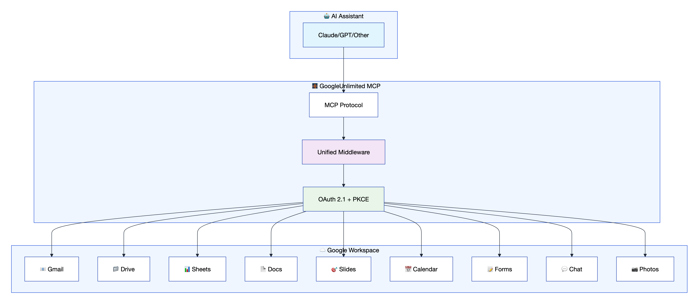
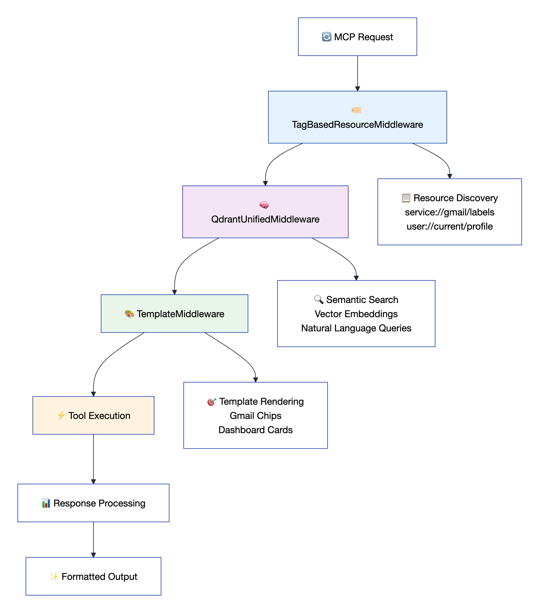
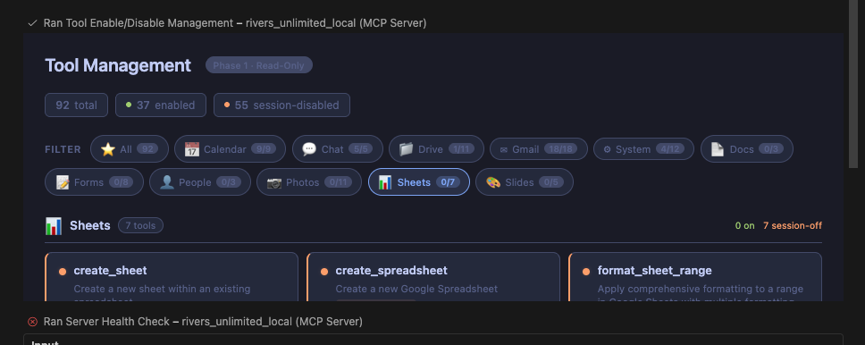
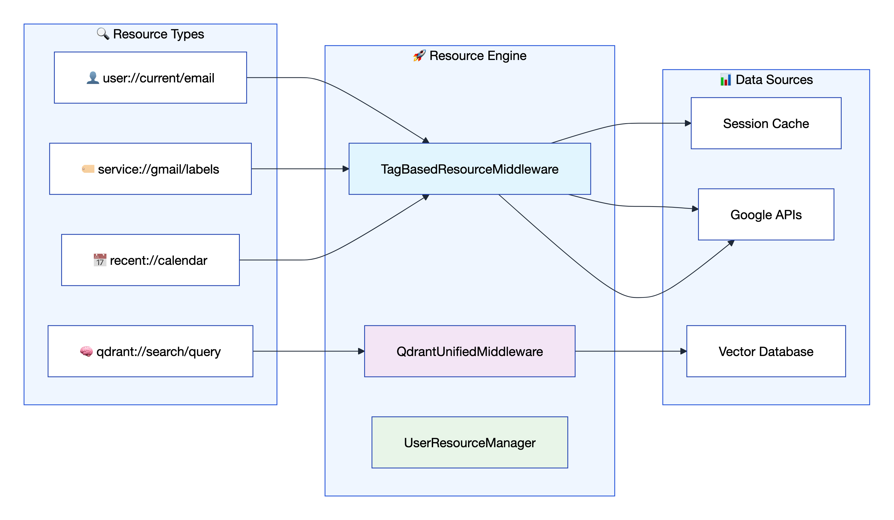
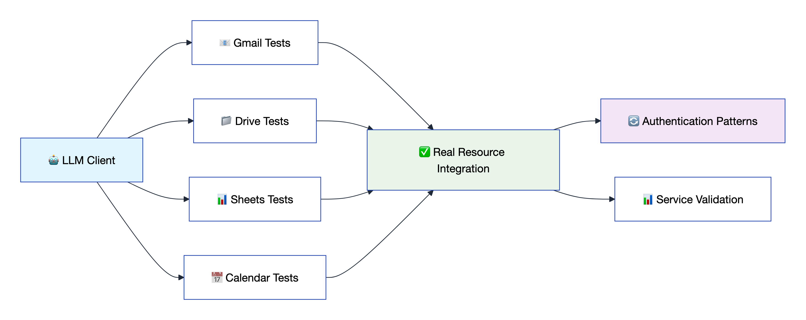
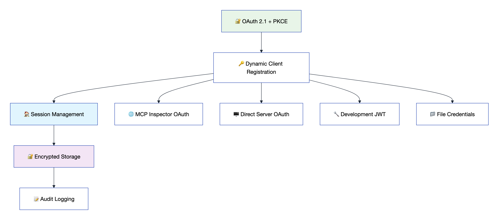

# 🚀 GoogleUnlimited Google Workspace Platform

[](https://github.com/dipseth/google_workspace_fastmcp2/tree/main/documentation)
[](https://pypi.org/project/google-workspace-unlimited/)
[](https://github.com/dipseth/google_workspace_fastmcp2/blob/main/LICENSE)

**GoogleUnlimited** is a comprehensive MCP framework that provides seamless Google Workspace integration through an advanced middleware architecture. It enables AI assistants and MCP clients to interact with Gmail, Google Drive, Docs, Sheets, Slides, Calendar, Forms, Chat, and Photos services using a unified, secure API.

## 📋 Table of Contents

- [Quick Installation Instructions](#-quick-installation-instructions)
- [Service Capabilities](#-service-capabilities)
- [Middleware Architecture](#-middleware-architecture)
- [Tool Management Dashboard](#️-tool-management-dashboard)
- [Template System](#-template-system)
- [Resource Discovery](#-resource-discovery)
- [Testing Framework](#-testing-framework)
- [Security & Authentication](#-security--authentication)

## ⚡ Quick Installation Instructions

### What is GoogleUnlimited?

GoogleUnlimited provides AI assistants with access to Google Workspace services through the Model Context Protocol (MCP). It supports **92+ tools** across **9 Google services**, enabling seamless integration between AI workflows and Google Workspace applications with revolutionary performance improvements.



### 🛠️ Installation Methods

#### Method 1: Quick Install via uvx (Recommended)

The fastest way to get started - install directly from PyPI:

```json
{
  "mcpServers": {
    "google-workspace-unlimited": {
      "command": "uvx",
      "args": ["google-workspace-unlimited"],
      "disabled": false,
      "timeout": 300
    }
  }
}
```

> ⚡ **That's it!** The server runs in stdio mode by default, perfect for MCP clients like Claude Desktop, Cursor, Roo, etc.

#### Method 2: Clone and Development Setup

For development or customization:

1. **Clone and setup:**
   ```bash
   git clone https://github.com/dipseth/google_workspace_fastmcp2.git
   cd google_workspace_fastmcp2
   uv sync
   ```

2. **Start the server:**
   ```bash
   uv run python server.py
   ```

   > The server starts immediately with **zero configuration required**. OAuth credentials are not needed at startup — authentication is handled lazily when you first interact with a Google service.

3. **Authenticate when ready:**

   When you call any Google Workspace tool, the server will prompt you to authenticate via the `start_google_auth` tool. This opens a browser-based OAuth flow. Once completed, credentials are stored locally and reused across sessions.

   To pre-configure OAuth credentials (optional), create a `.env` file:
   ```bash
   cp .env.example .env
   ```

   Then add your Google Cloud Console credentials:
   ```bash
   # Option A: Client ID + Secret
   GOOGLE_CLIENT_ID=your-client-id.apps.googleusercontent.com
   GOOGLE_CLIENT_SECRET=your-client-secret

   # Option B: Downloaded JSON credentials file
   GOOGLE_CLIENT_SECRETS_FILE=credentials.json
   ```

   > See the [Google Cloud Console setup steps](documentation/config/CONFIGURATION_GUIDE.md) for creating OAuth credentials and enabling APIs.

> 📚 **Configuration Resources:**
> - 🔧 **[Complete Configuration Guide](documentation/config/CONFIGURATION_GUIDE.md)** - Comprehensive environment variables and settings reference
> - 🤖 **[Claude.ai Integration Guide](documentation/config/claude_ai_integration_guide.md)** - Setup for Claude.ai remote MCP server usage
> - 🔒 **[HTTPS Setup Guide](documentation/config/https_setup_guide.md)** - SSL certificate configuration for secure connections
> - ⚙️ **[MCP JSON Configuration Guide](documentation/config/mcp_config_fastmcp.md)** - Standard MCP configuration for any compatible client

### 📋 Environment Variables Reference

All environment variables are **optional** — the server starts with sensible defaults and no `.env` file required. OAuth credentials are only needed when initiating a new authentication flow via `start_google_auth`.

**Google OAuth** (needed for first-time authentication):

| Variable | Default | Description |
|----------|---------|-------------|
| `GOOGLE_CLIENT_ID` | _(empty)_ | OAuth 2.0 client ID from Google Cloud Console |
| `GOOGLE_CLIENT_SECRET` | _(empty)_ | OAuth 2.0 client secret |
| `GOOGLE_CLIENT_SECRETS_FILE` | _(empty)_ | Alternative: path to downloaded OAuth JSON file |
| `OAUTH_REDIRECT_URI` | `http://localhost:8002/oauth2callback` | Must match Google Console redirect URI |

> Provide **either** `GOOGLE_CLIENT_ID` + `GOOGLE_CLIENT_SECRET` **or** `GOOGLE_CLIENT_SECRETS_FILE` before your first OAuth flow. Once authenticated, credentials are stored locally and these variables are no longer needed.

**Server:**

| Variable | Default | Description |
|----------|---------|-------------|
| `SERVER_HOST` | `localhost` | Server bind address |
| `SERVER_PORT` | `8002` | Server port |
| `ENABLE_HTTPS` | `false` | Enable HTTPS/SSL |
| `SSL_CERT_FILE` | - | Path to SSL certificate (required if HTTPS enabled) |
| `SSL_KEY_FILE` | - | Path to SSL private key (required if HTTPS enabled) |
| `LOG_LEVEL` | `INFO` | `DEBUG`, `INFO`, `WARNING`, `ERROR` |

**Security & Sessions:**

| Variable | Default | Description |
|----------|---------|-------------|
| `CREDENTIAL_STORAGE_MODE` | `FILE_ENCRYPTED` | `FILE_ENCRYPTED`, `FILE_PLAINTEXT`, `MEMORY_ONLY` |
| `CREDENTIALS_DIR` | `./credentials` | Directory for stored credentials |
| `SESSION_TIMEOUT_MINUTES` | `60` | Session idle timeout |
| `GMAIL_ALLOW_LIST` | _(empty)_ | Comma-separated trusted email addresses |

**Tool Management:**

| Variable | Default | Description |
|----------|---------|-------------|
| `MINIMAL_TOOLS_STARTUP` | `true` | Start with only 5 protected tools enabled |
| `MINIMAL_STARTUP_SERVICES` | _(empty)_ | Comma-separated services to enable at startup (e.g., `drive,gmail`) |
| `RESPONSE_LIMIT_MAX_SIZE` | `500000` | Max tool response size in bytes (0 = disabled) |
| `RESPONSE_LIMIT_TOOLS` | _(empty)_ | Comma-separated tool names to limit (empty = all) |

**Qdrant Vector Database:**

| Variable | Default | Description |
|----------|---------|-------------|
| `QDRANT_URL` | `http://localhost:6333` | Qdrant vector database URL |
| `QDRANT_KEY` | `NONE` | Qdrant API key (use `NONE` for no auth) |
| `QDRANT_AUTO_LAUNCH` | `true` | Auto-launch Qdrant via Docker if not reachable |
| `QDRANT_DOCKER_IMAGE` | `qdrant/qdrant:latest` | Docker image for auto-launch |
| `QDRANT_DOCKER_CONTAINER_NAME` | `mcp-qdrant` | Container name for auto-launched Qdrant |

**Other:**

| Variable | Default | Description |
|----------|---------|-------------|
| `MCP_CHAT_WEBHOOK` | _(empty)_ | Default webhook URL for Google Chat card tools |
| `FASTMCP_CLOUD` | `false` | Enable cloud deployment mode (auto-switches to `MEMORY_WITH_BACKUP` storage) |

## 🔗 Client Connections

GoogleUnlimited supports multiple connection methods. Here are the two most popular ways to get started:

### 🎯 Quick Setup Options

**Option 1: Cursor IDE** (STDIO - Community Verified ✅):
```json
{
  "mcpServers": {
    "google-workspace": {
      "command": "uv",
      "args": [
        "--directory", "/path/to/google_workspace_fastmcp2",
        "run", "python", "server.py"
      ],
      "env": {
        "GOOGLE_CLIENT_SECRETS_FILE": "/path/to/client_secrets.json",
        "MCP_TRANSPORT": "stdio"
      }
    }
  }
}
```

**Option 2: HTTP Streamable** (VS Code Roo, Claude Code, Claude Desktop, etc.):
```bash
# Start server in HTTP mode
uv run python server.py --transport http --port 8002
```

Basic single-connection config:
```json
{
  "google-workspace": {
    "type": "streamable-http",
    "url": "https://localhost:8002/mcp",
    "disabled": false
  }
}
```

**Multi-connection setup** — connect the same client (or multiple clients) to the same server with different tool sets using [URL query parameters](#-url-based-service-filtering-http-transport):

```json
{
  "google-email": {
    "type": "streamable-http",
    "url": "https://localhost:8002/mcp?service=gmail"
  },
  "google-chat": {
    "type": "streamable-http",
    "url": "https://localhost:8002/mcp?service=chat"
  },
  "google-productivity": {
    "type": "streamable-http",
    "url": "https://localhost:8002/mcp?service=drive,docs,sheets,slides"
  }
}
```

Each connection gets its own **isolated session** with only the requested service tools enabled. You can also pin a session ID with `?uuid=` to resume the same session state across reconnects:

```json
{
  "google-workspace": {
    "type": "streamable-http",
    "url": "https://localhost:8002/mcp?uuid=my-workspace&service=gmail,drive,calendar"
  }
}
```

> See [URL-Based Service Filtering](#-url-based-service-filtering-http-transport) for the full list of query parameters.

### 📚 Complete Connection Guide

For detailed setup instructions, troubleshooting, and configurations for all supported clients including:
- Claude Code CLI (HTTP & STDIO)
- Claude Desktop
- VS Code / Roo / GitHub Copilot
- Claude.ai with Cloudflare Tunnel
- And more...

> 🔗 **[Complete Client Connection Guide](documentation/config/MCP_CLIENT_CONNECTIONS.md)** - Comprehensive setup instructions, troubleshooting, and advanced configurations for all supported AI clients and development environments

## 🎯 Service Capabilities

GoogleUnlimited supports **9 Google Workspace services** with **90+ specialized tools**:

| Service | Icon | Tools | Key Features | Documentation |
|---------|------|-------|--------------|---------------|
| **Gmail** | 📧 | 14 | Send, reply, labels, filters, search, allowlist | [`api-reference/gmail/`](documentation/api-reference/gmail/) |
| **Drive** | 📁 | 9 | Upload, download, sharing, Office docs, file management | [`api-reference/drive/`](documentation/api-reference/drive/) |
| **Docs** | 📄 | 4 | Create, edit, format, batch operations | [`api-reference/docs/`](documentation/api-reference/docs/) |
| **Sheets** | 📊 | 7 | Read, write, formulas, formatting | [`api-reference/sheets/`](documentation/api-reference/sheets/) |
| **Slides** | 🎯 | 5 | Presentations, templates, export | [`api-reference/slides/`](documentation/api-reference/slides/) |
| **Calendar** | 📅 | 9 | Events, scheduling, attendees, timezones | [`api-reference/calendar/`](documentation/api-reference/calendar/) |
| **Forms** | 📝 | 8 | Creation, responses, validation, publishing | [`api-reference/forms/`](documentation/api-reference/forms/) |
| **Chat** | 💬 | 24 | Messaging, cards, spaces, webhooks, unified cards | [`api-reference/chat/`](documentation/api-reference/chat/) |
| **Photos** | 📷 | 12 | Albums, upload, search, metadata, smart search | [`api-reference/photos/`](documentation/api-reference/photos/) |

> 📚 **API Documentation Resources:**
> - 🔗 **[Complete API Reference](documentation/api-reference/)** - Comprehensive documentation for all 92+ tools across 9 services
> - 📧 **[Gmail API Guide](documentation/api-reference/gmail/)** - Email management, labels, filters, and search operations
> - 📁 **[Drive API Guide](documentation/api-reference/drive/)** - File operations, sharing, and Office document handling
> - 📊 **[Sheets API Guide](documentation/api-reference/sheets/)** - Spreadsheet data manipulation and formatting
> - 📅 **[Calendar API Guide](documentation/api-reference/calendar/)** - Event scheduling and timezone management

## 🧠 Middleware Architecture

GoogleUnlimited uses a middleware architecture that provides seamless service integration, intelligent resource management, and powerful templating capabilities.



### 🔧 Core Middleware Components

- **🏷️ TagBasedResourceMiddleware**: Intelligent resource discovery using URI patterns (`service://gmail/messages`, `user://current/email`)
- **🧠 QdrantUnifiedMiddleware**: AI-powered semantic search across all tool responses with vector embeddings
- **🎨 TemplateMiddleware**: Advanced Jinja2 template system for beautiful, structured output formatting

### ✨ Architecture Benefits

- **🔄 Unified Resource Access**: URI-based access to service data without API calls
- **🧠 Semantic Intelligence**: Natural language search across all stored responses
- **🎨 Visual Excellence**: Consistent, beautiful output formatting for optimal AI consumption
- **💰 Token Efficiency**: Template macros reduce token usage by 60-80% through structured data rendering
- **⚡ Performance**: 30x faster than traditional approaches through intelligent caching

> 📚 **Middleware Documentation Resources:**
> - 📖 **[Middleware Architecture Guide](documentation/middleware/)** - Complete middleware system documentation and implementation details
> - 🏷️ **[TagBasedResourceMiddleware](documentation/middleware/)** - URI pattern resource discovery and management
> - 🧠 **[QdrantUnifiedMiddleware](documentation/middleware/)** - AI-powered semantic search and vector embeddings
> - 🎨 **[TemplateMiddleware](documentation/middleware/)** - Advanced Jinja2 template system for output formatting
> - 🔧 **[SessionToolFilteringMiddleware](documentation/middleware/SESSION_TOOL_FILTERING_MIDDLEWARE.md)** - Per-session tool enable/disable management

### 🚀 Minimal Tools Startup

By default, GoogleUnlimited starts with **only 5 protected tools enabled** for optimal performance and security. This allows clients to enable only the tools they need.

**Protected Tools (Always Available):**
- `manage_tools` - Enable/disable tools globally or per-session
- `manage_tools_by_analytics` - Analytics-based tool management
- `health_check` - Server health and configuration status
- `start_google_auth` - Initiate OAuth authentication
- `check_drive_auth` - Verify authentication status

**Configuration:**

```bash
# Default: Start with minimal tools (only 5 protected tools)
MINIMAL_TOOLS_STARTUP=true

# Optional: Pre-enable specific services at startup
MINIMAL_STARTUP_SERVICES=drive,gmail,calendar

# Disable minimal startup (enable all 92+ tools immediately)
MINIMAL_TOOLS_STARTUP=false
```

**Enabling Tools at Runtime:**

```python
# Enable all tools globally
manage_tools(action="enable_all")

# Enable specific tools
manage_tools(action="enable", tool_names=["search_drive_files", "list_gmail_labels"])

# List all registered tools (shows enabled/disabled status)
manage_tools(action="list")
```

### 🔧 Session-Scoped Tool Management

GoogleUnlimited supports **per-session tool enable/disable** functionality, allowing different MCP clients to have different tool availability without affecting other connected clients.

**Key Features:**
- **Session Isolation**: Disable tools for one client session without affecting others
- **Non-Invasive**: Session-scoped operations never modify the global tool registry
- **Protected Tools**: Core management tools (`manage_tools`, `health_check`, etc.) always remain available
- **Middleware-Based**: Uses `SessionToolFilteringMiddleware` for protocol-level filtering

**Usage Examples:**

```python
# Disable tools for this session only (other clients unaffected)
manage_tools(action="disable", tool_names=["send_gmail_message"], scope="session")

# Disable all except specific tools for this session
manage_tools(action="disable_all_except", tool_names=["search_drive_files", "list_events"], scope="session")

# Re-enable all tools for this session
manage_tools(action="enable_all", scope="session")

# Global operations (original behavior, affects all clients)
manage_tools(action="disable", tool_names=["send_gmail_message"], scope="global")
```

**Response Structure:**

```json
{
  "success": true,
  "action": "disable_all_except",
  "scope": "session",
  "enabledCount": 94,
  "disabledCount": 0,
  "toolsAffected": ["tool1", "tool2", "..."],
  "sessionState": {
    "sessionId": "f725be09...",
    "sessionAvailable": true,
    "sessionDisabledTools": ["tool1", "tool2"],
    "sessionDisabledCount": 89
  },
  "message": "Kept 5 tools, disabled 89 tools for this session"
}
```

### 🖥️ Tool Management Dashboard

GoogleUnlimited includes a built-in **Tool Management Dashboard** served via the MCP Apps `ui://` resource scheme. This provides a visual interface for monitoring and managing tool availability across sessions.



**Features:**
- **Service-grouped tool view** — tools organized by Google service (Gmail, Drive, Sheets, etc.) with counts
- **Session state visibility** — see which tools are enabled, disabled, or session-disabled at a glance
- **Filter chips** — quickly filter by service to focus on relevant tools
- **Live data** — powered by `DashboardCacheMiddleware` which caches list-tool results for instant `ui://data-dashboard` resource access

The dashboard is automatically wired to all list tools via `wire_dashboard_to_list_tools()` — no per-tool configuration needed.

### 🔗 URL-Based Service Filtering (HTTP Transport)

When using HTTP/SSE transport, you can filter tools by service directly via URL query parameters - no code required:

```bash
# Enable only Gmail tools
http://localhost:8002/mcp?service=gmail

# Enable Gmail + Drive + Calendar
http://localhost:8002/mcp?service=gmail,drive,calendar

# Resume a previous session
http://localhost:8002/mcp?uuid=your-session-id

# Resume session with specific services
http://localhost:8002/mcp?uuid=abc123&service=gmail,drive

# Disable minimal startup (enable all tools)
http://localhost:8002/mcp?minimal=false
```

**Available URL Parameters:**

| Parameter | Example | Description |
|-----------|---------|-------------|
| `service` or `services` | `?service=gmail,drive` | Comma-separated list of services to enable |
| `uuid` | `?uuid=abc123` | Resume a previous session by ID |
| `minimal` | `?minimal=false` | Override minimal startup mode |

**Available Services:** `gmail`, `drive`, `calendar`, `docs`, `sheets`, `slides`, `photos`, `chat`, `forms`, `people`

> 📚 **Session Tool Management Resources:**
> - 🔧 **[SessionToolFilteringMiddleware Guide](documentation/middleware/SESSION_TOOL_FILTERING_MIDDLEWARE.md)** - Complete documentation for per-session tool management

## 🎨 Template System

GoogleUnlimited features powerful **Jinja2 template macros** that transform raw Google Workspace data into visually stunning, AI-optimized formats.

### 🎯 Available Template Macros

| Template File | Macro | Purpose | Key Features |
|---------------|-------|---------|--------------|
| **`email_card.j2`** | `render_gmail_labels_chips()` | Gmail label visualization | Interactive chips, unread counts, direct Gmail links |
| **`calendar_dashboard.j2`** | `render_calendar_dashboard()` | Calendar & events dashboard | Primary/shared calendars, upcoming events, dark theme |
| **`dynamic_macro.j2`** | `render_calendar_events_dashboard()` | Calendar events dashboard | Event cards, time/location details, clickable links, dark theme |
| **`document_templates.j2`** | `generate_report_doc()` | Professional reports | Metrics, tables, charts, company branding |
| **`colorfuL_email.j2`** | `render_beautiful_email3()` | Rich HTML emails | Multiple signatures, gradients, responsive design |

### 💡 Template Macro Examples

**Gmail Labels Visualization** - Transform label lists into beautiful interactive chips:

```jinja2
{{ render_gmail_labels_chips( service://gmail/labels , 'Label summary for: ' + user://current/email ) }}
```

**Calendar Dashboard** - Create comprehensive calendar overviews:

```jinja2
{{ render_calendar_dashboard( service://calendar/calendars, service://calendar/events, 'My Calendar Overview' ) }}
```

**Calendar Events Dashboard** - Transform calendar events into beautiful, interactive event cards:

```jinja2
{{ render_calendar_events_dashboard( service://calendar/events , 'Upcoming Events for: ' + user://current/email.email ) }}
```


This macro creates a stunning dark-themed dashboard featuring:
- 📅 **Interactive Event Cards**: Each event is rendered as a clickable card that opens in Google Calendar
- 🕐 **Smart Time Display**: Automatically formats all-day events vs. timed events with timezone support
- 📍 **Location Integration**: Displays meeting locations and virtual meeting links
- 👥 **Attendee Information**: Shows attendee counts and participant details
- ✅ **Status Indicators**: Color-coded status (confirmed, tentative, cancelled) with visual feedback
- 📱 **Responsive Design**: Mobile-optimized layout with touch-friendly interactions
- 🎨 **Dark Theme Styling**: Professional appearance with gradient backgrounds and hover effects

**Professional Documents** - Generate reports with metrics and charts:

```jinja2
{{ generate_report_doc(
    report_title='Q4 Performance Report',
    metrics=[{'value': '$1.2M', 'label': 'Revenue', 'change': 15}],
    company_name='Your Company'
) }}
```

### 🔍 Macro Discovery & Dynamic Creation

Explore all available macros using the template resource system:

```python
# Access the template://macros resource to discover all available macros
macros = await access_resource("template://macros")
# Returns comprehensive macro information with usage examples

# Access specific macro details
macro_details = await access_resource("template://macros/render_gmail_labels_chips")
```

### 🎯 Dynamic Macro Creation

Create custom macros at runtime using the `create_template_macro` tool:

```python
# Create a new macro dynamically
await create_template_macro(
    macro_name="render_task_status_badge",
    macro_content='''
    
    
    <span class="status-badge status-completed {{ size }}">✅ Complete</span>
    
    <span class="status-badge status-in-progress {{ size }}">🔄 In Progress</span>
    
    <span class="status-badge status-pending {{ size }}">⏳ {{ status|title }}</span>
    
    
    ''',
    description="Renders visual status badges for task states with appropriate icons",
    usage_example="{{ render_task_status_badge('completed', 'large') }}",
    persist_to_file=True
)

# Immediately use the newly created macro
await send_gmail_message(
    html_body="Task Status: {{ render_task_status_badge('completed', 'large') }}"
)
```

**DSL-powered macros** — dynamic macros can also embed [Google Chat card DSL notation](documentation/api-reference/chat/) to generate rich, structured cards. The DSL symbols define the card layout while Jinja2 handles dynamic content:

```jinja2
{# workspace_dashboard.j2 — a dynamic macro that outputs a Google Chat card #}




§[δ×3, ℊ[ǵ×4], §[δ×2, Ƀ[ᵬ×3]]]

Welcome back, {{ username | title }}!

Your Workspace Overview:

- {{ stat.label }}: {{ stat.value }}


Actions:
- Button: Open Gmail → https://mail.google.com
- Button: Open Calendar → https://calendar.google.com
- Button: Open Drive → https://drive.google.com

```

The DSL line `§[δ×3, ℊ[ǵ×4], §[δ×2, Ƀ[ᵬ×3]]]` defines the card structure: a Section with 3 DecoratedText widgets, a Grid with 4 items, and a nested Section with 2 DecoratedText widgets and a ButtonList with 3 buttons. The Jinja2 template fills in the content dynamically — and because it's persisted to `templates/dynamic/`, it's immediately available to `send_dynamic_card` and other tools.

**Key Features:**
- ⚡ **Immediate Availability**: Macros are instantly available after creation
- 🎯 **Resource Integration**: Automatically available via `template://macros/macro_name`
- 💾 **Optional Persistence**: Save macros to disk for permanent availability
- 🔄 **Template Processing**: Full Jinja2 syntax validation and error handling
- 💬 **DSL Integration**: Macros can output card DSL notation for rich Google Chat cards

### 🚀 Real-World Usage

Templates can be directly used in tool calls for beautiful, structured output:

```python
# Send a beautiful email with calendar dashboard
await send_gmail_message(
    to="manager@company.com",
    subject="Weekly Schedule Update",
    html_body="{{ render_calendar_events_dashboard( service://calendar/events, 'My upcoming events') }}",
    content_type="mixed"
)

# Generate and send a professional report
await create_doc(
    title="Q4 Performance Report",
    content="{{ generate_report_doc( report_title='Quarterly Results', company_name='GoogleUnlimited' ) }}"
)
```

> 📚 **Template System Resources:**
> - 🎨 **[Template Directory](middleware/templates/)** - Complete collection of Jinja2 templates and macros
> - 💌 **[Beautiful Email Templates](middleware/templates/beautiful_email.j2)** - Rich HTML email styling and themes
> - 🏷️ **[Gmail Label Cards](middleware/templates/email_card.j2)** - Interactive label visualization with chips
> - 📅 **[Calendar Dashboard](middleware/templates/calendar_dashboard.j2)** - Event timeline and scheduling views
> - 📄 **[Document Templates](middleware/templates/document_templates.j2)** - Structured document formatting

## 🗂️ Resource Discovery

GoogleUnlimited provides a powerful **MCP resource system** that enables lightning-fast data access without API calls through intelligent URI patterns.



### 🎯 Resource URI Patterns

| Pattern | Purpose | Example | Returns |
|---------|---------|---------|---------|
| `user://profile/{email}` | User authentication status | `user://profile/john@gmail.com` | Profile + auth state |
| `service://{service}/lists` | Available service lists | `service://gmail/lists` | [filters, labels] |
| `service://{service}/{list_type}` | All items in list | `service://gmail/labels` | All Gmail labels |
| `service://{service}/{list_type}/{id}` | Specific item details | `service://gmail/labels/INBOX` | INBOX label details |
| `recent://{service}` | Recent items | `recent://drive` | Recent Drive files |
| `qdrant://search/{query}` | Semantic search | `qdrant://search/gmail errors` | Relevant responses |

### 🏗️ Key Resource Files

- **[`resources/user_resources.py`](resources/user_resources.py)**: Authentication, profiles, session management (1,812 lines)
- **[`resources/service_list_resources.py`](resources/service_list_resources.py)**: Service discovery through TagBasedResourceMiddleware (446 lines)
- **[`middleware/qdrant_core/resources.py`](middleware/qdrant_core/resources.py)**: AI-powered search and analytics (319 lines)

### ⚡ Lightning-Fast Access

```python
# Instant Gmail labels (no API call needed)
labels = await access_resource("service://gmail/labels")

# Current user info from session
user = await access_resource("user://current/email")

# Semantic search across all tool responses
results = await access_resource("qdrant://search/gmail errors today")

# Recent calendar events
events = await access_resource("recent://calendar")
```

> 📚 **Resource System Documentation:**
> - 🗂️ **[User Resources](resources/user_resources.py)** - Authentication, profiles, and session management (1,812 lines)
> - 🏷️ **[Service List Resources](resources/service_list_resources.py)** - Service discovery through TagBasedResourceMiddleware (446 lines)
> - 🧠 **[Qdrant Core Resources](middleware/qdrant_core/resources.py)** - AI-powered search and analytics (319 lines)
> - 📋 **[Resource Patterns Guide](documentation/middleware/)** - Complete URI pattern reference and usage examples

## 🧪 Testing Framework

GoogleUnlimited includes comprehensive testing with **client tests** that validate MCP usage exactly as an LLM would experience it, plus additional testing suites. **559 tests passing with 100% pass rate**.

### 🎯 Client Testing Focus



The **client tests** are the most important component - they provide deterministic testing of MCP operations using real resource integration and standardized patterns across all **92+ tools** and **9 Google services**. These tests validate both explicit email authentication and middleware injection patterns.

### 🚀 Quick Test Commands

```bash
# 🧪 Run all client tests (primary test suite)
uv run pytest tests/client/ -v

# 📧 Test specific service
uv run pytest tests/client/ -k "gmail" -v

# 🔐 Authentication required tests
uv run pytest tests/client/ -m "auth_required" -v
```

### 🔬 Real Resource ID Integration

The testing framework fetches **real IDs** from service resources for realistic testing:

```python
# Available fixtures for real resource testing
real_gmail_message_id      # From service://gmail/messages
real_drive_document_id     # From service://drive/items
real_calendar_event_id     # From service://calendar/events
real_photos_album_id       # From service://photos/albums
real_forms_form_id         # From service://forms/forms
real_chat_space_id         # From service://chat/spaces
```

### 🔄 CI/CD Pipeline

Automated testing and publishing via GitHub Actions:

- **CI Workflow**: Runs on every PR and push to main
  - Python 3.11 & 3.12 matrix testing
  - Linting with `ruff check` and formatting with `ruff format`
  - Full test suite execution
- **TestPyPI Publishing**: Automated package publishing for testing

> 📚 **Testing Resources:**
> - 📋 **[Client Testing Framework Guide](tests/client/TESTING_FRAMEWORK.md)** - Complete client testing documentation and patterns
> - 🧪 **[Client Tests Directory](tests/client/)** - Real resource integration tests for deterministic MCP validation
> - 🤖 **[MCP Client Integration](https://gofastmcp.com/clients/client)** - Learn more about MCP client patterns and usage
> - 🔐 **[Authentication Patterns](tests/client/)** - Email vs middleware injection validation testing

## 🔒 Security & Authentication

GoogleUnlimited implements **enterprise-grade security** with OAuth 2.1 + PKCE, advanced session management, and comprehensive audit capabilities.



### 🛡️ Authentication Flows

1. **🌐 MCP Inspector OAuth**: MCP Spec compliant with Dynamic Client Registration
2. **🖥️ Direct Server OAuth**: Web-based authentication for direct access
3. **🔧 Development JWT**: Testing mode with generated tokens
4. **📁 Enhanced File Credentials**: Persistent storage with encryption options
5. **🔑 Custom OAuth Clients**: Bring your own OAuth credentials with automatic fallback

### ✨ Security Features

- **🔐 OAuth 2.1 + PKCE**: Modern authentication with proof-of-key exchange (supports public clients)
- **🔒 Session Isolation**: Multi-tenant support preventing data leaks
- **🏷️ 27+ API Scopes**: Granular permission management across all services
- **📊 Audit Logging**: Complete security event tracking
- **🔐 AES-256 Encryption**: Machine-specific keys for credential storage
- **🔄 Three-Tier Fallback**: Robust credential persistence across server restarts (State Map → UnifiedSession → Context Storage)

### ⚙️ Security Configuration

```env
# 🔒 Security settings in .env
CREDENTIAL_STORAGE_MODE=FILE_ENCRYPTED
SESSION_SECRET_KEY=your-secret-key
SESSION_TIMEOUT_MINUTES=30
ENABLE_AUDIT_LOGGING=true
GMAIL_ALLOW_LIST=trusted@example.com
```

> 📚 **Security Documentation Resources:**
> - 🛡️ **[Unified OAuth Architecture](documentation/security/unified_oauth_architecture_design.md)** - Complete security architecture and authentication design
> - 🔐 **[OAuth 2.1 + PKCE Implementation](documentation/security/)** - Modern authentication with proof-of-key exchange
> - 🏠 **[Session Management Guide](documentation/security/)** - Multi-tenant support and session isolation
> - 🔒 **[Encryption & Storage](documentation/security/)** - AES-256 credential encryption and machine-specific keys
> - 📊 **[Audit Logging System](documentation/security/)** - Complete security event tracking and monitoring

---

<div align="center">

**🚀 Ready to revolutionize your Google Workspace integration?**

[📚 Documentation](documentation/) • [🔧 Configuration](documentation/config/) • [🎯 API Reference](documentation/api-reference/) • [🧪 Testing](tests/client/)

</div>