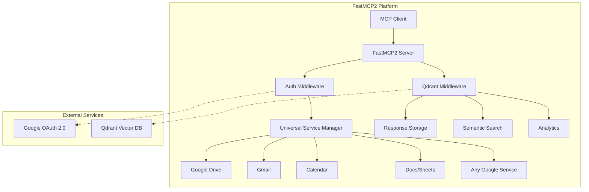
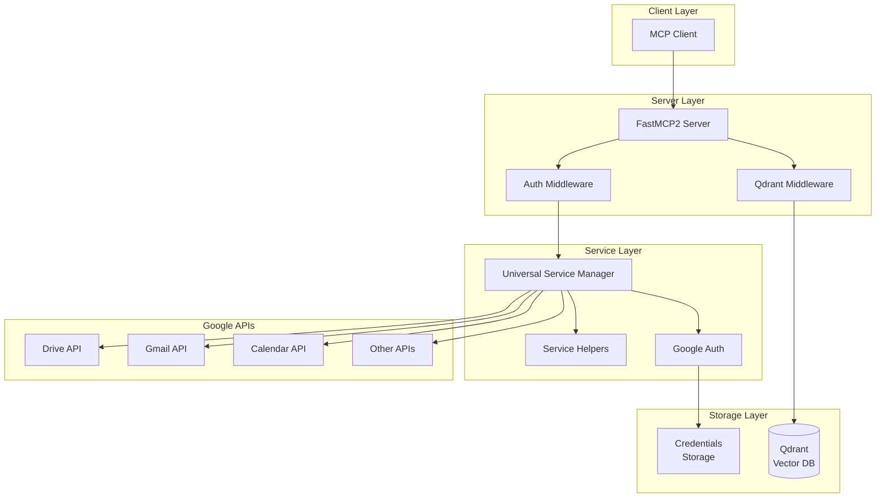
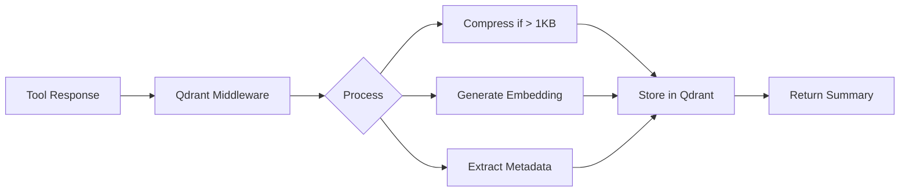

# FastMCP2 Google Service Platform

A revolutionary MCP server that provides **universal Google service integration** with OAuth authentication, multi-user support, and AI-powered semantic search capabilities via Qdrant.



## Table of Contents

- [Key Features](#key-features)
- [Quick Start](#quick-start)
- [Architecture Overview](#architecture-overview)
- [Universal Google Service Support](#universal-google-service-support)
- [Tool Documentation](#tool-documentation)
- [Qdrant Integration](#qdrant-integration)
- [Configuration](#configuration)
- [Advanced Usage](#advanced-usage)
- [Troubleshooting](#troubleshooting)
- [Contributing](#contributing)

## Key Features

### 🌐 Universal Google Service Support
- **One System, All Services**: Works with Drive, Gmail, Calendar, Docs, Sheets, Chat, Forms, Slides, and more
- **Zero-Decorator Architecture**: No decorators needed - middleware handles everything automatically
- **Smart Defaults**: Intelligent configuration for each service type
- **Configuration-Driven**: Add new Google services without code changes

### 🔐 Robust Authentication
- **OAuth 2.0 with PKCE**: Secure authentication flow
- **Multi-User Support**: Session-based authentication for multiple users
- **Automatic Token Refresh**: Seamless credential management
- **Persistent Storage**: File-based credential storage with caching

### 🧠 AI-Powered Features
- **Semantic Search**: Natural language search across all tool responses
- **Response Compression**: Automatic gzip compression for large payloads
- **Smart Summarization**: Token-efficient response summaries
- **Usage Analytics**: Comprehensive metrics and performance tracking

### ⚡ Performance Optimized
- **Lazy Loading**: Fast server startup (< 2 seconds)
- **Auto-Discovery**: Automatic Qdrant connection on ports 6333-6337
- **Connection Pooling**: Efficient resource management
- **Cached Services**: Intelligent service and credential caching

## Quick Start

### Prerequisites
- Python 3.11+
- [uv package manager](https://github.com/astral-sh/uv)
- Google Cloud Console project with APIs enabled
- (Optional) Docker for Qdrant

### Installation

1. **Clone and setup:**
```bash
git clone https://github.com/dipseth/fastmcp2_drive_upload.git
cd fastmcp2_drive_upload
uv sync
```

2. **Configure Google OAuth:**
   - Go to [Google Cloud Console](https://console.cloud.google.com/)
   - Enable required APIs (Drive, Gmail, etc.)
   - Create OAuth 2.0 credentials (Web application)
   - Add `http://localhost:8002/oauth/callback` to redirect URIs
   - Download credentials JSON file

3. **Setup environment:**
```bash
cp .env.example .env
# Edit .env with your Google OAuth credentials path
```

4. **Start Qdrant (optional but recommended):**
```bash
docker run -p 6333:6333 qdrant/qdrant
```

5. **Run the server:**
```bash
uv run python server.py
```

## Architecture Overview

### System Architecture



### Core Components

#### 1. **FastMCP2 Framework**
- Core server with HTTP transport
- Tool registration and execution
- Custom route handling for OAuth callbacks

#### 2. **Authentication Layer**
- OAuth 2.0 with PKCE implementation
- Multi-user credential management
- Automatic token refresh

#### 3. **Universal Service Layer**
- Generic service creation for any Google API
- Smart defaults for common services
- Middleware-based service injection

#### 4. **Qdrant Integration**
- Semantic search capabilities
- Response storage and compression
- Usage analytics and metrics

## Universal Google Service Support

### The Innovation

Instead of implementing each Google service separately, the platform uses a **universal service architecture**:

```python
# Works for ANY Google service!
service = await get_google_service(
    user_email="user@example.com",
    service_type="drive",     # or "gmail", "calendar", "docs", etc.
    scopes=["drive_file"],    # Smart scope groups
    version="v3"              # API version
)
```

### Supported Services

| Service | Description | Default Scopes |
|---------|-------------|----------------|
| `drive` | Google Drive | `drive_file`, `drive_read` |
| `gmail` | Gmail | `gmail_read`, `gmail_send`, `gmail_compose` |
| `calendar` | Google Calendar | `calendar_read`, `calendar_events` |
| `docs` | Google Docs | `docs_read`, `docs_write` |
| `sheets` | Google Sheets | `sheets_read`, `sheets_write` |
| `chat` | Google Chat | `chat_messages`, `chat_spaces` |
| `forms` | Google Forms | `forms_read`, `forms_responses` |
| `slides` | Google Slides | `slides_read`, `slides_write` |

### Usage Patterns

#### Pattern 1: Simple Service Creation
```python
# Uses smart defaults automatically
drive_service = await get_service("drive", user_email)
gmail_service = await get_service("gmail", user_email)
```

#### Pattern 2: Middleware Service Injection (Recommended)
```python
@mcp.tool()
async def my_tool(user_google_email: str):
    # Request services - middleware handles everything!
    drive_key = request_service("drive")
    gmail_key = request_service("gmail", ["gmail_send"])
    
    # Get injected services
    drive_service = get_injected_service(drive_key)
    gmail_service = get_injected_service(gmail_key)
```

## Tool Documentation

### Authentication Tools

#### `start_google_auth`
Initiate OAuth authentication flow for a user.

```python
await start_google_auth(
    user_google_email="user@gmail.com",
    service_name="Google Services"  # Optional
)
```

#### `check_drive_auth`
Check authentication status for a user.

```python
await check_drive_auth(user_google_email="user@gmail.com")
```

### Drive Tools

#### `upload_file_to_drive`
Upload a local file to Google Drive.

```python
await upload_file_to_drive(
    user_google_email="user@gmail.com",
    filepath="/path/to/file.pdf",
    folder_id="1BxiMVs0XRA5nFMdKvBdBZjgmUUqptlbs74OgvE2upms",  # Optional
    filename="custom_name.pdf"  # Optional
)
```

### Gmail Tools (11 tools)

- `search_gmail_messages` - Search using Gmail query syntax
- `get_gmail_message_content` - Get full message content
- `send_gmail_message` - Send emails
- `draft_gmail_message` - Create drafts
- `list_gmail_labels` - List all labels
- `reply_to_gmail_message` - Reply with threading
- And 5 more...

### Qdrant Search Tools

#### `search_tool_history`
Search historical tool responses using natural language.

```python
await search_tool_history(
    query="gmail errors from last week",
    limit=10,
    tool_name="send_gmail_message"  # Optional filter
)
```

#### `get_tool_analytics`
Get comprehensive usage analytics.

```python
await get_tool_analytics(
    days=7,  # Time range
    tool_name="upload_file_to_drive"  # Optional filter
)
```

## Qdrant Integration

### Features



### Key Capabilities

1. **Auto-Discovery**: Automatically finds Qdrant on ports 6333-6337
2. **Lazy Loading**: Model loads only when needed (fast startup)
3. **Compression**: Gzip compression for large responses
4. **Semantic Search**: Natural language queries
5. **Analytics**: Usage metrics and performance tracking

### Starting Qdrant

```bash
# Default port
docker run -p 6333:6333 qdrant/qdrant

# Custom port (auto-discovered)
docker run -p 6335:6335 qdrant/qdrant
```

## Configuration

### Environment Variables

Create a `.env` file:

```env
# OAuth Configuration (Option 1: JSON file - Recommended)
GOOGLE_CLIENT_SECRETS_FILE=/path/to/client_secret.json

# OAuth Configuration (Option 2: Individual variables)
# GOOGLE_CLIENT_ID=your_client_id.apps.googleusercontent.com
# GOOGLE_CLIENT_SECRET=your_client_secret

# Server Configuration
SERVER_PORT=8002
SERVER_HOST=localhost
OAUTH_REDIRECT_URI=http://localhost:8002/oauth/callback

# Storage Configuration
CREDENTIALS_DIR=./credentials

# Session Management
SESSION_TIMEOUT_MINUTES=60

# Logging
LOG_LEVEL=INFO

# Qdrant Configuration (Optional)
QDRANT_URL=http://localhost:6333
QDRANT_API_KEY=your_api_key  # If using cloud
```

### Adding New Google Services

Simply update the configuration files:

```python
# In service_manager.py
SERVICE_CONFIGS = {
    "new_service": {"service": "new_api_name", "version": "v1"}
}

# In service_helpers.py
SERVICE_DEFAULTS = {
    "new_service": {
        "default_scopes": ["new_service_read"],
        "version": "v1",
        "description": "New Google Service"
    }
}
```

## Advanced Usage

### Multi-Service Tool Example

```python
@mcp.tool()
async def process_and_notify(
    user_google_email: str, 
    file_path: str, 
    recipients: list[str]
) -> str:
    """Upload file to Drive, create calendar event, and send emails."""
    
    # Request multiple services
    drive_key = request_service("drive")
    gmail_key = request_service("gmail", ["gmail_send"])
    calendar_key = request_service("calendar", ["calendar_events"])
    
    # Get injected services
    drive_service = get_injected_service(drive_key)
    gmail_service = get_injected_service(gmail_key)
    calendar_service = get_injected_service(calendar_key)
    
    # Upload to Drive
    file_result = drive_service.files().create(...).execute()
    
    # Create calendar event
    event_result = calendar_service.events().insert(...).execute()
    
    # Send notifications
    for recipient in recipients:
        gmail_service.users().messages().send(...).execute()
    
    return "✅ All operations completed successfully!"
```

### Custom Service Configuration

```python
# Create service with custom configuration
custom_service = await get_google_service(
    user_email=user_email,
    service_type="customapi",
    scopes=["https://www.googleapis.com/auth/custom.scope"],
    version="v2",
    cache_enabled=False  # Disable caching for this service
)
```

## Troubleshooting

### Common Issues

#### "No valid credentials" Error
- Run `start_google_auth` to authenticate
- Check OAuth configuration in Google Cloud Console
- Verify redirect URI matches exactly

#### Server Hanging on Startup
- This is likely Qdrant loading - wait 10-30 seconds
- Or disable Qdrant if not needed (see configuration)

#### Qdrant Not Connecting
- Ensure Docker is running: `docker ps | grep qdrant`
- Check ports 6333-6337 are available
- Server works without Qdrant (graceful degradation)

### Debug Mode

Enable debug logging:
```env
LOG_LEVEL=DEBUG
```

Check server logs for detailed information.

### Reset Authentication

```bash
# Clear all stored credentials
rm -rf ./credentials/*

# Restart server
uv run python server.py
```

## Performance Metrics

- **Server Startup**: < 2 seconds
- **Tool Response Time**: 50-500ms (depends on Google API)
- **Qdrant Search**: < 100ms for most queries
- **Token Refresh**: Automatic, < 1 second
- **Response Compression**: ~70% size reduction

## Security Features

- ✅ OAuth 2.0 with PKCE
- ✅ Secure credential storage
- ✅ Session isolation
- ✅ Automatic cleanup
- ✅ Path traversal protection
- ✅ Error message sanitization

## Contributing

1. Fork the repository
2. Create a feature branch (`git checkout -b feature/amazing-feature`)
3. Commit your changes (`git commit -m 'Add amazing feature'`)
4. Push to the branch (`git push origin feature/amazing-feature`)
5. Open a Pull Request

### Development Setup

```bash
# Install dev dependencies
uv sync --dev

# Run tests
uv run pytest

# Format code
uv run black .
uv run ruff check .
```

## License

MIT License - see LICENSE file for details.

## Acknowledgments

- [FastMCP](https://github.com/jlowin/fastmcp) - The MCP framework
- [Google APIs](https://developers.google.com/apis) - Google service integration
- [Qdrant](https://qdrant.tech) - Vector database for semantic search
- [Sentence Transformers](https://www.sbert.net) - Embedding generation

## Support

- 📧 Email: support@fastmcp2.com
- 📚 Documentation: [docs.fastmcp2.com](https://docs.fastmcp2.com)
- 🐛 Issues: [GitHub Issues](https://github.com/dipseth/fastmcp2_drive_upload/issues)
- 💬 Discord: [Join our community](https://discord.gg/fastmcp2)

---

**FastMCP2 Google Service Platform** - Universal Google service integration made simple. 🚀