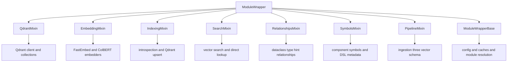
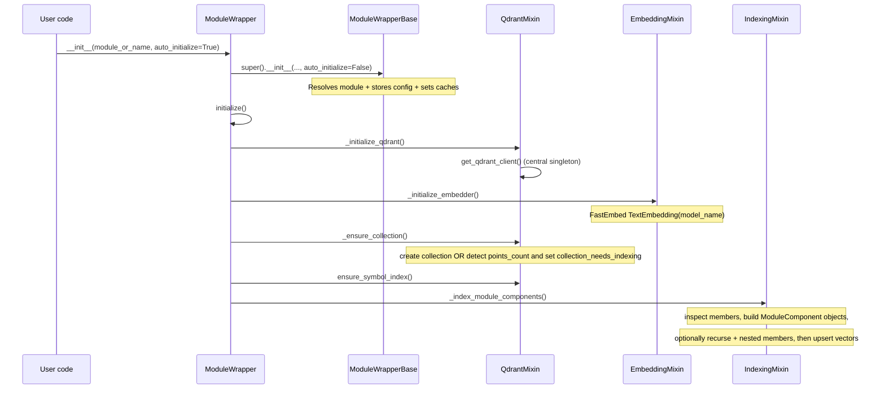
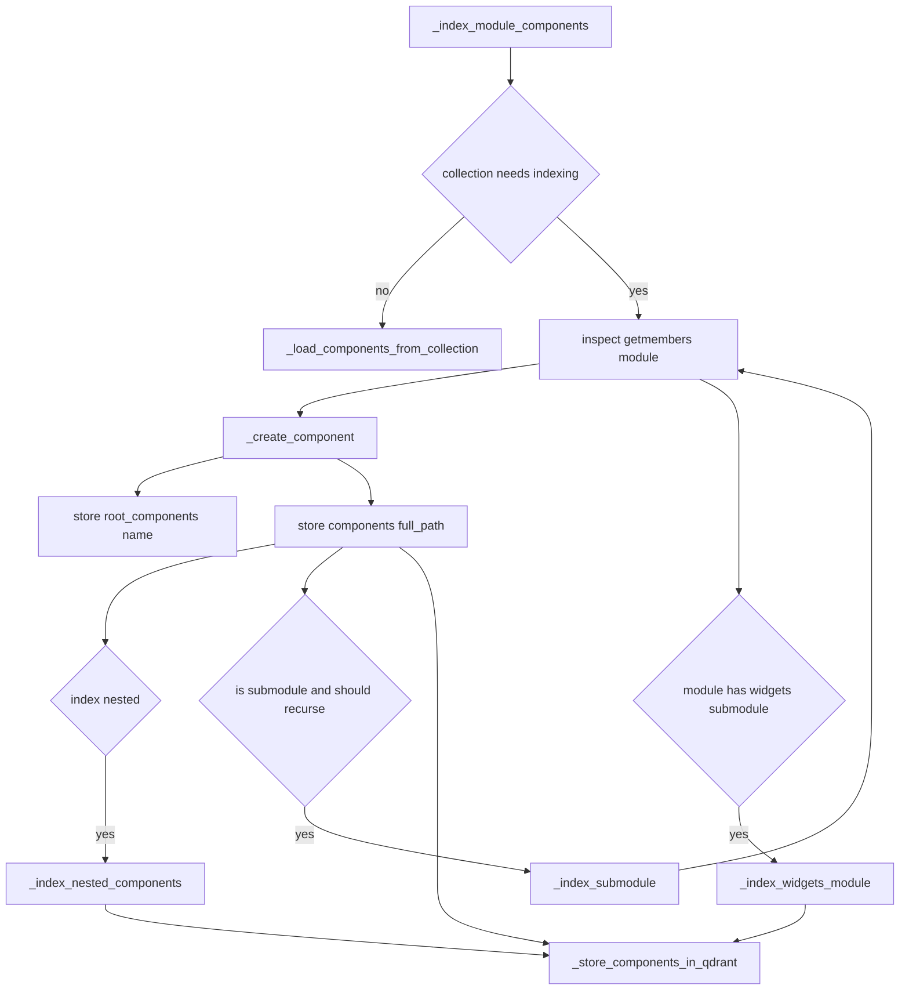
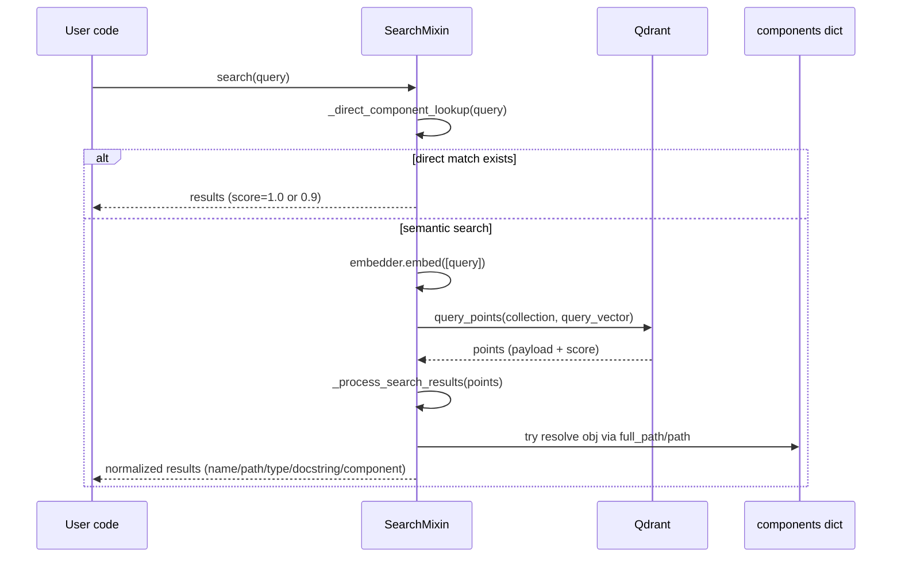
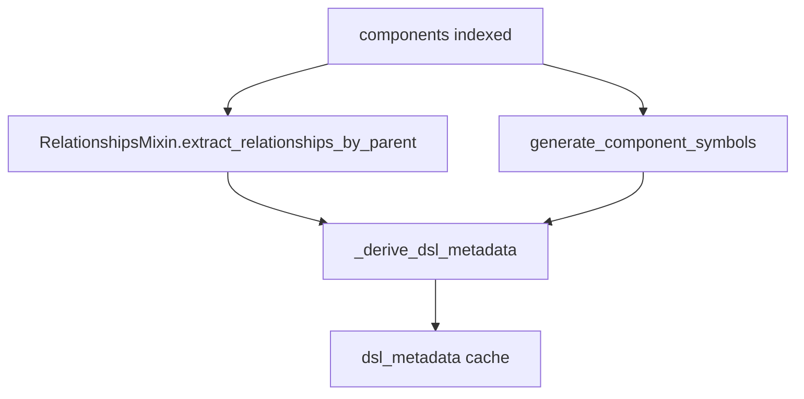
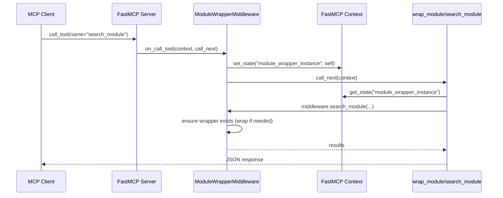

# ModuleWrapper: how the system works (diagrams)

This file documents **how [`adapters/module_wrapper/`](module_wrapper/:1) works** by describing the runtime flow of:

- creating a [`adapters.module_wrapper.ModuleWrapper`](module_wrapper/__init__.py:158) instance
- indexing module components into Qdrant
- searching (semantic + optional ColBERT)
- extracting relationships and generating the symbol/DSL metadata
- MCP middleware integration via [`adapters/module_wrapper_mcp.py`](module_wrapper_mcp.py:1)

---

## 1) Big picture: composition via mixins

[`adapters.module_wrapper.ModuleWrapper`](module_wrapper/__init__.py:158) is a composed class (multiple inheritance) that combines independent concerns:

Key idea: **`ModuleWrapperBase` provides the shared state + helpers**, while each mixin supplies one “slice” of behavior.

---

## 2) Initialization sequence (what happens when you construct a wrapper)

The public entrypoint is creating a wrapper via [`adapters.module_wrapper.ModuleWrapper.__init__()`](module_wrapper/__init__.py:187).

If `auto_initialize=True` (default), it immediately calls [`adapters.module_wrapper.ModuleWrapper.initialize()`](module_wrapper/__init__.py:260).

Important flags that affect initialization behavior:

- `skip_standard_library`, `include_modules`, `exclude_modules` → gating recursion in [`adapters.module_wrapper.indexing_mixin.IndexingMixin._should_include_module()`](module_wrapper/indexing_mixin.py:94)
- `index_nested` → include class members via [`adapters.module_wrapper.indexing_mixin.IndexingMixin._index_nested_components()`](module_wrapper/indexing_mixin.py:261)
- `max_depth` → recursion depth for submodules via [`adapters.module_wrapper.indexing_mixin.IndexingMixin._index_submodule()`](module_wrapper/indexing_mixin.py:313)
- `force_reindex`, `clear_collection` → collection behavior in [`adapters.module_wrapper.qdrant_mixin.QdrantMixin._ensure_collection()`](module_wrapper/qdrant_mixin.py:103)

---

## 3) Indexing flow: turning a Python module into Qdrant points

Indexing is initiated by [`adapters.module_wrapper.indexing_mixin.IndexingMixin._index_module_components()`](module_wrapper/indexing_mixin.py:433).

### 3.1 Control flow

### 3.2 What gets stored

Each discovered member becomes a [`adapters.module_wrapper.core.ModuleComponent`](module_wrapper/core.py:133).

The persisted payload is primarily built by [`adapters.module_wrapper.core.ModuleComponent.to_dict()`](module_wrapper/core.py:186) and includes:

- `name`, `type`, `module_path`, `full_path`
- docstring and (truncated) source
- whether it has children

The vector embedding text is intentionally minimal, generated by [`adapters.module_wrapper.indexing_mixin.IndexingMixin._generate_embedding_text()`](module_wrapper/indexing_mixin.py:593):

- `Name: ...`
- `Type: ...`
- `Path: ...`
- `Documentation: <first line>`

Vectors are created through `self.embedder.embed([text])` (FastEmbed), and points are upserted with deterministic UUID-like IDs in [`adapters.module_wrapper.indexing_mixin.IndexingMixin._store_components_in_qdrant()`](module_wrapper/indexing_mixin.py:627).

---

## 4) Search flow: query → embedding → Qdrant → resolved Python objects

The main API is [`adapters.module_wrapper.search_mixin.SearchMixin.search()`](module_wrapper/search_mixin.py:37).

Notes:

- “Direct lookup” compares the query to `component.name` across `self.components` (fast path) in [`adapters.module_wrapper.search_mixin.SearchMixin._direct_component_lookup()`](module_wrapper/search_mixin.py:253).
- Semantic search uses Qdrant’s `query_points` and then resolves objects from cached component registry, falling back to dynamic import traversal via [`adapters.module_wrapper.search_mixin.SearchMixin.get_component_by_path()`](module_wrapper/search_mixin.py:406).

### Optional ColBERT search

If enabled, [`adapters.module_wrapper.search_mixin.SearchMixin.colbert_search()`](module_wrapper/search_mixin.py:168) uses:

- `self.colbert_embedder.query_embed([query])`
- Qdrant multi-vector search (`using="colbert"`) against `self.colbert_collection_name`

ColBERT vectors are indexed by [`adapters.module_wrapper.indexing_mixin.IndexingMixin._index_components_colbert()`](module_wrapper/indexing_mixin.py:700) after initialization.

---

## 5) Relationships + symbols + DSL metadata (how structure gets inferred)

There are two related concepts:

1. **Relationships**: parent→child containment derived from dataclass type hints
2. **Symbols/DSL**: a compact notation for expressing structures (esp. UI/card composition)

### 5.1 Relationship extraction

Relationships are extracted by [`adapters.module_wrapper.relationships_mixin.RelationshipsMixin.extract_relationships()`](module_wrapper/relationships_mixin.py:219):

- iterate over indexed components
- only consider `component_type == "class"`
- only consider `dataclasses.is_dataclass(cls)`
- parse `typing.get_type_hints(cls)`
- unwrap `Optional[...]` and containers (`List[T]`, etc.)
- consider non-primitive, non-builtin-prefix classes as “component types”

Grouped view:

- [`adapters.module_wrapper.relationships_mixin.RelationshipsMixin.extract_relationships_by_parent()`](module_wrapper/relationships_mixin.py:273) returns `parent_class -> [child relationship dicts...]`
- cached `parent -> [child_class names]` is exposed via [`adapters.module_wrapper.relationships_mixin.RelationshipsMixin.relationships`](module_wrapper/relationships_mixin.py:301)

### 5.2 Symbol mapping + DSL metadata

`ModuleWrapperBase` exposes lazy caches:

- [`adapters.module_wrapper.core.ModuleWrapperBase.symbol_mapping`](module_wrapper/core.py:365) calls [`adapters.module_wrapper.core.ModuleWrapperBase.generate_component_symbols()`](module_wrapper/core.py:379)
- which uses [`adapters.module_wrapper.symbol_generator.SymbolGenerator`](module_wrapper/symbol_generator.py:1)

Then DSL metadata is derived from relationships + symbols via [`adapters.module_wrapper.core.ModuleWrapperBase.dsl_metadata`](module_wrapper/core.py:538) and [`adapters.module_wrapper.core.ModuleWrapperBase._derive_dsl_metadata()`](module_wrapper/core.py:545).

This metadata includes:

- `symbols` and `reverse_symbols`
- “containers” (relationship parents)
- “items” (heuristic wrapper-pattern items, e.g. ButtonList→Button)
- basic grammar hints

---

## 6) MCP integration: how tools access wrappers

MCP integration is provided by [`adapters/module_wrapper_mcp.py`](module_wrapper_mcp.py:1).

Key pieces:

- [`adapters.module_wrapper_mcp.ModuleWrapperMiddleware`](module_wrapper_mcp.py:41) manages a `wrappers: Dict[module_name, ModuleWrapper]` registry
- it can pre-wrap `modules_to_wrap` in [`adapters.module_wrapper_mcp.ModuleWrapperMiddleware._initialize_wrappers()`](module_wrapper_mcp.py:117)
- it hooks into tool calls in [`adapters.module_wrapper_mcp.ModuleWrapperMiddleware.on_call_tool()`](module_wrapper_mcp.py:148)
  - for module-wrapper tools, it stores itself into FastMCP context as `module_wrapper_instance`

Then tool handlers fetch it using `get_context()` and `ctx.get_state(...)` inside [`adapters.module_wrapper_mcp.setup_module_wrapper_tools()`](module_wrapper_mcp.py:316).

---

## 7) Ingestion pipeline (advanced indexing path)

Separately from the “classic” single-vector collection, a multi-vector pipeline exists in [`adapters.module_wrapper.pipeline_mixin.PipelineMixin`](module_wrapper/pipeline_mixin.py:199).

It creates a **3-vector** schema:

- `components` (ColBERT multi-vector)
- `inputs` (ColBERT multi-vector)
- `relationships` (dense vector)

Entry point: [`adapters.module_wrapper.pipeline_mixin.PipelineMixin.run_ingestion_pipeline()`](module_wrapper/pipeline_mixin.py:334).

This is a richer indexing flow used for structural composition and instance-pattern migration.

---

## Glossary

- **Component**: a member of the wrapped module represented by [`adapters.module_wrapper.core.ModuleComponent`](module_wrapper/core.py:133)
- **Collection**: Qdrant collection storing vectors + payload (e.g. `mcp_module_card_framework_v2`)
- **Direct lookup**: name-based match that bypasses vector search
- **Symbol**: Unicode shorthand for a component/class used in DSL
- **Named vectors**: multi-vector schema designed for better retrieval across “components vs inputs vs relationships”
