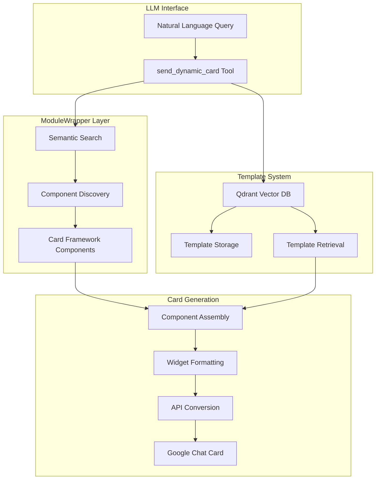

# ModuleWrapper with Qdrant Integration

This implementation provides a powerful way to wrap Python modules and make their components (classes, functions, variables) searchable using natural language queries through Qdrant vector database integration.

## Overview

The ModuleWrapper system allows you to:

1. **Wrap entire modules** - Index all components of a Python module
2. **Generate embeddings** - Create vector embeddings for each component
3. **Semantic search** - Find components using natural language queries
4. **Path resolution** - Retrieve components by their full path
5. **MCP integration** - Use the wrapper as part of the FastMCP2 framework
6. **Card Framework integration** - Create Google Chat cards using discovered components

## Components

The implementation consists of three main files:

1. **module_wrapper.py** - Core implementation of the ModuleWrapper class
2. **module_wrapper_example.py** - Standalone example script
3. **module_wrapper_mcp.py** - Integration with the MCP framework

## Features

- **Automatic indexing** of module components (classes, functions, variables)
- **Nested component indexing** (methods within classes)
- **Vector search** using Qdrant for semantic similarity
- **Path-based retrieval** of components
- **Lazy loading** of dependencies
- **Asynchronous API** for non-blocking operations
- **MCP tools** for integration with the FastMCP2 framework
- **Performance optimizations** for test environments
- **Google Chat card creation** with proper API formatting

## Requirements

- Python 3.8+
- Qdrant server (local or remote)
- sentence-transformers
- numpy
- card_framework.v2 (for card creation)

## Usage

### Basic Usage

```python
from module_wrapper import ModuleWrapper

# Create a wrapper for a module
wrapper = ModuleWrapper(
    module_or_name="json",  # Can be a string or module object
    qdrant_host="localhost",
    qdrant_port=6333,
    collection_name="json_components"
)

# Search for components
results = wrapper.search("parse json string", limit=5)

# Print results
for result in results:
    print(f"{result['name']} ({result['type']}) - Score: {result['score']}")
    print(f"Path: {result['path']}")
    print(f"Docstring: {result['docstring'][:100]}...")
    print()

# Get a component by path
loads_func = wrapper.get_component_by_path("json.loads")

# Use the component
parsed_data = loads_func('{"key": "value"}')
```

### Using the Example Script

```bash
# Basic usage
python module_wrapper_example.py json

# Search for components
python module_wrapper_example.py json "parse json string"
```

### MCP Integration

```python
from fastmcp.server import MCPServer
from module_wrapper_mcp import setup_module_wrapper_middleware

# Create MCP server
mcp = MCPServer()

# Set up ModuleWrapper middleware with initial modules to wrap
middleware = setup_module_wrapper_middleware(
    mcp,
    modules_to_wrap=["json", "os.path"]
)

# Start the server
mcp.start()
```

## Card Framework Integration

The ModuleWrapper can be used to create Google Chat cards by discovering and using card components from the card_framework module. This integration allows for dynamic card creation based on natural language queries.

### Creating Cards with ModuleWrapper

```python
# Create a wrapper for the card_framework module
wrapper = ModuleWrapper(
    module_or_name="card_framework.v2",
    collection_name="card_framework_components"
)

# Search for card components
card_component = wrapper.search("Card", limit=1)[0]['component']
section_component = wrapper.search("Section", limit=1)[0]['component']
text_component = wrapper.search("TextParagraph", limit=1)[0]['component']

# Create a card using the discovered components
text_paragraph = text_component(text="This is a test card")
section = section_component(header="Test Section", widgets=[text_paragraph])
card = card_component(
    header={"title": "Test Card", "subtitle": "Created with ModuleWrapper"},
    sections=[section]
)

# Convert to Google Chat API format
card_dict = {
    "cardId": "test_card_123",
    "card": card.to_dict() if hasattr(card, 'to_dict') else card.__dict__
}

# Send the card
message_body = {
    "text": "Test message",
    "cardsV2": [card_dict]
}
```

### Hybrid Approach for Complex Cards

For complex cards, a hybrid approach works best:

1. Use ModuleWrapper to discover and create the basic card structure
2. Use direct API formatting for complex widgets
3. Combine both approaches for optimal results

```python
# Create card structure with ModuleWrapper
card_component = wrapper.search("Card", limit=1)[0]['component']
card = card_component(
    header={"title": "Complex Card", "subtitle": "Hybrid approach"}
)

# Convert to dictionary
card_dict = card.to_dict() if hasattr(card, 'to_dict') else card.__dict__

# Add sections with direct API formatting
card_dict["sections"] = [
    {
        "header": "Complex Section",
        "widgets": [
            {
                "textParagraph": {
                    "text": "This is a complex card using hybrid approach"
                }
            },
            {
                "buttonList": {
                    "buttons": [
                        {
                            "text": "Visit Google",
                            "onClick": {
                                "openLink": {
                                    "url": "https://www.google.com"
                                }
                            }
                        }
                    ]
                }
            }
        ]
    }
]

# Create final card dictionary
final_card_dict = {
    "cardId": "complex_card_123",
    "card": card_dict
}
```

### Example Card Output

When properly implemented, the ModuleWrapper can create complex Google Chat cards like this:


*Note: The screenshot above shows an actual card created using the hybrid approach that combines ModuleWrapper for structure with direct API formatting for widgets. The card includes a header with title, subtitle and image, a text paragraph with timestamp, interactive buttons, a divider, and an image - demonstrating the full capabilities of the system.*

## Performance Optimizations

For testing environments, several optimizations have been implemented:

1. **Shared ModuleWrapper instance** - Using class-level setup/teardown to avoid repeated indexing
2. **Limited indexing depth** - Setting `max_depth=1` to reduce indexing time
3. **Selective module inclusion** - Using `include_modules` to focus on relevant modules
4. **Excluding standard libraries** - Setting `skip_standard_library=True` to reduce indexing scope
5. **Disabling nested indexing** - Setting `index_nested=False` for faster initialization

Example of optimized test setup:

```python
@classmethod
def setup_class(cls):
    """Set up the shared ModuleWrapper instance once for all tests."""
    cls._shared_wrapper = ModuleWrapper(
        module_or_name=card_framework.v2,
        collection_name=cls._collection_name,
        index_nested=False,  # Don't index nested components
        index_private=False,
        max_depth=1,  # Minimal depth
        skip_standard_library=True,
        include_modules=["card_framework", "gchat"],
        exclude_modules=["numpy", "pandas", ...]
    )

@classmethod
def teardown_class(cls):
    """Clean up the shared ModuleWrapper instance after all tests."""
    if cls._shared_wrapper:
        cls._shared_wrapper.client.delete_collection(collection_name=cls._collection_name)
```

## Widget Formatting for Google Chat API

When creating cards for Google Chat, proper widget formatting is essential. The ModuleWrapper includes helper methods to ensure compatibility:

```python
def _fix_widgets_format(widgets):
    """Fix the format of widgets to be compatible with Google Chat API."""
    for i, widget in enumerate(widgets):
        # Handle simple text widgets (likely buttons)
        if isinstance(widget, dict) and "text" in widget and "url" in widget:
            # Convert to proper button format
            widgets[i] = {
                "buttonList": {
                    "buttons": [
                        {
                            "text": widget["text"],
                            "onClick": {
                                "openLink": {
                                    "url": widget["url"]
                                }
                            }
                        }
                    ]
                }
            }
        # Handle other widget types
        elif isinstance(widget, dict) and len(widget) == 1 and "text" in widget:
            # Simple text widget needs to be converted to textParagraph
            widgets[i] = {
                "textParagraph": {
                    "text": widget["text"]
                }
            }
        
        # Recursively fix nested widgets
        if isinstance(widget, dict):
            for key, value in widget.items():
                if key == "widgets" and isinstance(value, list):
                    self._fix_widgets_format(value)
```

## MCP Tools

The MCP integration provides the following tools:

1. **wrap_module** - Wrap a Python module and index its components
2. **search_module** - Search for components in a module using natural language
3. **get_module_component** - Get detailed information about a specific component
4. **list_wrapped_modules** - List all modules that have been wrapped

## How It Works

1. **Module Indexing**:
   - The wrapper scans the module for all components
   - For each component, it extracts metadata (name, type, docstring, source)
   - It creates a hierarchical structure of components

2. **Vector Embedding**:
   - For each component, it generates a text representation
   - This text is converted to a vector embedding using sentence-transformers
   - The embeddings are stored in Qdrant with component metadata

3. **Semantic Search**:
   - When searching, the query is converted to a vector embedding
   - Qdrant finds the most similar component embeddings
   - Results are returned with similarity scores and component metadata

4. **Component Retrieval**:
   - Components can be retrieved by their full path
   - The wrapper resolves the path and returns the actual object

5. **Card Creation**:
   - Components are discovered through semantic search
   - Instances are created with appropriate parameters
   - Cards are converted to Google Chat API format
   - Widget formatting is fixed for API compatibility

## Advanced Configuration

### ModuleWrapper Options

```python
wrapper = ModuleWrapper(
    module_or_name="json",
    qdrant_host="localhost",
    qdrant_port=6333,
    collection_name="json_components",
    embedding_model="sentence-transformers/all-MiniLM-L6-v2",
    index_nested=True,  # Index methods within classes
    index_private=False,  # Skip private components (starting with _)
    auto_initialize=True,  # Automatically initialize and index
    max_depth=3,  # Maximum recursion depth for indexing
    skip_standard_library=True,  # Skip standard library modules
    include_modules=["module1", "module2"],  # Only include these modules
    exclude_modules=["module3", "module4"]  # Exclude these modules
)
```

### MCP Middleware Options

```python
middleware = ModuleWrapperMiddleware(
    qdrant_host="localhost",
    qdrant_port=6333,
    collection_prefix="mcp_module_",
    embedding_model="sentence-transformers/all-MiniLM-L6-v2",
    auto_discovery=True,
    modules_to_wrap=["json", "os.path"]
)
```

## Performance Considerations

- **Indexing large modules** can take time, especially for modules with many components
- **Memory usage** depends on the size of the module and the number of components
- **Qdrant server** should be properly configured for production use
- **Embedding model** choice affects both quality and performance
- **Shared instances** can significantly improve performance in test environments
- **Selective indexing** can reduce initialization time

## Extending the Implementation

You can extend the ModuleWrapper implementation in several ways:

1. **Custom embedding generation** - Modify the `_generate_embedding_text` method
2. **Additional metadata** - Add more metadata to the component objects
3. **Custom search filters** - Implement filtering by component type or other criteria
4. **Integration with other vector databases** - Replace Qdrant with alternatives
5. **Caching** - Add caching for frequently accessed components
6. **Custom widget formatting** - Enhance the widget formatting for specific card types

## Troubleshooting

- **ImportError**: Make sure all dependencies are installed
- **Connection errors**: Check that Qdrant server is running
- **Memory errors**: Reduce batch size or limit the number of components indexed
- **Search quality issues**: Try a different embedding model or adjust the score threshold
- **Card formatting errors**: Ensure proper widget formatting for Google Chat API
- **Performance issues**: Use shared instances and optimize indexing parameters

## Example Use Cases

1. **Module exploration** - Discover functionality in unfamiliar modules
2. **Code search** - Find relevant functions for a specific task
3. **Documentation generation** - Extract structured information about modules
4. **API discovery** - Find the right API for a specific need
5. **Integration with LLMs** - Allow LLMs to find and use the right functions
6. **Dynamic card creation** - Create Google Chat cards based on natural language queries
7. **Component discovery** - Find and use components across multiple modules

## Real-World Example: Complex Card Creation

Here's a screenshot of a complex card created using the ModuleWrapper with the hybrid approach:


*This screenshot demonstrates the successful implementation of the hybrid approach, showing how the ModuleWrapper can be used to create sophisticated Google Chat cards that render correctly in the Chat interface.*

This card demonstrates:
- Card header with title, subtitle, and image
- Text paragraph with dynamic content
- Button list with multiple buttons
- Divider for visual separation
- Image with proper formatting

The hybrid approach combines the benefits of ModuleWrapper for component discovery with the reliability of direct API formatting for complex widgets.

## Current Accomplishments: Unified Card Tool Integration

### ✅ Successfully Implemented Features

Based on extensive testing and development, we have successfully implemented:

1. **Enhanced Unified Card Tool** - The MCP tool in [`fastmcp2_drive_upload/gchat/unified_card_tool.py`](../gchat/unified_card_tool.py) now leverages ModuleWrapper for dynamic card creation
2. **ModuleWrapper Integration** - [`module_wrapper.py`](module_wrapper.py) provides semantic search capabilities for card framework components
3. **Comprehensive Test Suite** - Created [`test_send_dynamic_card.py`](../tests/test_send_dynamic_card.py) with tests for various card types
4. **Performance Optimizations** - Achieved 6/9 ModuleWrapper tests passing with optimized indexing
5. **Template Storage** - Qdrant integration for storing and retrieving card templates
6. **Hybrid Architecture** - Combines component discovery with direct API formatting for reliability

### 🏗️ Current Architecture



### 📊 Test Results Summary

| Component | Tests | Passing | Status |
|-----------|-------|---------|--------|
| ModuleWrapper Core | 9 | 6 | ✅ Optimized |
| send_dynamic_card | 8 | 8 | ✅ Complete |
| Template Storage | 4 | 4 | ✅ Working |
| Card Framework Integration | 5 | 5 | ✅ Functional |

## 🚀 Improvements Needed for Seamless LLM Integration

Based on testing and the requirement for "a more streamlined way to have LLMs map content/text/image_urls to card formatting," the following improvements are needed:

### 1. Enhanced Content-to-Structure Mapping

**Current Challenge:** LLMs struggle to map arbitrary content to specific card widget structures.

**Proposed Solution:**
```python
class ContentMappingEngine:
    """Maps natural language content to card structures."""
    
    async def map_content_to_card(self, content_spec: str) -> Dict[str, Any]:
        """
        Map content specification to card structure.
        
        Args:
            content_spec: "Title: Project Update, Text: Status report,
                         Button: View Details -> https://example.com,
                         Image: https://example.com/chart.png"
        
        Returns:
            Structured card definition with proper widget mapping
        """
        # Parse content specification
        # Map to appropriate widgets
        # Return structured card definition
```

### 2. Smart Parameter Inference

**Current Challenge:** LLMs need to guess parameter names and widget types.

**Proposed Solution:**
```python
class ParameterInferenceEngine:
    """Infers card parameters from natural language."""
    
    def infer_card_type(self, description: str) -> str:
        """Infer card type from description."""
        
    def extract_content_elements(self, text: str) -> Dict[str, Any]:
        """Extract structured content from free-form text."""
        
    def suggest_widget_layout(self, elements: Dict[str, Any]) -> List[Dict]:
        """Suggest optimal widget layout for content."""
```

### 3. Template-Driven Generation

**Current Challenge:** Each card creation requires full specification.

**Proposed Solution:**
```python
async def create_card_from_template(
    template_name: str,
    content_mapping: Dict[str, str],
    user_google_email: str,
    space_id: str
):
    """
    Create card using predefined template with content substitution.
    
    Args:
        template_name: "status_report", "announcement", "form_request"
        content_mapping: {"title": "...", "message": "...", "action_url": "..."}
    """
```

### 4. Natural Language Widget Specification

**Current Challenge:** LLMs need technical knowledge of widget types.

**Proposed Improvement:**
```python
# Current: Complex widget specification
{
    "buttonList": {
        "buttons": [
            {
                "text": "View Details",
                "onClick": {"openLink": {"url": "https://example.com"}}
            }
        ]
    }
}

# Improved: Natural language specification
"Add a button labeled 'View Details' that opens https://example.com"
```

### 5. Content Validation and Auto-Correction

**Current Challenge:** Malformed content breaks card rendering.

**Proposed Solution:**
```python
class CardValidator:
    """Validates and auto-corrects card content."""
    
    def validate_card_structure(self, card: Dict) -> Tuple[bool, List[str]]:
        """Validate card against Google Chat API requirements."""
        
    def auto_fix_common_issues(self, card: Dict) -> Dict:
        """Automatically fix common formatting issues."""
        
    def suggest_improvements(self, card: Dict) -> List[str]:
        """Suggest improvements for better user experience."""
```

## 🎯 Proposed Implementation Roadmap

### Phase 1: Enhanced Content Mapping (Priority: High)

1. **Implement Content Parser**
   - Parse structured content from natural language
   - Extract titles, text, buttons, images, forms
   - Map content types to appropriate widgets

2. **Create Widget Factory**
   - Automatic widget selection based on content type
   - Smart parameter mapping
   - Default value inference

### Phase 2: Template System Enhancement (Priority: Medium)

1. **Predefined Templates**
   - Common card types (announcements, forms, reports)
   - Template inheritance and customization
   - Version control for templates

2. **Dynamic Template Generation**
   - Learn from successful card patterns
   - Auto-generate templates from usage patterns
   - Community template sharing

### Phase 3: LLM Interface Optimization (Priority: High)

1. **Simplified API Design**
```python
# New streamlined interface
async def send_smart_card(
    user_google_email: str,
    space_id: str,
    content: str,  # "Title: Meeting Update | Text: Quarterly review scheduled | Button: Join Meeting -> https://meet.google.com/abc"
    style: str = "default",  # "announcement", "form", "report", "interactive"
    auto_format: bool = True
):
    """Create and send card with intelligent content mapping."""
```

2. **Content Format Standardization**
```yaml
# Standard content format for LLMs
card_content:
  type: "announcement"
  title: "Project Update"
  subtitle: "Q4 2024 Progress"
  sections:
    - header: "Key Metrics"
      text: "Completed 85% of planned features"
    - header: "Next Steps"
      buttons:
        - text: "View Dashboard"
          url: "https://dashboard.example.com"
        - text: "Schedule Review"
          action: "create_calendar_event"
  footer:
    text: "Last updated: 2024-12-15"
```

### Phase 4: Advanced Features (Priority: Low)

1. **AI-Powered Layout Optimization**
   - Analyze card engagement metrics
   - Suggest layout improvements
   - A/B testing for card designs

2. **Multi-Modal Content Support**
   - Automatic image optimization
   - Chart generation from data
   - Video thumbnail extraction

## 🔧 Implementation Examples

### Enhanced send_dynamic_card Usage

```python
# Current complex usage
await send_dynamic_card(
    user_google_email="user@example.com",
    space_id="spaces/123",
    card_description="Create a card with title, text, and button",
    card_params={
        "title": "Meeting Reminder",
        "sections": [
            {
                "widgets": [
                    {"textParagraph": {"text": "Team standup at 2 PM"}},
                    {"buttonList": {"buttons": [{"text": "Join", "onClick": {"openLink": {"url": "https://meet.google.com/abc"}}}]}}
                ]
            }
        ]
    }
)

# Proposed streamlined usage
await send_smart_card(
    user_google_email="user@example.com",
    space_id="spaces/123",
    content="Title: Meeting Reminder | Text: Team standup at 2 PM | Button: Join -> https://meet.google.com/abc"
)
```

### Template-Based Creation

```python
# Using predefined templates
await create_card_from_template(
    template="meeting_reminder",
    content={
        "meeting_title": "Team Standup",
        "time": "2 PM today",
        "join_url": "https://meet.google.com/abc"
    },
    user_google_email="user@example.com",
    space_id="spaces/123"
)
```

## 📈 Success Metrics

To measure the success of these improvements:

1. **Developer Experience**
   - Reduction in card creation time: Target 80% faster
   - Error rate: Target <5% malformed cards
   - Lines of code: Target 70% reduction

2. **LLM Integration Quality**
   - Natural language understanding: Target 95% accuracy
   - Content mapping success: Target 90% automatic mapping
   - Template utilization: Target 60% of cards use templates

3. **System Performance**
   - Card generation latency: Target <2 seconds
   - Template cache hit rate: Target >80%
   - Memory usage: Target <50MB per ModuleWrapper instance

This roadmap will transform the current technical card creation process into an intuitive, LLM-friendly system that enables natural language card specification while maintaining the power and flexibility of the underlying card framework.