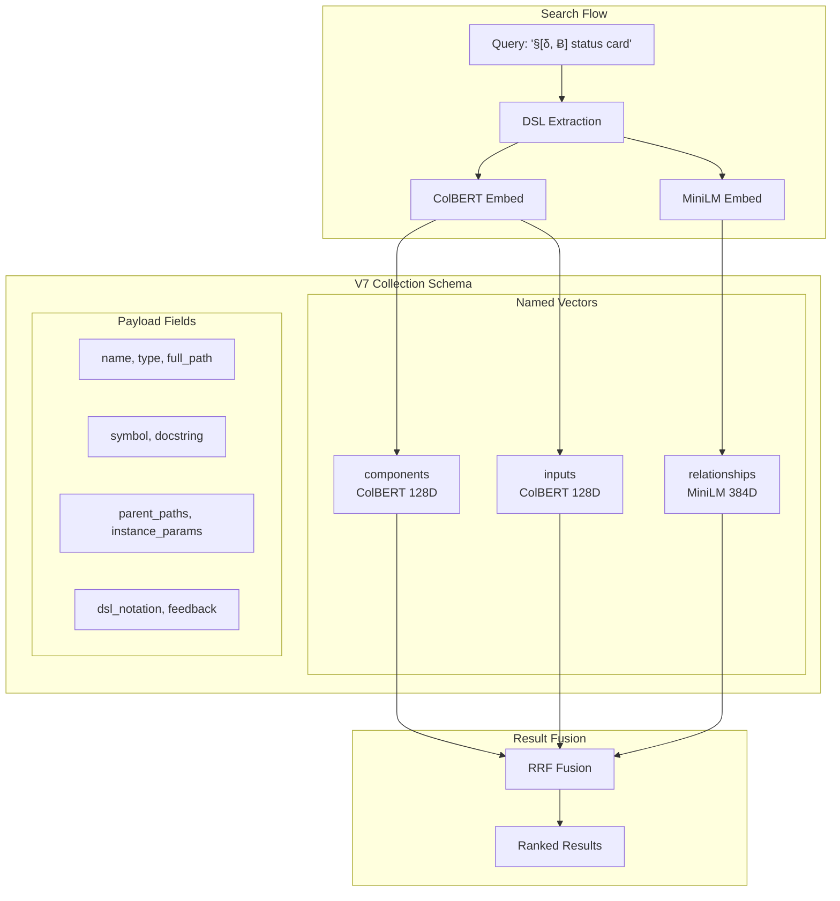
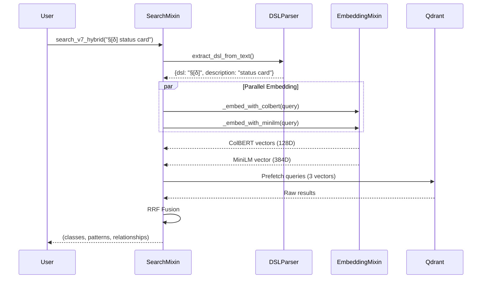
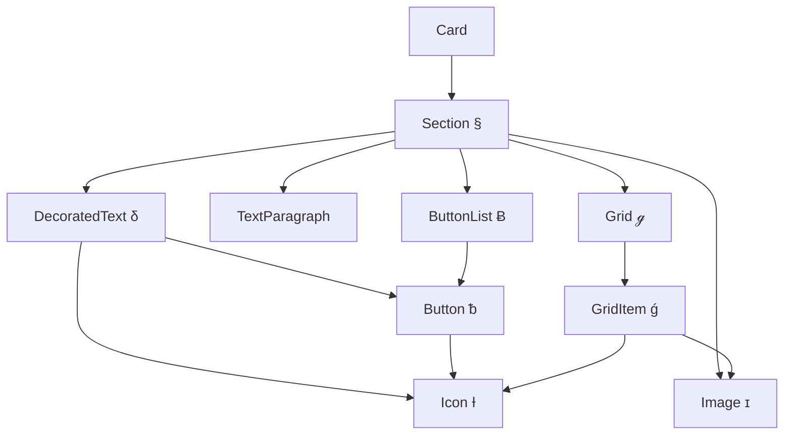
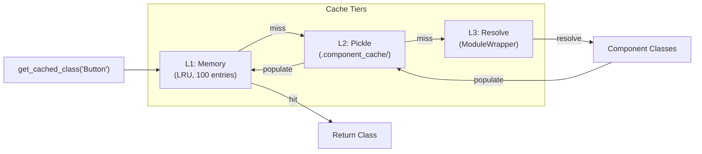

# Module Wrapper

A modular system for Python module introspection with Qdrant vector database integration. ModuleWrapper extracts components from Python modules, generates embeddings, and enables semantic search with DSL notation support.

## Features

- **Module Introspection** - Automatically extract classes, functions, and relationships from Python modules
- **Multi-Vector Embeddings** - ColBERT (128D) + MiniLM (384D) for precise semantic search
- **DSL Notation** - Unicode symbols for compact structure representation (`§[δ, Ƀ[ᵬ×2]]`)
- **DAG Relationships** - NetworkX-based containment graph with traversal queries
- **Tiered Caching** - L1 (memory) → L2 (pickle) → L3 (resolve) for fast retrieval
- **Instance Patterns** - Store and vary successful component usage patterns

## Quick Start

```python
from adapters.module_wrapper import ModuleWrapper

# Initialize with a module
wrapper = ModuleWrapper("card_framework.v2", auto_initialize=True)

# Search for components
results = wrapper.search("button with click action")

# Get component by path
Button = wrapper.get_component_by_path("card_framework.v2.widgets.button.Button")

# Use DSL-aware search
results = wrapper.search_by_dsl("§[δ, Ƀ[ᵬ×2]] Build a status card")
```

## Architecture

ModuleWrapper uses a mixin composition pattern for modularity:

```mermaid
classDiagram
    class ModuleWrapper {
        +search(query)
        +get_component_by_path(path)
        +search_v7_hybrid(description)
    }

    class ModuleWrapperBase {
        +module_name: str
        +components: Dict
        +_initialized: bool
    }

    class QdrantMixin {
        +client: QdrantClient
        +collection_name: str
        +_initialize_qdrant()
    }

    class EmbeddingMixin {
        +embedder: TextEmbedding
        +colbert_embedder: LateInteraction
        +_embed_with_colbert()
        +_embed_with_minilm()
    }

    class IndexingMixin {
        +_index_module_components()
        +_extract_component_info()
    }

    class SearchMixin {
        +search()
        +search_v7()
        +search_v7_hybrid()
        +search_by_dsl()
    }

    class RelationshipsMixin {
        +relationships: Dict
        +extract_relationships()
    }

    class SymbolsMixin {
        +symbol_mapping: Dict
        +parse_dsl_to_components()
        +build_dsl_from_paths()
    }

    class PipelineMixin {
        +ingest_v7()
        +_build_v7_payload()
    }

    class GraphMixin {
        +build_relationship_graph()
        +get_descendants()
        +get_all_paths()
    }

    class CacheMixin {
        +cache_pattern()
        +get_cached_class()
        +get_cached_entry()
    }

    class InstancePatternMixin {
        +store_instance_pattern()
        +generate_variations()
        +get_cached_variation()
    }

    ModuleWrapper --|> QdrantMixin
    ModuleWrapper --|> EmbeddingMixin
    ModuleWrapper --|> IndexingMixin
    ModuleWrapper --|> SearchMixin
    ModuleWrapper --|> RelationshipsMixin
    ModuleWrapper --|> SymbolsMixin
    ModuleWrapper --|> PipelineMixin
    ModuleWrapper --|> GraphMixin
    ModuleWrapper --|> CacheMixin
    ModuleWrapper --|> InstancePatternMixin
    ModuleWrapper --|> ModuleWrapperBase
```



## Multi-Vector Embedding Schema

The V7 collection uses three named vectors for different search strategies:



| Vector | Model | Dimension | Purpose |
|--------|-------|-----------|---------|
| `components` | ColBERT | 128D | Component identity matching |
| `inputs` | ColBERT | 128D | Parameter/content matching |
| `relationships` | MiniLM | 384D | Structural pattern matching |

## DSL Notation

Compact Unicode symbols represent component structures:

| Symbol | Component | Example |
|--------|-----------|---------|
| `§` | Section | `§[...]` |
| `δ` | DecoratedText | `§[δ]` |
| `Ƀ` | ButtonList | `§[Ƀ[ᵬ]]` |
| `ᵬ` | Button | `Ƀ[ᵬ×2]` |
| `ℊ` | Grid | `§[ℊ[ǵ×4]]` |
| `ǵ` | GridItem | `ℊ[ǵ×4]` |
| `Ɨ` | Icon | `ᵬ[Ɨ]` |
| `ɪ` | Image | `§[ɪ]` |

**Syntax:** `SYMBOL[child, child×N, ...]`

**Examples:**
- `§[δ]` - Section with DecoratedText
- `§[δ, Ƀ[ᵬ×2]]` - Section with text and 2 buttons
- `§[ℊ[ǵ×4]]` - Section with 4-item grid

```python
# Parse DSL to components
parsed = wrapper.parse_dsl_to_components("§[δ, Ƀ[ᵬ×2]]")
# {'components': [{'name': 'Section', 'symbol': '§'}, ...], 'is_valid': True}

# Build DSL from paths
dsl = wrapper.build_dsl_from_paths(["Section", "DecoratedText", "Button"])
# "§[δ, ᵬ] | Section DecoratedText Button"
```

## Search Flow



## DAG Relationships

Component containment forms a directed acyclic graph:



```python
# Build the relationship graph
wrapper.build_relationship_graph()

# Get all descendants
widgets = wrapper.get_descendants("Section", depth=2)
# ['DecoratedText', 'ButtonList', 'Image', 'Grid', 'Button', 'Icon', ...]

# Find paths between components
paths = wrapper.get_all_paths("Section", "Icon")
# [['Section', 'DecoratedText', 'Icon'], ['Section', 'ButtonList', 'Button', 'Icon']]

# Check containment
wrapper.can_contain("Section", "Icon")  # True (via DecoratedText or Button)
```

## Caching Architecture

Three-tier cache for fast component retrieval:



```python
# Cache a pattern
entry = wrapper.cache_pattern(
    key="status_card_v1",
    component_paths=["Section", "DecoratedText", "ButtonList"],
    instance_params={"text": "Status: Online"},
)

# Fast class retrieval (uses L1/L2/L3)
Section = wrapper.get_cached_class("Section")
Button = wrapper.get_cached_class("Button")

# Get cached entry
entry = wrapper.get_cached_entry("status_card_v1")
```

## Quick Reference

| Mixin | Purpose | Key Methods |
|-------|---------|-------------|
| `QdrantMixin` | Qdrant client management | `_initialize_qdrant()`, `_ensure_collection()` |
| `EmbeddingMixin` | MiniLM + ColBERT embeddings | `_embed_with_colbert()`, `_embed_with_minilm()` |
| `IndexingMixin` | Component extraction & indexing | `_index_module_components()` |
| `SearchMixin` | Multi-vector semantic search | `search()`, `search_v7_hybrid()`, `search_by_dsl()` |
| `RelationshipsMixin` | Type-hint relationship extraction | `extract_relationships()` |
| `SymbolsMixin` | DSL symbol generation & parsing | `parse_dsl_to_components()`, `build_dsl_from_paths()` |
| `PipelineMixin` | V7 collection ingestion | `ingest_v7()` |
| `GraphMixin` | NetworkX DAG operations | `get_descendants()`, `get_all_paths()` |
| `CacheMixin` | Tiered component caching | `cache_pattern()`, `get_cached_class()` |
| `InstancePatternMixin` | Pattern storage & variation | `store_instance_pattern()`, `generate_variations()` |

## Detailed Documentation

- [Embeddings](docs/embeddings.md) - Multi-vector embedding strategies
- [DSL Notation](docs/dsl-notation.md) - Symbol syntax and parsing
- [Search Strategies](docs/search-strategies.md) - Search methods and vector selection
- [Relationships & DAG](docs/relationships-dag.md) - Graph structure and traversal
- [Caching](docs/caching.md) - Tiered cache system
- [Instance Patterns](docs/instance-patterns.md) - Pattern storage and variations

## Version

`2.0.0`
