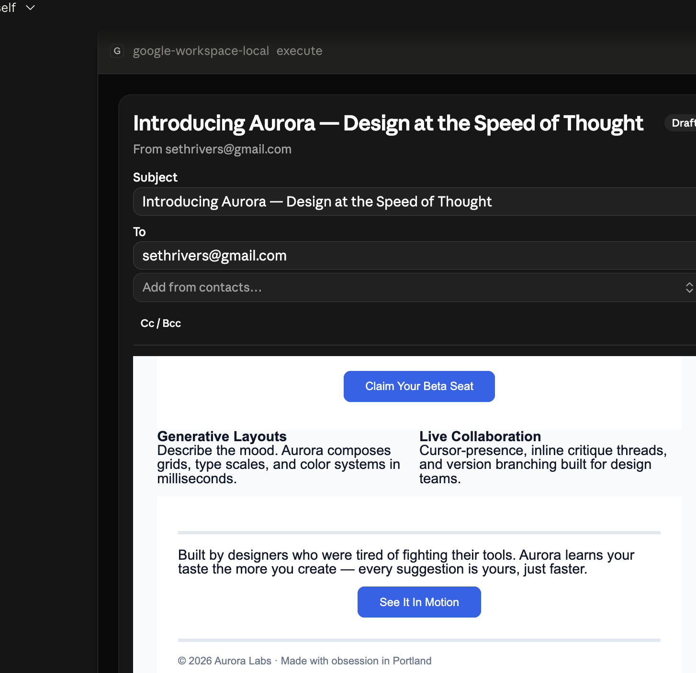

# Gmail draft preview app

An MCP App (`FastMCPApp`) that renders a Gmail draft as an interactive card in
the chat: the fully rendered email in a sandboxed iframe, editable To/Cc/Bcc
fields, and **Send** / **Save draft** / **Discard** buttons.



Source: [`gmail/draft_app.py`](../gmail/draft_app.py). Registered in
[`server.py`](../server.py) alongside the other app providers, behind
`ENABLE_APP_PROVIDERS=true`.

## Tool surface

| Tool | Visibility | Purpose |
|---|---|---|
| `preview_gmail_draft` | model | Entry point. Renders the card. Takes an existing `draft_id`, or `subject`/`body`/`html_body`/`email_spec` to create the draft first. |
| `gmail_draft_send` | app only | Applies recipient edits, then `drafts().send`. |
| `gmail_draft_save` | app only | Applies recipient edits via `drafts().update`. Does not send. |
| `gmail_draft_discard` | app only | `drafts().delete`. |

The three backend tools are invisible to the model — only the card can call
them, addressed through FastMCP's hashed backend names.

## Preview fidelity

The draft is fetched with `format="raw"` and parsed with `email`, so the card
previews the *exact* `text/html` MIME part Gmail will deliver. MJML output
survives verbatim: doctype, VML namespaces, `<style>` blocks, `@media` queries
and `<!--[if mso]>` conditionals are never rewritten or sanitised.

Two deliberate transformations:

- **`cid:` → `data:`** — inline images are base64-inlined so they resolve
  inside the iframe (images over 200 KB are skipped and the card says so).
- **Charset guarantee** — bare fragments get wrapped with `<meta charset>` so
  emoji and non-Latin subjects don't mangle. Documents that already declare a
  charset are passed through untouched.

Everything else degrades visibly rather than silently: unresolved `cid:` refs,
skipped image inlining and oversized-payload truncation each render a banner
inside the preview and a note under it. The draft itself is never modified by
previewing.

**Scripts don't run.** The iframe is sandboxed without `allow-scripts`, which
matches Gmail's own behaviour (Gmail strips `<script>`), so the preview is both
safe and honest. Only popups are allowed, so links stay clickable.

**Remote images.** Hosts build the app iframe's `img-src` from the declared
CSP domains, and scheme-only grants like `https:` are not honoured everywhere —
in Claude Desktop remote images rendered broken. So they are fetched
server-side and inlined as `data:` URIs, covering every remote form MJML emits:
``, `<td background>`, CSS `url(...)` for `mj-section` backgrounds and
VML `<v:image>`. Failures are silent — a broken image beats a failed preview.

Budgets are deliberately tight (150 KB per image, 500 KB total) because the
base64 rides in the result's `structuredContent`, and some hosts surface
structured content to the model as well as to the iframe — an unbounded budget
would charge every preview a large slice of context. Set
`DRAFT_PREVIEW_INLINE_IMAGES=false` to turn inlining off entirely.

The CSP is still widened (`_widen_preview_csp()` adds `https:` and `data:` to
the entry tool's `meta["ui"]["csp"].resourceDomains`) so hosts that *do* honour
it can load anything the budget skipped.

## Recipient edits are lossless

Editing To/Cc/Bcc rewrites only those headers on the parsed MIME message and
re-uploads via `drafts().update`. The body, attachments, transfer encodings and
`threadId` are preserved byte-for-byte — no re-render, no lossy round-trip.

## Allow list

`gmail_draft_send` runs the same `GMAIL_ALLOW_LIST` check as
`send_gmail_message`. Rather than eliciting, it returns
`needs_confirm: true` and the card reveals a **Send anyway** button — the click
is the human-in-the-loop confirmation.

## Testing it in a real client

MCP Apps only render in clients that advertise the
`io.modelcontextprotocol/ui` extension. **Claude Desktop** and the **MCP
Inspector** do; VS Code Copilot does not.

The card works with Code Mode either on or off — see
"Code Mode" below for how that bridge works. To run over HTTP:

```bash
MCP_TRANSPORT=http ENABLE_APP_PROVIDERS=true uv run python server.py
```

For a stdio client (Claude Desktop), point it at
`uv run --no-sync --directory <repo> python server.py`. Set `HF_HUB_OFFLINE=1`
— without it, Hugging Face revalidates already-cached embedding models over the
network and startup exceeds the client's ~60s handshake timeout (22s with it,
~60s+ without).

Then point the client at `https://localhost:8002/mcp` and ask it to draft an
email — for example *"draft an MJML email to me with a hero, a button and a
footer, then preview it"*. The model calls `draft_gmail_message` followed by
`preview_gmail_draft` (or `preview_gmail_draft` alone with an `email_spec`).

What to check in the card:

1. The preview matches what Gmail shows for the same draft (open it in Gmail
   → Drafts side by side).
2. Editing **To** and pressing **Save draft** updates the draft in Gmail while
   leaving the body and any attachments intact.
3. **Discard** asks for confirmation, then the draft disappears from Gmail.
4. **Send** delivers the email, and a non-allow-listed recipient surfaces the
   **Send anyway** path instead of sending.


## Code Mode

Under Code Mode the model never sees the real catalog — every call goes through
`execute`. Two things are needed for an app card to survive that.

**Reachability.** `execute` resolves tool names against
`get_tool_catalog()`, which reads `mcp.local_provider._components`. A
`FastMCPApp` keeps its tools in its *own* `LocalProvider`, so app tools were
absent and `call_tool("preview_gmail_draft", …)` raised `NotFoundError`. The
catalog now also walks `mcp.providers` and includes model-visible provider
tools — deliberately **not** the `["app"]`-only backends, so the model still
cannot send mail without the card's button press. Calling `gmail_draft_send`
from inside `execute` returns `Unknown tool`, by design.

**Rendering.** A host decides a tool can draw UI from `meta.ui.resourceUri` on
the *tool definition*; there is no per-result channel. Under Code Mode the only
tool the host sees is `execute`, which carried no UI meta — so the card arrived
as plain JSON and was printed instead of rendered. `execute` now points at
`ui://prefab/code-mode/renderer.html`, registered by `setup_ui_apps`. FastMCP's
placeholder URI cannot be used here: Prefab resource synthesis walks provider
`_components`, and `execute` is built by a transform, so no per-tool renderer
would ever be synthesized for it.

Because `execute` now always advertises UI, ordinary results would otherwise
render as an empty panel — `build_default_execute_view()` gives them a result
card instead.

**Context cost.** An app tool's return value *is* the serialized view, so
`execute` replaces the content with a one-line summary rather than echoing
~15 KB of layout JSON at the model. Note this only controls the `content`
field: `structuredContent` carries the view because the renderer needs it, and
a host may surface that to the model too. That is host behaviour, not something
the server can suppress — it is the reason the image budgets above are tight.


## Client capability gating

A view spec is worthless to a client that cannot draw it, and it is not free —
the view rides in `structuredContent`. With `DRAFT_PREVIEW_UI_GATING=true`
(the default), a client showing no sign of MCP UI support gets a compact text
summary instead of a card, `preview_gmail_draft` skips the image fetch and
contact lookup entirely, and `execute` returns raw results with no view.

Two signals from the client's `initialize` handshake decide this, and **either
one is enough**:

1. **The MCP Apps UI extension.** `ctx.client_supports_extension(UI_EXTENSION_ID)`
   reports whether the client advertised `io.modelcontextprotocol/ui`.
   Protocol-correct, but under-reported — a host can render MCP UI without
   declaring it.
2. **`clientInfo.name`**, matched case-insensitively as a substring against
   `DRAFT_PREVIEW_UI_CLIENTS` (default `claude-ai,claudeai,claude-desktop`).
   This is what makes gating safe to default on: a host that renders but never
   advertises still gets its card.

Name matching is a heuristic — a client may send any name it likes — but this
decides payload size, not access, so a wrong guess costs tokens rather than
granting anything. OAuth is deliberately not consulted: under dynamic client
registration the `client_id` is minted per registration, so auth identifies the
*user*, not the software they are running.

Verified behaviour against real handshakes: FastMCP's own `Client` reports
`name="mcp"` and advertises nothing, so it is gated to text; a client reporting
`name="claude-ai"` gets the card without advertising the extension.

**Finding out what your client reports.** The server logs each client's identity
once per session:

```
[ui-gating] client=claude-ai version=2.1.0 advertises_extension=False allowlisted=True -> card
```

If a host you expect to render lands on `-> text-only`, add its reported name to
`DRAFT_PREVIEW_UI_CLIENTS`. To switch the whole mechanism off and send cards to
every client unconditionally, set `DRAFT_PREVIEW_UI_GATING=false`.
