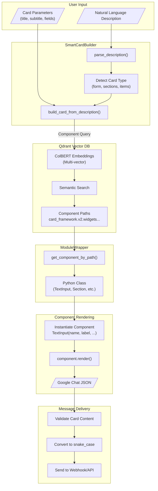
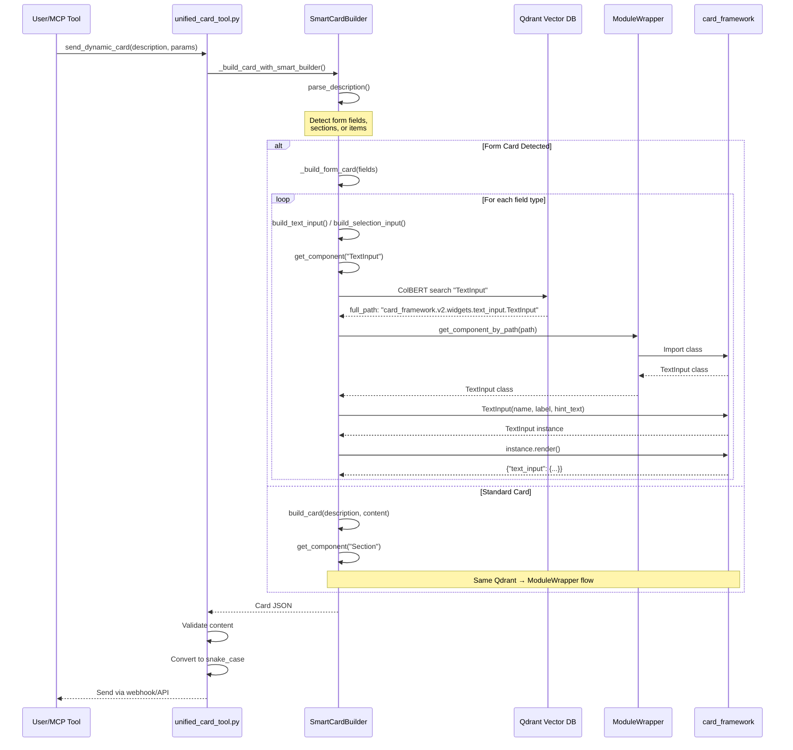
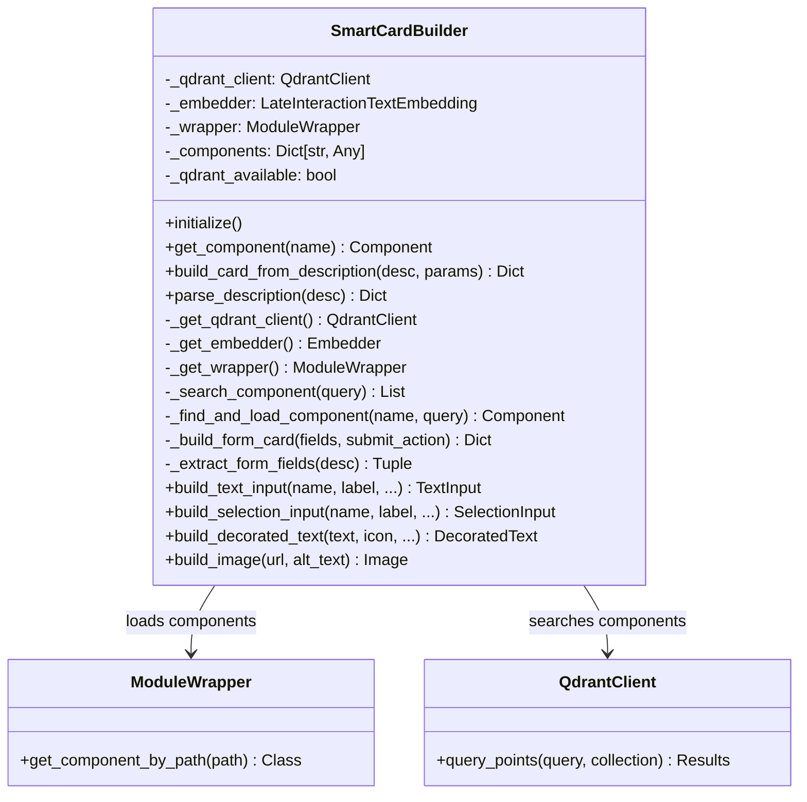
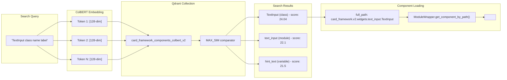
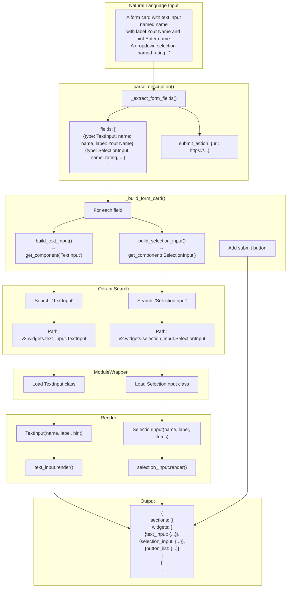
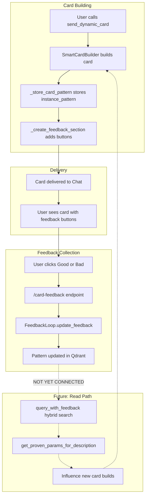
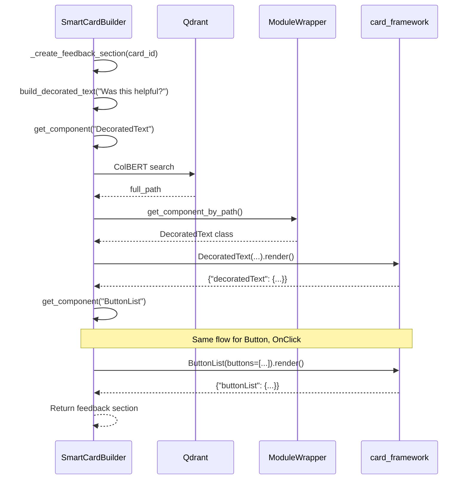
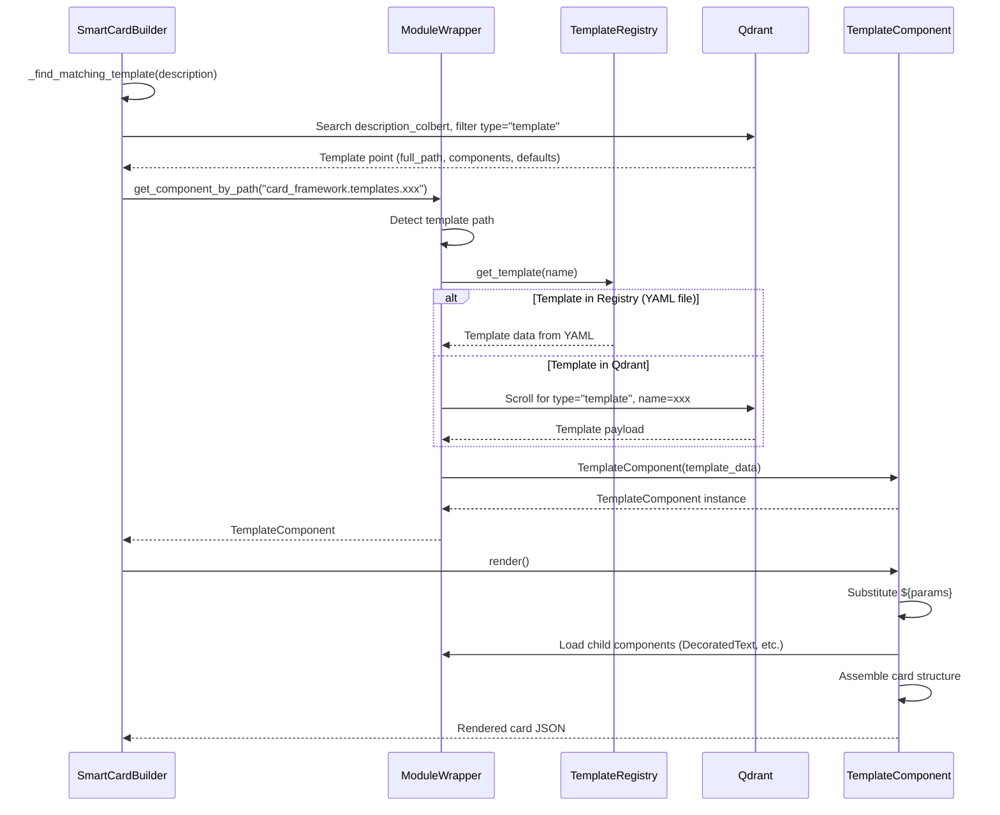

# SmartCardBuilder Architecture

## Overview

The SmartCardBuilder implements a **component-based card creation system** that uses:
- **Qdrant Vector DB** with ColBERT embeddings for semantic component search
- **ModuleWrapper** for dynamic Python class loading
- **card_framework** components with `.render()` methods for JSON generation

This architecture ensures a **single, consistent flow** for all card types (standard cards, form cards, columns, grids, etc.).

---

## High-Level Architecture



---

## Component Loading Flow



---

## Key Components

### 1. SmartCardBuilder (`gchat/smart_card_builder.py`)



### 2. Component Search Flow



---

## Form Card Flow



---

## Supported Components

| Component | Qdrant Path | Usage |
|-----------|-------------|-------|
| **Section** | `card_framework.v2.section.Section` | Container for widgets |
| **TextInput** | `card_framework.v2.widgets.text_input.TextInput` | Form text fields |
| **SelectionInput** | `card_framework.v2.widgets.selection_input.SelectionInput` | Dropdowns, checkboxes |
| **DecoratedText** | `card_framework.v2.widgets.decorated_text.DecoratedText` | Rich text with icons |
| **Image** | `card_framework.v2.widgets.image.Image` | Images |
| **Columns** | `card_framework.v2.widgets.columns.Columns` | Multi-column layouts |
| **ButtonList** | `card_framework.v2.widgets.button_list.ButtonList` | Action buttons |
| **Grid** | `card_framework.v2.widgets.grid.Grid` | Grid layouts |
| **DateTimePicker** | `card_framework.v2.widgets.date_time_picker.DateTimePicker` | Date/time selection |

---

## Key Benefits

1. **Single Flow** - All components (forms, cards, columns) use the same Qdrant → ModuleWrapper → render() path
2. **Semantic Search** - ColBERT multi-vector embeddings find the most relevant component classes
3. **Dynamic Loading** - Components are loaded at runtime via ModuleWrapper, no hardcoded imports
4. **Consistent Output** - All components use `.render()` for standardized Google Chat JSON
5. **Extensible** - Add new components to card_framework and Qdrant index; SmartCardBuilder finds them automatically

---

## File Structure

```
gchat/
├── smart_card_builder.py      # Main builder with Qdrant/ModuleWrapper integration
├── unified_card_tool.py       # MCP tool entry point, calls SmartCardBuilder
├── feedback_loop.py           # NEW: Feedback loop with Qdrant instance_patterns
└── nlp_card_parser.py         # (Legacy) NLP parsing, now mostly in SmartCardBuilder

tools/
├── feedback_endpoints.py      # NEW: /card-feedback HTTP endpoints

adapters/
└── module_wrapper.py          # Dynamic component loading by path

config/
└── qdrant_client.py           # Centralized Qdrant client singleton

scripts/
├── migrate_colbert_collection_for_feedback.py  # Migration to v2 collection
└── warmstart_feedback_loop.py                  # Pre-populate known-good patterns

card_framework/
└── v2/
    ├── section.py             # Section component
    ├── card.py                # Card component
    └── widgets/
        ├── text_input.py      # TextInput component
        ├── selection_input.py # SelectionInput component
        ├── decorated_text.py  # DecoratedText component
        ├── columns.py         # Columns/Column components
        ├── image.py           # Image component
        └── ...
```

---

## Testing

Run the POC tests to validate the architecture:

```bash
# Full test suite including webhook E2E
uv run python tests/test_vectordb_component_loading_poc.py

# Form-specific tests
uv run python tests/test_form_components_poc.py

# Feedback loop tests
uv run python tests/test_feedback_loop.py
```

Expected output:
```
SUMMARY
   DecoratedText (FastEmbed): PASS
   Columns (FastEmbed): PASS
   Full Card (FastEmbed): PASS
   ColBERT vs FastEmbed: PASS
   Full Card (ColBERT): PASS
   Form Card (ColBERT): PASS
   Webhook E2E (ColBERT): PASS

   Overall: ALL TESTS PASSED
```

Feedback loop tests:
```
FEEDBACK LOOP TEST SUITE
   Ensure description_colbert vector: PASS
   Store instance_pattern: PASS
   Hybrid query with feedback: PASS
   Get proven params: PASS
   Feedback buttons in card: PASS
   Proven params merged: PASS

   Overall: ALL TESTS PASSED
```

---

## Field Notes: send_dynamic_card Experiments (Jan 2026)

This section captures hands-on results using [`mcp--rivers_unlimited_local--send_dynamic_card()`](mcp--rivers_unlimited_local--send_dynamic_card:1) with SmartCardBuilder, and proposes a practical feedback loop to make semantic-card generation improve over time.

### Snapshot of real renders


The screenshot above is from live runs and highlights a key theme:

- The system reliably produces *valid, deliverable* cards (webhook delivery succeeds; schema validation passes).
- The system is *not yet deterministic* at translating every natural-language instruction into the intended component tree; some instructions leak into visible text and some widgets appear duplicated.

### What I tried

All runs were sent via webhook and returned HTTP 200 with validation passing.

1) **Image + buttons promo card**
- Intent: card header + body text + hero image + two styled buttons.
- Outcome: strong. This is a natural fit for Chat cards and the component system.

2) **Form card (bug report intake)**
- Intent: multiple inputs + dropdown + date/time picker + submit action.
- Outcome: mixed. Inputs render, but part of the instruction (submit action semantics) was rendered as text in at least one attempt.

3) **Columns layout (standup card)**
- Intent: left image; right title + bullets + button.
- Outcome: mixed. Layout intent partially matched; some instruction-like text appeared in the render.

4) **Grid card (home page style 2x2 tiles)**
- Intent: 2x2 grid of deal tiles with per-tile image/title/price/button.
- Outcome: mixed. A tile/button concept appeared, but some instructional text leaked into the card.

5) **Deal details + highlights**
- Intent: hero + rating row + price row + highlights + Buy/Share buttons.
- Outcome: mixed-to-good. The structured rows and highlights show up, but button instructions duplicated (both instruction text and actual buttons).

### Interpretation against the architecture

The architecture described above is directionally correct and unusually robust for “natural language → UI JSON”:

- **Constrained output**: components render via `.render()`, reducing invalid JSON risk.
- **Extensibility**: new components can be indexed in Qdrant and discovered by SmartCardBuilder.

However, the field results show two practical failure modes:

1) **Instruction leakage**
- When parsing fails to convert a phrase into a concrete widget/action, the text appears verbatim.
- This is visible in the screenshot where phrases like `Add two buttons...` and `and one button labeled...` show up as text next to actual buttons.

2) **Partial/doubled fulfillment**
- The builder sometimes creates both (a) a text representation of an instruction and (b) the intended widgets.
- This often happens when content extraction and component assembly are not tightly coupled.

### Why this is still useful

Even with the above issues, this system is valuable when positioned correctly:

- Best for: **fast iteration, "good enough" rich cards** (ops updates, promos, lightweight dashboards, intake forms).
- Not best for: **pixel-perfect layouts** or **complex action semantics** unless the user supplies structured `card_params` or there is a deterministic template.

### Validated Card Types (Jan 2026 Testing)

The following card types were successfully generated and delivered via webhook (all HTTP 200):

| Card Type | Description | Key Components |
|-----------|-------------|----------------|
| **System Health Dashboard** | Status rows with service states | DecoratedText, ButtonList |
| **Build Failed Alert** | Error notification with details | Header, DecoratedText, 2 buttons |
| **Welcome/Onboarding** | Checklist-style with action button | Header, list items, ButtonList |
| **Meeting Reminder** | Time/Room/Attendees + join buttons | Header, DecoratedText, 2 buttons |
| **Product Showcase** | Image + price + multiple buttons | Image, DecoratedText, ButtonList (3) |
| **PR Notification** | Multi-section (Changes/Reviewers) | Multi-section, DecoratedText |
| **Weather Forecast** | Temperature + forecast times | Header, DecoratedText list |
| **Order Confirmation** | Order details with tracking | Header, DecoratedText, 2 buttons |

**Example natural language descriptions that work well:**

```
"Dashboard card with header 'System Health' showing three status rows:
'API Server' with status 'Online', 'Database' with status 'Connected',
'Cache' with status 'High Latency 250ms'. Add a 'View Details' button
linking to https://example.com/dashboard"
```

```
"Product showcase card with header 'New Release' showing image
https://picsum.photos/400/200. Body shows 'MacBook Pro M4' with price
'$2,499' and description 'The most powerful laptop ever built'.
Three buttons: 'Buy Now' linking to https://apple.com/buy..."
```

---

## Feedback Loop Architecture (Implemented Jan 2026)

The feedback loop has been **implemented** and provides a closed-loop learning system for card generation.

### Overview



### Qdrant Collection: `card_framework_components_colbert_v2`

The collection uses **two named vectors** per point:

| Vector | Dimension | Purpose |
|--------|-----------|---------|
| `colbert` | N × 128 | Component path embedding (for class search) |
| `description_colbert` | N × 128 | Card description embedding (for pattern search) |

**Point Types:**

| Type | Has colbert? | Has description_colbert? | Purpose |
|------|--------------|-------------------------|---------|
| `class` | ✅ From path | ❌ Zeros (placeholder) | Original component classes |
| `function` | ✅ From path | ❌ Zeros | Component functions |
| `variable` | ✅ From path | ❌ Zeros | Component variables |
| `instance_pattern` | ✅ From description | ✅ From description | Successful card patterns (0-2 positive feedbacks) |
| `template` | ✅ From description | ✅ From description | **Promoted patterns** (3+ positive feedbacks) |

### instance_pattern Point Structure

When a card is built, `_store_card_pattern()` creates an `instance_pattern` point:

```python
PointStruct(
    id="uuid",
    vector={
        "colbert": description_vectors,         # Multi-vector from description
        "description_colbert": description_vectors,  # Same (for semantic search)
    },
    payload={
        "name": "instance_pattern_abc12345",
        "type": "instance_pattern",
        "parent_paths": [                       # Components used
            "card_framework.v2.widgets.decorated_text.DecoratedText",
            "card_framework.v2.widgets.button_list.ButtonList",
        ],
        "instance_params": {                    # THE ENRICHED CONTENT
            "title": "Product Card",
            "text": "Widget description",
            "buttons": [{"text": "Buy", "url": "..."}],
        },
        "card_description": "First section titled 'X' showing Y...",
        "feedback": "positive" | "negative" | null,  # Updated via endpoint
        "user_email": "user@example.com",
        "card_id": "uuid-for-linking",          # Links feedback button to pattern
        "timestamp": "2026-01-20T12:00:00",
    }
)
```

### Feedback Buttons Flow

The feedback buttons are built using the **same component system** as all other card elements:



**Fallback**: If components fail to load, manual JSON is used as fallback.

### HTTP Endpoints

Located in `tools/feedback_endpoints.py`:

| Endpoint | Method | Purpose |
|----------|--------|---------|
| `/card-feedback` | GET | Receives feedback clicks, updates pattern |
| `/card-feedback/stats` | GET | Returns JSON stats (positive/negative/pending counts) |

**Example feedback URL in button:**
```
https://your-server/card-feedback?card_id=abc123&feedback=positive
```

### Unwrapping instance_patterns

To retrieve proven parameters from similar successful cards:

```python
from gchat.feedback_loop import get_feedback_loop

feedback_loop = get_feedback_loop()

# Method 1: Direct lookup
proven_params = feedback_loop.get_proven_params_for_description(
    description="Show a product with price and buy button",
    min_score=0.5,  # Similarity threshold
)
# Returns: {"title": "...", "text": "...", "buttons": [...]} or None

# Method 2: Hybrid query (classes + patterns)
class_results, pattern_results = feedback_loop.query_with_feedback(
    component_query="DecoratedText class",
    description="Product card with pricing",
    limit=10,
)
# class_results: [{name, full_path, score, type: "class"}, ...]
# pattern_results: [{instance_params, feedback, score, type: "instance_pattern"}, ...]
```

### Current Implementation Status

| Feature | Status | Location |
|---------|--------|----------|
| Store patterns when cards built | ✅ Working | `smart_card_builder.py:2197` |
| Feedback buttons via component system | ✅ Working | `smart_card_builder.py:2107` |
| Update feedback via endpoint | ✅ Working | `feedback_endpoints.py` |
| Hybrid query (prefetch + RRF) | ✅ Working | `feedback_loop.py:275` |
| Get proven params | ✅ Working | `feedback_loop.py:427` |
| **Use proven params in card building** | ✅ **CONNECTED** | `smart_card_builder.py:1285` |

### How the Read Path Works

In `build_card_from_description()`, proven patterns are checked and merged:

```python
def build_card_from_description(self, description, ...):
    # FEEDBACK LOOP: Check for proven patterns from similar successful cards
    proven_params = self._get_proven_params(description)
    if proven_params:
        logger.info(f"🎯 Found proven pattern for similar description, merging params")
        # Merge proven params with explicit params (explicit takes priority)
        title = title or proven_params.get("title")
        subtitle = subtitle or proven_params.get("subtitle")
        image_url = image_url or proven_params.get("image_url")
        text = text or proven_params.get("text")
        # Merge buttons and fields similarly...

    # Continue with normal flow...
```

**The full closed loop:**
1. User builds card → pattern stored with `feedback=None`
2. User clicks 👍 → `feedback="positive"` updated in Qdrant
3. Future similar card → proven params retrieved via ColBERT similarity
4. Proven params merged → better card with less explicit config needed

### Files Added/Modified for Feedback Loop

```
gchat/
├── smart_card_builder.py       # Modified: stores patterns, creates feedback section
├── feedback_loop.py            # NEW: FeedbackLoop class, Qdrant integration

tools/
├── feedback_endpoints.py       # NEW: HTTP endpoints for feedback

scripts/
├── migrate_colbert_collection_for_feedback.py  # NEW: Migration to v2 collection
├── warmstart_feedback_loop.py                  # NEW: Pre-populate known-good patterns

tests/
├── test_feedback_loop.py       # NEW: Feedback loop tests
```

### Testing the Feedback Loop

```bash
# Run feedback loop tests
uv run python tests/test_feedback_loop.py

# Check feedback stats
curl https://localhost:8002/card-feedback/stats
# Returns: {"total": 10, "positive": 5, "negative": 2, "pending": 3}
```

---

## Template System (Promoted Patterns)

When patterns receive enough positive feedback, they are **promoted** to become first-class components that participate in the Qdrant → ModuleWrapper → render() flow.

### Promotion Thresholds

```
┌─────────────────────────────────────────────────────────────────┐
│                    Positive Feedback Count                       │
└─────────────────────────────────────────────────────────────────┘
                              │
        ┌─────────────────────┼─────────────────────┐
        │                     │                     │
   count < 3             3 ≤ count < 10        count ≥ 10
        │                     │                     │
        ▼                     ▼                     ▼
  instance_pattern      type="template"       Promoted to YAML
  (params merged)       (in Qdrant)           card_framework/patterns/
```

### Template Component Flow

When a pattern is promoted to `type="template"`, it becomes loadable via ModuleWrapper:



### Template Point Structure (type="template")

```python
PointStruct(
    id="uuid",
    vector={"colbert": [...], "description_colbert": [...]},
    payload={
        "type": "template",
        "name": "approved_product_card_abc123",
        "full_path": "card_framework.templates.approved_product_card_abc123",
        "components": [
            {
                "path": "card_framework.v2.widgets.decorated_text.DecoratedText",
                "params": {"text": "${price}", "top_label": "Price"}
            },
            {
                "path": "card_framework.v2.widgets.button_list.ButtonList",
                "params": {"buttons": [{"text": "${button_text}", "url": "${button_url}"}]}
            }
        ],
        "defaults": {
            "price": "$99.99",
            "button_text": "Buy",
            "button_url": "#"
        },
        "layout": {"type": "standard"},
        "positive_count": 5,
        "promoted_at": "2026-01-20T12:00:00",
        "source_description": "Product card with price and buy button",
    }
)
```

### YAML Template Format (Promoted to File)

When a template reaches 10+ positive feedbacks, it's saved to a YAML file:

```yaml
# card_framework/patterns/approved_product_card_abc123.yaml
name: approved_product_card_abc123

components:
  - path: card_framework.v2.widgets.decorated_text.DecoratedText
    params:
      text: "${price}"
      top_label: "Price"
      wrap_text: true

  - path: card_framework.v2.widgets.button_list.ButtonList
    params:
      buttons:
        - text: "${button_text}"
          url: "${button_url}"

defaults:
  title: "Product"
  price: "$99.99"
  button_text: "Buy Now"
  button_url: "#"

layout:
  type: standard

metadata:
  source_description: "Product card with price and buy button"
  positive_count: 12
  promoted_to_file_at: "2026-01-20T12:00:00"
```

### Files for Template System

```
gchat/
├── template_component.py       # NEW: TemplateComponent class, TemplateRegistry

card_framework/
└── patterns/                   # NEW: YAML template files
    ├── _example_template.yaml  # Example/documentation
    └── approved_*.yaml         # Promoted templates

adapters/
└── module_wrapper.py           # MODIFIED: _get_template_component() method

tests/
└── test_template_system.py     # NEW: Template system tests
```

### Testing the Template System

```bash
uv run python tests/test_template_system.py
```

Expected output:
```
TEMPLATE SYSTEM TEST SUITE
   TemplateComponent basic: PASS
   Parameter substitution: PASS
   Registry loads YAML: PASS
   Registry saves YAML: PASS
   ModuleWrapper template path: PASS
   Pattern promotion: PASS

   Overall: ALL TESTS PASSED
```

---

### Recent Bug Fixes (Jan 2026)

#### `_card_id` Leaking to Google Chat API (Fixed)

**Problem:** The `_card_id` internal field (used for feedback loop tracking) was being included in the card JSON sent to Google Chat API, causing HTTP 400 errors:

```
HttpError 400: Invalid JSON payload received. Unknown name "_card_id" at 'message.cards_v2[0].card': Cannot find field.
```

**Root Cause:** The webhook delivery path called `_strip_internal_fields()` at line 1093 of `unified_card_tool.py`, but the API delivery path at line 1302 did not.

**Fix:** Added `_strip_internal_fields()` call before constructing API request params:

```python
# unified_card_tool.py:1302-1304
# Strip internal fields (like _card_id) before sending to API
api_message_body = _strip_internal_fields(message_body)
request_params = {"parent": space_id, "body": api_message_body}
```

#### Google Chat API Card Limitation

**Important:** Google Chat API does **not** allow sending cards with human OAuth credentials. You must use either:
1. **Webhook URL** (recommended for MCP tools)
2. **Service account credentials**

Tests that call `send_dynamic_card` without a `webhook_url` will receive:
```
HttpError 400: Message cannot have cards for requests carrying human credentials.
```

Client tests were updated to pass `webhook_url` when `TEST_CHAT_WEBHOOK` is configured.

---

### Security Notes

- Treat Chat webhook URLs as secrets: anyone with the URL can post into the target space.
- The feedback endpoint validates `card_id` exists before updating.
- Internal fields like `_card_id` are stripped before sending to Google Chat API.
