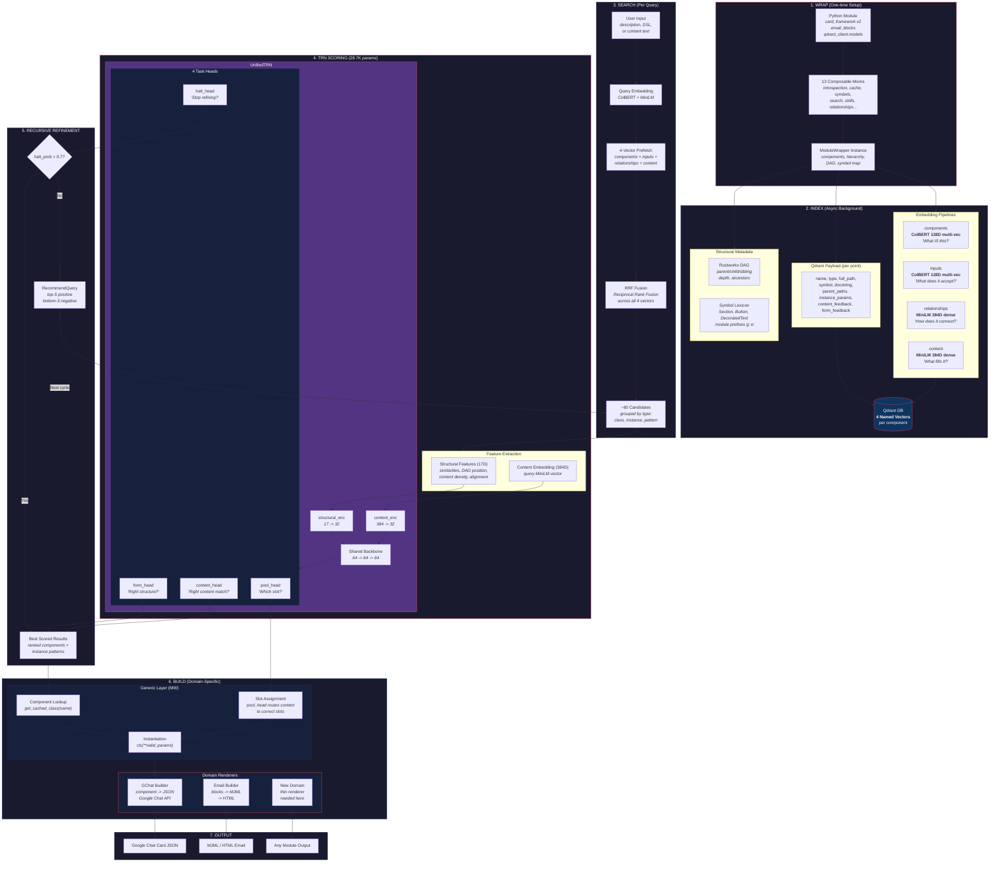
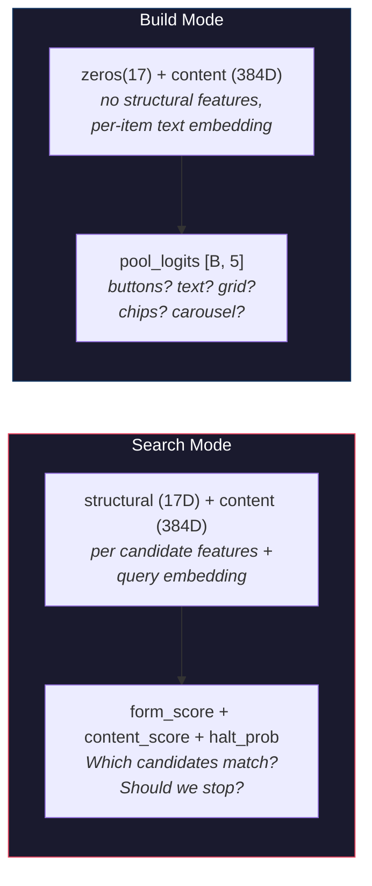
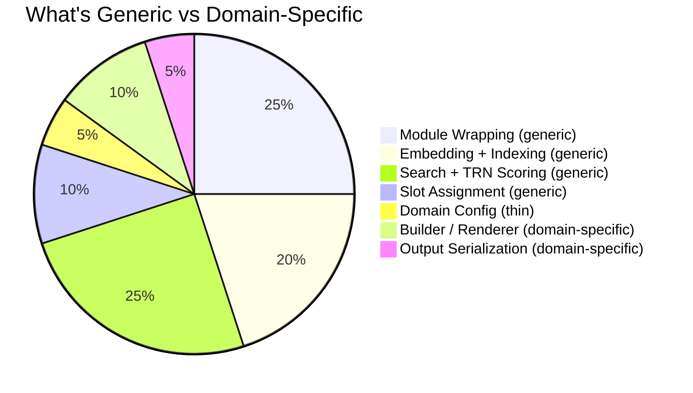

# TRM + Module Wrapper Architecture

## Full Pipeline: Module to Execution

## Search Mode vs Build Mode

## Domain Agnosticism Breakdown

## Adding a New Domain

To wrap a new Python module and make it fully functional:

| Step | Effort | What You Write |
|------|--------|---------------|
| 1. DomainConfig | ~30 lines | Pool vocab, component-to-pool map, specificity order |
| 2. Wrapper setup | ~20 lines | `WrapperRegistry.register(module, config)` |
| 3. Onboarding | 1 command | `python onboard_domain.py --domain new_domain` |
| 4. Domain renderer | ~50-100 lines | **Only domain-specific part**: how to serialize output |

Steps 1-3 are template-driven. Step 4 is the only truly custom code.
