# Payment Model Architecture: Open-Source MCP with Paid Value-Add

## The Core Insight

The code is free. The intelligence is paid.

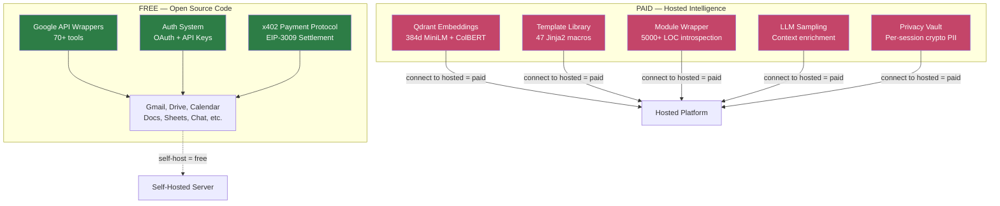

---

## Where the Value Lives

### Layer 1: Commodity (Free) — Google API Wrappers

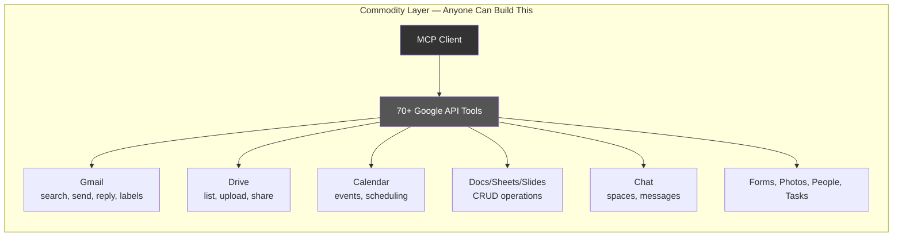

**Cost to replicate:** Days of work, well-documented Google APIs.
**Our cost to operate:** $0 (user's Google quota consumed, not ours).
**Monetization:** None — this is the open-source promise.

### Layer 2: Curated Intelligence (Pro) — Hosted Embeddings + Templates

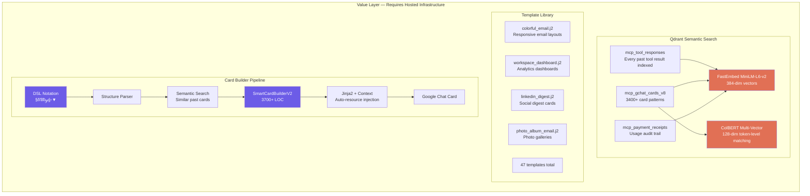

**Cost to replicate:** Weeks of work + ongoing curation of card patterns and templates.
**Our cost to operate:** ~$50-150/mo (Qdrant cloud) + compute.
**Monetization:** Pro tier — access to hosted embeddings, search, templates, and the card builder.

### Layer 3: Platform Intelligence (Enterprise) — LLM + Module System

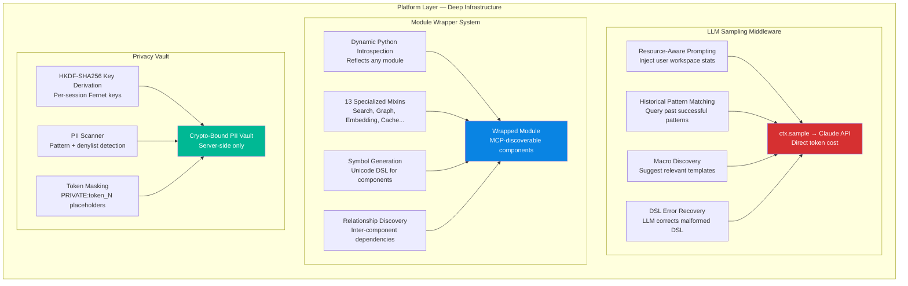

**Cost to replicate:** Months of engineering — module wrapper alone is 5000+ LOC.
**Our cost to operate:** ~$0.001-0.01/sample (LLM tokens) + compute.
**Monetization:** Enterprise tier — sampling costs passed through, full platform access.

---

## How the Payment Flow Works

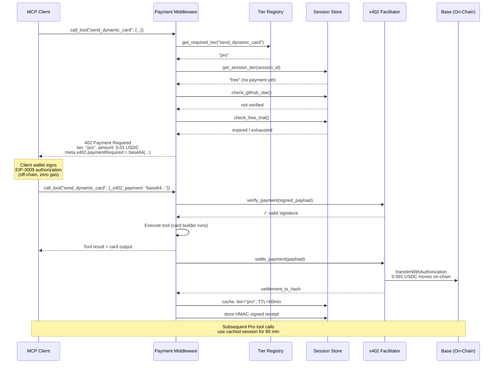

---

## Tier Enforcement: Two-Layer Defense

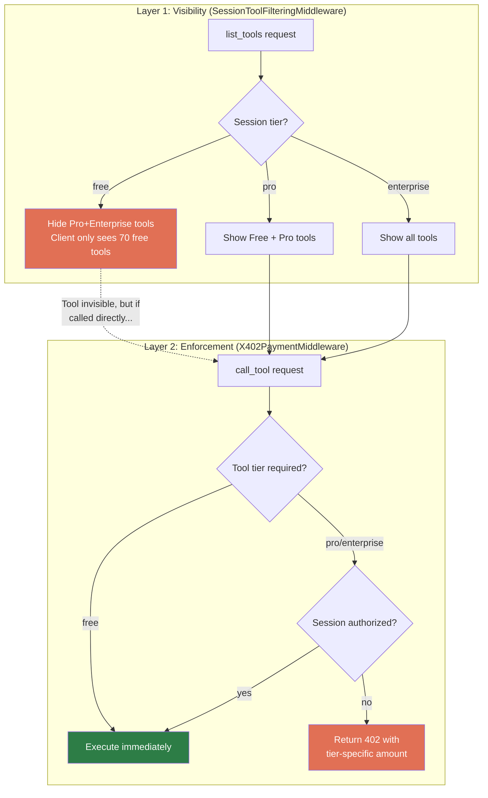

---

## Onboarding Funnel

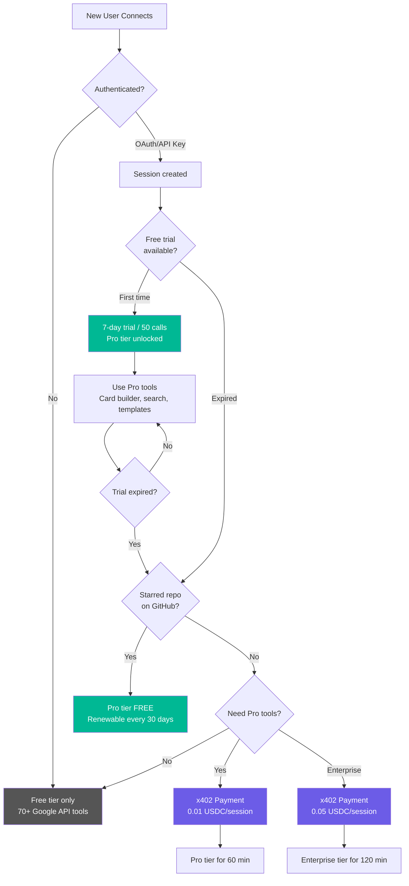

---

## Revenue Model

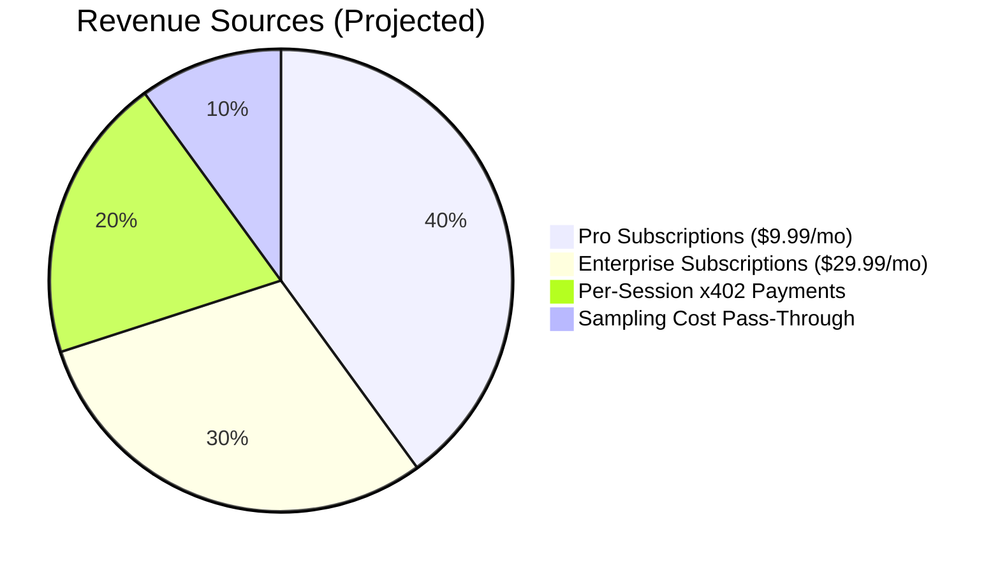

### Cost vs. Revenue at Scale

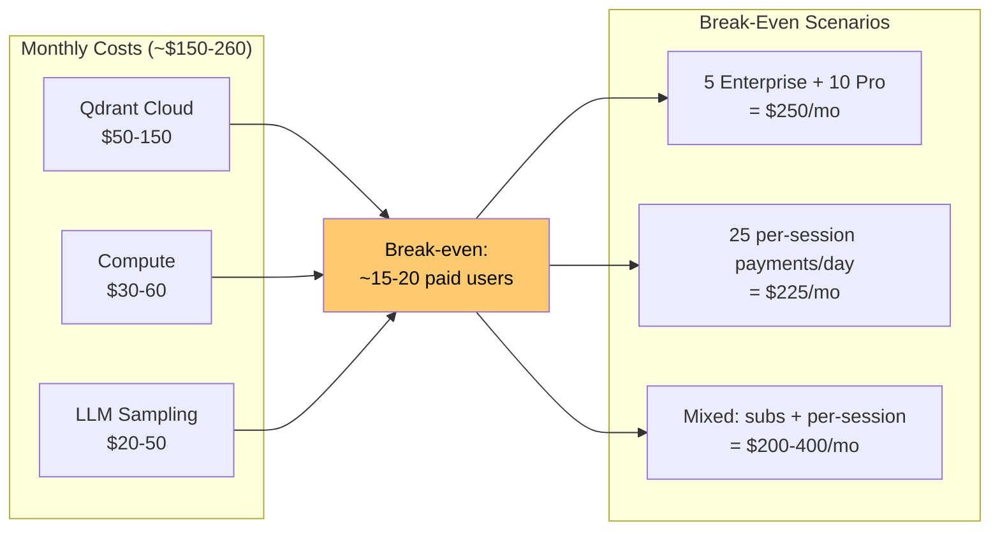

---

## Receipt & Metering Pipeline

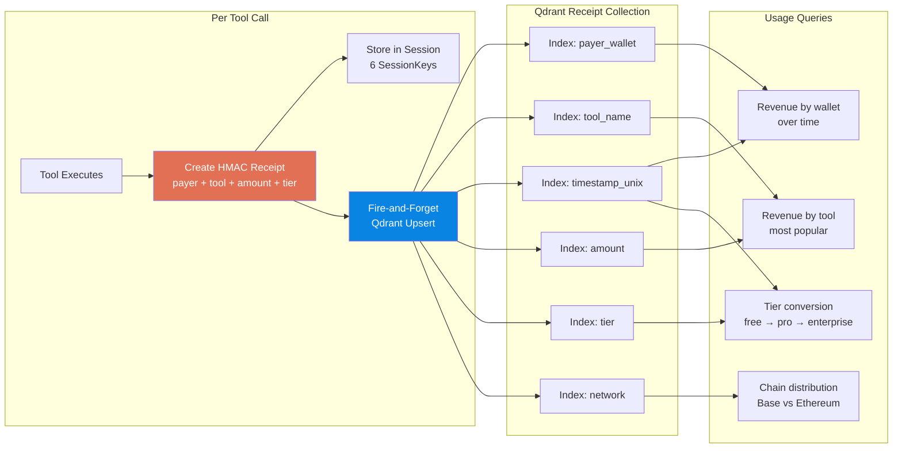

---

## What's On-Chain vs. Off-Chain

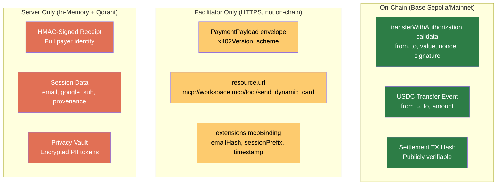

---

## Architectural Summary

| Concern | Where It Lives | How It's Enforced |
|---------|---------------|-------------------|
| **Tool classification** | `middleware/payment/tiers.py` — TierDefinition registry | `get_tier_for_tool()` → None/pro/enterprise |
| **Tool visibility** | `middleware/session_tool_filtering_middleware.py` | Premium tools hidden from `list_tools` |
| **Payment gating** | `middleware/payment/middleware.py` | 402 response with tier-specific amount |
| **x402 settlement** | `middleware/payment/x402_server.py` + Coinbase facilitator | EIP-3009 verify → execute → settle |
| **Identity binding** | `middleware/payment/receipt.py` | HMAC receipt ties wallet to email/sub |
| **Receipt storage** | `middleware/payment/receipt_store.py` → Qdrant | Fire-and-forget, indexed for billing |
| **GitHub star check** | `middleware/payment/github_stars.py` (planned) | Public API check, session-cached |
| **Free trial** | `middleware/payment/trial.py` (planned) | Per-email-hash, Qdrant-persisted counter |
| **Usage metering** | `middleware/payment/metering.py` (planned) | Qdrant queries over receipt collection |
| **Sampling costs** | `middleware/sampling_middleware.py` | Token count → supplementary receipt |
