# Enhanced Template Parameter Middleware v3 - Jinja2 Integration

## Overview

The **Enhanced Template Parameter Middleware v3** provides a hybrid templating solution that combines the simplicity of v2's regex-based templating with the full power of Jinja2. This middleware automatically detects template complexity and routes to the appropriate engine for optimal performance and functionality.

**🎯 V3 Key Features:**
- **🔄 Hybrid Architecture** - Automatic detection between simple and Jinja2 templates
- **⚡ Zero Dependencies by Default** - Jinja2 is optional, falls back gracefully
- **📄 Full Backward Compatibility** - All v2 `{{resource://uri.property}}` syntax works unchanged
- **🎭 Advanced Jinja2 Features** - Conditionals, loops, filters, functions, HTML templating
- **🚀 Performance Optimized** - Uses simple regex when possible, Jinja2 when needed
- **🛡️ Graceful Fallbacks** - Missing Jinja2 falls back to simple templating

```mermaid
graph TB
    A["🔧 Tool Call"] --> B["🎭 Enhanced Template Middleware v3"]
    B --> C{"Has Templates?"}
    C -->|"No"| M["➡️ Pass Through"]
    C -->|"Yes"| D["🔍 Detect Template Type"]
    D --> E{"Template Type"}
    E -->|"Simple"| F["🔧 Regex Engine (v2)"]
    E -->|"Jinja2"| G["🎭 Jinja2 Engine"]
    E -->|"Mixed"| G
    F --> H["📡 Resource Resolution"]
    G --> I["🎨 Jinja2 Rendering"]
    I --> J["📡 Deferred Resource Resolution"]
    H --> K["🎯 Property Extraction"]
    J --> K
    K --> L["💾 Cache Result"]
    L --> N["✅ Replace Templates"]
    N --> O["▶️ Execute Tool"]
    M --> O
    O --> P["📤 Return Result"]
    
    style A fill:#e1f5fe,stroke:#01579b,stroke-width:2px
    style B fill:#f3e5f5,stroke:#4a148c,stroke-width:2px
    style G fill:#fff8e1,stroke:#f57f17,stroke-width:2px
    style F fill:#e8f5e8,stroke:#2e7d32,stroke-width:2px
    style O fill:#e0f2f1,stroke:#00695c,stroke-width:2px
```



## 🔄 Template Engine Selection

### Automatic Detection

The middleware automatically detects the appropriate template engine:

| Template Type | Syntax Examples | Engine Used | Performance |
|---------------|-----------------|-------------|-------------|
| **Simple** | `{{user://current/email.email}}` | Regex (v2) | ⚡ Fastest |
| **Jinja2** | `...` | Jinja2 | 🭠Full featured |
| **Mixed** | Both simple + Jinja2 syntax | Jinja2 | 🔄 Comprehensive |

### Detection Patterns

```python
# Simple Template Detection
"{{user://current/email.email}}"           # ✅ Simple
"Hello {{user://current/email.email}}!"    # ✅ Simple

# Jinja2 Detection
"Hello!"  # ✅ Jinja2
"{{ user.email | upper }}"                      # ✅ Jinja2
"{{ user_email() }}"                            # ✅ Jinja2
"{# This is a comment #}"                       # ✅ Jinja2

# Mixed (Uses Jinja2)
"{{user://current/email.email}}"  # ✅ Jinja2
```

## 📊 Simple Templates (V2 Compatibility)

All existing v2 templates work unchanged with the same performance:

### Basic Resource Access

```python
@mcp.tool()
async def backward_compatible_tool(
    # Unchanged v2 syntax
    user_email: str = "{{user://current/email.email}}",
    session_id: str = "{{user://current/email.session_id}}",
    gmail_count: str = "{{service://gmail/labels.count}}",
    first_label: str = "{{service://gmail/labels.items.0.name}}",
    # Complex property paths still work
    auth_status: str = "{{user://current/profile.auth_status.credentials_valid}}"
) -> str:
    """All v2 templates work exactly the same."""
    return f"User: {user_email}, Labels: {gmail_count}, Auth: {auth_status}"
```

## 🎭 Advanced Jinja2 Templates

### Conditional Rendering

```python
@mcp.tool()
async def conditional_email(
    recipient: str,
    # Jinja2 conditional template
    greeting: str = """
    
    Hello {{ user.email }}! Welcome back to the platform.
    
    Hello! Please log in to continue.
    
    """
) -> str:
    """Email with conditional content based on auth status."""
    return f"To: {recipient}\n\n{greeting}"
```

### Loops and Data Processing

```python
@mcp.tool()
async def generate_label_summary(
    # Jinja2 loop template with data processing
    summary: str = """
    📧 Gmail Label Summary:
    
    
    
    **Total Labels:** {{ labels.count }}
    
    **System Labels:**
    
    - {{ label.name }} (ID: {{ label.id }})
    
    
    **User Labels:** 
    
    
    
    - {{ label.name }}
    
    
    - ... and {{ user_labels | length - 5 }} more
    
    
    *No custom labels found*
    
    
    ❌ Gmail not available
    
    """
) -> str:
    """Generate comprehensive label summary with loops and conditionals."""
    return summary
```

### HTML Email Templates

```python
@mcp.tool()
async def create_html_welcome_email(
    user_name: str,
    # Rich HTML template with Jinja2
    html_content: str = """
    <!DOCTYPE html>
    <html>
    <head>
        <meta charset="UTF-8">
        <title>Welcome Email</title>
        <style>
            .header { background: #4285f4; color: white; padding: 20px; text-align: center; }
            .content { padding: 20px; font-family: Arial, sans-serif; }
            .stats { background: #f8f9fa; padding: 15px; border-radius: 5px; margin: 10px 0; }
            .label-list { list-style: none; padding: 0; }
            .label-item { padding: 5px; margin: 2px 0; background: #e3f2fd; border-radius: 3px; }
        </style>
    </head>
    <body>
        <div class="header">
            <h1>Welcome, {{ user_name }}!</h1>
        </div>
        
        <div class="content">
            
            <p>Great to see you back, <strong>{{ user.email }}</strong>!</p>
            
            <div class="stats">
                <h3>📊 Your Account Stats:</h3>
                <ul>
                    <li>Session ID: <code>{{ user.session_id }}</code></li>
                    <li>Login Time: {{ user.timestamp | format_date('%B %d, %Y at %H:%M') }}</li>
                    <li>Account Status: ✅ Active & Verified</li>
                </ul>
            </div>
            
            
            
            <div class="stats">
                <h3>📧 Gmail Integration:</h3>
                <p>Found <strong>{{ labels.count }}</strong> labels in your Gmail account:</p>
                <ul class="label-list">
                
                    <li class="label-item">
                        🏷️ {{ label.name }} 
                        <em>({{ 'System' if label.type == 'system' else 'Custom' }})</em>
                    </li>
                
                
                    <li class="label-item">... and {{ labels.count - 8 }} more labels</li>
                
                </ul>
            </div>
            
            
            <p>🚀 Ready to get started? Check out your dashboard for the latest updates!</p>
            
            <div class="stats">
                <h3>🔐 Authentication Required</h3>
                <p>Please log in to view your personalized content and account information.</p>
            </div>
            
        </div>
        
        <div style="margin-top: 30px; padding: 15px; font-size: 12px; color: #666; border-top: 1px solid #eee;">
            <p>Email generated at {{ now.strftime('%Y-%m-%d %H:%M UTC') }} | 
               Powered by Enhanced Template Middleware v3</p>
        </div>
    </body>
    </html>
    """
) -> str:
    """Create rich HTML welcome email with Jinja2 templating."""
    return f"📧 HTML Welcome Email created for {user_name}"
```

## 🔧 Resource Functions

### Built-in Helper Functions

Jinja2 templates have access to specialized resource functions:

```python
# Quick access functions (no parameters needed)
{{ user_email() }}           # Returns current user's email directly
{{ user_profile() }}         # Returns complete user profile object  
{{ gmail_labels() }}         # Returns Gmail labels data
{{ workspace_content() }}    # Returns workspace content summary

# Generic resource access
{{ resource('user://current/email', 'email') }}          # Same as user_email()
{{ resource('service://gmail/labels') }}                 # Same as gmail_labels()
{{ service_data('calendar', 'events') }}                 # service://calendar/events
```

### Template Context Objects

Rich context objects available in all Jinja2 templates:

```python
# Pre-populated user data (when available)
{{ user.email }}              # Current user email
{{ user.session_id }}         # Current session ID
{{ user.authenticated }}      # Authentication status

# Utility functions
{{ now }}                     # Current datetime
{{ utcnow }}                  # Current UTC datetime
{{ len(items) }}              # Length function
{{ range(5) }}                # Range function
{{ max(values) }}             # Max function

# Data manipulation
{{ json.dumps(data) }}        # JSON serialization
{{ str(value) }}              # String conversion
```

## 🎨 Custom Filters

### Data Processing Filters

```python
# Date formatting
{{ user.timestamp | format_date('%Y-%m-%d') }}           # → "2025-01-01"
{{ user.timestamp | format_date('%B %d, %Y at %H:%M') }} # → "January 01, 2025 at 12:00"

# Property extraction
{{ complex_object | extract('user.profile.name') }}      # Dot notation extraction

# Safe property access
{{ data | safe_get('email', 'unknown@example.com') }}   # Safe get with default

# JSON formatting
{{ gmail_labels() | json_pretty(4) }}                   # Pretty print with 4-space indent
```

## 🚀 Real-World Examples

### 1. Smart Email Composition

```python
@mcp.tool()
async def compose_smart_email(
    recipient: str,
    email_type: str = "update",
    # Dynamic subject based on type and user context
    subject: str = """
    
    Welcome to the platform, {{ user_email() | split('@') | first | title }}!
    
    Account Update from {{ user_email() }}
    
    Daily Summary - {{ now.strftime('%B %d, %Y') }}
    
    Message from {{ user_email() }}
    
    """,
    
    # Rich email body with conditional sections
    body: str = """
    Hello {{ recipient | split('@') | first | title }},

    
    🎉 **Welcome to our platform!**
    
    We're excited to have you on board. Here's what you can expect:
    
    
    **Your Account Information:**
    - Email: {{ user.email }}
    - Account Created: {{ user.timestamp | format_date('%B %d, %Y') }}
    - Status: ✅ Verified and Active
    
    
    
    **Gmail Integration:**  
    We've detected {{ labels.count }} labels in your Gmail account. 
    
    You're well organized! 🗂️
    
    Perfect setup for getting started! 📧
    
    
    
    
    **Next Steps:**
    1. Explore your dashboard
    2. Set up your preferences  
    3. Connect additional services
    
    
    📈 **Account Update**
    
    Here's what's new in your account:
    
    
    **Current Session:**
    - Login: {{ user.timestamp | format_date('%H:%M on %B %d') }}
    - Session: {{ user.session_id }}
    - Status: {{ 'Active ✅' if user.authenticated else 'Inactive ⚠️' }}
    
    
    **Recent Activity:**
    
    - Activity {{ i + 1 }}: Example activity item
    
    
    
    📊 **Daily Summary for {{ now.strftime('%B %d, %Y') }}**
    
    
    **Today's Highlights:**
    - Sessions: 1 active ({{ user.session_id[:8] }}...)
    - Account: {{ user.email }}
    - Status: All systems operational ✅
    
    
    
    **Gmail Stats:**
    - Total Labels: {{ labels.count }}
    - System Labels: {{ labels.items | selectattr('type', 'equalto', 'system') | list | length }}
    - Custom Labels: {{ labels.items | selectattr('type', 'equalto', 'user') | list | length }}
    
    
    
    
    📝 **General Message**
    
    
    Hello {{ user.email }}!
    
    This is a general message from the system.
    
    Hello!
    
    Please log in to access personalized content.
    
    

    ---
    Best regards,  
    The Platform Team
    
    *Email generated at {{ now.strftime('%Y-%m-%d %H:%M UTC') }} 
     using Enhanced Template Middleware v3*
    """
) -> str:
    """Compose smart email with dynamic content based on type and user context."""
    
    return f"""
    ✉️ **Smart Email Composed**
    
    **Type:** {email_type}
    **To:** {recipient}
    **Subject:** {subject}
    
    **Body Preview:**
    {body[:200]}...
    
    🎭 **Features Used:**
    - Conditional content based on email_type
    - User context integration
    - Gmail data integration  
    - Date formatting filters
    - String manipulation filters
    - Dynamic content generation
    """
```

### 2. Advanced Dashboard Generation

```python
@mcp.tool()
async def create_admin_dashboard(
    dashboard_type: str = "overview",
    # Complex dashboard template with comprehensive logic
    dashboard_html: str = """
    <!DOCTYPE html>
    <html>
    <head>
        <title>{{ dashboard_type | title }} Dashboard</title>
        <style>
            body { font-family: -apple-system, BlinkMacSystemFont, 'Segoe UI', sans-serif; margin: 0; background: #f5f5f5; }
            .container { max-width: 1200px; margin: 0 auto; padding: 20px; }
            .header { background: white; padding: 30px; border-radius: 8px; margin-bottom: 20px; box-shadow: 0 2px 4px rgba(0,0,0,0.1); }
            .cards { display: grid; grid-template-columns: repeat(auto-fit, minmax(300px, 1fr)); gap: 20px; }
            .card { background: white; padding: 20px; border-radius: 8px; box-shadow: 0 2px 4px rgba(0,0,0,0.1); }
            .status-good { border-left: 4px solid #34a853; }
            .status-warning { border-left: 4px solid #fbbc04; }
            .status-error { border-left: 4px solid #ea4335; }
            .metric { font-size: 24px; font-weight: bold; margin: 10px 0; }
            .label-grid { display: grid; grid-template-columns: repeat(auto-fill, minmax(150px, 1fr)); gap: 8px; margin: 10px 0; }
            .label-badge { padding: 4px 8px; background: #e8f0fe; border: 1px solid #4285f4; border-radius: 12px; font-size: 12px; text-align: center; }
        </style>
    </head>
    <body>
        <div class="container">
            <div class="header">
                <h1>🏢 {{ dashboard_type | title }} Dashboard</h1>
                <p>Generated at {{ now.strftime('%B %d, %Y at %H:%M UTC') }}</p>
                
                <p>👤 Logged in as: <strong>{{ user.email }}</strong></p>
                
            </div>
            
            <div class="cards">
                <!-- Authentication Card -->
                
                <div class="card status-good">
                    <h3>🔐 Authentication</h3>
                    <div class="metric">✅ Authenticated</div>
                    <ul>
                        <li>User: {{ user.email }}</li>
                        <li>Session: {{ user.session_id[:16] }}...</li>
                        <li>Login: {{ user.timestamp | format_date('%H:%M on %m/%d/%Y') }}</li>
                    </ul>
                </div>
                
                <div class="card status-error">
                    <h3>🔐 Authentication</h3>
                    <div class="metric">❌ Not Authenticated</div>
                    <p>Please log in to access system features.</p>
                </div>
                
                
                <!-- Gmail Integration Card -->
                
                
                <div class="card status-good">
                    <h3>📧 Gmail Integration</h3>
                    <div class="metric">{{ labels.count }} Labels</div>
                    
                    
                    
                    
                    <p><strong>System:</strong> {{ system_labels | length }} labels</p>
                    <p><strong>Custom:</strong> {{ user_labels | length }} labels</p>
                    
                    
                    <div class="label-grid">
                        
                        <div class="label-badge">{{ label.name }}</div>
                        
                        
                        <div class="label-badge">+{{ user_labels | length - 12 }} more</div>
                        
                    </div>
                    
                </div>
                
                <div class="card status-warning">
                    <h3>📧 Gmail Integration</h3>
                    <div class="metric">⚠️ Not Available</div>
                    <p>Gmail integration not configured or accessible.</p>
                </div>
                
                
                <!-- System Health Card -->
                <div class="card status-good">
                    <h3>🔧 System Health</h3>
                    <div class="metric">✅ All Systems Operational</div>
                    <ul>
                        <li>Template Engine: v3 (Jinja2 + Simple)</li>
                        <li>Resource Cache: {{ 'Enabled' if true else 'Disabled' }}</li>
                        <li>Debug Mode: {{ 'On' if false else 'Off' }}</li>
                        <li>Uptime: Since {{ now.strftime('%H:%M UTC') }}</li>
                    </ul>
                </div>
                
                <!-- Quick Actions Card -->
                <div class="card">
                    <h3>⚡ Quick Actions</h3>
                    
                    <ul>
                        <li><a href="/admin/users">👥 Manage Users</a></li>
                        <li><a href="/admin/system">🔧 System Settings</a></li>
                        <li><a href="/admin/logs">📋 View Logs</a></li>
                        <li><a href="/admin/cache">🧹 Clear Cache</a></li>
                    </ul>
                    
                    <ul>
                        <li><a href="/profile">👤 Edit Profile</a></li>
                        <li><a href="/integrations">🔗 Manage Integrations</a></li>
                        <li><a href="/settings">⚙️ Settings</a></li>
                        <li><a href="/help">❓ Get Help</a></li>
                    </ul>
                    
                </div>
            </div>
        </div>
    </body>
    </html>
    """
) -> str:
    """Generate comprehensive admin dashboard with rich HTML templating."""
    
    return f"""
    🏢 **Admin Dashboard Generated**
    
    **Type:** {dashboard_type}
    **User:** {user_name}
    
    **HTML Content:** Complete dashboard with cards, metrics, and styling
    
    🎨 **Advanced Features Demonstrated:**
    - Responsive CSS Grid layout
    - Conditional card content based on system state
    - Dynamic label badge generation
    - Complex data filtering with Jinja2 selectattr
    - Rich HTML structure with embedded styling
    - Real-time system metrics
    - Context-aware quick actions
    """
```

### 3. Configuration File Generation

```python
@mcp.tool()
async def generate_config_file(
    service_name: str,
    environment: str = "production",
    # YAML config template with environment-specific values
    config_content: str = """
    # {{ service_name }} Configuration
    # Generated: {{ now.strftime('%Y-%m-%d %H:%M:%S UTC') }}
    # Environment: {{ environment }}

    service:
      name: {{ service_name }}
      version: "1.0.0"
      environment: {{ environment }}
      
    
    authentication:
      user_email: {{ user.email }}
      session_timeout: 36001800
      
    
    integrations:
      
      gmail:
        enabled: true
        labels_configured: {{ gmail_labels().count }}
        
        system_labels:
        
          - name: {{ label.name }}
            id: {{ label.id }}
        
        
      
      gmail:
        enabled: false
        reason: "Integration not available"
      
      
    features:
      template_engine: "v3-hybrid"
      caching: {{ 'enabled' if true else 'disabled' }}
      debug_logging: {{ 'enabled' if environment == 'development' else 'disabled' }}
      
    
    development:
      hot_reload: true
      verbose_logging: true
      test_mode: true
      sample_data:
        users: ["{{ user.email | default('test@example.com') }}"]
        session_id: "{{ user.session_id | default('dev-session') }}"
    
    
    # Generated by Enhanced Template Middleware v3
    # Supports both simple {{resource://uri.property}} and full Jinja2 templating
    """
) -> str:
    """Generate environment-specific configuration files."""
    
    return f"""
    ⚙️ **Configuration File Generated**
    
    **Service:** {service_name}
    **Environment:** {environment}
    
    **Content:**
    {config_content[:300]}...
    
    🔧 **Features Demonstrated:**
    - Environment-specific configurations
    - Conditional sections based on integrations
    - YAML structure with dynamic values
    - User context integration
    - Development vs production differences
    - Complex data iteration and filtering
    """
```

## 🔀 Migration from V2 to V3

### Instant Migration (Zero Changes Needed)

```python
# V2 code works unchanged in V3:
@mcp.tool()
async def existing_v2_tool(
    user_email: str = "{{user://current/email.email}}",
    gmail_count: str = "{{service://gmail/labels.count}}",
    nested_prop: str = "{{user://current/profile.auth_status.authenticated}}"
) -> str:
    """V2 templates work exactly the same in V3."""
    return f"User: {user_email}, Labels: {gmail_count}, Auth: {nested_prop}"
```

### Progressive Enhancement

```python
# Start simple, enhance as needed:

# Phase 1: Simple templates (existing v2 code)
greeting: str = "Hello {{user://current/email.email}}!"

# Phase 2: Add basic Jinja2 logic  
greeting: str = "Hello {{ user.email }}!Hello!"

# Phase 3: Full Jinja2 power
greeting: str = """

Hello {{ user.email | split('@') | first | title }}! 
Welcome back at {{ now.strftime('%H:%M') }}.

Hello! Please log in to continue.

"""
```

## ⚙️ Configuration and Setup

### Basic Setup

```python
from fastmcp import FastMCP
from middleware.template_middleware_v3_jinja2 import setup_enhanced_template_middleware
from auth.middleware import AuthMiddleware

# Create FastMCP server
mcp = FastMCP("My Enhanced Server")

# Add authentication middleware first
mcp.add_middleware(AuthMiddleware())

# Add enhanced template middleware with Jinja2
template_middleware = setup_enhanced_template_middleware(
    mcp,
    enable_caching=True,           # Enable resource caching
    cache_ttl_seconds=300,         # 5-minute cache TTL
    enable_debug=False,            # Production: disable debug
    jinja2_options={
        'autoescape': False,       # For JSON content
        'trim_blocks': True,       # Clean template output
        'lstrip_blocks': True,     # Remove leading whitespace
    }
)
```

### Development Setup

```python
# Development configuration with enhanced debugging
template_middleware = setup_enhanced_template_middleware(
    mcp,
    enable_caching=True,
    cache_ttl_seconds=60,          # Shorter cache for development
    enable_debug=True,             # Enable detailed logging
    jinja2_options={
        'autoescape': False,
        'trim_blocks': True,
        'lstrip_blocks': True,
        'undefined': StrictUndefined,  # Catch template errors in dev
    }
)

# Monitor template resolution
stats = template_middleware.get_cache_stats()
print(f"Template engine status: {stats}")
```

### HTML Email Setup

```python
# HTML email configuration with autoescape
template_middleware = setup_enhanced_template_middleware(
    mcp,
    enable_caching=True,
    cache_ttl_seconds=600,         # Longer cache for email templates
    enable_debug=False,
    jinja2_options={
        'autoescape': select_autoescape(['html', 'xml']),  # HTML safety
        'trim_blocks': False,      # Preserve HTML formatting
        'lstrip_blocks': False,
    }
)
```

## 🔒 Security and Performance

### Security Features

```python
# Safe template context - no dangerous functions exposed
✅ Safe: {{ user.email }}                    # User data access
✅ Safe: {{ len(items) }}                    # Built-in functions
✅ Safe: {{ now.strftime('%Y-%m-%d') }}      # Date formatting
❌ Blocked: {{ __import__('os') }}           # Module imports blocked
❌ Blocked: {{ eval('dangerous_code') }}     # Code evaluation blocked
```

### Performance Optimization

```python
# Performance tips for large templates:

# 1. Use simple templates when Jinja2 features aren't needed
user_email: str = "{{user://current/email.email}}"  # Fast regex resolution

# 2. Cache expensive resource calls
  # Called once, reused multiple times

# 3. Limit loop iterations
  # Process first 10 only

# 4. Use selective filters

```

## 🧪 Testing and Debugging

### Template Testing

```python
# Test simple templates
from middleware.template_middleware_v3_jinja2 import EnhancedTemplateMiddleware

middleware = EnhancedTemplateMiddleware(enable_debug_logging=True)

# Test property extraction
data = {"user": {"email": "test@example.com", "name": "Test User"}}
result = middleware._extract_property(data, "user.email")
assert result == "test@example.com"

# Test template detection
assert middleware._has_jinja2_syntax("{{ user | filter }}")  # Jinja2
assert not middleware._has_jinja2_syntax("{{user://uri}}")   # Simple
```

### Debug Logging

```python
# Enable comprehensive debug logging
middleware = EnhancedTemplateMiddleware(enable_debug_logging=True)

# Logs show:
# 🔧 Processing tool call: my_tool
# 🔍 Template detection: Jinja2=✅, Simple=❌
# 🎭 Resolving Jinja2 template: my_tool.param
# 📍 Resolving: user://current/email
# 📦 Raw resource type: ReadResourceContents
# 🎯 Unwrapping detected: 'data' -> dict
# ✅ Jinja2 template resolved: my_tool.param
```

## 📋 Best Practices

### Template Design Guidelines

1. **Start Simple, Enhance Gradually**
   ```python
   # Start: "{{user://current/email.email}}"
   # Enhance: "{{ user.email }}"
   ```

2. **Use Appropriate Engine**
   ```python
   # Simple data access → Use simple templates
   user_email: str = "{{user://current/email.email}}"
   
   # Logic/loops/conditions → Use Jinja2
   content: str = "{{ item.name }}"
   ```

3. **Cache Resource Calls**
   ```python
   # Good: Cache expensive calls
   
   ...
   
   # Avoid: Multiple calls
   ...
   ```

4. **Handle Missing Data Gracefully**
   ```python
   # Use defaults and conditionals
   {{ labels.count }}0
   {{ user.email | default('unknown@example.com') }}
   ```

### Performance Guidelines

1. **Enable Caching** - Always enable for production
2. **Monitor Cache Stats** - Use `get_cache_stats()` for optimization
3. **Use Simple Templates for Simple Data** - Let the engine auto-detect
4. **Limit Template Complexity** - Break complex templates into smaller parts

## 🎉 Complete Working Example

```python
from fastmcp import FastMCP, Context
from middleware.template_middleware_v3_jinja2 import setup_enhanced_template_middleware
from auth.middleware import AuthMiddleware

# Create server
mcp = FastMCP("Enhanced Template Demo v3")

# Setup middleware
mcp.add_middleware(AuthMiddleware())
template_middleware = setup_enhanced_template_middleware(
    mcp, 
    enable_caching=True,
    cache_ttl_seconds=300,
    enable_debug=True
)

@mcp.tool()
async def comprehensive_demo(
    demo_type: str = "showcase",
    # Simple v2 compatibility
    simple_email: str = "{{user://current/email.email}}",
    simple_count: str = "{{service://gmail/labels.count}}",
    
    # Advanced Jinja2 features
    dynamic_content: str = """
    🎯 **{{ demo_type | title }} Demo Results**
    
    ## User Information
    
    **Authenticated User:** {{ user.email }}
    **Session:** {{ user.session_id }}
    **Login Time:** {{ user.timestamp | format_date('%B %d, %Y at %H:%M') }}
    **Status:** ✅ Active and verified
    
    **Status:** ❌ Not authenticated
    
    
    ## Gmail Integration
    
    
    **Total Labels:** {{ labels.count }}
    **Breakdown:**
    
    
    - System Labels: {{ system | length }} ({{ system | map(attribute='name') | join(', ') }})
    - Custom Labels: {{ custom | length }} ({{ custom[:3] | map(attribute='name') | join(', ') }}, +{{ custom | length - 3 }} more)
    
    **Gmail:** ❌ Not available or configured
    
    
    ## System Metrics
    **Generated:** {{ now.strftime('%Y-%m-%d %H:%M:%S UTC') }}
    **Template Engine:** Enhanced v3 (Simple + Jinja2)
    **Performance:** {{ 'High-performance with caching' if true else 'Standard performance' }}Baseline performance
    
    ## Template Features Demonstrated
    ✅ **Simple Templates:** Basic resource resolution ({{ simple_count }} labels)
    ✅ **Jinja2 Logic:** Conditional rendering and loops
    ✅ **Custom Filters:** Date formatting, data extraction
    ✅ **Resource Functions:** Direct access to common resources
    ✅ **Data Processing:** Complex filtering and transformation
    ✅ **Mixed Content:** Both engines working together seamlessly
    
    ---
    *This content was generated using both simple {{resource://uri}} templates 
     and advanced Jinja2 {{ expressions | filters }}*
    """,
    
    # Summary with both engines
    summary: str = "Demo complete: {{user://current/email.email}} used {{ labels.count }}0 labels"
) -> str:
    """Comprehensive demonstration of Enhanced Template Middleware v3."""
    
    return f"""
    🚀 **Enhanced Template Middleware v3 - Complete Demo**
    
    **Demo Type:** {demo_type}
    **Simple Email:** {simple_email}
    **Simple Count:** {simple_count}
    
    **Dynamic Content:**
    {dynamic_content}
    
    **Summary:** {summary}
    
    🎭 **All Features Working:**
    - ✅ V2 backward compatibility (simple_email, simple_count)
    - ✅ Jinja2 advanced features (dynamic_content)
    - ✅ Mixed templating (summary)
    - ✅ Resource caching and performance optimization
    - ✅ Graceful fallbacks and error handling
    """

if __name__ == "__main__":
    mcp.run()
```

## 🏆 V3 Advantages

| Feature | V2 (Simple) | V3 (Enhanced) | Benefit |
|---------|-------------|---------------|---------|
| **Templating** | Regex only | Regex + Jinja2 | 🎭 Full template language |
| **Logic** | None | Conditionals, loops | 🧠 Smart content generation |
| **Filters** | None | 50+ built-in + custom | 🎨 Rich data formatting |
| **Functions** | None | Resource + utility functions | 🚀 Powerful helpers |
| **HTML** | Basic | Full autoescape + styling | 🌐 Professional emails |
| **Performance** | Fast | Smart routing | ⚡ Best of both worlds |
| **Compatibility** | N/A | 100% v2 compatible | 🔄 Zero migration needed |

### Migration Benefits

✅ **Zero Breaking Changes** - All v2 code works unchanged  
✅ **Progressive Enhancement** - Add Jinja2 features when needed  
✅ **Performance Preserved** - Simple templates still use fast regex  
✅ **Rich Functionality** - Complex templates get full Jinja2 power  
✅ **Graceful Degradation** - Missing Jinja2 falls back to simple engine  

## 📚 Template Reference

### Simple Template Syntax (V2)
```python
"{{user://current/email.email}}"                    # Property extraction
"{{service://gmail/labels.count}}"                  # Service data
"{{workspace://content/recent.total_files}}"        # Nested properties
"{{service://gmail/labels.items.0.name}}"           # Array indexing
```

### Jinja2 Template Syntax (V3)
```python
"..."                  # Conditionals
"{{ item }}"     # Loops
"{{ variable | filter }}"                           # Filters
"{{ function() }}"                                  # Functions
"{{ user.email | upper | replace('@', ' at ') }}"   # Chained filters
```

### Resource Functions (V3)
```python
"{{ user_email() }}"                                # Quick user email
"{{ user_profile() }}"                             # Full user profile
"{{ gmail_labels() }}"                             # Gmail data
"{{ resource('custom://uri', 'property') }}"       # Generic access
"{{ service_data('calendar', 'events') }}"         # Service helper
```

### Custom Filters (V3)
```python
"{{ date_string | format_date('%Y-%m-%d') }}"       # Date formatting
"{{ complex_data | extract('path.to.value') }}"    # Property extraction
"{{ data | safe_get('key', 'default') }}"          # Safe access
"{{ object | json_pretty(4) }}"                    # Pretty JSON
```

> **🎭 Enhanced Template Middleware v3 - The perfect evolution of your template system: All the simplicity of v2 with the unlimited power of Jinja2!** ✨🚀