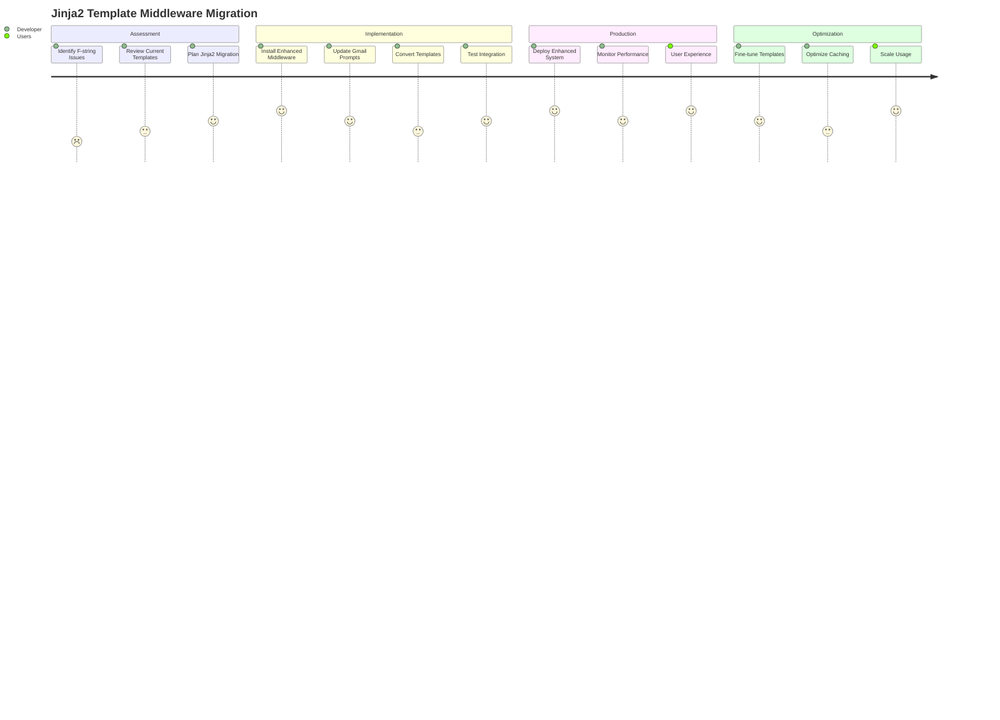

# Template Parameter Middleware with Jinja2 Integration

## Overview

The Template Parameter Middleware provides automatic parameter substitution using FastMCP resources with **full Jinja2 templating capabilities**. This powerful middleware allows tools to use both simple template expressions like `{{resource://uri}}` and complex Jinja2 templates with conditionals, loops, and filters in their parameters, which are automatically resolved at runtime using the FastMCP resource system.

**✨ NEW: Jinja2 Integration Features:**
- **Professional templating engine** with full Jinja2 syntax support
- **Complex template logic**: ``, ``, `{{ variable | filter }}`
- **Automatic HTML/CSS escaping** (no more f-string parsing errors!)
- **Template file organization** and caching
- **Template inheritance** and includes
- **Custom filters** for FastMCP-specific operations
- **Sandboxed execution** for security

```mermaid
graph TB
    A["🔧 Tool Call"] --> B["🎭 Template Middleware"]
    B --> C{"Has Templates?"}
    C -->|"Yes"| D["🔍 Parse Templates"]
    C -->|"No"| I["➡️ Pass Through"]
    D --> E["📡 Fetch Resources"]
    E --> F["⚡ Cache Check"]
    F -->|"Hit"| G["📋 Use Cache"]
    F -->|"Miss"| H["🌐 Call Resource"]
    G --> J["🔄 Resolve Parameters"]
    H --> K["💾 Store Cache"]
    K --> J
    J --> L["✨ Execute Tool"]
    I --> L
    L --> M["📤 Return Result"]
    
    style A fill:#e1f5fe,stroke:#01579b,stroke-width:2px
    style B fill:#f3e5f5,stroke:#4a148c,stroke-width:2px
    style E fill:#e8f5e8,stroke:#2e7d32,stroke-width:2px
    style L fill:#fff3e0,stroke:#e65100,stroke-width:2px
    style M fill:#e0f2f1,stroke:#00695c,stroke-width:2px
```



## 🎯 Key Features

- **🎨 Full Jinja2 Templating**: Professional template engine with conditionals, loops, filters, and inheritance
- **📡 Automatic Parameter Substitution**: Resolve `{{resource://uri}}` expressions in tool parameters
- **🔍 JSON Path Extraction**: Extract specific data with `{{resource://uri}}["path"]` syntax
- **🌟 Advanced Template Logic**: Use ``, ``, `{{ variable | filter }}` for complex rendering
- **🔒 Automatic Escaping**: HTML/CSS escaping prevents parsing errors (solved f-string CSS issues!)
- **📁 Template File Organization**: Load templates from organized directory structures
- **🔄 Template Inheritance**: Use Jinja2 extends and includes for template reuse
- **⚡ Performance Optimized**: Resource caching and template compilation caching
- **🛡️ Security Controls**: Sandboxed execution and resource scheme allowlists
- **🐛 Debug Logging**: Comprehensive logging for troubleshooting
- **🔄 Backwards Compatibility**: Non-templated tools continue to work normally

```mermaid
mindmap
  root)Template Parameter Middleware(
    (🎯 Core Features)
      ::icon(fa fa-cogs)
      Auto Substitution
      JSON Path Extract
      Resource Caching
      Security Controls
    (📚 Resources)
      ::icon(fa fa-database)
      User Auth
      Gmail Services
      Workspace Content
      Tools Directory
    (🛠️ Integration)
      ::icon(fa fa-puzzle-piece)
      FastMCP Server
      Auth Middleware
      Custom Tools
      Client SDK
    (🚀 Benefits)
      ::icon(fa fa-rocket)
      Context Aware
      Performance
      User Friendly
      Developer DX
```




## 🔧 Template Expression Syntax

### Basic Resource Access (Original FastMCP Style)

```python
# Simple resource access - returns the entire resource
"{{user://current/email}}"

# Returns: "user@example.com"
```

### JSON Path Extraction (Original FastMCP Style)

```python
# Extract specific fields from resource responses
"{{user://current/profile}}['email']"

# Extract from nested objects
"{{workspace://content/recent}}['content_summary']['total_files']"

# Extract from arrays
"{{tools://enhanced/list}}['enhanced_tools'][0]['name']"
```

### 🎨 NEW: Advanced Jinja2 Template Logic

```python
# Conditional rendering
"Welcome {{resources.user_current_email}}!Please log in"

# Loop through data
"{{label.name}}, "

# Jinja2 filters
"{{resources.workspace_recent.content_summary.total_files | default(0)}}"

# Complex template with multiple features
"""

Hello {{resources.user_current_profile.email}}!

Your recent activity:

• {{doc.name}} ({{doc.modified | format_datetime}})


You have {{resources.gmail_labels | length}} Gmail labels.

"""
```

### Template File Organization

```python
# Load templates from files
# File: prompts/templates/gmail/welcome_email.txt
"""
Subject: Welcome {{user_email}}!




Hello {{user_name}},

Welcome to our platform! Here's what you can do:


• {{feature.name}}: {{feature.description}}


Best regards,
Your FastMCP Assistant

"""

# Use in tool parameter
@mcp.tool()
async def send_welcome_email(
    user_email: str = "{{template://user_email}}",
    email_body: str = ""
):
    # Template automatically loaded and rendered
    pass
```

## 📚 Available Resources

```mermaid
graph TB
    subgraph "🔐 Authentication Layer"
        A["user://current/email"]
        B["user://current/profile"]
        C["auth://session/current"]
        D["template://user_email"]
    end
    
    subgraph "📧 Gmail Services"
        E["service://gmail/labels"]
        F["service://gmail/filters"]
        G["gmail://content/suggestions"]
        H["gmail://messages/recent"]
    end
    
    subgraph "💼 Workspace Content"
        I["workspace://content/recent"]
        J["workspace://content/search"]
    end
    
    subgraph "🛠️ Tools & Services"
        K["tools://list/all"]
        L["tools://enhanced/list"]
        M["google://services/scopes"]
    end
    
    N["🎭 Template Middleware"] --> A
    N --> E
    N --> I
    N --> K
    
    style N fill:#f3e5f5,stroke:#4a148c,stroke-width:3px
    style A fill:#e1f5fe,stroke:#01579b
    style E fill:#e8f5e8,stroke:#2e7d32
    style I fill:#fff3e0,stroke:#e65100
    style K fill:#fce4ec,stroke:#c2185b
```



### User & Authentication Resources

> 🔐 **Authentication Layer**: Core user identity and session management

| Resource URI | Description | Example Usage |
|-------------|-------------|---------------|
| `user://current/email` | Current user's email address | `{{user://current/email}}` |
| `user://current/profile` | Full user profile with auth status | `{{user://current/profile}}['email']` |
| `user://profile/{email}` | Profile for specific user | `{{user://profile/user@domain.com}}['auth_status']['authenticated']` |
| `template://user_email` | Simple user email string | `{{template://user_email}}` |
| `auth://session/current` | Current session information | `{{auth://session/current}}['session_id']` |
| `auth://sessions/list` | List all active sessions | `{{auth://sessions/list}}['count']` |
| `auth://credentials/{email}/status` | Credential status for user | `{{auth://credentials/user@domain.com/status}}['credentials_valid']` |

### Google Services Resources

| Resource URI | Description | Example Usage |
|-------------|-------------|---------------|
| `google://services/scopes/{service}` | Required scopes for Google service | `{{google://services/scopes/drive}}['default_scopes']` |

### Workspace Content Resources

| Resource URI | Description | Example Usage |
|-------------|-------------|---------------|
| `workspace://content/recent` | Recent workspace content | `{{workspace://content/recent}}['content_by_type']['documents']` |
| `workspace://content/search/{query}` | Search workspace content | `{{workspace://content/search/reports}}['total_results']` |

### Gmail Resources

| Resource URI | Description | Example Usage |
|-------------|-------------|---------------|
| `service://gmail/labels` | Gmail labels (system & user labels) | `{{service://gmail/labels}}["user_labels"][0]["id"]` |
| `service://gmail/filters` | Gmail filter rules | `{{service://gmail/filters}}["filters"][0]["description"]` |
| `service://gmail/lists` | Available Gmail list types | `{{service://gmail/lists}}["list_types"]` |
| `gmail://content/suggestions` | Content suggestions for emails | `{{gmail://content/suggestions}}['quick_links']['items']` |
| `gmail://allow-list` | Gmail send allow list | `{{gmail://allow-list}}['allow_list_count']` |
| `gmail://messages/recent` | Recent Gmail messages | `{{gmail://messages/recent}}['messages'][0]['subject']` |

### Tools Resources

| Resource URI | Description | Example Usage |
|-------------|-------------|---------------|
| `tools://list/all` | Complete tools directory | `{{tools://list/all}}['total_tools']` |
| `tools://enhanced/list` | Enhanced tools collection | `{{tools://enhanced/list}}['enhanced_tools']` |
| `tools://usage/guide` | Tools usage guide | `{{tools://usage/guide}}['quick_start']` |

## 🛠️ Implementation Examples

### Basic Setup with Jinja2

```python
from fastmcp import FastMCP
from middleware.template_middleware import setup_template_middleware

# Create FastMCP server
mcp = FastMCP("MyServer")

# Add template middleware with Jinja2 support
template_middleware = setup_template_middleware(
    mcp,
    template_dirs=[
        "templates",
        "templates/prompts", 
        "templates/tools",
        "prompts/templates"
    ],
    enable_debug=True,
    enable_caching=True,
    cache_ttl_seconds=300,
    sandbox_mode=True  # Enable sandboxed Jinja2 execution
)
```

### Advanced Configuration

```python
from middleware.template_middleware import TemplateParameterMiddleware

# Full configuration options
middleware = TemplateParameterMiddleware(
    # Template loading
    template_dirs=["prompts/templates", "templates"],
    template_string_cache=True,
    
    # Jinja2 configuration
    autoescape=True,  # Automatic HTML/CSS escaping
    trim_blocks=True,
    lstrip_blocks=True,
    sandbox_mode=True,  # Secure execution
    
    # Performance
    enable_caching=True,
    cache_ttl_seconds=300,
    template_cache_size=400,
    
    # Security
    allowed_resource_schemes=[
        "user", "auth", "template", "google", 
        "tools", "workspace", "gmail", "service"
    ],
    max_recursion_depth=3,
    
    # Debugging
    enable_debug_logging=True,
    debug_template_source=True
)

mcp.add_middleware(middleware)
```

### Tool with Jinja2 Template Parameters

```python
@mcp.tool()
async def send_personalized_email(
    recipient: str,
    subject: str = "Update from {{resources.user_current_email}}",
    greeting: str = "Hello {{resources.user_current_profile.email}}!Hello!",
    summary: str = """

You have {{resources.workspace_recent.content_summary.total_files}} files:

• {{doc.name}}


... and {{resources.workspace_recent.content_by_type.documents | length - 3}} more


No recent activity

"""
) -> str:
    """Send personalized email with Jinja2 template resolution."""
    # All Jinja2 template expressions are automatically resolved before tool execution
    # recipient: "boss@company.com"
    # subject: "Update from john.doe@company.com"  
    # greeting: "Hello john.doe@company.com!"
    # summary: "You have 42 files:\n• Report.docx\n• Presentation.pptx\n• Budget.xlsx\n... and 39 more"
    
    return f"Email sent to {recipient}\nSubject: {subject}\nGreeting: {greeting}\nSummary: {summary}"
```

### Template File-Based Tool

```python
# Create template file: prompts/templates/gmail/status_report.txt
"""
Subject: Weekly Status Report - {{now() | strftime('%B %d, %Y')}}

Hello {{resources.user_current_email}},


## Recent Activity
You've been productive! Here's your activity summary:

**Documents ({{resources.workspace_recent.content_by_type.documents | length}}):**

• {{doc.name}} - {{doc.modified | format_datetime('%m/%d')}}


**Gmail Status:**

• Total labels: {{resources.gmail_labels | length}}
• System labels: {{resources.gmail_labels.system_labels | length}}
• Custom labels: {{resources.gmail_labels.user_labels | length}}



No recent activity to report.


Best regards,
Your FastMCP Assistant
"""

# Use the template in a tool
@mcp.tool()
async def generate_status_report(
    report_content: str = ""
) -> str:
    """Generate a status report using Jinja2 template file."""
    # The entire template file is loaded, rendered with current resources,
    # and the result is passed as the report_content parameter
    return f"Generated report:\n\n{report_content}"
```

### Real Gmail Integration Example

```python
@mcp.tool()
async def create_gmail_filter_report(
    user_email: str = "{{template://user_email}}",
    inbox_label: str = "{{service://gmail/labels}}[\"system_labels\"][2][\"id\"]",  # INBOX
    work_label: str = "{{service://gmail/labels}}[\"user_labels\"][0][\"id\"]",    # First user label
    total_labels: int = "{{service://gmail/labels}}[\"count\"]",
    filter_count: int = "{{service://gmail/filters}}[\"count\"]"
) -> str:
    """Create Gmail filter report with real label IDs from client tests."""
    # Based on our successful client test results:
    # user_email: "srivers@groupon.com"
    # inbox_label: "INBOX" 
    # work_label: "CHAT" (or other real label ID)
    # total_labels: 33
    # filter_count: 3
    
    return f"""
    Gmail Report for {user_email}:
    📧 Total Labels: {total_labels}
    📂 Inbox Label: {inbox_label}
    🏷️ Work Label: {work_label} 
    🔧 Active Filters: {filter_count}
    """
```

### Advanced Template Usage

```python
@mcp.tool()
async def create_smart_report(
    user_email: str = "{{template://user_email}}",
    recent_docs: str = "{{workspace://content/recent}}['content_by_type']['documents']",
    auth_status: str = "{{user://current/profile}}['auth_status']['credentials_valid']",
    session_info: str = "{{auth://session/current}}['session_id']"
) -> str:
    """Create a smart report with automatically populated data."""
    
    # All parameters are pre-resolved:
    # user_email: "john.doe@company.com"
    # recent_docs: JSON array of recent documents
    # auth_status: true/false
    # session_info: "uuid-session-id"
    
    import json
    docs = json.loads(recent_docs) if isinstance(recent_docs, str) else recent_docs
    
    report = f"""
    Smart Report for {user_email}
    Session: {session_info}
    Auth Status: {'✅ Authenticated' if json.loads(auth_status) else '❌ Not authenticated'}
    Recent Documents: {len(docs)} found
    """
    
    return report
```

### Complex JSON Path Examples

```python
@mcp.tool()
async def analyze_workspace_activity(
    total_files: int = "{{workspace://content/recent}}['content_summary']['total_files']",
    doc_count: int = "{{workspace://content/recent}}['content_summary']['documents']", 
    first_doc_name: str = "{{workspace://content/recent}}['content_by_type']['documents'][0]['name']",
    user_domain: str = "{{user://current/profile}}['email'].split('@')[1]",
    template_suggestions: str = "{{gmail://content/suggestions}}['email_templates']['status_update']['opening_lines'][0]"
) -> str:
    """Analyze workspace activity with complex data extraction."""
    
    return f"""
    Workspace Analysis:
    - Total files: {total_files}
    - Documents: {doc_count}
    - Latest doc: {first_doc_name}
    - User domain: {user_domain}
    - Suggested opening: {template_suggestions}
    """
```

## 🔍 JSON Path Syntax Reference

### Basic Access

```python
# Object property access
"{{resource://uri}}['property']"
"{{resource://uri}}['nested']['property']"

# Array index access
"{{resource://uri}}[0]"
"{{resource://uri}}[0]['property']"

# Combined access
"{{resource://uri}}['items'][0]['name']"
```

### Advanced Path Expressions

```python
# Multiple levels of nesting
"{{workspace://content/recent}}['content_by_type']['documents'][0]['web_view_link']"

# Access different parts of complex resources
"{{gmail://content/suggestions}}['email_templates']['meeting_follow_up']['subject_template']"

# Extract counts and metadata
"{{tools://list/all}}['tools_by_category']['drive_tools']['tool_count']"
```

## 🚨 Error Handling

```mermaid
flowchart TD
    A["🎭 Template Processing"] --> B{"Valid Syntax?"}
    B -->|"No"| C["⚠️ Log Warning"]
    B -->|"Yes"| D["📡 Fetch Resource"]
    
    D --> E{"Resource Found?"}
    E -->|"No"| F["❌ Log Error"]
    E -->|"Yes"| G["🔍 Apply JSON Path"]
    
    G --> H{"Path Valid?"}
    H -->|"No"| I["⚠️ Log Path Error"]
    H -->|"Yes"| J["✅ Return Value"]
    
    C --> K["📝 Keep Original"]
    F --> K
    I --> K
    
    style A fill:#e3f2fd,stroke:#1976d2,stroke-width:2px
    style J fill:#e8f5e8,stroke:#388e3c,stroke-width:2px
    style K fill:#fff3e0,stroke:#e65100,stroke-width:2px
    style C fill:#fff8e1,stroke:#f57c00
    style F fill:#ffebee,stroke:#d32f2f
    style I fill:#fff8e1,stroke:#f57c00
```



### Template Resolution Errors

The middleware handles errors gracefully:

1. **Template Parsing Errors**: Invalid syntax logs warning, keeps original value
2. **Resource Resolution Errors**: Failed resource access logs error, keeps original value  
3. **JSON Path Errors**: Invalid paths log warning, keeps original value
4. **Authentication Errors**: Resource access denied logs info, keeps original value

### Example Error Scenarios

```python
# Invalid JSON path - logs warning, keeps original
"{{user://current/profile}}['nonexistent_field']"

# Invalid resource URI - logs error, keeps original  
"{{invalid://resource/uri}}"

# Resource access denied - logs info, keeps original
"{{restricted://resource}}" 

# Malformed template syntax - logs warning, keeps original
"{{unclosed template"
```

## 🎛️ Configuration Options

### Middleware Configuration with Jinja2

```python
from middleware.template_middleware import TemplateParameterMiddleware

middleware = TemplateParameterMiddleware(
    # Template discovery and loading
    template_dirs=[
        "templates",
        "templates/prompts", 
        "templates/tools",
        "prompts/templates"  # Gmail prompts location
    ],
    template_string_cache=True,                    # Cache compiled templates
    
    # Resource URI patterns
    resource_pattern=r'\{\{resource://([^}]+)\}\}', # Resource URI syntax
    template_pattern=r'\{\{([^}]+)\}\}',            # General template syntax
    
    # Jinja2 configuration
    autoescape=True,                               # Auto-escape HTML/CSS
    trim_blocks=True,                              # Remove first newline after block
    lstrip_blocks=True,                            # Strip leading spaces
    sandbox_mode=True,                             # Enable sandboxed execution
    
    # Caching and performance
    enable_caching=True,                           # Cache resource responses
    cache_ttl_seconds=300,                         # Cache TTL (5 minutes)
    template_cache_size=400,                       # Max templates to cache
    
    # Security and validation
    allowed_resource_schemes=[                     # Allowed URI schemes
        "user", "auth", "template", "google", 
        "tools", "workspace", "gmail", "service"
    ],
    max_recursion_depth=3,                         # Max template nesting
    
    # Debugging
    enable_debug_logging=False,                    # Debug logging
    debug_template_source=False                    # Log template source code
)
```

### Jinja2 Environment Features

```python
# The middleware automatically configures Jinja2 with:

# Custom FastMCP filters
{{resources.workspace_recent | json_extract('content_summary.total_files')}}
{{resources.user_current_profile.created_at | format_datetime('%Y-%m-%d')}}
{{long_text | truncate_text(100, '...')}}

# Custom global functions
{{now()}}              # Current datetime
{{utc_now()}}         # Current UTC datetime

# Auto-escaping for HTML/CSS (prevents f-string parsing errors)

<style>
  .status { color: {{status_color}}; }
</style>

```

### Alternative Template Patterns

```python
# Use different delimiters if needed
template_pattern=r'\$\{([^}]+)\}'  # ${...} syntax
template_pattern=r'%\{([^}]+)\}'   # %{...} syntax
template_pattern=r'#\{([^}]+)\}'   # #{...} syntax
```

## 🚀 Performance Considerations

### Caching Strategy

- **Enable Caching**: Use `enable_caching=True` for production
- **Cache TTL**: Set appropriate TTL based on resource update frequency
- **Cache Stats**: Monitor cache hit rates with `middleware.get_cache_stats()`

### Resource Access Optimization

- **Resource Schemes**: Restrict `allowed_resource_schemes` for security
- **Recursion Limits**: Set appropriate `max_recursion_depth`
- **Debug Logging**: Disable `enable_debug_logging` in production

## 🔒 Security Considerations

### Resource Access Control

```python
# Restrict to safe resource schemes only
allowed_resource_schemes=[
    "user", "auth", "template",    # Authentication resources
    "tools", "workspace",          # Content resources  
    "gmail"                        # Service-specific resources
]
```

### JSON Path Safety

The middleware uses `ast.parse()` and restricted `eval()` for JSON path evaluation:

- Only basic subscript operations allowed
- No arbitrary code execution
- Sandboxed evaluation environment
- Safe handling of malformed expressions

## 🧪 Testing and Debugging

```mermaid
flowchart TB
    A["🧪 Template Testing"] --> B["📡 Client SDK Test"]
    A --> C["🔍 Debug Mode"]
    A --> D["📊 Manual Testing"]
    
    B --> E["Connect to Server"]
    E --> F["Call Real Tools"]
    F --> G["Extract Gmail Data"]
    G --> H["Validate Templates"]
    
    C --> I["Enable Logging"]
    I --> J["Monitor Resolution"]
    J --> K["Check Cache Stats"]
    
    D --> L["Test Parameters"]
    L --> M["Verify JSON Paths"]
    M --> N["Validate Output"]
    
    H --> O["✅ Tests Pass"]
    K --> O
    N --> O
    
    style A fill:#e3f2fd,stroke:#1976d2,stroke-width:2px
    style O fill:#e8f5e8,stroke:#388e3c,stroke-width:2px
    style B fill:#f3e5f5,stroke:#4a148c
    style C fill:#fff3e0,stroke:#e65100
    style D fill:#e0f2f1,stroke:#00695c
```



### Client Testing with FastMCP Client SDK

```python
# Test template middleware integration with real server
import pytest
from fastmcp import Client
from .test_auth_utils import get_client_auth_config

class TestTemplateMiddleware:
    @pytest.fixture
    async def client(self):
        """Create client connected to running server."""
        auth_config = get_client_auth_config("test@example.com")
        client = Client("http://localhost:8002/mcp/", auth=auth_config)
        async with client:
            yield client
    
    @pytest.mark.asyncio
    async def test_real_gmail_data(self, client):
        """Test getting real Gmail label IDs via tools."""
        result = await client.call_tool("list_gmail_labels", {
            "user_google_email": "test@example.com"
        })
        
        # Extract real label IDs (format: "(ID: LABELID)")
        import re
        label_ids = re.findall(r'\(ID:\s*([^)]+)\)', str(result))
        
        # Verify real data - from our test we got:
        # ['CHAT', 'SENT', 'INBOX', 'IMPORTANT', 'TRASH', 'DRAFT', 'SPAM'...]
        assert len(label_ids) > 0, "Should find real Gmail label IDs"
        assert "INBOX" in label_ids, "Should have INBOX label"
        assert "SENT" in label_ids, "Should have SENT label"
        
        return label_ids

# Run with: uv run pytest tests/test_template_middleware_integration.py -v
```

### Enable Debug Mode

```python
# Enable detailed logging
template_middleware.enable_debug_mode(True)

# Check cache statistics
stats = template_middleware.get_cache_stats()
print(f"Cache entries: {stats['entries']}")
print(f"Cached resources: {stats['cached_resources']}")
```

### Manual Testing

```python
# Test template resolution manually
from middleware.template_middleware import TemplateParameterMiddleware

middleware = TemplateParameterMiddleware(enable_debug_logging=True)

# Test with real Gmail service resources
test_params = {
    "user_email": "{{template://user_email}}",
    "inbox_label": "{{service://gmail/labels}}[\"system_labels\"][2][\"id\"]",  # INBOX
    "label_count": "{{service://gmail/labels}}[\"count\"]"
}
```

## 🔄 Migration from Manual Parameters

### Before (Manual Parameters)

```python
@mcp.tool()
async def send_email(
    user_google_email: str,  # Manual parameter
    recipient: str,
    subject: str
) -> str:
    # Tool had to require email parameter
    pass
```

### After (Template Parameters)

```python
@mcp.tool()
async def send_email(
    recipient: str,
    subject: str,
    user_email: str = "{{template://user_email}}"  # Automatic resolution
) -> str:
    # Email automatically resolved from session context
    pass
```

## 📋 Best Practices

### Template Design

1. **Use Appropriate Resources**: Choose the most specific resource for your needs
2. **Handle Failures Gracefully**: Template resolution failures keep original values
3. **Cache Wisely**: Enable caching for frequently accessed resources
4. **Secure Access**: Use allowed schemes to restrict resource access
5. **Debug Thoroughly**: Enable debug logging during development

### Performance Optimization

1. **Minimize Nesting**: Keep JSON paths as shallow as possible
2. **Cache Configuration**: Set appropriate TTL based on data freshness needs
3. **Resource Selection**: Use the most efficient resource for your data needs
4. **Batch Access**: Design resources to return multiple related data points

### Error Handling

1. **Expect Failures**: Always assume template resolution might fail
2. **Provide Defaults**: Use meaningful default values in parameters
3. **Log Appropriately**: Use debug logging to troubleshoot issues
4. **Fallback Logic**: Implement fallback behavior in your tools

## 🔗 Integration with Existing Middleware

```mermaid
sequenceDiagram
    participant Client
    participant Auth as 🔐 AuthMiddleware
    participant Template as 🎭 TemplateMiddleware
    participant Resource as 📡 ResourceSystem
    participant Tool as 🛠️ Tool
    
    Client->>Auth: 1. Tool Request
    Auth->>Auth: 2. Validate Credentials
    Auth->>Template: 3. Forward with Context
    Template->>Template: 4. Parse Templates
    Template->>Resource: 5. Fetch Resources
    Resource-->>Template: 6. Resource Data
    Template->>Template: 7. Resolve Parameters
    Template->>Tool: 8. Execute with Resolved Params
    Tool-->>Template: 9. Tool Result
    Template-->>Auth: 10. Forward Result
    Auth-->>Client: 11. Final Response
    
    rect rgb(240, 248, 255)
        Note over Auth,Template: Middleware Chain Processing
    end
    
    rect rgb(248, 255, 240)
        Note over Template,Resource: Template Resolution
    end
```



The Template Parameter Middleware works seamlessly with existing middleware:

### With AuthMiddleware

```python
# Add both middleware - order matters
mcp.add_middleware(AuthMiddleware())        # Sets up authentication context
mcp.add_middleware(TemplateParameterMiddleware())  # Resolves templates using auth context
```

### With Custom Middleware

```python
class CustomMiddleware(Middleware):
    async def on_call_tool(self, context: MiddlewareContext, call_next):
        # Your custom logic here
        result = await call_next(context)
        # Template resolution happens automatically
        return result

# Add in correct order
mcp.add_middleware(AuthMiddleware())
mcp.add_middleware(CustomMiddleware())
mcp.add_middleware(TemplateParameterMiddleware())
```

## 🎉 Complete Example with Jinja2 Integration

Here's a complete example showing the enhanced Template Parameter Middleware with Jinja2 in action:

```python
from fastmcp import FastMCP
from middleware.template_middleware import setup_template_middleware
from auth.middleware import AuthMiddleware
from resources.user_resources import setup_user_resources
from prompts.gmail_prompts import setup_gmail_prompts

# Create server
mcp = FastMCP("Enhanced Template Demo Server")

# Setup resources first
setup_user_resources(mcp)
setup_gmail_prompts(mcp)  # Includes Jinja2 Gmail templates

# Add middleware in correct order
mcp.add_middleware(AuthMiddleware())
template_middleware = setup_template_middleware(
    mcp, 
    template_dirs=[
        "prompts/templates",  # Gmail templates location
        "templates/prompts",
        "templates/tools"
    ],
    enable_debug=True,
    sandbox_mode=True,
    autoescape=True  # Prevent CSS f-string parsing errors
)

@mcp.tool()
async def smart_email_composer(
    recipient: str,
    subject: str = "Weekly Update from {{resources.user_current_email}}",
    email_body: str = """

Hi {{recipient}}!

Here's your weekly update from {{resources.user_current_email}}:

## 📁 Recent Activity

I've been working on {{resources.workspace_recent.content_summary.total_files}} files:


• **{{doc.name}}** (modified {{doc.modified | format_datetime('%m/%d/%Y')}})



...and {{resources.workspace_recent.content_by_type.documents | length - 5}} more documents.


No recent document activity.


## 📧 Gmail Status

My Gmail is organized with:
- {{resources.gmail_labels.system_labels | length}} system labels
- {{resources.gmail_labels.user_labels | length}} custom labels
- Total: {{resources.gmail_labels | length}} labels

Most used labels:

• {{label.name}} ({{label.messages_total}} messages)



## ⚡ Quick Actions

Suggested actions:

• {{suggestion.title}}: {{suggestion.description}}



Best regards,
{{resources.user_current_profile.email}}

P.S. This email was generated at {{now() | strftime('%Y-%m-%d %H:%M:%S')}} using FastMCP with Jinja2! 🚀

Unable to generate personalized content - please authenticate first.

"""
) -> str:
    """Compose smart emails with Jinja2 template resolution and real resource data."""
    
    # All Jinja2 templates are automatically resolved by the middleware
    # The email_body parameter contains fully rendered HTML with:
    # - Conditional logic based on authentication status
    # - Loops through workspace documents and Gmail labels
    # - Formatted dates and counts
    # - Automatic HTML escaping for safety
    
    return f"""
📧 **Email Composed Successfully!**

**To:** {recipient}
**Subject:** {subject}

**Body Preview:**
{email_body[:500]}{'...' if len(email_body) > 500 else ''}

**Full Email Length:** {len(email_body)} characters
**Template Features Used:** Jinja2 conditionals, loops, filters, and resource integration
"""

# Template file example: prompts/templates/gmail/signature.html
"""
<div class="signature">
    <p>Best regards,<br>
    <strong>{{resources.user_current_profile.display_name | default(resources.user_current_email)}}</strong>
    </p>
    
    
    <p><em>{{resources.user_current_profile.company}}</em></p>
    
    
    <p><small>Powered by FastMCP with Jinja2 • Generated {{now() | strftime('%Y-%m-%d')}}</small></p>
</div>
"""

@mcp.tool()
async def add_email_signature(
    content: str,
    signature: str = ""
) -> str:
    """Add professional email signature using Jinja2 template file."""
    return f"{content}\n\n{signature}"

if __name__ == "__main__":
    # Run the enhanced server
    mcp.run()
```

This creates a **powerful, context-aware FastMCP server** where:

✨ **Jinja2 templates** provide professional formatting with conditionals and loops
🎯 **Resource integration** automatically populates real user data
🛡️ **Auto-escaping** prevents CSS/HTML parsing errors (solved the f-string issues!)
📁 **Template files** organize complex templates in reusable files
⚡ **Performance optimized** with template compilation and resource caching
🔒 **Security focused** with sandboxed template execution

## 🚀 Next Steps

### 🎨 Jinja2 Integration Benefits

**✅ Solved Problems:**
- **F-string CSS parsing errors**: Auto-escaping prevents `NameError: name 'font' is not defined`
- **Complex template logic**: Use conditionals, loops, and filters instead of string concatenation
- **Template organization**: Load templates from organized file structures
- **HTML/CSS safety**: Automatic escaping prevents injection and parsing issues

**🚀 New Capabilities:**
- **Professional templating**: Full Jinja2 feature set with inheritance and includes
- **Enhanced Gmail prompts**: Clean templates without f-string issues
- **Performance optimization**: Template compilation and resource caching
- **Security improvements**: Sandboxed execution with allowlists

### Migration Path



1. **🔧 Upgrade**: The middleware now includes full Jinja2 support by default
2. **🧪 Test**: Verify template resolution with real data (Gmail prompts working!)
3. **✨ Enhance**: Convert existing tools to use Jinja2 template features
4. **📊 Monitor**: Watch performance and debug logs
5. **🎯 Optimize**: Tune cache settings and add template files

> **🎭 The enhanced Template Parameter Middleware with Jinja2 integration transforms your FastMCP platform into a professional, template-driven system that eliminates f-string parsing errors while providing powerful templating capabilities!** ✨🚀