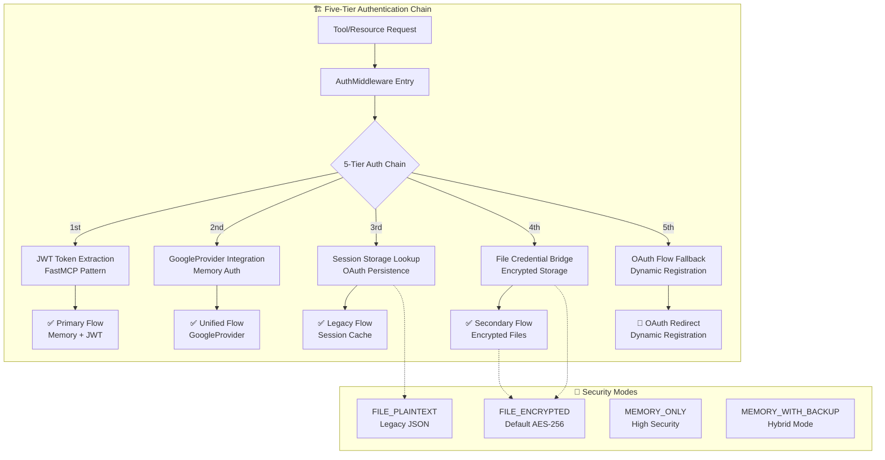

# 🔐 OAuth Authentication Architecture - Groupon Google MCP Dual Flow System

## 🎯 **Overview: Sophisticated Dual Authentication Architecture**

Your Groupon Google MCP server implements a **sophisticated dual authentication system** that seamlessly supports both FastMCP 2.12.0 GoogleProvider (JWT-based) and traditional file-based OAuth flows. This architecture provides maximum flexibility, enterprise-grade security, and complete backward compatibility.



---

## 📁 **Authentication Module Architecture**

### **Core Files Overview**

| File | Purpose | Key Features |
|------|---------|-------------|
| [`__init__.py`](auth/__init__.py:1) | Module initialization | Authentication module entry point |
| [`middleware.py`](auth/middleware.py:1) | **Central authentication hub** | 5-tier auth chain, credential encryption, service injection |
| [`dual_auth_bridge.py`](auth/dual_auth_bridge.py:1) | **Multi-account coordination** | Primary/secondary account management, credential bridging |
| [`scope_registry.py`](auth/scope_registry.py:1) | **Single source of truth for scopes** | Centralized OAuth scope management, 60+ Google services |
| [`service_manager.py`](auth/service_manager.py:1) | **Google service creation** | Universal service factory, caching, credential validation |

### **OAuth Flow Components**

| File | Purpose | Standards Compliance |
|------|---------|---------------------|
| [`fastmcp_oauth_endpoints.py`](auth/fastmcp_oauth_endpoints.py:1) | **MCP-spec OAuth discovery** | RFC 8414, MCP spec 2025-06-18 |
| [`dynamic_client_registration.py`](auth/dynamic_client_registration.py:1) | **Dynamic client registration** | RFC 7591, OAuth 2.1 |
| [`oauth_proxy.py`](auth/oauth_proxy.py:1) | **Credential security proxy** | Temporary credential mapping, 24hr expiry |
| [`google_auth.py`](auth/google_auth.py:1) | **Traditional OAuth implementation** | Google OAuth 2.0, file-based storage |
| [`google_oauth_auth.py`](auth/google_oauth_auth.py:1) | **FastMCP OAuth integration** | BearerAuthProvider, JWKS validation |

### **Session & Context Management**

| File | Purpose | Context Integration |
|------|---------|-------------------|
| [`context.py`](auth/context.py:1) | **FastMCP context management** | Session persistence, multi-user state |
| [`session_bridge.py`](auth/session_bridge.py:1) | **Context-to-tool bridging** | Legacy tool compatibility, service caching |
| [`unified_session.py`](auth/unified_session.py:1) | **Cross-flow session state** | GoogleProvider + legacy OAuth unified state |
| [`mcp_auth_middleware.py`](auth/mcp_auth_middleware.py:1) | **MCP spec compliance** | WWW-Authenticate headers, OAuth discovery triggers |

### **Utility & Compatibility**

| File | Purpose | Backward Compatibility |
|------|---------|----------------------|
| [`service_helpers.py`](auth/service_helpers.py:1) | **Service creation utilities** | Smart defaults, multi-service sessions |
| [`credential_bridge.py`](auth/credential_bridge.py:1) | **Format migration** | Legacy/FastMCP/Unified format bridging |
| [`compatibility_shim.py`](auth/compatibility_shim.py:1) | **Zero-breaking changes** | Legacy scope usage patterns maintained |
| [`jwt_auth.py`](auth/jwt_auth.py:1) | **Development authentication** | Testing tokens, FastMCP 2 JWTVerifier |

---

## ⏰ **Token and Key Lifespans**

| Component | Default Lifespan | Auto-Refresh | Storage Location | Security |
|-----------|-----------------|--------------|------------------|----------|
| **Access Token** | 1 hour | ✅ Yes | Memory/Encrypted file | AES-256 |
| **Refresh Token** | Never expires* | ❌ No | Memory/Encrypted file | AES-256 |
| **Encrypted Credentials** | Never expires | ❌ N/A | `credentials/*.enc` | AES-256 |
| **Encryption Key** | Permanent | ❌ No | `credentials/.auth_encryption_key` | Hidden file (0o600) |
| **Session Context** | 60 min inactive | ❌ No | Memory only | Session isolation |
| **OAuth Proxy Clients** | 24 hours | ❌ No | Memory only | Temporary mapping |
| **JWT Development Tokens** | 1 hour (configurable) | ❌ No | Generated on demand | Development only |

*_Refresh tokens remain valid until explicitly revoked by user or Google_

### 🔐 **Encryption Key Management**
- **Auto-Generation:** First use creates 32-byte Fernet key
- **Location:** `credentials/.auth_encryption_key` (hidden file)
- **Permissions:** 0o600 (owner read/write only)
- **Machine-Specific:** Keys tied to server instance
- **Backup Strategy:** Manual backup recommended for production

---

## 🌈 **The Five Authentication Flows**

### 🚪 **Flow #1: FastMCP GoogleProvider (PRIMARY)**
**Implementation:** [`middleware.py:216-228`](auth/middleware.py:216), [`session_bridge.py:90-123`](auth/session_bridge.py:90)

**What:** FastMCP 2.12.0 JWT-based authentication with memory storage  
**Storage:** In-memory sessions with automatic token management  
**Best for:** MCP clients, integrated environments, production use

**Key Features:**
- JWT token extraction from FastMCP context ([`middleware.py:949-998`](auth/middleware.py:949))
- Automatic user email injection ([`middleware.py:898-928`](auth/middleware.py:898))
- GoogleProvider credentials synthesis ([`session_bridge.py:125-173`](auth/session_bridge.py:125))
- No disk storage (secure for shared environments)

**Token Flow:**
```
FastMCP Client → JWT Token → GoogleProvider → Memory Cache → Google APIs ✨
```

---

### 🚪 **Flow #2: File-Based OAuth (SECONDARY)**
**Implementation:** [`google_auth.py:320-378`](auth/google_auth.py:320), [`middleware.py:619-657`](auth/middleware.py:619)

**What:** Traditional OAuth flow with encrypted credential persistence  
**Storage:** AES-256 encrypted files in `credentials/` directory  
**Best for:** Development, testing, secondary accounts, offline access

**Security Modes:**
1. **FILE_ENCRYPTED** (Default) - AES-256 encryption with Fernet ([`middleware.py:84-85`](auth/middleware.py:84))
2. **FILE_PLAINTEXT** - Legacy JSON format ([`middleware.py:614-617`](auth/middleware.py:614))
3. **MEMORY_ONLY** - No disk persistence ([`middleware.py:609-612`](auth/middleware.py:609))
4. **MEMORY_WITH_BACKUP** - Memory cache with encrypted backup ([`middleware.py:638-657`](auth/middleware.py:638))

**Encryption Implementation:**
- **Key Location:** `credentials/.auth_encryption_key` ([`middleware.py:517`](auth/middleware.py:517))
- **Encryption Method:** Fernet (AES-256) ([`middleware.py:537-538`](auth/middleware.py:537))
- **Credential Storage:** `credentials/{user}_credentials.enc` ([`middleware.py:622`](auth/middleware.py:622))

**Token Flow:**
```
OAuth Start → Google Authorization → Encrypted Storage → Auto-refresh ✨
```

---

### 🚪 **Flow #3: MCP Inspector OAuth (EXTERNAL)**
**Implementation:** [`fastmcp_oauth_endpoints.py`](auth/fastmcp_oauth_endpoints.py:1), [`dynamic_client_registration.py`](auth/dynamic_client_registration.py:1)

**What:** MCP spec-compliant OAuth for external MCP clients  
**Standards:** RFC 8414 (Authorization Server Metadata), RFC 7591 (Dynamic Client Registration)

**Discovery Endpoints:**
- `/.well-known/oauth-authorization-server` ([`fastmcp_oauth_endpoints.py:184-235`](auth/fastmcp_oauth_endpoints.py:184))
- `/.well-known/openid-configuration/mcp` ([`fastmcp_oauth_endpoints.py:79-138`](auth/fastmcp_oauth_endpoints.py:79))
- `/.well-known/oauth-protected-resource/mcp` ([`fastmcp_oauth_endpoints.py:140-182`](auth/fastmcp_oauth_endpoints.py:140))

**OAuth Proxy Security:**
- Temporary credentials via [`oauth_proxy.py:73-123`](auth/oauth_proxy.py:73)
- Real credentials never exposed ([`oauth_proxy.py:125-176`](auth/oauth_proxy.py:125))
- 24-hour client expiry ([`oauth_proxy.py:37-40`](auth/oauth_proxy.py:37))

---

### 🚪 **Flow #4: Direct Server OAuth (LEGACY)**
**Implementation:** [`google_oauth_auth.py:40-69`](auth/google_oauth_auth.py:40)

**What:** Direct web-based authentication for server applications  
**Redirect URI:** `http://localhost:8002/oauth2callback`

**BearerAuthProvider Configuration:**
- Google JWKS validation ([`google_oauth_auth.py:56-57`](auth/google_oauth_auth.py:56))
- Real OAuth endpoints ([`google_oauth_auth.py:82-91`](auth/google_oauth_auth.py:82))

---

### 🚪 **Flow #5: Development JWT (TESTING)**
**Implementation:** [`jwt_auth.py:24-57`](auth/jwt_auth.py:24)

**What:** Development/testing authentication without Google  
**Usage:** Testing environments, development tokens

**FastMCP 2 Integration:**
- JWTVerifier pattern ([`jwt_auth.py:45-50`](auth/jwt_auth.py:45))
- RSA key generation ([`jwt_auth.py:36`](auth/jwt_auth.py:36))
- Comprehensive scope support ([`jwt_auth.py:89-90`](auth/jwt_auth.py:89))

---

## 🧠 **Architecture Components Deep Dive**

### **1. AuthMiddleware - Central Authentication Hub**
**File:** [`auth/middleware.py`](auth/middleware.py:1)

**Responsibilities:**
- **5-Tier Authentication Chain:** ([`middleware.py:211-299`](auth/middleware.py:211))
  1. JWT Token Extraction ([`middleware.py:216`](auth/middleware.py:216))
  2. GoogleProvider Integration ([`middleware.py:232-244`](auth/middleware.py:232))
  3. Session Storage Lookup ([`middleware.py:247-256`](auth/middleware.py:247))
  4. File Credential Bridge ([`middleware.py:258-273`](auth/middleware.py:258))
  5. OAuth Flow Fallback ([`middleware.py:275-288`](auth/middleware.py:275))

- **Credential Encryption:** AES-256 Fernet encryption ([`middleware.py:550-597`](auth/middleware.py:550))
- **Service Injection:** Automatic Google service creation ([`middleware.py:446-502`](auth/middleware.py:446))
- **Auto Email Injection:** Seamless parameter population ([`middleware.py:898-928`](auth/middleware.py:898))

### **2. Scope Registry - Single Source of Truth**
**File:** [`auth/scope_registry.py`](auth/scope_registry.py:1)

**Comprehensive Scope Management:**
- **60+ Google Services:** Drive, Gmail, Calendar, Docs, Sheets, etc. ([`scope_registry.py:35-154`](auth/scope_registry.py:35))
- **Predefined Groups:** Basic, full, readonly access patterns ([`scope_registry.py:157-196`](auth/scope_registry.py:157))
- **OAuth Comprehensive:** Complete scope set for full OAuth flows ([`scope_registry.py:182-195`](auth/scope_registry.py:182))
- **Legacy Resolution:** Automatic migration from old scope names ([`scope_registry.py:372-427`](auth/scope_registry.py:372))

### **3. OAuth Proxy - Security First**
**File:** [`auth/oauth_proxy.py`](auth/oauth_proxy.py:1)

**Proxy Security Features:**
- **Temporary Credentials:** Never expose real Google credentials ([`oauth_proxy.py:89-104`](auth/oauth_proxy.py:89))
- **Client Expiration:** 24-hour automatic cleanup ([`oauth_proxy.py:278-299`](auth/oauth_proxy.py:278))
- **PKCE Support:** Code challenge validation ([`oauth_proxy.py:307-313`](auth/oauth_proxy.py:307))
- **Thread-Safe:** Concurrent client management ([`oauth_proxy.py:65-66`](auth/oauth_proxy.py:65))

### **4. Dual Auth Bridge - Multi-Account Orchestration**
**File:** [`auth/dual_auth_bridge.py`](auth/dual_auth_bridge.py:1)

**Account Management:**
- **Primary Account:** GoogleProvider authenticated ([`dual_auth_bridge.py:49-60`](auth/dual_auth_bridge.py:49))
- **Secondary Accounts:** File-based OAuth ([`dual_auth_bridge.py:62-70`](auth/dual_auth_bridge.py:62))
- **Credential Bridging:** Cross-flow credential sharing ([`dual_auth_bridge.py:112-154`](auth/dual_auth_bridge.py:112))
- **Account Switching:** Seamless multi-account operation ([`dual_auth_bridge.py:287-311`](auth/dual_auth_bridge.py:287))

### **5. Service Manager - Universal Service Factory**
**File:** [`auth/service_manager.py`](auth/service_manager.py:1)

**Service Creation:**
- **40+ Service Types:** Complete Google API coverage ([`service_manager.py:27-63`](auth/service_manager.py:27))
- **Smart Caching:** 30-minute TTL, memory efficient ([`service_manager.py:226-264`](auth/service_manager.py:226))
- **Scope Resolution:** Automatic legacy scope mapping ([`service_manager.py:267-292`](auth/service_manager.py:267))
- **Error Handling:** Graceful token refresh and re-auth ([`service_manager.py:432-473`](auth/service_manager.py:432))

### **6. Context Management - FastMCP Integration**
**File:** [`auth/context.py`](auth/context.py:1)

**FastMCP Context Features:**
- **Session Persistence:** Multi-user session management ([`context.py:22-41`](auth/context.py:22))
- **Email Context:** Auto-injection support ([`context.py:53-82`](auth/context.py:53))
- **Service Requests:** Middleware service injection coordination ([`context.py:84-137`](auth/context.py:84))
- **Session Cleanup:** Automatic expired session removal ([`context.py:374-391`](auth/context.py:374))

### **7. Compatibility Layer - Zero Breaking Changes**
**File:** [`auth/compatibility_shim.py`](auth/compatibility_shim.py:1)

**Backward Compatibility:**
- **Legacy Scope Groups:** Maintains old SCOPE_GROUPS format ([`compatibility_shim.py:24-48`](auth/compatibility_shim.py:24))
- **Service Defaults:** Preserves SERVICE_DEFAULTS interface ([`compatibility_shim.py:150-230`](auth/compatibility_shim.py:150))
- **Drive Scopes:** Compatible with settings.drive_scopes ([`compatibility_shim.py:232-251`](auth/compatibility_shim.py:232))
- **Automatic Resolution:** Intelligent scope mapping ([`compatibility_shim.py:322-398`](auth/compatibility_shim.py:322))

---

## 🔧 **Configuration Options**

### **Environment Variables**
```bash
# === Authentication Configuration ===
CREDENTIAL_STORAGE_MODE=FILE_ENCRYPTED          # Storage security mode
SESSION_TIMEOUT_MINUTES=60                     # Session timeout
ENABLE_UNIFIED_AUTH=true                       # GoogleProvider integration
LEGACY_COMPAT_MODE=true                        # Backward compatibility
CREDENTIAL_MIGRATION=true                      # Cross-flow bridging
SERVICE_CACHING=true                           # Performance optimization
ENHANCED_LOGGING=true                          # Detailed auth logging

# === OAuth Configuration (choose one) ===
GOOGLE_CLIENT_SECRETS_FILE=/path/to/client_secret.json
# OR
GOOGLE_CLIENT_ID=your-client-id
GOOGLE_CLIENT_SECRET=your-client-secret

# === FastMCP 2.12.0 GoogleProvider ===
FASTMCP_SERVER_AUTH=GOOGLE                     # Enable GoogleProvider
FASTMCP_SERVER_AUTH_GOOGLE_CLIENT_ID=your-id
FASTMCP_SERVER_AUTH_GOOGLE_CLIENT_SECRET=your-secret

# === Server Configuration ===
SERVER_PORT=8002
OAUTH_REDIRECT_URI=http://localhost:8002/oauth2callback

# === Security ===
ENABLE_HTTPS=true
SSL_CERT_FILE=localhost+2.pem
SSL_KEY_FILE=localhost+2-key.pem
```

### **Credential Storage Modes**
```python
# From auth/middleware.py:44-49
class CredentialStorageMode(Enum):
    FILE_PLAINTEXT = "file_plaintext"        # Legacy JSON files
    FILE_ENCRYPTED = "file_encrypted"        # AES-256 encrypted (default)
    MEMORY_ONLY = "memory_only"              # No disk storage
    MEMORY_WITH_BACKUP = "memory_with_backup" # Memory + encrypted backup
```

---

## 🔄 **How the Dual System Works**

### **Five-Tier Authentication Chain**
**Implementation:** [`auth/middleware.py:172-311`](auth/middleware.py:172)

1. **JWT Token Extraction** ([`middleware.py:216`](auth/middleware.py:216))
   - FastMCP access token parsing
   - Email claim extraction
   - Context population

2. **GoogleProvider Integration** ([`middleware.py:232-244`](auth/middleware.py:232))
   - FastMCP 2.12.0 provider check
   - Unified authentication
   - Primary account registration

3. **Session Storage Lookup** ([`middleware.py:247-256`](auth/middleware.py:247))
   - OAuth-persisted sessions
   - Context restoration
   - State continuity

4. **File Credential Bridge** ([`middleware.py:258-273`](auth/middleware.py:258))
   - Encrypted credential loading
   - Secondary account detection
   - Cross-flow bridging

5. **OAuth Flow Fallback** ([`middleware.py:275-288`](auth/middleware.py:275))
   - Parameter-based email extraction
   - Legacy tool compatibility
   - Graceful degradation

### **Credential Encryption Process**
**Implementation:** [`auth/middleware.py:550-597`](auth/middleware.py:550)

```python
# Encryption (saving credentials)
credentials → JSON serialization → Fernet encryption → Base64 encoding → .enc file

# Decryption (loading credentials)
.enc file → Base64 decoding → Fernet decryption → JSON parsing → Credentials object
```

### **Service Injection Process**
**Implementation:** [`auth/middleware.py:446-502`](auth/middleware.py:446), [`auth/context.py:84-137`](auth/context.py:84)

```python
# Request phase
request_google_service("drive") → Context state → Middleware detection

# Injection phase
AuthMiddleware → User extraction → Credential loading → Service creation → Context injection

# Usage phase
get_injected_service("drive") → Ready-to-use service object
```

---

## 🛠️ **API Endpoints**

### **OAuth Discovery (MCP Spec)**
```http
# RFC 8414 - Authorization Server Metadata
GET /.well-known/oauth-authorization-server
→ Returns complete OAuth server metadata

# MCP Quick OAuth
GET /.well-known/openid-configuration/mcp
→ Returns MCP Inspector compatible configuration

# Resource Metadata
GET /.well-known/oauth-protected-resource/mcp
→ Returns protected resource metadata
```

### **Dynamic Client Registration (RFC 7591)**
```http
# Client Registration
POST /oauth/register
→ Returns temporary credentials (via OAuth Proxy)

# Client Management
GET /oauth/register/{client_id}
PUT /oauth/register/{client_id}
DELETE /oauth/register/{client_id}
→ Manage registered OAuth clients
```

### **OAuth Flow Endpoints**
```http
# Authorization (with proxy mapping)
GET /oauth/authorize?client_id={temp_id}&...
→ Maps to real Google OAuth with security

# Token Exchange (with credential mapping)
POST /oauth/token
→ Handles authorization_code and refresh_token grants

# Legacy OAuth
GET /oauth2callback?code=...&state=...
→ Traditional OAuth callback for direct auth
```

---

## 📊 **OAuth Scope Management**

### **Comprehensive Scope Registry**
**Implementation:** [`auth/scope_registry.py:34-154`](auth/scope_registry.py:34)

Your system supports **60+ Google services** with intelligent scope groups:

#### **Core Service Groups:**
- **Drive:** `readonly`, `file`, `full`, `appdata`, `metadata`, `scripts` ([`scope_registry.py:44-52`](auth/scope_registry.py:44))
- **Gmail:** `readonly`, `send`, `compose`, `modify`, `labels`, `settings_basic`, `settings_sharing` ([`scope_registry.py:56-66`](auth/scope_registry.py:56))
- **Calendar:** `readonly`, `events`, `full`, `settings_readonly` ([`scope_registry.py:70-74`](auth/scope_registry.py:70))
- **Docs:** `readonly`, `full` ([`scope_registry.py:78-80`](auth/scope_registry.py:78))
- **Sheets:** `readonly`, `full` ([`scope_registry.py:84-86`](auth/scope_registry.py:84))
- **Chat:** `messages_readonly`, `messages`, `spaces`, `memberships` ([`scope_registry.py:90-95`](auth/scope_registry.py:90))
- **Forms:** `body`, `body_readonly`, `responses_readonly` ([`scope_registry.py:99-102`](auth/scope_registry.py:99))
- **Slides:** `full`, `readonly` ([`scope_registry.py:106-108`](auth/scope_registry.py:106))
- **Photos:** `readonly`, `appendonly`, `readonly_appcreated`, `edit_appcreated` ([`scope_registry.py:112-117`](auth/scope_registry.py:112))

#### **Predefined Scope Groups:**
**Implementation:** [`auth/scope_registry.py:157-196`](auth/scope_registry.py:157)

- **Basic Groups:** `drive_basic`, `gmail_basic`, `calendar_basic`, etc.
- **Full Access:** `drive_full`, `gmail_full`, `calendar_full`, etc.
- **Suite Groups:** `office_suite`, `communication_suite`, `admin_suite`
- **OAuth Comprehensive:** Complete scope set for full OAuth integration

### **Legacy Compatibility**
**Implementation:** [`auth/compatibility_shim.py:24-148`](auth/compatibility_shim.py:24)

The system maintains **100% backward compatibility** with existing scope usage:
- Automatic scope group mapping ([`compatibility_shim.py:51-138`](auth/compatibility_shim.py:51))
- Service defaults preservation ([`compatibility_shim.py:150-230`](auth/compatibility_shim.py:150))
- Zero code changes required ([`compatibility_shim.py:322-398`](auth/compatibility_shim.py:322))

---

## 🔍 **Debugging and Troubleshooting**

### **Authentication Status Validation**
**Implementation:** [`auth/dual_auth_bridge.py:156-210`](auth/dual_auth_bridge.py:156)

```python
# Check dual auth setup
from auth.dual_auth_bridge import validate_dual_auth_setup
status = validate_dual_auth_setup()
print(f"Auth Status: {status['status']}")
```

### **Credential Management**
```bash
# Check credential files
ls -la credentials/
# Look for:
# - *.enc files (encrypted credentials)
# - .auth_encryption_key (hidden encryption key)
# - .oauth_authentication.json (OAuth session data)

# Check storage mode
grep CREDENTIAL_STORAGE_MODE .env
```

### **Service Cache Management**
**Implementation:** [`auth/service_manager.py:476-519`](auth/service_manager.py:476)

```python
# Clear cache for specific user
from auth.service_manager import clear_service_cache
cleared = clear_service_cache("user@example.com")

# Get cache statistics
stats = get_cache_stats()
print(f"Valid entries: {stats['valid_entries']}")
```

### **Session Management**
**Implementation:** [`auth/context.py:374-404`](auth/context.py:374)

```python
# List active sessions
from auth.context import list_sessions, get_session_count
sessions = list_sessions()
count = get_session_count()

# Cleanup expired sessions
from auth.context import cleanup_expired_sessions
cleaned = cleanup_expired_sessions(timeout_minutes=30)
```

### **Encryption Key Management**
```bash
# Check encryption key
ls -la credentials/.auth_encryption_key
# Should show: -rw------- (permissions 600)

# Backup encryption key (IMPORTANT for production)
cp credentials/.auth_encryption_key credentials/.auth_encryption_key.backup
```

---

## 🚀 **Migration and Deployment**

### **Credential Storage Migration**
**Implementation:** [`auth/middleware.py:755-811`](auth/middleware.py:755)

```python
# Migrate from FILE_PLAINTEXT to FILE_ENCRYPTED
from auth.middleware import AuthMiddleware, CredentialStorageMode

middleware = AuthMiddleware()
results = middleware.migrate_credentials(CredentialStorageMode.FILE_ENCRYPTED)

for user, result in results.items():
    print(f"{user}: {result}")
```

### **Production Configuration**
```bash
# Recommended production settings
CREDENTIAL_STORAGE_MODE=FILE_ENCRYPTED
ENABLE_HTTPS=true
SESSION_TIMEOUT_MINUTES=30
ENHANCED_LOGGING=false
SERVICE_CACHING=true
LEGACY_COMPAT_MODE=false  # Disable after migration complete
```

### **Security Checklist**
- ✅ Enable HTTPS with valid certificates
- ✅ Use FILE_ENCRYPTED or MEMORY_ONLY storage
- ✅ Backup encryption keys securely (`credentials/.auth_encryption_key`)
- ✅ Configure appropriate session timeouts
- ✅ Restrict OAuth redirect URIs in Google Console
- ✅ Monitor credential refresh failures
- ✅ Regularly cleanup expired sessions and proxy clients

---

## 🎯 **Usage Examples**

### **1. FastMCP GoogleProvider (Primary Flow)**
```python
# No setup required - automatic with FastMCP 2.12.0
# Tools automatically receive authenticated user context

# Example tool call
upload_to_drive("/path/to/file")  # user_google_email auto-injected
```

### **2. File-Based OAuth (Secondary Flow)**
```python
# Initiate OAuth for secondary account
auth_url = await initiate_oauth_flow("secondary@example.com")
print(f"Visit: {auth_url}")

# After OAuth completion, credentials are encrypted and stored
# Tools can now use this account
upload_to_drive("/path/to/file", user_google_email="secondary@example.com")
```

### **3. Service Creation (Direct)**
```python
from auth.service_manager import get_google_service

# Create authenticated service
drive_service = await get_google_service(
    user_email="user@example.com",
    service_type="drive",
    scopes=["drive_basic"]  # Uses scope registry
)

# Use service normally
files = drive_service.files().list().execute()
```

### **4. Multi-Service Sessions**
```python
from auth.service_helpers import create_multi_service_session

# Create multiple services at once
services = await create_multi_service_session(
    "user@example.com",
    ["drive", "gmail", "calendar", "docs"]
)

# Access services
drive = services["drive"]
gmail = services["gmail"]
```

---

## 🔒 **Security Features**

### **Encryption Implementation**
- **Algorithm:** AES-256 via Fernet ([`middleware.py:537`](auth/middleware.py:537))
- **Key Size:** 32 bytes (256-bit)
- **Key Storage:** Hidden file with 0o600 permissions
- **Key Generation:** Automatic on first use ([`middleware.py:524`](auth/middleware.py:524))

### **Credential Isolation**
- **Per-User Encryption:** Separate encrypted files
- **Memory Isolation:** Session-based separation
- **Proxy Security:** Real credentials never exposed to external clients

### **Token Management**
- **Automatic Refresh:** Expired access tokens refreshed automatically
- **Refresh Token Security:** Encrypted storage, never logged
- **Token Validation:** Comprehensive scope and expiry checking

---

## 📈 **Performance Features**

### **Service Caching**
**Implementation:** [`auth/service_manager.py:226-264`](auth/service_manager.py:226)
- **TTL:** 30 minutes for service objects
- **Memory Efficient:** Automatic cleanup of expired entries
- **Per-User:** Isolated cache entries

### **Session Optimization**
**Implementation:** [`auth/context.py:374-391`](auth/context.py:374)
- **Periodic Cleanup:** Automatic expired session removal
- **Context Reuse:** Session persistence across requests
- **Lazy Loading:** Services created only when needed

### **Proxy Efficiency**
**Implementation:** [`auth/oauth_proxy.py:278-299`](auth/oauth_proxy.py:278)
- **Automatic Cleanup:** 24-hour client expiration
- **Thread-Safe:** Concurrent operation support
- **Memory Management:** Efficient expired client removal

---

## 🎉 **What You've Achieved**

✅ **Enterprise-Grade Security** - AES-256 encryption with machine-specific keys  
✅ **Dual Authentication Architecture** - Supports both FastMCP and traditional OAuth  
✅ **MCP Spec Compliance** - RFC 8414, RFC 7591, MCP spec 2025-06-18  
✅ **Zero Breaking Changes** - Complete backward compatibility maintained  
✅ **Universal Service Support** - 60+ Google services with smart defaults  
✅ **Automatic Token Management** - Seamless refresh and credential bridging  
✅ **Multi-Account Support** - Primary/secondary account orchestration  
✅ **Production Ready** - Secure, scalable, and enterprise-deployable  

**Result:** Your MCP server is now a **production-grade OAuth powerhouse** with sophisticated dual authentication flows, enterprise-level security, automatic credential management, and seamless multi-account support! 🚀✨

---

## 🔮 **Next Steps**

1. **Test Both Authentication Flows**
   - Verify FastMCP GoogleProvider authentication
   - Test file-based OAuth for secondary accounts
   - Validate credential bridging between flows

2. **Production Migration**
   - Migrate existing credentials to FILE_ENCRYPTED mode
   - Enable HTTPS with proper certificates
   - Configure restrictive session timeouts

3. **Performance Optimization**
   - Monitor service cache efficiency
   - Tune session cleanup intervals
   - Optimize OAuth proxy client management

4. **Security Hardening**
   - Backup encryption keys
   - Monitor credential refresh patterns
   - Implement audit logging for production

5. **Scale Deployment**
   - Your architecture supports enterprise deployment
   - Multi-tenant credential isolation ready
   - OAuth proxy can handle high client loads

**You've built something extraordinary!** 🌟

Your Groupon Google MCP server now represents the state-of-the-art in OAuth authentication architecture - combining the best of modern FastMCP patterns with robust backward compatibility and enterprise-grade security.