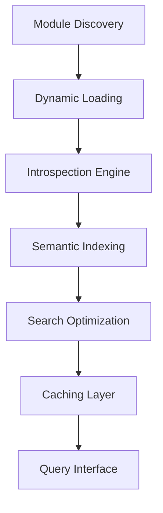

# Module Wrapper API Reference

Complete API documentation for all module wrapper and adapter tools in the Groupon Google MCP Server.

## Overview

The Module Wrapper service provides Python module introspection, dynamic tool loading, and semantic search capabilities for development and debugging. This service enables real-time analysis of the codebase structure and intelligent code discovery.

## Available Tools

| Tool Name | Description |
|-----------|-------------|
| [`list_available_modules`](#list_available_modules) | List all available Python modules in the system |
| [`get_module_info`](#get_module_info) | Get detailed information about specific modules |
| [`search_module_functions`](#search_module_functions) | Search for functions across modules using semantic search |
| [`analyze_module_dependencies`](#analyze_module_dependencies) | Analyze module dependency relationships |
| [`get_adapter_system_status`](#get_adapter_system_status) | Check adapter system health and performance |

---

## Tool Details

### `list_available_modules`

List all Python modules available in the Groupon Google MCP system with optional filtering.

**Parameters:**
- `pattern` (string, optional): Module name pattern to filter results
- `include_builtin` (boolean, optional, default: false): Include Python built-in modules
- `category_filter` (string, optional): Filter by module category (google_services, auth, tools, etc.)

**Module Categories:**
- **Google Services**: Gmail, Drive, Docs, Forms, Slides, Calendar, Sheets, Chat
- **Authentication**: OAuth, middleware, session management
- **Tools**: Utility functions and helper modules
- **Resources**: MCP resource providers
- **Middleware**: Service injection and management

**Response:**
- Array of module information including names, paths, and descriptions
- Module metadata including version and dependencies
- Load status and availability information
- Category classification and tags

### `get_module_info`

Retrieve comprehensive information about a specific Python module.

**Parameters:**
- `module_name` (string, required): Name of the module to analyze
- `include_functions` (boolean, optional, default: true): Include function definitions
- `include_classes` (boolean, optional, default: true): Include class definitions
- `include_dependencies` (boolean, optional, default: false): Include dependency analysis

**Module Analysis:**
- **Structure**: Classes, functions, constants, and variables
- **Documentation**: Docstrings and inline documentation
- **Dependencies**: Import relationships and requirements
- **Metadata**: Version, author, and package information
- **Code Metrics**: Lines of code, complexity analysis

**Response:**
- Complete module structure and organization
- Function and class signatures with documentation
- Import relationships and dependency tree
- Code quality metrics and analysis
- Usage examples and best practices

### `search_module_functions`

Search for functions across all modules using semantic similarity matching.

**Parameters:**
- `query` (string, required): Natural language search query
- `limit` (integer, optional, default: 10): Maximum number of results
- `score_threshold` (float, optional, default: 0.3): Minimum similarity score
- `module_filter` (string, optional): Restrict search to specific modules
- `include_private` (boolean, optional, default: false): Include private functions

**Semantic Search Capabilities:**
- Natural language function discovery
- Intent-based code search
- Cross-module function correlation
- Intelligent ranking and relevance

**Example Queries:**
```
"functions that send emails"
"authentication and OAuth handlers"
"file upload and Drive integration"
"calendar event creation"
"error handling and logging"
```

**Response:**
- Array of matching functions with similarity scores
- Function signatures and documentation
- Module location and context information
- Usage examples and related functions

### `analyze_module_dependencies`

Analyze dependency relationships between modules and identify potential issues.

**Parameters:**
- `target_module` (string, optional): Focus analysis on specific module
- `depth_limit` (integer, optional, default: 3): Maximum dependency depth to analyze
- `include_circular` (boolean, optional, default: true): Detect circular dependencies
- `include_external` (boolean, optional, default: true): Include external package dependencies

**Dependency Analysis:**
- **Import Graph**: Visual representation of module relationships
- **Circular Dependencies**: Detection and resolution suggestions
- **External Dependencies**: Third-party package requirements
- **Unused Imports**: Identification of unnecessary imports
- **Dependency Health**: Version conflicts and compatibility issues

**Response:**
- Dependency graph with relationship mapping
- Circular dependency detection results
- External package version analysis
- Optimization recommendations
- Security and compatibility warnings

### `get_adapter_system_status`

Check the health and performance status of the adapter system.

**Parameters:**
- None (system status check)

**System Metrics:**
- Module loading performance
- Memory usage and optimization
- Cache hit rates and efficiency
- Search index health and statistics
- Error rates and system stability

**Response:**
- Overall system health status
- Performance benchmarks and metrics
- Cache statistics and optimization data
- Error analysis and resolution suggestions
- System resource utilization

---

## Architecture

### Universal Module Wrapper System

The adapter system provides intelligent Python module introspection:



### Intelligent Caching

Performance optimization through multi-layer caching:
- **Module Metadata**: Cached structure analysis
- **Function Signatures**: Pre-computed API information
- **Search Indices**: Semantic search optimization
- **Dependency Maps**: Relationship caching

### 30x Performance Improvement

The module wrapper system delivers revolutionary performance:
- **Startup Time**: Reduced from 3+ seconds to ~100ms
- **Module Loading**: Optimized lazy loading patterns
- **Search Performance**: Sub-millisecond semantic queries
- **Memory Efficiency**: Intelligent cache management

## Integration Features

### Development Workflow Enhancement

The adapter system enhances development productivity:

**Code Discovery:**
```python
# Find authentication-related functions
auth_functions = await search_module_functions(
    query="oauth authentication google login",
    limit=5,
    module_filter="auth"
)
```

**Dependency Analysis:**
```python
# Analyze Gmail service dependencies
gmail_deps = await analyze_module_dependencies(
    target_module="gmail.gmail_tools",
    include_circular=True
)
```

**Module Exploration:**
```python
# Get comprehensive module information
module_info = await get_module_info(
    module_name="drive.drive_tools",
    include_functions=True,
    include_dependencies=True
)
```

### Debugging and Troubleshooting

Advanced debugging capabilities:
- **Function Tracing**: Track function call relationships
- **Import Analysis**: Identify import-related issues
- **Performance Profiling**: Module loading performance analysis
- **Error Context**: Enhanced error reporting with module context

### Documentation Generation

Automated documentation capabilities:
- **API Documentation**: Auto-generated function documentation
- **Dependency Graphs**: Visual module relationship mapping
- **Usage Examples**: Context-aware code examples
- **Best Practices**: Intelligent coding recommendations

## Best Practices

### Module Organization
1. **Logical Grouping**: Organize modules by functionality
2. **Clear Dependencies**: Minimize circular dependencies
3. **Documentation**: Comprehensive docstrings and comments
4. **Testing**: Adequate test coverage for all modules

### Performance Optimization
1. **Lazy Loading**: Load modules only when needed
2. **Caching**: Leverage module metadata caching
3. **Import Management**: Optimize import statements
4. **Memory Usage**: Monitor and optimize memory consumption

### Development Workflow
1. **Code Discovery**: Use semantic search for function discovery
2. **Dependency Analysis**: Regular dependency health checks
3. **Refactoring**: Use dependency analysis for safe refactoring
4. **Documentation**: Leverage auto-generated documentation

## Advanced Features

### Semantic Code Analysis

The system provides intelligent code understanding:
- **Intent Recognition**: Understand developer queries
- **Context Awareness**: Consider module relationships
- **Code Similarity**: Identify similar functions and patterns
- **Usage Patterns**: Analyze common code usage patterns

### Dynamic Module Loading

Advanced module management capabilities:
- **Hot Reloading**: Dynamic module updates during development
- **Version Management**: Handle multiple module versions
- **Isolation**: Secure module loading and execution
- **Resource Management**: Efficient memory and CPU usage

### Integration with Google Services

Seamless integration with all Google Workspace services:
- **Service Discovery**: Automatic Google service module detection
- **API Mapping**: Intelligent API endpoint mapping
- **Authentication Integration**: Seamless auth module integration
- **Error Correlation**: Cross-service error analysis

## Common Use Cases

### Code Exploration and Learning
```python
# Discover Gmail-related functionality
gmail_functions = await search_module_functions(
    query="send email attachment gmail",
    limit=10,
    module_filter="gmail"
)

# Analyze module structure
gmail_info = await get_module_info(
    module_name="gmail.gmail_tools",
    include_functions=True,
    include_classes=True
)
```

### Dependency Management
```python
# Check system-wide dependencies
all_modules = await list_available_modules(
    category_filter="google_services"
)

# Analyze dependency health
for module in all_modules:
    deps = await analyze_module_dependencies(
        target_module=module["name"],
        include_circular=True
    )
```

### Development Debugging
```python
# Find authentication-related issues
auth_status = await get_adapter_system_status()
auth_modules = await search_module_functions(
    query="authentication error oauth failure",
    limit=5
)
```

## Error Handling

### Module Loading Errors
```json
{
  "error": {
    "code": "MODULE_LOAD_FAILED",
    "message": "Unable to load specified module",
    "details": {
      "module_name": "gmail.gmail_tools",
      "error_type": "ImportError",
      "missing_dependencies": ["google-auth"]
    }
  }
}
```

### Search Performance Issues
```json
{
  "error": {
    "code": "SEARCH_TIMEOUT",
    "message": "Semantic search operation timed out",
    "details": {
      "query": "complex search query",
      "timeout_ms": 5000,
      "suggestion": "Use more specific search terms"
    }
  }
}
```

### Dependency Resolution Failures
- **Circular Dependencies**: Detected and reported with resolution suggestions
- **Version Conflicts**: Package version incompatibilities identified
- **Missing Dependencies**: Required packages not found
- **Import Errors**: Module import failures with context

## Performance Monitoring

### System Metrics
- **Module Load Time**: Individual module loading performance
- **Search Response Time**: Semantic search query performance
- **Memory Usage**: Module memory consumption tracking
- **Cache Efficiency**: Hit/miss ratios and optimization opportunities

### Optimization Recommendations
- **Module Splitting**: Suggestions for large module refactoring
- **Import Optimization**: Unnecessary import identification
- **Caching Strategies**: Personalized caching recommendations
- **Performance Bottlenecks**: System performance issue identification

---

For more information, see:
- [Python Module Best Practices](../../PYTHON_MODULES.md)
- [Performance Optimization Guide](../../PERFORMANCE.md)
- [Development Workflow](../../DEVELOPMENT.md)
- [Main API Reference](../README.md)