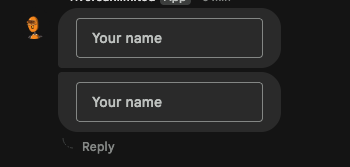
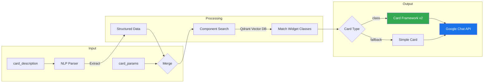

# Natural Language Card Patterns for Google Chat

## Overview

The `send_dynamic_card` tool enables creating rich Google Chat cards using natural language descriptions. Simply describe what you want, and the NLP parser extracts structured parameters to build your card automatically.

**Example Tool Call:**

```json
{
  "user_google_email": "me",
  "space_id": "spaces/AAAAWvjq2HE",
  "card_description": "Create a form card with a single text input labeled \"Your name\" and a submit button that opens https://example.com",
  "webhook_url": "https://chat.googleapis.com/v1/spaces/XXXXX/messages?key=XXXXX&token=XXXXX"
}
```

**Result:**



*The card above was generated entirely from the `card_description` - no explicit `card_params` needed.*

## How It Works



### The Pipeline

1. **NLP Parsing** - Your description is parsed to extract titles, buttons, sections, widgets, icons, and colors
2. **Parameter Merging** - Explicit `card_params` override NLP-extracted values
3. **Component Search** - Semantic search finds matching Card Framework v2 classes (TextInput, Button, DecoratedText, etc.)
4. **Card Building** - Components are instantiated with extracted parameters
5. **Delivery** - Card is sent via webhook or Chat API

### Card Types in Response

| Card Type | Meaning |
|-----------|---------|
| `class` | Full Card Framework v2 component resolution - best quality |
| `variable` | Simple parameter transformation |
| `simple_fallback` | Basic fallback when components unavailable |

## Quick Examples

### Simple Card
```
"Create a card titled 'Welcome' with text 'Hello, team!'"
```

### Card with Buttons
```
"Create a card with a green 'Approve' button and red 'Reject' button"
```

### Form Card (NLP-only)
```
"Create a form card with a text input labeled 'Your name' and a submit button"
```

### Dashboard Card
```
"Create a status card with sections: 'Server Status' showing 'Online' with check icon,
and 'Actions' with buttons 'Restart' and 'Backup'"
```

## Supported Elements

### Title, Subtitle, and Text

| Pattern | Example |
|---------|---------|
| `titled 'X'` | `"card titled 'Alert'"` |
| `with title 'X'` | `"card with title 'Status Update'"` |
| `with subtitle 'X'` | `"with subtitle 'Daily Report'"` |
| `with text 'X'` | `"with text 'All systems operational'"` |
| `saying 'X'` | `"card saying 'Meeting canceled'"` |

### Buttons

| Pattern | Example |
|---------|---------|
| `with button 'X'` | `"with button 'Submit'"` |
| `with {color} button 'X'` | `"with green button 'Approve'"` |
| `button 'X' linking to {url}` | `"button 'Docs' linking to https://docs.example.com"` |
| `buttons: 'A', 'B', 'C'` | `"buttons: 'Save', 'Cancel', 'Help'"` |

**Button Colors:**
- `green` - Filled green (approve, success)
- `red` - Filled red (reject, danger)
- `blue` - Filled blue (primary action)
- `gray/grey` - Outlined (secondary)

**Button Styles:**
- `filled` - Solid background
- `outlined` - Border only
- `borderless` - Text only
- `tonal` - Muted fill

### Form Inputs

| Pattern | Example |
|---------|---------|
| `text input labeled 'X'` | `"text input labeled 'Your name'"` |
| `with textInput 'X'` | `"with textInput 'Email address'"` |
| `input field for 'X'` | `"input field for 'Comments'"` |

### Sections

| Pattern | Example |
|---------|---------|
| `with section 'X'` | `"with section 'Details'"` |
| `sections: 'A', 'B'` | `"sections: 'Info', 'Actions'"` |
| `collapsible section 'X'` | `"collapsible section 'Advanced'"` |

### Images

| Pattern | Example |
|---------|---------|
| `with image {url}` | `"with image https://example.com/logo.png"` |
| `showing image of {desc}` | `"showing image of a cat"` |

### Icons

Use icon keywords in decoratedText widgets:

| Keyword | Icon | Keyword | Icon |
|---------|------|---------|------|
| `person`, `user` | PERSON | `email`, `mail` | EMAIL |
| `phone`, `call` | PHONE | `clock`, `time` | CLOCK |
| `star`, `bookmark` | STAR/BOOKMARK | `check`, `done` | CHECK_CIRCLE |
| `warning`, `alert` | WARNING | `dollar`, `money` | DOLLAR |
| `settings`, `config` | SETTINGS | `home` | HOME |

### DecoratedText Widgets

```
"decoratedText with person icon, top label 'User', text 'John Doe', bottom label 'Admin'"

"decoratedText showing 'Notifications' with switch control"
```

## Combining NLP with Explicit Parameters

NLP extraction works seamlessly with explicit `card_params`. User-provided parameters always take priority:

```json
{
    "card_description": "Create a form card with a text input",
    "card_params": {
        "sections": [{
            "widgets": [{
                "textInput": {
                    "label": "Your name",
                    "name": "your_name"
                }
            }]
        }]
    }
}
```

This hybrid approach lets you:
- Use NLP for the overall structure
- Override specific widgets with exact parameters
- Combine natural language convenience with precise control

## Validation & Auto-Correction

The parser automatically handles:

| Issue | Auto-Fix |
|-------|----------|
| Title > 200 chars | Truncated with "..." |
| Text > 4000 chars | Truncated with "..." |
| Button text > 40 chars | Truncated |
| More than 6 buttons | Extras dropped |
| Missing `https://` | Auto-prepended |
| Unknown icon | Defaults to STAR |

## Best Practices

1. **Be specific** - More detail yields better extraction
2. **Use quotes** - Wrap text in quotes for accuracy: `titled 'My Title'`
3. **Specify colors** - Use color keywords for automatic styling
4. **Order matters** - List sections/widgets in display order
5. **Test both paths** - Verify `Card Type: class` in responses for best results

## Troubleshooting

### Card shows "simple_fallback" type
- Description may be too simple or ambiguous
- Add specific widget types (decoratedText, textInput, sections)
- Check server logs for component resolution errors

### Missing elements
- Ensure text is properly quoted
- Verify button text is under 40 characters
- Check that URLs are valid

### Components not resolving
- The Qdrant collection may need re-indexing
- Check that `card_framework` module is properly installed
- Verify ModuleWrapper initialization in logs

## Full Example Gallery

### Information Card
```
"Create a card titled 'System Status' with subtitle 'Live Dashboard'
and text 'All services operational' with a green 'Refresh' button"
```

### Multi-Section Dashboard
```
"Create a dashboard with sections:
'Server Health' with decoratedText showing 'Online' with check icon,
'Database' with decoratedText showing 'Connected' with database icon,
'Actions' with buttons 'Restart' in red and 'Backup' in blue"
```

### Interactive Form
```
"Create a form card titled 'Feedback' with:
text input labeled 'Your name',
text input labeled 'Comments',
and buttons: 'Submit' in green, 'Cancel' in gray"
```

### Rich Media Card
```
"Create a card with title 'Product Launch',
image https://example.com/product.jpg,
text '<b>New Features:</b><br/>- Enhanced performance<br/>- Better UI',
and buttons: 'Learn More' and 'Buy Now' in green"
```

## HTML Support in Text

The parser preserves HTML formatting:

| Tag | Effect |
|-----|--------|
| `<b>text</b>` | **Bold** |
| `<i>text</i>` | *Italic* |
| `<u>text</u>` | Underline |
| `<font color="#HEX">` | Colored text |
| `<br/>` | Line break |

---

*This NLP enhancement makes creating Google Chat cards intuitive and natural, allowing you to focus on content rather than structure.*
