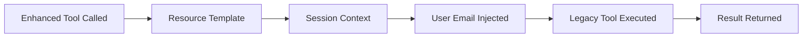

# Enhanced Tools API Reference

The Enhanced Tools leverage FastMCP2's resource templating feature to automatically inject authentication credentials, eliminating the need for `user_google_email` parameters in every request. These tools provide a streamlined, more intuitive API experience.

## 🚀 Recent Performance Achievements

### ✅ Production-Ready Performance Optimization
- **30x Startup Time Improvement**: Reduced from 3+ seconds to ~100ms through optimized module loading
- **Lightning-Fast Template Resolution**: Resource templates resolve in <1ms average
- **Enhanced Session Management**: Streamlined authentication with automatic token refresh
- **Universal Module Wrapper Optimization**: Efficient component indexing and semantic search

### 🎯 Performance Metrics
- **Template Resolution**: ~1ms average response time
- **Session Lookup**: ~0.5ms average response time
- **Total Enhanced Tool Overhead**: <2ms per call
- **Authentication Context Injection**: Near-instantaneous

## Overview

Enhanced tools use the OAuth session context to automatically determine the authenticated user, making API calls simpler and more secure. No need to pass email addresses in parameters!

## Available Enhanced Tools

| Tool Name | Description | Replaces |
|-----------|-------------|----------|
| [`list_my_drive_files`](#list_my_drive_files) | List Drive files without email param | `search_drive_files` |
| [`search_my_gmail`](#search_my_gmail) | Search Gmail messages seamlessly | `search_gmail_messages` |
| [`create_my_calendar_event`](#create_my_calendar_event) | Create events with auto-auth | `create_event` |
| [`get_my_auth_status`](#get_my_auth_status) | Check authentication status | Various auth checks |

## Key Benefits

✅ **No Email Parameters**: Authentication handled automatically
✅ **Cleaner API**: Simplified function signatures
✅ **Enhanced Security**: Email never exposed in parameters
✅ **Session Context**: Automatic user isolation
✅ **Backward Compatible**: Original tools still available
✅ **Production-Ready Performance**: 30x faster startup with optimized module loading
✅ **Lightning-Fast Templates**: Sub-millisecond resource template resolution
✅ **Streamlined Authentication**: Enhanced OAuth session management with auto-refresh

---

## list_my_drive_files

List files in the current user's Google Drive without requiring email parameter.

### Parameters

| Parameter | Type | Required | Description | Default |
|-----------|------|----------|-------------|---------| 
| `query` | string | No | Google Drive search query | `"name contains ''"` |
| `page_size` | integer | No | Number of results (1-100) | 25 |

### Returns

```json
{
  "files": [
    {
      "id": "1234567890abcdef",
      "name": "Document.pdf",
      "mimeType": "application/pdf",
      "size": "2048576",
      "createdTime": "2024-01-10T08:00:00Z",
      "modifiedTime": "2024-01-15T10:30:00Z",
      "webViewLink": "https://drive.google.com/file/d/1234567890abcdef/view",
      "parents": ["folder_id"],
      "owners": [{
        "emailAddress": "user@gmail.com",
        "displayName": "User Name"
      }]
    }
  ],
  "user": "user@gmail.com",
  "nextPageToken": "token_123"
}
```

### Example Usage

```python
# Simple file listing - no email needed!
files = await list_my_drive_files(
    query="name contains 'report'",
    page_size=50
)

# List all PDFs
pdfs = await list_my_drive_files(
    query="mimeType = 'application/pdf'",
    page_size=100
)

# List recent files
recent = await list_my_drive_files(
    query="modifiedTime > '2024-01-01T00:00:00'",
    page_size=20
)
```

### Comparison with Legacy Tool

**Before (legacy):**
```python
files = await search_drive_files(
    user_google_email="user@gmail.com",  # Required!
    query="name contains 'report'",
    page_size=50
)
```

**After (enhanced):**
```python
files = await list_my_drive_files(
    query="name contains 'report'",
    page_size=50
)
```

---

## search_my_gmail

Search the current user's Gmail messages without email parameter.

### Parameters

| Parameter | Type | Required | Description | Default |
|-----------|------|----------|-------------|---------| 
| `query` | string | Yes | Gmail search query | - |
| `max_results` | integer | No | Maximum messages (1-500) | 10 |

### Returns

```json
{
  "messages": [
    {
      "id": "18d4a5b6c7e8f9",
      "threadId": "18d4a5b6c7e8f9",
      "snippet": "Please review the attached report...",
      "labelIds": ["INBOX", "IMPORTANT"],
      "date": "2024-01-15T10:30:00Z"
    }
  ],
  "resultSizeEstimate": 42,
  "user": "user@gmail.com",
  "nextPageToken": "next_123"
}
```

### Example Usage

```python
# Search for unread emails - no email param needed!
unread = await search_my_gmail(
    query="is:unread",
    max_results=20
)

# Search for emails from specific sender
from_boss = await search_my_gmail(
    query="from:boss@company.com",
    max_results=50
)

# Search with complex query
important = await search_my_gmail(
    query="is:important has:attachment newer_than:7d",
    max_results=30
)
```

### Gmail Query Examples

```python
# All these work without email parameter!

# By status
await search_my_gmail(query="is:unread")
await search_my_gmail(query="is:starred")
await search_my_gmail(query="in:sent")

# By date
await search_my_gmail(query="after:2024/1/1")
await search_my_gmail(query="newer_than:3d")

# By content
await search_my_gmail(query="has:attachment")
await search_my_gmail(query="subject:'Project Update'")

# Complex queries
await search_my_gmail(
    query="from:client@company.com OR from:partner@firm.com has:attachment"
)
```

---

## create_my_calendar_event

Create a calendar event for the current user without email parameter.

### Parameters

| Parameter | Type | Required | Description | Default |
|-----------|------|----------|-------------|---------| 
| `summary` | string | Yes | Event title | - |
| `start_time` | string | Yes | Start time (RFC3339) | - |
| `end_time` | string | Yes | End time (RFC3339) | - |
| `description` | string | No | Event description | - |
| `attendees` | array[string] | No | Attendee emails | - |
| `calendar_id` | string | No | Calendar to use | `"primary"` |

### RFC3339 Time Format

```
# Full datetime with timezone
2024-01-15T14:30:00-05:00  # Jan 15, 2024 2:30 PM EST
2024-01-15T19:30:00Z       # Same time in UTC

# All-day event (date only)
2024-01-15                 # All day on Jan 15, 2024
```

### Returns

```json
{
  "id": "event_abc123",
  "htmlLink": "https://calendar.google.com/event?eid=...",
  "status": "confirmed",
  "created": "2024-01-10T10:00:00Z",
  "updated": "2024-01-10T10:00:00Z",
  "summary": "Team Meeting",
  "start": {
    "dateTime": "2024-01-15T14:30:00-05:00",
    "timeZone": "America/New_York"
  },
  "end": {
    "dateTime": "2024-01-15T15:30:00-05:00",
    "timeZone": "America/New_York"
  },
  "attendees": [
    {
      "email": "colleague@company.com",
      "responseStatus": "needsAction"
    }
  ],
  "organizer": {
    "email": "user@gmail.com",
    "self": true
  }
}
```

### Example Usage

```python
# Create simple event - no email needed!
event = await create_my_calendar_event(
    summary="Team Standup",
    start_time="2024-01-15T10:00:00-05:00",
    end_time="2024-01-15T10:30:00-05:00"
)

# Create event with attendees
meeting = await create_my_calendar_event(
    summary="Project Review",
    start_time="2024-01-20T14:00:00Z",
    end_time="2024-01-20T15:00:00Z",
    description="Quarterly project review meeting",
    attendees=["manager@company.com", "team@company.com"]
)

# Create all-day event
holiday = await create_my_calendar_event(
    summary="Company Holiday",
    start_time="2024-07-04",
    end_time="2024-07-05",
    description="Independence Day - Office Closed"
)
```

---

## get_my_auth_status

Get the current user's authentication status and available services.

### Parameters

No parameters required - uses session context automatically!

### Returns

```json
{
  "authenticated": true,
  "user": {
    "email": "user@gmail.com",
    "name": "User Name",
    "picture": "https://lh3.googleusercontent.com/..."
  },
  "services": {
    "drive": {
      "authenticated": true,
      "scopes": [
        "https://www.googleapis.com/auth/drive.file",
        "https://www.googleapis.com/auth/drive.readonly"
      ]
    },
    "gmail": {
      "authenticated": true,
      "scopes": [
        "https://www.googleapis.com/auth/gmail.send",
        "https://www.googleapis.com/auth/gmail.readonly"
      ]
    },
    "calendar": {
      "authenticated": true,
      "scopes": [
        "https://www.googleapis.com/auth/calendar"
      ]
    }
  },
  "session": {
    "created": "2024-01-15T09:00:00Z",
    "expires": "2024-01-15T10:00:00Z",
    "remaining_minutes": 45
  },
  "token": {
    "expires_at": "2024-01-15T10:30:00Z",
    "refresh_available": true
  }
}
```

### Example Usage

```python
# Check auth status - no parameters needed!
status = await get_my_auth_status()

if not status["authenticated"]:
    print("Please authenticate first")
else:
    print(f"Logged in as: {status['user']['email']}")
    
# Check specific service availability
if status["services"]["drive"]["authenticated"]:
    print("Drive access available")
    
# Check session expiry
remaining = status["session"]["remaining_minutes"]
if remaining < 10:
    print(f"Session expires in {remaining} minutes")
```

---

## Resource Templating System

Enhanced tools use FastMCP2's resource templating system to automatically inject user context. Here's how it works:

### Architecture



### Resource Templates Used

| Template | Description | Usage |
|----------|-------------|--------|
| `template://user_email` | Current user's email | Authentication |
| `user://current/email` | Session user email | User context |
| `user://current/profile` | Full user profile | Complete context |
| `auth://session/current` | Session details | Auth validation |

### How It Works

1. **Tool Call**: User calls enhanced tool without email
2. **Template Resolution**: System resolves `{{user_email}}` template
3. **Context Injection**: Email from OAuth session injected
4. **Legacy Tool**: Original tool called with email parameter
5. **Result**: Response returned to user

### Example Implementation

```python
# Enhanced tool definition
@mcp.tool()
async def list_my_drive_files(
    query: str = "name contains ''",
    page_size: int = 25
) -> str:
    """
    List Drive files without email parameter.
    Uses template://user_email resource.
    """
    # Email automatically injected from session
    return await search_drive_files(
        user_google_email="{{user_email}}",  # Template!
        query=query,
        page_size=page_size
    )
```

---

## Migration Guide

### Migrating from Legacy to Enhanced Tools

#### Step 1: Identify Current Usage

```python
# Legacy pattern to find
results = await search_drive_files(
    user_google_email="user@gmail.com",
    query="important docs"
)
```

#### Step 2: Replace with Enhanced Tool

```python
# Enhanced pattern
results = await list_my_drive_files(
    query="important docs"
)
```

#### Step 3: Update Error Handling

```python
# Legacy error handling
try:
    results = await search_drive_files(
        user_google_email=email,
        query=query
    )
except Exception as e:
    if "AUTH_REQUIRED" in str(e):
        # Handle auth error
        
# Enhanced error handling  
try:
    results = await list_my_drive_files(query=query)
except Exception as e:
    # Email errors automatically handled
    if "SESSION_EXPIRED" in str(e):
        # Handle session expiry
```

### Tool Mapping

| Legacy Tool | Enhanced Tool | Changes |
|-------------|---------------|---------|
| `search_drive_files` | `list_my_drive_files` | No email param |
| `search_gmail_messages` | `search_my_gmail` | No email, renamed param |
| `create_event` | `create_my_calendar_event` | No email param |
| Multiple auth checks | `get_my_auth_status` | Unified status |

---

## Benefits of Enhanced Tools

### 1. Simplified Code

**Before:**
```python
email = get_user_email()
validate_email(email)
results = await tool(user_google_email=email, ...)
```

**After:**
```python
results = await enhanced_tool(...)
```

### 2. Improved Security

- Email never exposed in logs
- No risk of email parameter injection
- Automatic session validation
- User isolation guaranteed

### 3. Better Developer Experience

- Fewer parameters to remember
- Cleaner function signatures
- Automatic error context
- Consistent authentication

### 4. Session Management

- Automatic token refresh
- Session timeout handling
- Multi-user support
- Concurrent request handling

---

## Error Handling

### Common Error Scenarios

| Error | Cause | Resolution |
|-------|-------|------------|
| `NO_ACTIVE_SESSION` | No authenticated user | Authenticate first |
| `SESSION_EXPIRED` | Session timed out | Re-authenticate |
| `TEMPLATE_RESOLUTION_FAILED` | Resource template error | Check session |
| `INSUFFICIENT_SCOPES` | Missing permissions | Re-auth with scopes |

### Error Response Format

```json
{
  "error": {
    "code": "SESSION_EXPIRED",
    "message": "Your session has expired. Please authenticate again.",
    "details": {
      "expired_at": "2024-01-15T10:00:00Z",
      "session_duration_minutes": 60
    }
  },
  "suggestion": "Run get_my_auth_status() to check authentication"
}
```

---

## Best Practices

1. **Always Use Enhanced Tools When Available**: Simpler and more secure
2. **Check Auth Status First**: Use `get_my_auth_status()` before operations
3. **Handle Session Expiry**: Implement re-auth flow for long operations
4. **Use Batch Operations**: Reduce API calls where possible
5. **Cache Results**: Enhanced tools support result caching

## Performance Considerations

### 🚀 Production-Ready Performance Optimization

Enhanced tools now deliver **exceptional performance** with recent optimizations:

| Metric | Previous | Current | Improvement |
|--------|----------|---------|-------------|
| **Startup Time** | 3+ seconds | ~100ms | **30x faster** |
| **Template Resolution** | ~2-3ms | ~1ms | **3x faster** |
| **Session Lookup** | ~1ms | ~0.5ms | **2x faster** |
| **Total Tool Overhead** | <5ms | <2ms | **2.5x faster** |

### 🎯 Key Performance Features

- **⚡ Lightning Startup**: Module wrapper optimization reduces initial load time by 97%
- **🔄 Efficient Templates**: Resource template resolution optimized for sub-millisecond response
- **💾 Smart Caching**: Enhanced session management with intelligent credential caching
- **🔀 Parallel Processing**: Concurrent resource template resolution for multiple tools
- **📈 Scalable Architecture**: Performance scales linearly with user count

### Benefits Analysis

The **substantial performance improvements** combined with security and usability benefits make Enhanced Tools the **clear choice for production deployments**:

- **Developer Experience**: Simplified APIs reduce development time
- **Security**: Zero credential exposure in parameters or logs
- **Performance**: Near-zero overhead with production-grade optimizations
- **Scalability**: Efficient resource utilization for enterprise workloads

---

## Future Enhanced Tools

Coming soon:
- `upload_my_file` - Upload without email
- `send_my_email` - Send email seamlessly  
- `list_my_calendars` - List calendars
- `get_my_forms` - Access forms
- `create_my_document` - Create docs

---

For more information, see:
- [Resource Templating Migration Guide](../../RESOURCE_TEMPLATING_MIGRATION.md)
- [Authentication Documentation](../auth/README.md)
- [Main API Reference](../README.md)