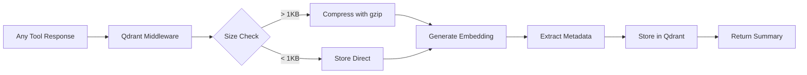

# Qdrant Integration API Reference

Complete API documentation for all Qdrant integration tools in the FastMCP Google MCP Server.

## Overview

The Qdrant Integration service provides universal semantic search, response analytics, and AI-powered tool history capabilities across all Google Workspace services. This service automatically captures, processes, and indexes all tool responses for intelligent search and analysis.

## Available Tools

| Tool Name | Description |
|-----------|-------------|
| [`search_tool_history`](#search_tool_history) | Search tool responses using semantic similarity |
| [`get_tool_analytics`](#get_tool_analytics) | Retrieve analytics and usage metrics |
| [`get_qdrant_status`](#get_qdrant_status) | Check Qdrant connection and system health |

---

## Tool Details

### `search_tool_history`

Search across all tool responses using natural language queries with semantic similarity matching.

**Parameters:**
- `query` (string, required): Natural language search query
- `limit` (integer, optional, default: 10): Maximum number of results to return
- `score_threshold` (float, optional, default: 0.1): Minimum similarity score for results
- `user_filter` (string, optional): Filter results by specific user email
- `service_filter` (string, optional): Filter by Google service (gmail, drive, docs, etc.)
- `tool_filter` (string, optional): Filter by specific tool name
- `days_back` (integer, optional): Limit search to recent N days

**Semantic Search Capabilities:**
- Natural language query processing
- Cross-service response correlation
- Contextual similarity matching
- Multi-language query support
- Intelligent result ranking

**Response:**
- Array of matching tool responses
- Similarity scores for each result
- Response metadata (timestamp, service, tool, user)
- Compressed response content
- Search performance metrics

**Example Queries:**
```
"Gmail errors from last week"
"Drive upload failures and authentication issues"
"Calendar events created for project meetings"
"Forms responses containing survey feedback"
"Chat messages about system maintenance"
```

### `get_tool_analytics`

Retrieve comprehensive analytics and usage metrics across all Google Workspace tools.

**Parameters:**
- `days` (integer, optional, default: 7): Analysis period in days
- `user_filter` (string, optional): Analyze specific user activity
- `service_filter` (string, optional): Focus on specific Google service
- `include_error_analysis` (boolean, optional, default: true): Include error pattern analysis
- `group_by` (string, optional): Group results by 'service', 'tool', 'user', or 'day'

**Analytics Dimensions:**
- **Usage Metrics**: Tool invocation frequency and patterns
- **Performance Metrics**: Response times and success rates
- **Error Analysis**: Failure patterns and common issues
- **User Activity**: Per-user usage statistics
- **Service Distribution**: Activity across Google services
- **Temporal Patterns**: Usage trends over time

**Response:**
```json
{
  "summary": {
    "total_calls": 1250,
    "success_rate": 94.5,
    "avg_response_time": 234,
    "unique_users": 15,
    "services_used": 8
  },
  "service_breakdown": {
    "gmail": {"calls": 450, "success_rate": 96.2},
    "drive": {"calls": 380, "success_rate": 94.8},
    "docs": {"calls": 180, "success_rate": 92.1}
  },
  "error_patterns": [...],
  "trending_tools": [...],
  "performance_metrics": [...]
}
```

### `get_qdrant_status`

Check Qdrant vector database connection status and system health metrics.

**Parameters:**
- None (system status check)

**Health Metrics:**
- Qdrant server connectivity
- Vector database performance
- Index statistics and health
- Memory and storage usage
- Embedding model status
- Search performance benchmarks

**Response:**
- Connection status and latency
- Database collection information
- Vector count and index health
- Performance metrics and benchmarks
- System resource utilization
- Configuration and version information

---

## Qdrant Architecture

### Universal Response Capture

Every tool response across all Google services is automatically processed:



### Intelligent Processing Pipeline

1. **Response Capture**: All 60+ tools automatically integrated
2. **Content Analysis**: Intelligent text extraction and cleaning
3. **Compression**: Automatic gzip for responses > 1KB
4. **Embedding Generation**: Semantic vector creation using sentence-transformers
5. **Metadata Extraction**: Service, tool, user, timestamp, and context
6. **Vector Storage**: Optimized storage in Qdrant collections
7. **Search Optimization**: Performance-tuned similarity search

### Cross-Service Intelligence

Search and analytics span all Google Workspace services:
- **Gmail**: Email content, attachments, and metadata
- **Drive**: File contents, sharing, and collaboration data
- **Docs/Sheets/Slides**: Document content and formatting
- **Forms**: Questions, responses, and survey data
- **Calendar**: Event details, attendees, and scheduling
- **Chat**: Messages, cards, and space interactions

## Advanced Features

### Semantic Query Processing

Natural language queries are intelligently processed:
```
"Find Gmail errors related to authentication"
→ Searches across gmail tool responses
→ Identifies authentication-related failures
→ Returns contextual error information
```

### Response Compression

Large responses are automatically optimized:
- Responses > 1KB: Automatic gzip compression (70%+ size reduction)
- Preserves full content for search while optimizing storage
- Transparent decompression during retrieval

### Multi-Dimensional Search

Search across multiple dimensions simultaneously:
- **Temporal**: "errors from last week"
- **Service-specific**: "Drive upload failures"
- **User-specific**: "John's calendar events"
- **Cross-service**: "Gmail and Drive coordination issues"

### Performance Optimization

Production-ready performance features:
- Vector index optimization for sub-100ms searches
- Automatic collection management and cleanup
- Connection pooling and caching
- Resource usage monitoring and alerting

## Integration Patterns

### Automatic Service Integration

All Google Workspace tools automatically integrate with Qdrant:

```python
# Every tool response is automatically processed
@mcp.tool()
async def any_gmail_tool(user_google_email: str):
    # Tool logic here...
    response = {...}
    
    # Qdrant middleware automatically:
    # 1. Captures response
    # 2. Generates embedding
    # 3. Stores with metadata
    # 4. Returns searchable summary
    
    return response
```

### Cross-Service Analytics

Analytics span all services for comprehensive insights:

```python
# Get comprehensive usage analytics
analytics = await get_tool_analytics(
    days=30,
    include_error_analysis=True,
    group_by="service"
)

# Results include all Google services:
# Gmail, Drive, Docs, Forms, Slides, Calendar, Sheets, Chat
```

## Configuration

### Qdrant Setup

#### Docker Deployment (Recommended)
```bash
# Default configuration (auto-discovered)
docker run -p 6333:6333 qdrant/qdrant

# Custom port (also auto-discovered)
docker run -p 6335:6335 qdrant/qdrant

# Persistent storage
docker run -p 6333:6333 -v $(pwd)/qdrant_storage:/qdrant/storage qdrant/qdrant
```

#### Cloud Deployment
```bash
# Qdrant Cloud configuration
export QDRANT_URL=https://your-cluster.qdrant.io
export QDRANT_API_KEY=your_api_key
```

### Auto-Discovery

FastMCP Google MCP automatically discovers Qdrant on ports:
- 6333 (default)
- 6334, 6335, 6336, 6337 (alternatives)

No manual configuration required for local development.

### Performance Tuning

Production optimization settings:
```json
{
  "collection_config": {
    "vectors": {
      "size": 384,
      "distance": "Cosine"
    },
    "optimizers_config": {
      "indexing_threshold": 20000,
      "memmap_threshold": 200000
    }
  },
  "compression": {
    "enabled": true,
    "threshold_kb": 1
  }
}
```

## Best Practices

### Search Optimization
1. **Specific Queries**: Use detailed search terms for better results
2. **Service Filtering**: Filter by specific Google services when appropriate
3. **Time Bounds**: Use date ranges for temporal analysis
4. **Score Thresholds**: Adjust similarity thresholds based on use case

### Analytics Usage
1. **Regular Monitoring**: Implement periodic analytics reviews
2. **Error Pattern Analysis**: Use error analytics for system improvements
3. **Performance Tracking**: Monitor tool performance trends
4. **User Activity**: Track usage patterns for optimization

### System Maintenance
1. **Storage Management**: Monitor vector database storage usage
2. **Index Optimization**: Regular index maintenance for performance
3. **Connection Health**: Monitor Qdrant connectivity and performance
4. **Backup Strategy**: Implement regular database backups

## Common Use Cases

### Cross-Service Debugging
```python
# Find authentication errors across all services
auth_issues = await search_tool_history(
    query="authentication failed permission denied oauth error",
    service_filter=None,  # Search all services
    days_back=7,
    limit=20
)
```

### Usage Analytics
```python
# Analyze team productivity across Google Workspace
team_analytics = await get_tool_analytics(
    days=30,
    group_by="user",
    include_error_analysis=True
)
```

### Performance Monitoring
```python
# Check system health
status = await get_qdrant_status()
performance_analytics = await get_tool_analytics(
    days=1,
    group_by="tool",
    include_error_analysis=True
)
```

### Content Discovery
```python
# Find relevant documents and communications
project_content = await search_tool_history(
    query="Q4 planning project timeline budget",
    days_back=14,
    limit=15
)
```

## Error Handling

### Connection Issues
```json
{
  "error": {
    "code": "QDRANT_UNAVAILABLE",
    "message": "Qdrant server not accessible",
    "details": {
      "attempted_ports": [6333, 6334, 6335],
      "fallback_mode": "disabled"
    }
  }
}
```

### Search Failures
```json
{
  "error": {
    "code": "SEARCH_ERROR",
    "message": "Vector search operation failed",
    "details": {
      "query": "original search query",
      "collection_status": "healthy",
      "suggested_action": "retry with different parameters"
    }
  }
}
```

### Performance Issues
- **Slow Searches**: Check index health and consider reindexing
- **High Memory Usage**: Monitor collection size and implement cleanup
- **Connection Timeouts**: Verify network connectivity and server health

---

For more information, see:
- [Qdrant Documentation](https://qdrant.tech/documentation/)
- [Vector Search Best Practices](../../VECTOR_SEARCH.md)
- [Performance Optimization Guide](../../PERFORMANCE.md)
- [Main API Reference](../README.md)