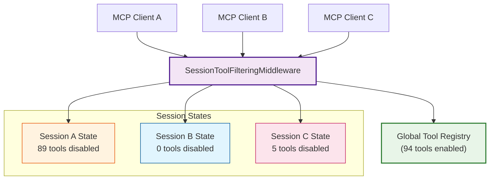
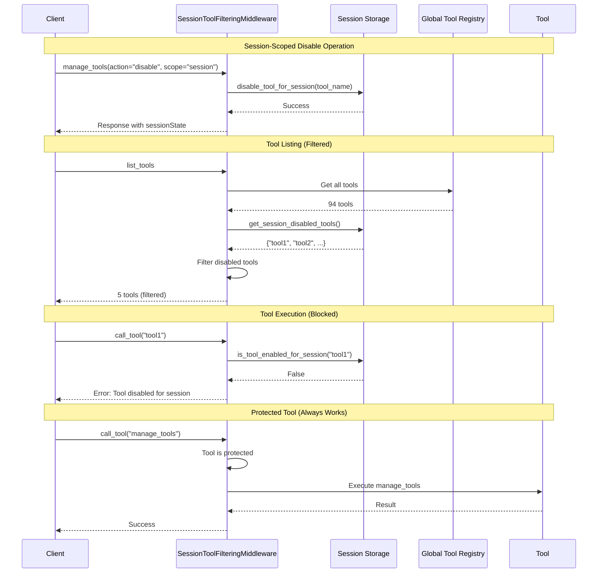

# Session Tool Filtering Middleware

## Overview

The Session Tool Filtering Middleware enables **per-session tool enable/disable** functionality for FastMCP servers. This powerful middleware allows different MCP clients to have different tool availability without affecting other connected clients or the global tool registry.

**Key Benefits:**
- **Session Isolation**: Each MCP client session can have its own set of enabled/disabled tools
- **Non-Invasive**: Session-scoped operations never modify the global tool state
- **Protocol-Level Filtering**: Tools are filtered at both listing and execution stages
- **Protected Tools**: Core management tools always remain available



## Key Features

- **Per-Session Tool Management**: Enable/disable tools for individual client sessions
- **Middleware-Based Filtering**: Intercepts `list_tools` and `call_tool` operations
- **Thread-Safe**: Uses session storage patterns from `auth/context.py`
- **Protected Tools**: Core management tools cannot be disabled
- **Scope Parameter**: Choose between `"global"` and `"session"` scope for operations
- **Structured Responses**: Returns detailed session state in tool management responses

## Architecture

### Components

1. **`auth/context.py`** - Session storage and management functions
2. **`middleware/session_tool_filtering_middleware.py`** - The middleware implementation
3. **`tools/server_tools.py`** - Updated `manage_tools` tool with scope parameter
4. **`tools/server_types.py`** - Response types including `SessionToolState`

### Session Tool Management Functions

The following functions in `auth/context.py` manage session-scoped tool state:

```python
# Get the set of tools disabled for a specific session
get_session_disabled_tools(session_id: str = None) -> set

# Disable a tool for the current session only
disable_tool_for_session(tool_name: str, session_id: str = None) -> bool

# Re-enable a tool for the current session
enable_tool_for_session(tool_name: str, session_id: str = None) -> bool

# Check if a tool is enabled for a specific session
is_tool_enabled_for_session(tool_name: str, session_id: str = None) -> bool

# Clear all session-specific tool disables
clear_session_disabled_tools(session_id: str = None) -> bool

# Get a summary of session tool state
get_session_tool_state_summary(session_id: str = None) -> dict
```

## Usage

### Basic Setup

The middleware is automatically configured in `server.py`:

```python
from middleware.session_tool_filtering_middleware import setup_session_tool_filtering_middleware

# Setup Session Tool Filtering Middleware
session_tool_filter_middleware = setup_session_tool_filtering_middleware(
    mcp,
    enable_debug=True,  # Set to False in production
)
```

### Tool Management with Scope

The `manage_tools` tool now accepts a `scope` parameter:

```python
# Session-scoped operations (affects only current client)
manage_tools(action="disable", tool_names=["send_gmail_message"], scope="session")
manage_tools(action="disable_all_except", tool_names=["search_drive_files"], scope="session")
manage_tools(action="enable", tool_names=["send_gmail_message"], scope="session")
manage_tools(action="enable_all", scope="session")

# Global operations (affects all clients - original behavior)
manage_tools(action="disable", tool_names=["send_gmail_message"], scope="global")
manage_tools(action="enable_all", scope="global")
```

### Available Actions

| Action | Description | Session Scope Behavior |
|--------|-------------|----------------------|
| `list` | List all tools with status | Shows both global and session state |
| `disable` | Disable specific tools | Adds to session's disabled set |
| `enable` | Enable specific tools | Removes from session's disabled set |
| `disable_all_except` | Disable all except specified | Disables most tools for session |
| `enable_all` | Enable all tools | Clears session's disabled set |

### Protected Tools

The following tools are protected and cannot be disabled (even with session scope):

- `manage_tools` - Tool management
- `manage_tools_by_analytics` - Analytics-based tool management
- `health_check` - Server health monitoring
- `start_google_auth` - OAuth authentication
- `check_drive_auth` - Authentication verification

## Response Structure

### ManageToolsResponse

The response includes session-specific information:

```json
{
  "success": true,
  "action": "disable_all_except",
  "scope": "session",
  "totalTools": 94,
  "enabledCount": 94,
  "disabledCount": 0,
  "toolsAffected": ["upload_to_drive", "search_gmail_messages", "..."],
  "toolsSkipped": ["start_google_auth", "health_check", "manage_tools", "..."],
  "protectedTools": ["start_google_auth", "health_check", "manage_tools", "manage_tools_by_analytics", "check_drive_auth"],
  "sessionState": {
    "sessionId": "f725be09...",
    "sessionAvailable": true,
    "sessionDisabledTools": ["upload_to_drive", "search_gmail_messages", "..."],
    "sessionDisabledCount": 89
  },
  "message": "Kept 5 tools, disabled 89 tools for this session"
}
```

### SessionToolState

```python
class SessionToolState(BaseModel):
    """Information about session-specific tool state."""

    sessionId: Optional[str] = Field(
        None, description="Session identifier (truncated for privacy)"
    )
    sessionAvailable: bool = Field(
        ..., description="Whether session context was available for the operation"
    )
    sessionDisabledTools: List[str] = Field(
        default_factory=list,
        description="Tools disabled for this session only (not affecting global state)"
    )
    sessionDisabledCount: int = Field(
        0, description="Number of tools disabled for this session"
    )
```

## Middleware Implementation

### SessionToolFilteringMiddleware

The middleware implements two hooks:

#### `on_list_tools`

Filters the tool list based on session-specific disabled tools:

```python
async def on_list_tools(self, context: MiddlewareContext, call_next) -> List[Any]:
    """Filter the tool list based on session-specific disabled tools."""
    # Get all tools from downstream
    all_tools = await call_next(context)

    # Get current session ID
    session_id = get_session_context()
    if not session_id:
        return all_tools  # No session context - return all tools

    # Get session-specific disabled tools
    session_disabled = get_session_disabled_tools(session_id)
    if not session_disabled:
        return all_tools  # No session disables

    # Filter out session-disabled tools (except protected ones)
    filtered_tools = []
    for tool in all_tools:
        tool_name = getattr(tool, "name", None)

        # Protected tools are always visible
        if tool_name in self.protected_tools:
            filtered_tools.append(tool)
            continue

        # Include if not session-disabled
        if tool_name not in session_disabled:
            filtered_tools.append(tool)

    return filtered_tools
```

#### `on_call_tool`

Blocks execution of session-disabled tools:

```python
async def on_call_tool(self, context: MiddlewareContext, call_next) -> Any:
    """Block execution of session-disabled tools."""
    # Extract tool name from request
    tool_name = extract_tool_name(context)

    # Protected tools always execute
    if tool_name in self.protected_tools:
        return await call_next(context)

    # Check session state
    session_id = get_session_context()
    if session_id and not is_tool_enabled_for_session(tool_name, session_id):
        raise ValueError(
            f"Tool '{tool_name}' is disabled for this session. "
            f"Use manage_tools with scope='session' and action='enable' to re-enable it."
        )

    return await call_next(context)
```

## Configuration

### Middleware Options

```python
from middleware.session_tool_filtering_middleware import SessionToolFilteringMiddleware

middleware = SessionToolFilteringMiddleware(
    # Tools that can never be filtered (always visible)
    protected_tools={
        "manage_tools",
        "manage_tools_by_analytics",
        "health_check",
        "start_google_auth",
        "check_drive_auth",
    },
    # Enable verbose debug logging
    enable_debug=False,
)
```

### Custom Protected Tools

You can customize which tools are protected:

```python
# Add custom protected tools
custom_protected = {
    "manage_tools",
    "health_check",
    "start_google_auth",
    "check_drive_auth",
    "my_critical_tool",  # Custom addition
}

middleware = SessionToolFilteringMiddleware(
    protected_tools=custom_protected,
)
```

## Use Cases

### Multi-Tenant Environments

Different clients can have different tool access based on their needs:

```python
# Client A: Full access (no session disables)
# Client B: Read-only access
manage_tools(
    action="disable_all_except",
    tool_names=["search_drive_files", "list_events", "search_gmail_messages"],
    scope="session"
)

# Client C: Gmail-only access
manage_tools(
    action="disable_all_except",
    tool_names=["search_gmail_messages", "send_gmail_message", "list_gmail_labels"],
    scope="session"
)
```

### Testing and Development

Isolate tool availability during testing:

```python
# Disable all tools except the one being tested
manage_tools(
    action="disable_all_except",
    tool_names=["my_new_tool"],
    scope="session"
)

# Run tests...

# Re-enable all tools
manage_tools(action="enable_all", scope="session")
```

### Security and Access Control

Limit tool access for specific sessions:

```python
# Restrict a session to safe, read-only tools
manage_tools(
    action="disable",
    tool_names=[
        "send_gmail_message",
        "delete_event",
        "manage_drive_files",
        # ... other write operations
    ],
    scope="session"
)
```

## Sequence Diagram



## Session Context Resolution

The middleware uses `get_session_context()` to identify the current session. This function checks multiple sources:

1. **Explicitly set session_id**: Via `set_session_context()` call
2. **FastMCP's native session_id**: From the transport layer (`ctx.session_id`)

```python
def get_session_context() -> Optional[str]:
    """Get the current session ID from the FastMCP context."""
    try:
        ctx = get_context()

        # First try explicitly set session_id
        session_id = ctx.get_state("session_id")
        if session_id:
            return session_id

        # Fall back to FastMCP's native session_id property
        if hasattr(ctx, "session_id"):
            native_session_id = ctx.session_id
            if native_session_id:
                return native_session_id

        return None
    except RuntimeError:
        return None
```

## Troubleshooting

### Session Context Not Available

If `sessionAvailable` is `false` in responses:

1. **Check middleware order**: Ensure `SessionToolFilteringMiddleware` is added after auth middleware
2. **Verify transport**: Session IDs require SSE or WebSocket transport (not stdio in some cases)
3. **Check FastMCP version**: Ensure you're using a version that exposes `session_id`

### Tools Not Being Filtered

If session-disabled tools still appear:

1. **Verify middleware is registered**: Check server logs for middleware initialization
2. **Check protected tools list**: Protected tools are never filtered
3. **Verify session ID**: Ensure the same session is being used for disable and list operations

### Debug Logging

Enable debug logging to troubleshoot issues:

```python
middleware = SessionToolFilteringMiddleware(enable_debug=True)
```

This will log:
- Session context resolution
- Tools being filtered
- Blocked tool executions

## Best Practices

1. **Use session scope for client-specific restrictions**: Don't modify global state unless necessary
2. **Always include core management tools in exceptions**: Ensure `manage_tools` and `health_check` remain accessible
3. **Clear session disables when done**: Use `enable_all` with session scope to reset
4. **Monitor session state**: Check `sessionState` in responses to verify current state
5. **Handle errors gracefully**: Catch `ValueError` when calling session-disabled tools

## API Reference

### manage_tools Tool

```python
async def manage_tools_tool(
    action: Literal["list", "disable", "enable", "disable_all_except", "enable_all"],
    tool_names: Optional[Union[str, List[str]]] = None,
    scope: Literal["global", "session"] = "global",
    include_internal: bool = False,
    user_google_email: Optional[str] = None,
) -> ManageToolsResponse:
    """
    List, enable, or disable FastMCP tools at runtime.

    Args:
        action: Action to perform
        tool_names: Tool name(s) for enable/disable operations
        scope: 'global' affects all clients, 'session' affects only current session
        include_internal: Include internal tools (names starting with '_')
        user_google_email: User email for authentication

    Returns:
        ManageToolsResponse with operation results and session state
    """
```

### SessionToolFilteringMiddleware Class

```python
class SessionToolFilteringMiddleware(Middleware):
    """
    Middleware that filters tools based on per-session enabled/disabled state.

    Args:
        protected_tools: Set of tool names that should never be filtered
        enable_debug: Enable verbose debug logging

    Methods:
        on_list_tools: Filter tool list based on session state
        on_call_tool: Block execution of session-disabled tools
    """
```

## Related Documentation

- [Tool Management API Reference](../api-reference/tools/)
- [Authentication Middleware](./AUTH_MIDDLEWARE.md)
- [FastMCP Middleware Guide](https://gofastmcp.com/servers/middleware)
