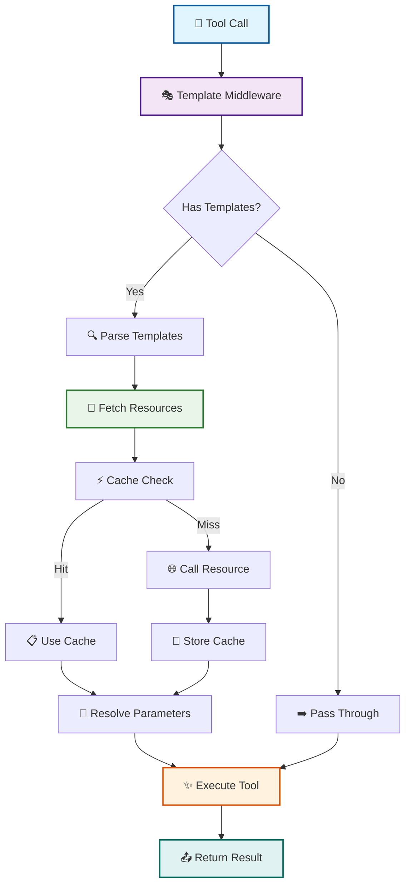
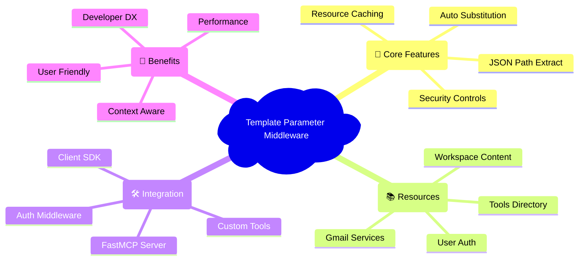
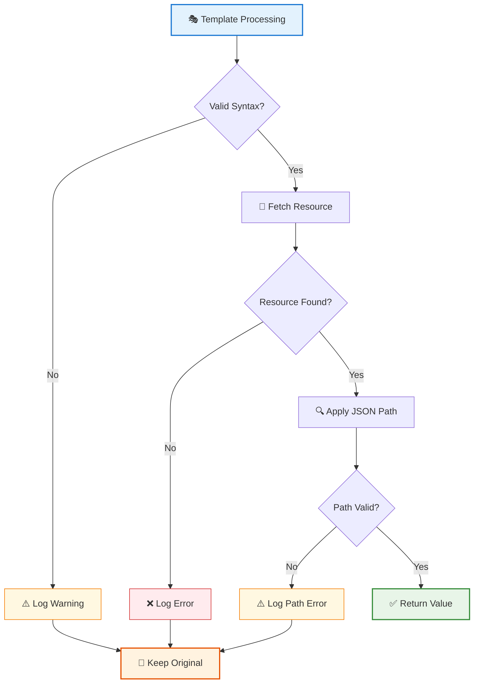
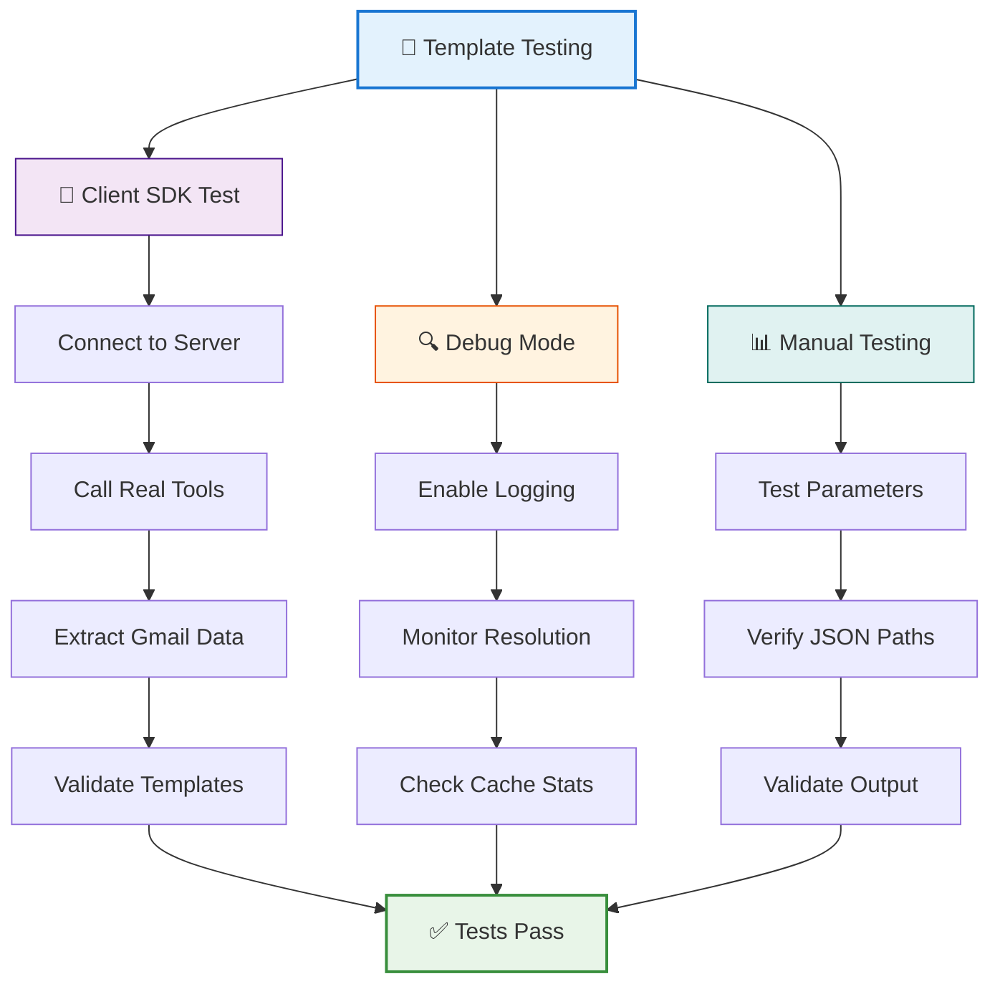
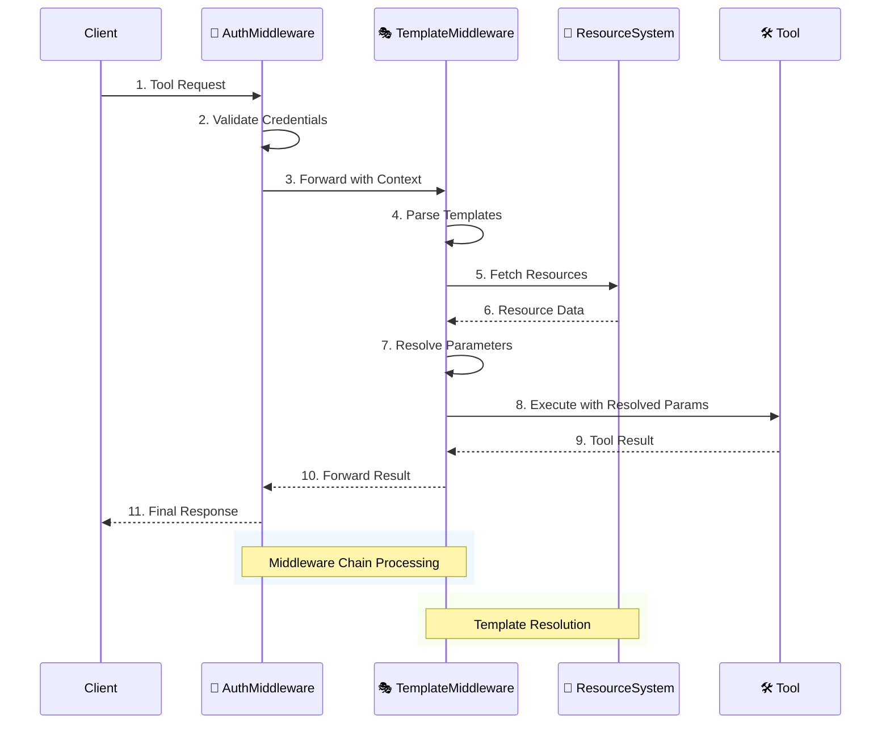
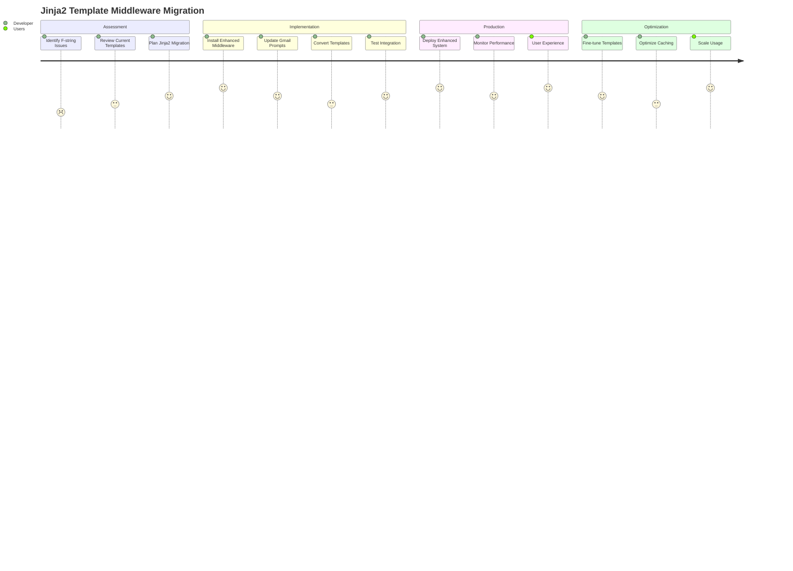

> 🚨 **MAJOR UPDATE** (Latest): **Natural Resource URI Syntax** now supported! Use `{{user://current/email.email}}` directly in templates. See [Natural Resource URI Syntax](#-new-natural-resource-uri-syntax-breakthrough-feature) for details.

# Template Parameter Middleware with Jinja2 Integration

## Overview

The Template Parameter Middleware provides automatic parameter substitution using FastMCP resources with **full Jinja2 templating capabilities**. This powerful middleware allows tools to use both simple template expressions like `{{resource://uri}}` and complex Jinja2 templates with conditionals, loops, and filters in their parameters, which are automatically resolved at runtime using the FastMCP resource system.

**✨ NEW: Jinja2 Integration Features:**
- **Professional templating engine** with full Jinja2 syntax support
- **Complex template logic**: ``, ``, `{{ variable | filter }}`
- **Automatic HTML/CSS escaping** (no more f-string parsing errors!)
- **Template file organization** and caching
- **Template inheritance** and includes
- **Custom filters** for FastMCP-specific operations
- **Sandboxed execution** for security



## 🎯 Key Features

- **🎨 Full Jinja2 Templating**: Professional template engine with conditionals, loops, filters, and inheritance
- **📡 Automatic Parameter Substitution**: Resolve `{{resource://uri}}` expressions in tool parameters
- **🔍 JSON Path Extraction**: Extract specific data with `{{resource://uri}}["path"]` syntax
- **🌟 Advanced Template Logic**: Use ``, ``, `{{ variable | filter }}` for complex rendering
- **🔒 Automatic Escaping**: HTML/CSS escaping prevents parsing errors (solved f-string CSS issues!)
- **📁 Template File Organization**: Load templates from organized directory structures
- **🔄 Template Inheritance**: Use Jinja2 extends and includes for template reuse
- **⚡ Performance Optimized**: Resource caching and template compilation caching
- **🛡️ Security Controls**: Sandboxed execution and resource scheme allowlists
- **🐛 Debug Logging**: Comprehensive logging for troubleshooting
- **🔄 Backwards Compatibility**: Non-templated tools continue to work normally




## 🔧 Template Expression Syntax

### 🎯 NEW: Natural Resource URI Syntax (Breakthrough Feature!)

**✨ MAJOR UPDATE**: The middleware now supports **natural resource URI syntax** directly in Jinja2 templates!

```python
# 🆕 Natural property access - NOW WORKING!
"{{user://current/email.email}}"           # → "test_example@gmail.com"
"{{user://current/email.name}}"            # → "Seth Rivers"
"{{workspace://content/recent.total_files}}" # → 42

# 🆕 Complex property paths - FULLY SUPPORTED!
"{{service://gmail/labels.0.name}}"        # → "Important"
"{{workspace://content/recent.content_summary.documents}}" # → 10

# 🆕 Use in templates naturally
"Hello {{user://current/email.name}}!"     # → "Hello Seth Rivers!"
"User {{user://current/email.email}} says hello" # → "User test_example@gmail.com says hello"
```

**🔧 How It Works (Behind the Scenes):**

1. **Simple Preprocessing**: `{{user://current/email.email}}` → `{{user___current_email_dot_email}}`
2. **Resource Resolution**: Fetches base URI `user://current/email` once
3. **Property Extraction**: ResourceUndefined extracts `.email` property 
4. **Performance**: Only 1 API call instead of separate calls per property

**🎨 Key Benefits:**
- **Natural syntax**: Write `{{user://current/email.email}}` instead of complex JSON paths
- **Performance optimized**: Single resource fetch with multiple property access
- **Jinja2 compatible**: Works seamlessly with all Jinja2 features
- **Error resilient**: Graceful handling of missing properties

### Basic Resource Access (Original FastMCP Style)

```python
# Simple resource access - returns the entire resource
"{{user://current/email}}"

# Returns: "user@example.com"
```

### JSON Path Extraction (Original FastMCP Style)

```python
# Extract specific fields from resource responses
"{{user://current/profile}}['email']"

# Extract from nested objects
"{{workspace://content/recent}}['content_summary']['total_files']"

# Extract from arrays
"{{tools://enhanced/list}}['enhanced_tools'][0]['name']"
```

### 🎨 NEW: Advanced Jinja2 Template Logic

```python
# 🆕 NATURAL SYNTAX with conditionals - NOW WORKING!
"Hello {{user://current/email.name}}!"     # → "Hello Seth Rivers!"
"User {{user://current/email.email}} says hello" # → "User test_example@gmail.com says hello"

# 🆕 NATURAL SYNTAX in expressions
"Total files: {{workspace://content/recent.total_files}} | User: {{user://current/email.email}}"

# 🔄 Traditional resource access (still supported)
"Welcome {{resources.user_current_email}}!Please log in"

# Jinja2 filters
"{{resources.workspace_recent.content_summary.total_files | default(0)}}"

# Complex template with multiple features
"""

Hello {{resources.user_current_profile.email}}!

Your recent activity:

• {{doc.name}} ({{doc.modified | format_datetime}})


You have {{resources.gmail_labels | length}} Gmail labels.

"""
```

### Template File Organization

```python
# Load templates from files
# File: prompts/templates/gmail/welcome_email.txt
"""
Subject: Welcome {{user_email}}!




Hello {{user_name}},

Welcome to our platform! Here's what you can do:


• {{feature.name}}: {{feature.description}}


Best regards,
Your FastMCP Assistant

"""

# Use in tool parameter
@mcp.tool()
async def send_welcome_email(
    user_email: str = "{{template://user_email}}",
    email_body: str = ""
):
    # Template automatically loaded and rendered
    pass
```

## 📚 Available Resources

```mermaid
graph TB
    subgraph "🔐 Authentication Layer"
        A["user://current/email"]
        B["user://current/profile"]
        C["auth://session/current"]
        D["template://user_email"]
    end
    
    subgraph "📧 Gmail Services"
        E["service://gmail/labels"]
        F["service://gmail/filters"]
        G["gmail://content/suggestions"]
        H["gmail://messages/recent"]
    end
    
    subgraph "💼 Workspace Content"
        I["workspace://content/recent"]
        J["workspace://content/search"]
    end
    
    subgraph "🛠️ Tools & Services"
        K["tools://list/all"]
        L["tools://enhanced/list"]
        M["google://services/scopes"]
    end
    
    N["🎭 Template Middleware"] --> A
    N --> E
    N --> I
    N --> K
    
    style N fill:#f3e5f5,stroke:#4a148c,stroke-width:3px
    style A fill:#e1f5fe,stroke:#01579b
    style E fill:#e8f5e8,stroke:#2e7d32
    style I fill:#fff3e0,stroke:#e65100
    style K fill:#fce4ec,stroke:#c2185b
```



### User & Authentication Resources

> 🔐 **Authentication Layer**: Core user identity and session management

| Resource URI | Description | Example Usage |
|-------------|-------------|---------------|
| `user://current/email` | Current user's email address | `{{user://current/email}}` |
| `user://current/profile` | Full user profile with auth status | `{{user://current/profile}}['email']` |
| `user://profile/{email}` | Profile for specific user | `{{user://profile/user@domain.com}}['auth_status']['authenticated']` |
| `template://user_email` | Simple user email string | `{{template://user_email}}` |
| `auth://session/current` | Current session information | `{{auth://session/current}}['session_id']` |
| `auth://sessions/list` | List all active sessions | `{{auth://sessions/list}}['count']` |
| `auth://credentials/{email}/status` | Credential status for user | `{{auth://credentials/user@domain.com/status}}['credentials_valid']` |

### Google Services Resources

| Resource URI | Description | Example Usage |
|-------------|-------------|---------------|
| `google://services/scopes/{service}` | Required scopes for Google service | `{{google://services/scopes/drive}}['default_scopes']` |

### Workspace Content Resources

| Resource URI | Description | Example Usage |
|-------------|-------------|---------------|
| `workspace://content/recent` | Recent workspace content | `{{workspace://content/recent}}['content_by_type']['documents']` |
| `workspace://content/search/{query}` | Search workspace content | `{{workspace://content/search/reports}}['total_results']` |

### Gmail Resources

| Resource URI | Description | Example Usage |
|-------------|-------------|---------------|
| `service://gmail/labels` | Gmail labels (system & user labels) | `{{service://gmail/labels}}["user_labels"][0]["id"]` |
| `service://gmail/filters` | Gmail filter rules | `{{service://gmail/filters}}["filters"][0]["description"]` |
| `service://gmail/lists` | Available Gmail list types | `{{service://gmail/lists}}["list_types"]` |
| `gmail://content/suggestions` | Content suggestions for emails | `{{gmail://content/suggestions}}['quick_links']['items']` |
| `gmail://allow-list` | Gmail send allow list | `{{gmail://allow-list}}['allow_list_count']` |
| `gmail://messages/recent` | Recent Gmail messages | `{{gmail://messages/recent}}['messages'][0]['subject']` |

### Tools Resources

| Resource URI | Description | Example Usage |
|-------------|-------------|---------------|
| `tools://list/all` | Complete tools directory | `{{tools://list/all}}['total_tools']` |
| `tools://enhanced/list` | Enhanced tools collection | `{{tools://enhanced/list}}['enhanced_tools']` |
| `tools://usage/guide` | Tools usage guide | `{{tools://usage/guide}}['quick_start']` |

### Qdrant Resources

> 💾 **Vector Database**: Access stored tool responses and historical data

| Resource URI | Description | Example Usage |
|-------------|-------------|---------------|
| `qdrant://collection/{name}/{point_id}` | Get specific stored tool response by UUID | `{{qdrant://collection/mcp_tool_responses/01d61daf-ab9d-4dc1-9f54-80c317cef056}}` |
| `qdrant://search/{query}` | Search across all tool responses | `{{qdrant://search/recent emails}}['results'][0]['id']` |
| `qdrant://collection/{name}/responses/recent` | Recent tool responses in collection | `{{qdrant://collection/mcp_tool_responses/responses/recent}}['responses'][0]` |
| `qdrant://cache` | Tool response cache metadata | `{{qdrant://cache}}['search'][0]['point_id']` |
| `qdrant://status` | Qdrant middleware status | `{{qdrant://status}}['qdrant_enabled']` |

## 🛠️ Implementation Examples

### Basic Setup with Jinja2

```python
from fastmcp import FastMCP
from middleware.template_middleware import setup_template_middleware

# Create FastMCP server
mcp = FastMCP("MyServer")

# Add template middleware with Jinja2 support
template_middleware = setup_template_middleware(
    mcp,
    template_dirs=[
        "templates",
        "templates/prompts", 
        "templates/tools",
        "prompts/templates"
    ],
    enable_debug=True,
    enable_caching=True,
    cache_ttl_seconds=300,
    sandbox_mode=True  # Enable sandboxed Jinja2 execution
)
```

### Advanced Configuration

```python
from middleware.template_middleware import TemplateParameterMiddleware

# Full configuration options
middleware = TemplateParameterMiddleware(
    # Template loading
    template_dirs=["prompts/templates", "templates"],
    template_string_cache=True,
    
    # Jinja2 configuration
    autoescape=True,  # Automatic HTML/CSS escaping
    trim_blocks=True,
    lstrip_blocks=True,
    sandbox_mode=True,  # Secure execution
    
    # Performance
    enable_caching=True,
    cache_ttl_seconds=300,
    template_cache_size=400,
    
    # Security
    allowed_resource_schemes=[
        "user", "auth", "template", "google", 
        "tools", "workspace", "gmail", "service"
    ],
    max_recursion_depth=3,
    
    # Debugging
    enable_debug_logging=True,
    debug_template_source=True
)

mcp.add_middleware(middleware)
```

### Tool with Jinja2 Template Parameters

```python
### 🆕 Tool with Natural Resource URI Syntax (Latest Update!)

```python
@mcp.tool()
async def send_smart_email_with_natural_syntax(
    recipient: str,
    # 🆕 Natural syntax - direct property access!
    user_email: str = "{{user://current/email.email}}",           # → "test_example@gmail.com"
    user_name: str = "{{user://current/email.name}}",             # → "Seth Rivers"
    total_files: int = "{{workspace://content/recent.total_files}}", # → 42
    greeting: str = "Hello {{user://current/email.name}}!",       # → "Hello Seth Rivers!"
    # Mixed syntax - new + traditional
    summary: str = "User {{user://current/email.email}} has {{workspace://content/recent.total_files}} files"
) -> str:
    """NEW: Tool demonstrating natural resource URI syntax - no complex JSON paths needed!"""
    
    # All parameters are automatically resolved:
    # user_email: "test_example@gmail.com"
    # user_name: "Seth Rivers" 
    # total_files: 42
    # greeting: "Hello Seth Rivers!"
    # summary: "User test_example@gmail.com has 42 files"
    
    return f"""
    📧 **Smart Email Composed!**
    
    **From:** {user_name} ({user_email})
    **To:** {recipient}
    **Greeting:** {greeting}
    **Summary:** {summary}
    
    🎯 **Natural Syntax Benefits:**
    - Simple property access: {{user://current/email.email}} 
    - Performance optimized: Single API call for multiple properties
    - Jinja2 compatible: Works in conditionals, loops, and filters
    - Error resilient: Graceful handling of missing properties
    """
```

### Traditional Tool with Jinja2 Template Parameters

```python
@mcp.tool()
async def send_personalized_email(
    recipient: str,
    subject: str = "Update from {{resources.user_current_email}}",
    greeting: str = "Hello {{resources.user_current_profile.email}}!Hello!",
    summary: str = """

You have {{resources.workspace_recent.content_summary.total_files}} files:

• {{doc.name}}


... and {{resources.workspace_recent.content_by_type.documents | length - 3}} more


No recent activity

"""
) -> str:
    """Send personalized email with Jinja2 template resolution."""
    # All Jinja2 template expressions are automatically resolved before tool execution
    # recipient: "boss@company.com"
    # subject: "Update from john.doe@company.com"  
    # greeting: "Hello john.doe@company.com!"
    # summary: "You have 42 files:\n• Report.docx\n• Presentation.pptx\n• Budget.xlsx\n... and 39 more"
    
    return f"Email sent to {recipient}\nSubject: {subject}\nGreeting: {greeting}\nSummary: {summary}"
```

### Template File-Based Tool

```python
# Create template file: prompts/templates/gmail/status_report.txt
"""
Subject: Weekly Status Report - {{now() | strftime('%B %d, %Y')}}

Hello {{resources.user_current_email}},


## Recent Activity
You've been productive! Here's your activity summary:

**Documents ({{resources.workspace_recent.content_by_type.documents | length}}):**

• {{doc.name}} - {{doc.modified | format_datetime('%m/%d')}}


**Gmail Status:**

• Total labels: {{resources.gmail_labels | length}}
• System labels: {{resources.gmail_labels.system_labels | length}}
• Custom labels: {{resources.gmail_labels.user_labels | length}}



No recent activity to report.


Best regards,
Your FastMCP Assistant
"""

# Use the template in a tool
@mcp.tool()
async def generate_status_report(
    report_content: str = ""
) -> str:
    """Generate a status report using Jinja2 template file."""
    # The entire template file is loaded, rendered with current resources,
    # and the result is passed as the report_content parameter
    return f"Generated report:\n\n{report_content}"
```

### Real Gmail Integration Example

```python
@mcp.tool()
async def create_gmail_filter_report(
    user_email: str = "{{template://user_email}}",
    inbox_label: str = "{{service://gmail/labels}}[\"system_labels\"][2][\"id\"]",  # INBOX
    work_label: str = "{{service://gmail/labels}}[\"user_labels\"][0][\"id\"]",    # First user label
    total_labels: int = "{{service://gmail/labels}}[\"count\"]",
    filter_count: int = "{{service://gmail/filters}}[\"count\"]"
) -> str:
    """Create Gmail filter report with real label IDs from client tests."""
    # Based on our successful client test results:
    # user_email: "srivers@FastMCP.com"
    # inbox_label: "INBOX" 
    # work_label: "CHAT" (or other real label ID)
    # total_labels: 33
    # filter_count: 3
    
    return f"""
    Gmail Report for {user_email}:
    📧 Total Labels: {total_labels}
    📂 Inbox Label: {inbox_label}
    🏷️ Work Label: {work_label} 
    🔧 Active Filters: {filter_count}
    """
```

### Advanced Template Usage

```python
@mcp.tool()
async def create_smart_report(
    user_email: str = "{{template://user_email}}",
    recent_docs: str = "{{workspace://content/recent}}['content_by_type']['documents']",
    auth_status: str = "{{user://current/profile}}['auth_status']['credentials_valid']",
    session_info: str = "{{auth://session/current}}['session_id']"
) -> str:
    """Create a smart report with automatically populated data."""
    
    # All parameters are pre-resolved:
    # user_email: "john.doe@company.com"
    # recent_docs: JSON array of recent documents
    # auth_status: true/false
    # session_info: "uuid-session-id"
    
    import json
    docs = json.loads(recent_docs) if isinstance(recent_docs, str) else recent_docs
    
    report = f"""
    Smart Report for {user_email}
    Session: {session_info}
    Auth Status: {'✅ Authenticated' if json.loads(auth_status) else '❌ Not authenticated'}
    Recent Documents: {len(docs)} found
    """
    
    return report
```

### Qdrant Vector Database Integration

The template middleware seamlessly integrates with Qdrant resources, enabling dynamic content generation from stored tool responses:

```python
@mcp.tool()
async def send_historical_data_email(
    recipient: str,
    point_id: str = "01d61daf-ab9d-4dc1-9f54-80c317cef056",
    # 🔍 Automatically fetch complete Qdrant point data
    response_data: str = "{{ qdrant://collection/mcp_tool_responses/01d61daf-ab9d-4dc1-9f54-80c317cef056 }}",
    # Extract specific fields using JSON paths
    tool_name: str = "{{ qdrant://collection/mcp_tool_responses/01d61daf-ab9d-4dc1-9f54-80c317cef056 }}['tool_name']",
    execution_time: int = "{{ qdrant://collection/mcp_tool_responses/01d61daf-ab9d-4dc1-9f54-80c317cef056 }}['execution_time_ms']",
    timestamp: str = "{{ qdrant://collection/mcp_tool_responses/01d61daf-ab9d-4dc1-9f54-80c317cef056 }}['timestamp']"
) -> str:
    """Send email with embedded Qdrant tool response data."""
    
    # Template middleware automatically resolves all Qdrant URIs:
    # response_data: Full QdrantPointDetailsResponse as dict/JSON
    # tool_name: "get_doc_content"
    # execution_time: 15
    # timestamp: "2025-09-26T14:06:39.230441+00:00"
    
    import json
    data = json.loads(response_data) if isinstance(response_data, str) else response_data
    
    return f"""
    📧 **Historical Tool Response Email**
    
    **To:** {recipient}
    
    **Tool Execution Details:**
    - Tool: {tool_name}
    - Executed at: {timestamp}
    - Execution time: {execution_time}ms
    - User: {data['user_email']}
    - Session: {data['session_id']}
    
    **Complete Response Data:**
    ```json
    {json.dumps(data, indent=2)}
    ```
    
    🎯 **Template Integration Benefits:**
    - Direct Qdrant resource access in templates
    - Automatic decompression of stored data
    - JSON path extraction for specific fields
    - Seamless integration with other FastMCP resources
    """
```

**Real Example from Production:**

This actual tool call successfully embedded Qdrant data in an email:

```json
{
  "method": "tools/call",
  "params": {
    "name": "send_gmail_message",
    "arguments": {
      "subject": "test",
      "body": "{{ qdrant://collection/mcp_tool_responses/01d61daf-ab9d-4dc1-9f54-80c317cef056 }}",
      "to": "myself"
    }
  }
}
```

The email body was automatically populated with the complete point data:
- Full payload with all metadata
- Tool execution details (name, timing, user)
- Complete response data structure
- Automatic decompression (if applicable)
- Formatted as structured JSON

**Key Features:**
- ✅ **UUID Support**: Hyphens in point IDs automatically handled (converted to underscores in variable names)
- ✅ **Auto-Decompression**: Compressed Qdrant data transparently decompressed
- ✅ **Nested Access**: Extract specific fields using JSON path syntax
- ✅ **Performance**: Resources cached with 5-minute TTL by default
- ✅ **Error Handling**: Graceful fallback if point doesn't exist

**Advanced Qdrant Workflow Example:**

```python
@mcp.tool()
async def create_execution_audit_report(
    user_email: str = "{{template://user_email}}",
    # Step 1: Search for relevant tool executions
    search_results: str = "{{ qdrant://search/email tool executions }}",
    # Step 2: Get detailed data for top result
    top_result_id: str = "{{ qdrant://search/email tool executions }}['results'][0]['id']",
    top_result_data: str = "{{ qdrant://collection/mcp_tool_responses/{{top_result_id}} }}",
    # Mix with other resources for complete context
    workspace_files: int = "{{workspace://content/recent.total_files}}",
    report_template: str = """
# Tool Execution Audit Report
**Generated:** {{now() | strftime('%Y-%m-%d %H:%M:%S')}}
**User:** {{user_email}}

## Recent Tool Activity
Found {{search_results.total_results}} relevant tool executions.

### Top Result Details
- **Tool:** {{top_result_data.tool_name}}
- **Executed:** {{top_result_data.timestamp}}
- **Duration:** {{top_result_data.execution_time_ms}}ms
- **Session:** {{top_result_data.session_id}}

### Response Data
```json
{{top_result_data.response_data | json_pretty(2)}}
```

## Current Workspace Status
Active files: {{workspace_files}}

---
*Powered by Qdrant Vector Database + Template Middleware*
"""
) -> str:
    """Create comprehensive audit report combining Qdrant search with other resources."""
    # All template URIs automatically resolved - ready to use!
    return report_template
```

**Technical Details:**
The template middleware handles Qdrant URIs through a sophisticated pipeline:
1. **URI Detection**: Identifies `qdrant://collection/{name}/{uuid}` patterns
2. **UUID Normalization**: Converts hyphens to underscores (e.g., `01d61daf-ab9d-4dc1` → `01d61daf_ab9d_4dc1`)
3. **Resource Fetching**: Calls Qdrant resource handler to retrieve point data
4. **Payload Parsing**: Automatically extracts nested JSON from `ToolResult.content` fields
5. **Model Conversion**: Converts Pydantic models to plain dicts for Jinja2 compatibility
6. **Variable Injection**: Adds to template context with safe variable names
7. **Template Rendering**: Jinja2 renders with full access to structured Qdrant data

See [`documentation/middleware/qdrant-middleware-architecture.md`](documentation/middleware/qdrant-middleware-architecture.md#-template-integration-with-jinja2) for complete Qdrant template integration architecture.

### Complex JSON Path Examples

```python
@mcp.tool()
async def analyze_workspace_activity(
    total_files: int = "{{workspace://content/recent}}['content_summary']['total_files']",
    doc_count: int = "{{workspace://content/recent}}['content_summary']['documents']", 
    first_doc_name: str = "{{workspace://content/recent}}['content_by_type']['documents'][0]['name']",
    user_domain: str = "{{user://current/profile}}['email'].split('@')[1]",
    template_suggestions: str = "{{gmail://content/suggestions}}['email_templates']['status_update']['opening_lines'][0]"
) -> str:
    """Analyze workspace activity with complex data extraction."""
    
    return f"""
    Workspace Analysis:
    - Total files: {total_files}
    - Documents: {doc_count}
    - Latest doc: {first_doc_name}
    - User domain: {user_domain}
    - Suggested opening: {template_suggestions}
    """
```

## 🔍 JSON Path Syntax Reference

### Basic Access

```python
# Object property access
"{{resource://uri}}['property']"
"{{resource://uri}}['nested']['property']"

# Array index access
"{{resource://uri}}[0]"
"{{resource://uri}}[0]['property']"

# Combined access
"{{resource://uri}}['items'][0]['name']"
```

### Advanced Path Expressions

```python
# Multiple levels of nesting
"{{workspace://content/recent}}['content_by_type']['documents'][0]['web_view_link']"

# Access different parts of complex resources
"{{gmail://content/suggestions}}['email_templates']['meeting_follow_up']['subject_template']"

# Extract counts and metadata
"{{tools://list/all}}['tools_by_category']['drive_tools']['tool_count']"
```

## 🚨 Error Handling



### Template Resolution Errors

The middleware handles errors gracefully:

1. **Template Parsing Errors**: Invalid syntax logs warning, keeps original value
2. **Resource Resolution Errors**: Failed resource access logs error, keeps original value  
3. **JSON Path Errors**: Invalid paths log warning, keeps original value
4. **Authentication Errors**: Resource access denied logs info, keeps original value

### Example Error Scenarios

```python
# Invalid JSON path - logs warning, keeps original
"{{user://current/profile}}['nonexistent_field']"

# Invalid resource URI - logs error, keeps original  
"{{invalid://resource/uri}}"

# Resource access denied - logs info, keeps original
"{{restricted://resource}}" 

# Malformed template syntax - logs warning, keeps original
"{{unclosed template"
```

## 🎛️ Configuration Options

### Middleware Configuration with Jinja2

```python
from middleware.template_middleware import TemplateParameterMiddleware

middleware = TemplateParameterMiddleware(
    # Template discovery and loading
    template_dirs=[
        "templates",
        "templates/prompts", 
        "templates/tools",
        "prompts/templates"  # Gmail prompts location
    ],
    template_string_cache=True,                    # Cache compiled templates
    
    # Resource URI patterns
    resource_pattern=r'\{\{resource://([^}]+)\}\}', # Resource URI syntax
    template_pattern=r'\{\{([^}]+)\}\}',            # General template syntax
    
    # Jinja2 configuration
    autoescape=True,                               # Auto-escape HTML/CSS
    trim_blocks=True,                              # Remove first newline after block
    lstrip_blocks=True,                            # Strip leading spaces
    sandbox_mode=True,                             # Enable sandboxed execution
    
    # Caching and performance
    enable_caching=True,                           # Cache resource responses
    cache_ttl_seconds=300,                         # Cache TTL (5 minutes)
    template_cache_size=400,                       # Max templates to cache
    
    # Security and validation
    allowed_resource_schemes=[                     # Allowed URI schemes
        "user", "auth", "template", "google", 
        "tools", "workspace", "gmail", "service"
    ],
    max_recursion_depth=3,                         # Max template nesting
    
    # Debugging
    enable_debug_logging=False,                    # Debug logging
    debug_template_source=False                    # Log template source code
)
```

### Jinja2 Environment Features

```python
# The middleware automatically configures Jinja2 with:

# Custom FastMCP filters
{{resources.workspace_recent | json_extract('content_summary.total_files')}}
{{resources.user_current_profile.created_at | format_datetime('%Y-%m-%d')}}
{{long_text | truncate_text(100, '...')}}

# Custom global functions
{{now()}}              # Current datetime
{{utc_now()}}         # Current UTC datetime

# Auto-escaping for HTML/CSS (prevents f-string parsing errors)

<style>
  .status { color: {{status_color}}; }
</style>

```

### Alternative Template Patterns

```python
# Use different delimiters if needed
template_pattern=r'\$\{([^}]+)\}'  # ${...} syntax
template_pattern=r'%\{([^}]+)\}'   # %{...} syntax
template_pattern=r'#\{([^}]+)\}'   # #{...} syntax
```

## 🚀 Performance Considerations

### Caching Strategy

- **Enable Caching**: Use `enable_caching=True` for production
- **Cache TTL**: Set appropriate TTL based on resource update frequency
- **Cache Stats**: Monitor cache hit rates with `middleware.get_cache_stats()`

### Resource Access Optimization

- **Resource Schemes**: Restrict `allowed_resource_schemes` for security
- **Recursion Limits**: Set appropriate `max_recursion_depth`
- **Debug Logging**: Disable `enable_debug_logging` in production

## 🔒 Security Considerations

### Resource Access Control

```python
# Restrict to safe resource schemes only
allowed_resource_schemes=[
    "user", "auth", "template",    # Authentication resources
    "tools", "workspace",          # Content resources  
    "gmail"                        # Service-specific resources
]
```

### JSON Path Safety

The middleware uses `ast.parse()` and restricted `eval()` for JSON path evaluation:

- Only basic subscript operations allowed
- No arbitrary code execution
- Sandboxed evaluation environment
- Safe handling of malformed expressions

## 🧪 Testing and Debugging



### Client Testing with FastMCP Client SDK

```python
# Test template middleware integration with real server
import pytest
from fastmcp import Client
from .test_auth_utils import get_client_auth_config

class TestTemplateMiddleware:
    @pytest.fixture
    async def client(self):
        """Create client connected to running server."""
        auth_config = get_client_auth_config("test@example.com")
        client = Client("http://localhost:8002/mcp/", auth=auth_config)
        async with client:
            yield client
    
    @pytest.mark.asyncio
    async def test_real_gmail_data(self, client):
        """Test getting real Gmail label IDs via tools."""
        result = await client.call_tool("list_gmail_labels", {
            "user_google_email": "test@example.com"
        })
        
        # Extract real label IDs (format: "(ID: LABELID)")
        import re
        label_ids = re.findall(r'\(ID:\s*([^)]+)\)', str(result))
        
        # Verify real data - from our test we got:
        # ['CHAT', 'SENT', 'INBOX', 'IMPORTANT', 'TRASH', 'DRAFT', 'SPAM'...]
        assert len(label_ids) > 0, "Should find real Gmail label IDs"
        assert "INBOX" in label_ids, "Should have INBOX label"
        assert "SENT" in label_ids, "Should have SENT label"
        
        return label_ids

# Run with: uv run pytest tests/test_template_middleware_integration.py -v
```

### Enable Debug Mode

```python
# Enable detailed logging
template_middleware.enable_debug_mode(True)

# Check cache statistics
stats = template_middleware.get_cache_stats()
print(f"Cache entries: {stats['entries']}")
print(f"Cached resources: {stats['cached_resources']}")
```

### Manual Testing

```python
# Test template resolution manually
from middleware.template_middleware import TemplateParameterMiddleware

middleware = TemplateParameterMiddleware(enable_debug_logging=True)

# Test with real Gmail service resources
test_params = {
    "user_email": "{{template://user_email}}",
    "inbox_label": "{{service://gmail/labels}}[\"system_labels\"][2][\"id\"]",  # INBOX
    "label_count": "{{service://gmail/labels}}[\"count\"]"
}
```

## 🔄 Migration from Manual Parameters

### Before (Manual Parameters)

```python
@mcp.tool()
async def send_email(
    user_google_email: str,  # Manual parameter
    recipient: str,
    subject: str
) -> str:
    # Tool had to require email parameter
    pass
```

### After (Template Parameters)

```python
@mcp.tool()
async def send_email(
    recipient: str,
    subject: str,
    user_email: str = "{{template://user_email}}"  # Automatic resolution
) -> str:
    # Email automatically resolved from session context
    pass
```

## 📋 Best Practices

### Template Design

1. **Use Appropriate Resources**: Choose the most specific resource for your needs
2. **Handle Failures Gracefully**: Template resolution failures keep original values
3. **Cache Wisely**: Enable caching for frequently accessed resources
4. **Secure Access**: Use allowed schemes to restrict resource access
5. **Debug Thoroughly**: Enable debug logging during development

### Performance Optimization

1. **Minimize Nesting**: Keep JSON paths as shallow as possible
2. **Cache Configuration**: Set appropriate TTL based on data freshness needs
3. **Resource Selection**: Use the most efficient resource for your data needs
4. **Batch Access**: Design resources to return multiple related data points

### Error Handling

1. **Expect Failures**: Always assume template resolution might fail
2. **Provide Defaults**: Use meaningful default values in parameters
3. **Log Appropriately**: Use debug logging to troubleshoot issues
4. **Fallback Logic**: Implement fallback behavior in your tools

## 🔗 Integration with Existing Middleware



The Template Parameter Middleware works seamlessly with existing middleware:

### With AuthMiddleware

```python
# Add both middleware - order matters
mcp.add_middleware(AuthMiddleware())        # Sets up authentication context
mcp.add_middleware(TemplateParameterMiddleware())  # Resolves templates using auth context
```

### With Custom Middleware

```python
class CustomMiddleware(Middleware):
    async def on_call_tool(self, context: MiddlewareContext, call_next):
        # Your custom logic here
        result = await call_next(context)
        # Template resolution happens automatically
        return result

# Add in correct order
mcp.add_middleware(AuthMiddleware())
mcp.add_middleware(CustomMiddleware())
mcp.add_middleware(TemplateParameterMiddleware())
```

## 🎉 Complete Example with Jinja2 Integration

Here's a complete example showing the enhanced Template Parameter Middleware with Jinja2 in action:

```python
from fastmcp import FastMCP
from middleware.template_middleware import setup_template_middleware
from auth.middleware import AuthMiddleware
from resources.user_resources import setup_user_resources
from prompts.gmail_prompts import setup_gmail_prompts

# Create server
mcp = FastMCP("Enhanced Template Demo Server")

# Setup resources first
setup_user_resources(mcp)
setup_gmail_prompts(mcp)  # Includes Jinja2 Gmail templates

# Add middleware in correct order
mcp.add_middleware(AuthMiddleware())
template_middleware = setup_template_middleware(
    mcp, 
    template_dirs=[
        "prompts/templates",  # Gmail templates location
        "templates/prompts",
        "templates/tools"
    ],
    enable_debug=True,
    sandbox_mode=True,
    autoescape=True  # Prevent CSS f-string parsing errors
)

@mcp.tool()
async def smart_email_composer(
    recipient: str,
    subject: str = "Weekly Update from {{resources.user_current_email}}",
    email_body: str = """

Hi {{recipient}}!

Here's your weekly update from {{resources.user_current_email}}:

## 📁 Recent Activity

I've been working on {{resources.workspace_recent.content_summary.total_files}} files:


• **{{doc.name}}** (modified {{doc.modified | format_datetime('%m/%d/%Y')}})



...and {{resources.workspace_recent.content_by_type.documents | length - 5}} more documents.


No recent document activity.


## 📧 Gmail Status

My Gmail is organized with:
- {{resources.gmail_labels.system_labels | length}} system labels
- {{resources.gmail_labels.user_labels | length}} custom labels
- Total: {{resources.gmail_labels | length}} labels

Most used labels:

• {{label.name}} ({{label.messages_total}} messages)



## ⚡ Quick Actions

Suggested actions:

• {{suggestion.title}}: {{suggestion.description}}



Best regards,
{{resources.user_current_profile.email}}

P.S. This email was generated at {{now() | strftime('%Y-%m-%d %H:%M:%S')}} using FastMCP with Jinja2! 🚀

Unable to generate personalized content - please authenticate first.

"""
) -> str:
    """Compose smart emails with Jinja2 template resolution and real resource data."""
    
    # All Jinja2 templates are automatically resolved by the middleware
    # The email_body parameter contains fully rendered HTML with:
    # - Conditional logic based on authentication status
    # - Loops through workspace documents and Gmail labels
    # - Formatted dates and counts
    # - Automatic HTML escaping for safety
    
    return f"""
📧 **Email Composed Successfully!**

**To:** {recipient}
**Subject:** {subject}

**Body Preview:**
{email_body[:500]}{'...' if len(email_body) > 500 else ''}

**Full Email Length:** {len(email_body)} characters
**Template Features Used:** Jinja2 conditionals, loops, filters, and resource integration
"""

# Template file example: prompts/templates/gmail/signature.html
"""
<div class="signature">
    <p>Best regards,<br>
    <strong>{{resources.user_current_profile.display_name | default(resources.user_current_email)}}</strong>
    </p>
    
    
    <p><em>{{resources.user_current_profile.company}}</em></p>
    
    
    <p><small>Powered by FastMCP with Jinja2 • Generated {{now() | strftime('%Y-%m-%d')}}</small></p>
</div>
"""

@mcp.tool()
async def add_email_signature(
    content: str,
    signature: str = ""
) -> str:
    """Add professional email signature using Jinja2 template file."""
    return f"{content}\n\n{signature}"

if __name__ == "__main__":
    # Run the enhanced server
    mcp.run()
```

This creates a **powerful, context-aware FastMCP server** where:

✨ **Jinja2 templates** provide professional formatting with conditionals and loops
🎯 **Resource integration** automatically populates real user data
🛡️ **Auto-escaping** prevents CSS/HTML parsing errors (solved the f-string issues!)
📁 **Template files** organize complex templates in reusable files
⚡ **Performance optimized** with template compilation and resource caching
🔒 **Security focused** with sandboxed template execution

## 🚀 Next Steps

### 🎨 Jinja2 Integration Benefits

**✅ Solved Problems:**
- **F-string CSS parsing errors**: Auto-escaping prevents `NameError: name 'font' is not defined`
- **Complex template logic**: Use conditionals, loops, and filters instead of string concatenation
- **Template organization**: Load templates from organized file structures
- **HTML/CSS safety**: Automatic escaping prevents injection and parsing issues

**🚀 New Capabilities:**
- **Professional templating**: Full Jinja2 feature set with inheritance and includes
- **Enhanced Gmail prompts**: Clean templates without f-string issues
- **Performance optimization**: Template compilation and resource caching
- **Security improvements**: Sandboxed execution with allowlists

### Migration Path



1. **🔧 Upgrade**: The middleware now includes full Jinja2 support by default
2. **🧪 Test**: Verify template resolution with real data (Gmail prompts working!)
3. **✨ Enhance**: Convert existing tools to use Jinja2 template features
4. **📊 Monitor**: Watch performance and debug logs
5. **🎯 Optimize**: Tune cache settings and add template files

## 📚 API Documentation

### Core Classes

#### EnhancedTemplateMiddleware

The main middleware class that provides hybrid template resolution capabilities.

**Class Attributes:**
- `SIMPLE_TEMPLATE_PATTERN`: Regex pattern for detecting simple {{resource://uri}} templates
- `RESOURCE_URI_PATTERN`: Enhanced regex for resource URIs with property access
- `JINJA2_DETECTION_PATTERNS`: List of patterns for detecting Jinja2 syntax

**Instance Attributes:**
- `enable_caching`: Boolean flag for resource caching
- `cache_ttl_seconds`: Cache time-to-live configuration
- `enable_debug_logging`: Debug logging control
- `templates_dir`: Path to template files directory
- `jinja2_env`: Configured Jinja2 Environment (if available)

#### Key Methods

##### `__init__(enable_caching=True, cache_ttl_seconds=300, enable_debug_logging=False, jinja2_options=None, templates_dir=None)`

Initialize the enhanced template middleware with comprehensive configuration options.

**Parameters:**
- `enable_caching` (bool): Enable TTL-based resource caching for performance
- `cache_ttl_seconds` (int): Cache expiration time in seconds (default: 300)
- `enable_debug_logging` (bool): Enable detailed logging for development
- `jinja2_options` (Dict[str, Any]): Advanced Jinja2 Environment options
- `templates_dir` (str): Path to .j2 template files directory

**Key Features:**
- Automatic Jinja2 detection and fallback to simple templating
- Custom template loaders (FileSystem + Dynamic)
- Resource caching with configurable TTL
- Comprehensive error handling and logging

##### `async on_call_tool(context, call_next)`

Main middleware hook for intercepting and processing tool calls.

**Parameters:**
- `context` (MiddlewareContext): FastMCP middleware context
- `call_next`: Continuation function for middleware chain

**Returns:**
- Result from original tool execution after template resolution

**Processing Flow:**
1. Extract tool name and arguments
2. Validate FastMCP context availability
3. Recursively resolve template expressions
4. Update context with resolved values
5. Continue with tool execution

##### `clear_cache()`

Clear all cached resources and reset cache statistics.

**Use Cases:**
- Development: Force fresh data when resources change
- Testing: Ensure clean state between tests
- Memory management: Free cache memory
- Runtime: Force refresh of potentially stale data

##### `get_cache_stats()`

Get detailed cache statistics for monitoring and debugging.

**Returns:**
```python
{
    "enabled": bool,           # Caching configuration status
    "jinja2_available": bool,  # Jinja2 package availability
    "total_entries": int,      # Total cache entries
    "valid_entries": int,      # Non-expired entries
    "expired_entries": int,    # Expired but not cleaned
    "ttl_seconds": int,        # Configured TTL
    "cached_uris": List[str]   # List of cached resource URIs
}
```

### Exception Classes

#### TemplateResolutionError

Raised when template parameter resolution fails.

**Attributes:**
- `message`: Human-readable error description
- `resource_uri`: The resource URI that failed (optional)
- `template_text`: The template text that caused the error (optional)

**Common Causes:**
- Resource URI cannot be fetched from FastMCP context
- Invalid Jinja2 template syntax
- Property extraction failures
- Authentication/permission issues

#### SilentUndefined

Custom Jinja2 Undefined class for graceful template variable handling.

**Behavior:**
- Missing variables resolve to empty string ('')
- Boolean evaluation returns False
- Prevents UndefinedError exceptions
- Enables progressive template enhancement

### Setup Functions

#### `setup_enhanced_template_middleware(mcp, **kwargs)`

Primary setup function for integrating template middleware into FastMCP servers.

**Parameters:**
- `mcp`: FastMCP server instance
- `enable_caching` (bool): Enable resource caching (default: True)
- `cache_ttl_seconds` (int): Cache TTL in seconds (default: 300)
- `enable_debug` (bool): Enable debug logging (default: False)
- `jinja2_options` (Dict): Advanced Jinja2 configuration
- `templates_dir` (str): Template files directory path

**Returns:**
- `EnhancedTemplateMiddleware`: Configured middleware instance

**Example:**
```python
from middleware.template_middleware import setup_enhanced_template_middleware

# Basic setup
middleware = setup_enhanced_template_middleware(mcp)

# Production configuration
middleware = setup_enhanced_template_middleware(
    mcp,
    enable_caching=True,
    cache_ttl_seconds=600,  # 10 minutes
    enable_debug=False,
    jinja2_options={'autoescape': True}
)

# Development configuration
middleware = setup_enhanced_template_middleware(
    mcp,
    enable_debug=True,
    cache_ttl_seconds=60,  # Short TTL for development
    templates_dir='./custom_templates'
)
```

### Custom Filters and Functions

The middleware provides specialized Jinja2 filters for FastMCP integration:

#### Global Functions
- `now()`: Returns current UTC datetime
- `utcnow()`: Alias for now() for compatibility

#### Custom Filters
- `extract(data, path)`: Extract nested properties using dot notation
- `safe_get(data, key, default='')`: Safely access dict/object properties
- `format_date(date_input, format='%Y-%m-%d %H:%M')`: Format datetime objects
- `json_pretty(data, indent=2)`: Pretty-print JSON with indentation
- `strftime(date_input, format='%Y-%m-%d %H:%M:%S')`: Format dates with strftime
- `map_list(items, attribute=None)`: Map object attributes to list values
- `map_attr(items, attribute)`: Alias for map_list

#### Filter Usage Examples
```jinja2
{# Extract nested properties #}
{{ user_data | extract('profile.settings.theme') }}

{# Safe property access with defaults #}
{{ user | safe_get('name', 'Anonymous User') }}

{# Format dates and timestamps #}
{{ created_at | format_date('%B %d, %Y') }}
{{ timestamp | strftime('%H:%M:%S') }}

{# Pretty-print JSON data #}
{{ api_response | json_pretty(4) }}

{# Map object attributes to lists #}
{{ documents | map_list('title') }}
{{ users | map_attr('email') }}
```

## 🔧 Integration Patterns

### Middleware Chain Integration

The template middleware works seamlessly with existing FastMCP middleware:

```python
from fastmcp import FastMCP
from auth.middleware import AuthMiddleware
from middleware.template_middleware import setup_enhanced_template_middleware

# Create server
mcp = FastMCP("MyServer")

# Add middleware in correct order
mcp.add_middleware(AuthMiddleware())  # Authentication first
template_middleware = setup_enhanced_template_middleware(mcp)  # Templates second

# Templates can now access authenticated user context
@mcp.tool()
async def personalized_greeting(
    user_name: str = "{{user://current/profile.name}}",
    user_email: str = "{{user://current/email}}"
) -> str:
    return f"Hello {user_name} ({user_email})!"
```

### Resource Provider Integration

Custom resource providers can be used with the template middleware:

```python
# Custom resource provider
@mcp.resource("custom://data/{key}")
async def custom_data_resource(key: str) -> str:
    # Fetch data from custom source
    data = await fetch_custom_data(key)
    return json.dumps(data)

# Use in templates
@mcp.tool()
async def process_custom_data(
    data: str = "{{custom://data/user_preferences}}"
) -> str:
    # data is automatically resolved from custom resource
    return f"Processing: {data}"
```

### Template File Organization

Organize complex templates in dedicated files:

```
templates/
├── email/
│   ├── welcome.j2
│   ├── notification.j2
│   └── signature.j2
├── reports/
│   ├── daily_summary.j2
│   └── weekly_stats.j2
└── macros/
    ├── common.j2
    └── formatting.j2
```

```python
# templates/macros/common.j2


Dear {{ user.name | default('Valued User') }}

Hi {{ user.name | default('there') }}



# templates/email/welcome.j2


Subject: Welcome to Our Platform!

{{ user_greeting(formal=True) }},

Welcome to our platform! Here's what you can do:


• {{ feature.name }}: {{ feature.description }}


Best regards,
The Team
```

### Performance Optimization

#### Caching Strategy
```python
# Production: Longer TTL for stable resources
middleware = setup_enhanced_template_middleware(
    mcp,
    enable_caching=True,
    cache_ttl_seconds=3600  # 1 hour for user profiles
)

# Development: Shorter TTL for changing data
middleware = setup_enhanced_template_middleware(
    mcp,
    enable_caching=True,
    cache_ttl_seconds=60  # 1 minute for development
)

# Monitor cache performance
stats = middleware.get_cache_stats()
print(f"Cache hit rate: {stats['valid_entries']/stats['total_entries']*100:.1f}%")
```

#### Template Optimization
```python
# Efficient: Pre-resolve common resources
@mcp.tool()
async def efficient_template(
    user_email: str = "{{user://current/email}}",  # Cached
    workspace_files: int = "{{workspace://content/recent.total_files}}"  # Cached
) -> str:
    return f"User {user_email} has {workspace_files} files"

# Less efficient: Multiple resource calls
@mcp.tool()
async def inefficient_template(
    content: str = """
    User: {{user://current/email}}
    Profile: {{user://current/profile.name}}
    Settings: {{user://current/profile.settings}}
    """  # Multiple calls to user resources
) -> str:
    return content
```

> 🚀 **The enhanced Template Parameter Middleware with comprehensive API documentation transforms your FastMCP platform into a professional, well-documented system that's easy to understand, integrate, and extend!** ✨�