# Qdrant Middleware Architecture & Process Documentation

## Overview

The Qdrant Middleware for FastMCP is a comprehensive vector database integration that automatically captures, stores, and enables semantic search across all tool responses in your MCP server. This document explains the complete architecture, process flow, and recent fixes implemented.

## 🎯 Purpose

The Qdrant middleware provides:
- **Automatic Tool Response Storage**: Captures all tool responses with embeddings
- **Semantic Search**: Natural language queries across historical data
- **Performance Analytics**: Tool usage patterns and execution metrics
- **Resource Integration**: FastMCP resource system for cached data access
- **User Context Tracking**: Associates responses with user sessions and emails

## 🏗️ Architecture Overview

### Core Components

```
┌─────────────────────────────────────────────────────────────┐
│                 FastMCP Server                              │
├─────────────────────────────────────────────────────────────┤
│                Qdrant Unified Middleware                    │
│  ┌─────────────┬─────────────┬─────────────┬─────────────┐  │
│  │   Client    │   Storage   │   Search    │  Resource   │  │
│  │   Manager   │   Manager   │   Manager   │   Handler   │  │
│  └─────────────┴─────────────┴─────────────┴─────────────┘  │
├─────────────────────────────────────────────────────────────┤
│            Qdrant Cloud Vector Database                     │
│     (Stores embeddings + metadata + responses)             │
└─────────────────────────────────────────────────────────────┘
```

### Manager Responsibilities

| Manager | Purpose | Key Features |
|---------|---------|-------------|
| **QdrantClientManager** | Connection & Model Management | Auto-discovery, SSL, embedding model loading |
| **QdrantStorageManager** | Data Persistence | Compression, sanitization, metadata extraction |
| **QdrantSearchManager** | Query Processing | Semantic search, analytics, query parsing |
| **QdrantResourceHandler** | FastMCP Integration | Resource URIs, caching, Pydantic models |

## 🔄 Process Flow

### 1. Initialization Process

```mermaid
graph TD
    A[FastMCP Server Starts] --> B[Middleware Created]
    B --> C[Deferred Initialization]
    C --> D[Client Triggers First Request]
    D --> E{Request Type?}
    E -->|Tool List| F[on_list_tools Hook]
    E -->|Resource Read| G[on_read_resource Hook]
    E -->|Tool Call| H[on_call_tool Hook]
    F --> I[Background Init Started]
    G --> J[Sync Init for Resources]
    H --> K[Sync Init for Tools]
    I --> L[Embedding Model Loaded]
    J --> L
    K --> L
    L --> M[Qdrant Client Connected]
    M --> N[Collection Verified/Created]
    N --> O[✅ Ready for Operations]
```



### 2. Tool Response Storage


### 3. Resource Access Flow


## 🔧 Recent Fixes & Improvements

### Critical Issues Resolved

#### 1. Tuple/Attribute Errors ❌ → ✅
- **Problem**: `'tuple' object has no attribute 'content'`
- **Root Cause**: Resource handlers returned raw dictionaries
- **Solution**: All handlers now return proper Pydantic models
- **Impact**: Clean FastMCP resource integration

#### 2. Validation Errors ❌ → ✅  
- **Problem**: `vectors_count: Input should be a valid integer [type=int_type, input_value=None]`
- **Root Cause**: Qdrant API returns `None` for some collection stats
- **Solution**: Explicit None checking: `info.vectors_count if info.vectors_count is not None else 0`
- **Impact**: Proper collection info display

#### 3. Initialization Timing ❌ → ✅
- **Problem**: Middleware only initialized on `on_list_tools`
- **Root Cause**: Resource access bypassed initialization triggers  
- **Solution**: Added initialization to `on_list_resources` and `on_read_resource`
- **Impact**: Resources work immediately without requiring tool listing first

### Architecture Improvements

#### Context Caching System
```python
# Middleware processes and caches results
cache_key = f"qdrant_resource_{uri}"
context.set_state(cache_key, result)

# Resource handlers access cached data
cached_result = ctx.get_state(cache_key)
if cached_result:
    return SomePydanticModel(**cached_result)
```

#### Proper Pydantic Model Flow
```python
# Before: Returned raw dicts
return {"error": "message", "timestamp": "..."}

# After: Return proper Pydantic models  
return QdrantErrorResponse(
    error="message",
    uri=uri,
    timestamp=datetime.now(timezone.utc).isoformat()
)
```

## 📊 Available Resources

### Resource URIs

| URI Pattern | Purpose | Returns |
|-------------|---------|---------|
| `qdrant://collections/list` | List all collections | `QdrantCollectionsListResponse` |
| `qdrant://collection/{name}/info` | Collection details | `QdrantCollectionDetailsResponse` |
| `qdrant://collection/{name}/responses/recent` | Recent responses | `QdrantRecentResponsesResponse` |
| `qdrant://search/{query}` | Global search | `QdrantSearchResponse` |
| `qdrant://search/{collection}/{query}` | Collection search | `QdrantSearchResponse` |
| `qdrant://status` | Middleware status | `QdrantStatusResponse` |

### Pydantic Models

All resources return typed Pydantic models ensuring:
- ✅ **Type Safety**: Proper field validation  
- ✅ **IDE Support**: Auto-completion and hints
- ✅ **Serialization**: Clean JSON conversion
- ✅ **Error Handling**: Consistent error responses

## 🛠️ Tools Available

| Tool | Purpose | Usage |
|------|---------|--------|
| `search` | Semantic search across responses | `{"query": "gmail emails about meetings"}` |
| `fetch` | Retrieve specific response by ID | `{"point_id": "uuid-here"}` |
| `search_tool_history` | Legacy tool history search | `{"query": "recent", "limit": 10}` |
| `get_tool_analytics` | Usage analytics and metrics | `{}` |
| `get_response_details` | Detailed response information | `{"response_id": "uuid-here"}` |

## 🔍 Advanced Query Features

### Query Types Supported

```javascript
// Semantic search
{"query": "emails about project deadlines"}

// Service-specific search  
{"query": "service:gmail recent messages"}

// User-specific search
{"query": "user:sethrivers@gmail.com calendar events"}

// Combined search
{"query": "service:drive files shared last week"}
```

### Search Capabilities

- **Natural Language**: "Show me recent emails about the project"
- **Service Filtering**: `service:gmail`, `service:drive`, `service:calendar`  
- **User Filtering**: `user:email@domain.com`
- **Time-based**: Automatic recency scoring
- **Relevance Scoring**: Vector similarity matching

## 📈 Performance Features

### Optimization Profiles

| Profile | Use Case | Features |
|---------|----------|----------|
| `cloud_low_latency` | Small datasets, fast responses | In-memory storage, immediate indexing |
| `cloud_balanced` | Medium datasets | Balanced memory/disk usage |
| `cloud_large_scale` | Large datasets | Disk storage, batch processing |
| `local_development` | Development | Fast startup, minimal resources |

### Auto-Optimization

```python
# Set via environment variable
export QDRANT_OPTIMIZATION_PROFILE="cloud_low_latency"

# Automatic configuration:
# - Vector storage: In-memory for speed
# - HNSW parameters: Optimized for search quality
# - Indexing: Immediate at 1000 vectors (vs default 20000)  
# - Cleanup: Aggressive at 10% deleted (vs default 20%)
```

## 💾 Data Management

### Storage Strategy

1. **Compression**: Payloads > 5KB automatically compressed
2. **Sanitization**: Binary data base64 encoded  
3. **Metadata**: User email, session ID, timestamps
4. **Retention**: Configurable cleanup (default: 14 days)
5. **Indexing**: All key fields indexed for fast search

### Collection Structure

```json
{
  "id": "uuid-v4",
  "vector": [0.1, 0.2, ...], // 384-dim embedding
  "payload": {
    "tool_name": "gmail_search",
    "user_email": "user@domain.com", 
    "user_id": "user_uuid",
    "session_id": "session_uuid",
    "timestamp": "2025-09-17T21:00:00Z",
    "execution_time_ms": 1250,
    "compressed": false,
    "data": "{...response_json...}",
    "payload_type": "tool_response"
  }
}
```

## 🔒 Security & Privacy

### Data Protection
- User data associated with authenticated sessions
- Email-based filtering ensures users only see their data
- Automatic cleanup prevents indefinite data retention
- Compression reduces storage footprint

### Access Control
- Resources require authentication middleware
- Session-based user context extraction
- OAuth integration for Google services
- Secure cloud Qdrant connection with API keys

## 📝 Configuration

### Environment Variables

```bash
# Qdrant Connection
QDRANT_URL=https://your-cluster.qdrant.cloud
QDRANT_API_KEY=your-api-key

# Performance Tuning
QDRANT_OPTIMIZATION_PROFILE=cloud_low_latency
QDRANT_COMPRESSION_THRESHOLD=5120

# Collection Settings
QDRANT_COLLECTION_NAME=mcp_tool_responses
QDRANT_EMBEDDING_MODEL=sentence-transformers/all-MiniLM-L6-v2
```

### Middleware Registration

```python
from middleware.qdrant_middleware import QdrantUnifiedMiddleware

# Create and register middleware
qdrant_middleware = QdrantUnifiedMiddleware(
    qdrant_url="https://your-cluster.qdrant.cloud",
    qdrant_api_key="your-api-key",
    collection_name="mcp_tool_responses",
    embedding_model="sentence-transformers/all-MiniLM-L6-v2"
)

mcp.add_middleware(qdrant_middleware)
```

## 🧪 Testing

### Test Coverage

- ✅ Middleware initialization and hook integration
- ✅ Resource handler Pydantic model returns  
- ✅ Context caching mechanism
- ✅ Error handling and edge cases
- ✅ Tool functionality with real/mock data
- ✅ Performance characteristics

### Key Test Scenarios

```python
# Test proper Pydantic model returns
content = await client.read_resource("qdrant://collections/list")
assert isinstance(content[0], TextResourceContents)
json_data = json.loads(content[0].text)
pydantic_obj = QdrantCollectionsListResponse(**json_data)
assert pydantic_obj.qdrant_enabled is not None
```

## 🔮 Future Enhancements

### Planned Features
- [ ] Multi-tenant data isolation
- [ ] Custom embedding models  
- [ ] Advanced analytics dashboards
- [ ] Real-time search suggestions
- [ ] Export/import functionality
- [ ] Custom field indexing

### Integration Opportunities  
- [ ] Slack/Teams notification integration
- [ ] Webhook-based external triggers
- [ ] GraphQL query interface
- [ ] REST API exposure
- [ ] Elasticsearch hybrid search

## 📞 Support & Troubleshooting

### Common Issues

| Issue | Cause | Solution |
|-------|-------|----------|
| "Middleware not initialized" | Resource accessed before init | Check initialization hooks |
| "Tuple attribute error" | Wrong return type | Ensure Pydantic models returned |
| "Validation error" | Null values from Qdrant | Check None handling in resource handler |
| Connection timeouts | Network/SSL issues | Verify Qdrant URL and API key |

### Debug Logging

```python
# Enable detailed logging
import logging
logging.getLogger('middleware.qdrant_core').setLevel(logging.DEBUG)
```

### Health Checks

```bash
# Check resource status
curl -X POST https://localhost:8002/mcp \
  -H "Content-Type: application/json" \
  -d '{"method": "resources/read", "params": {"uri": "qdrant://status"}}'
```

---

## 📋 Summary

The Qdrant middleware provides a complete vector database integration for FastMCP servers, enabling automatic capture, storage, and semantic search of all tool responses. The recent architecture improvements ensure reliable operation with proper Pydantic model integration, comprehensive error handling, and optimized performance for cloud deployments.

**Key Benefits:**
- 🚀 **Zero Configuration**: Works out of the box with sensible defaults
- 🎯 **Type Safety**: Full Pydantic model integration  
- ⚡ **Performance**: Cloud-optimized with multiple profiles
- 🔍 **Powerful Search**: Natural language queries across all data
- 📊 **Analytics**: Built-in usage patterns and metrics
- 🛡️ **Secure**: User-scoped data access with automatic cleanup

The middleware is now production-ready and fully tested with comprehensive error handling and FastMCP resource system integration.