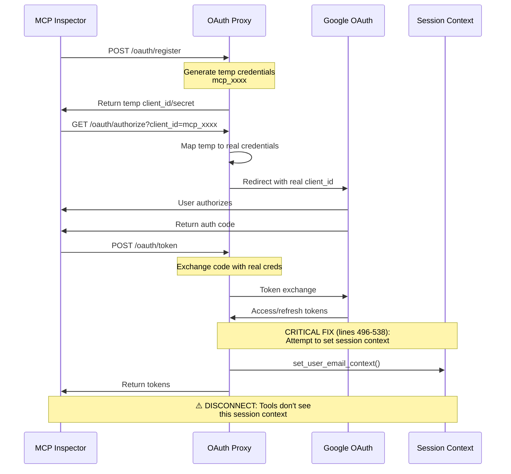
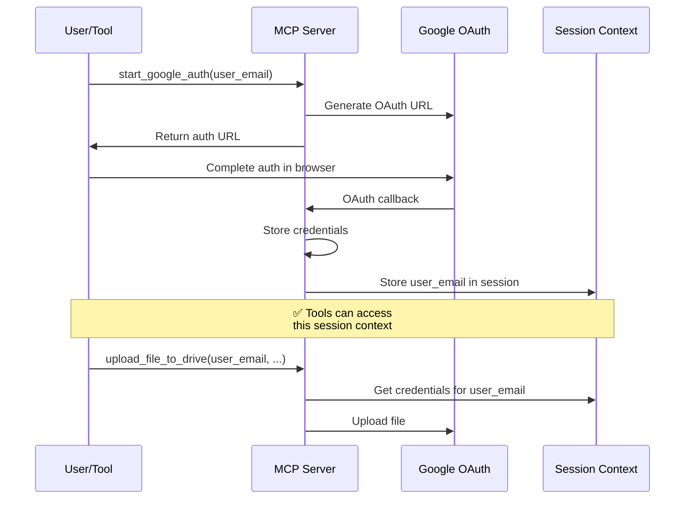

# OAuth Flow Reconciliation: Understanding the Authentication Disconnect

## Executive Summary

The FastMCP2 Google Drive Upload Server currently maintains **two distinct and parallel OAuth authentication flows** that operate independently:

1. **OAuth Proxy Flow** (New): Used by MCP Inspector for Quick OAuth via temporary credentials
2. **Legacy Direct Flow**: Used by the `start_google_auth` tool for direct Google OAuth

These flows do not share session context effectively, creating confusion about which authentication method to use and when. This document clarifies the disconnect and provides recommendations for reconciliation.

## The Two Authentication Flows

### Flow 1: OAuth Proxy Authentication (New)

**Location**: `auth/dynamic_client_registration.py` and `auth/fastmcp_oauth_endpoints.py`

This flow is designed for MCP Inspector integration using temporary credentials that never expose real Google OAuth secrets to clients.



**Key Characteristics:**
- Uses temporary client IDs (format: `mcp_xxxx`)
- Never exposes real Google credentials to clients
- Implements OAuth Proxy pattern for security
- **Attempts** to set session context after authentication (lines 496-538 in `fastmcp_oauth_endpoints.py`)

### Flow 2: Legacy Direct OAuth (Original)

**Location**: `drive/upload_tools.py` (lines 133-208)

This flow directly initiates Google OAuth without the proxy layer.



**Key Characteristics:**
- Uses real Google client credentials directly
- Stores credentials in file system or other storage
- Successfully maintains session context for subsequent tool calls
- Requires explicit `user_google_email` parameter for tools

## The Disconnect Points

### 1. Session Context Isolation

The critical disconnect occurs because the two flows manage session context differently:

- **OAuth Proxy Flow**: Sets session context in lines 496-538 of `fastmcp_oauth_endpoints.py`, but this context is not accessible to tools
- **Legacy Flow**: Sets session context that tools can successfully access

### 2. Tool Parameter Requirements

Tools like `upload_file_to_drive` still require the `user_google_email` parameter because:

1. They were designed for the legacy flow
2. They cannot access the session context set by the OAuth Proxy
3. The session bridging attempt (lines 496-538) doesn't effectively connect the contexts

### 3. Credential Storage Mismatch

- **OAuth Proxy**: Stores mapping in memory (`oauth_proxy._proxy_clients`)
- **Legacy Flow**: Stores credentials in persistent storage (files/database)
- Tools expect credentials in the legacy storage format

## Why Both Flows Exist

### Historical Context

1. **Original Implementation**: The server started with direct Google OAuth (`start_google_auth`)
2. **MCP Inspector Integration**: Required OAuth Proxy for security (never expose real credentials)
3. **Parallel Development**: Both flows evolved independently without full integration

### Current Usage Scenarios

| Scenario | Which Flow | Why |
|----------|------------|-----|
| MCP Inspector Quick OAuth | OAuth Proxy | Security requirement - no credential exposure |
| Direct tool usage | Legacy Flow | Tools expect user_email parameter |
| Manual authentication | Legacy Flow | `start_google_auth` tool available |
| Programmatic clients | OAuth Proxy | Dynamic Client Registration support |

## The Session Context Bridge Attempt

In `fastmcp_oauth_endpoints.py` (lines 496-538), there's a "CRITICAL FIX" attempting to bridge the gap:

```python
# CRITICAL FIX: Set session context after successful OAuth proxy authentication
if client_id.startswith("mcp_"):
    # Get user email from Google userinfo
    # Set session context
    set_user_email_context(authenticated_email)
```

**Why It Doesn't Work Fully:**

1. **Timing Issue**: Session context is set after token exchange, but tools may not have access to the same session
2. **Scope Issue**: The session context may be request-scoped rather than persistent
3. **Storage Issue**: Tools look for credentials in legacy storage, not session context

## Recommendations for Reconciliation

### Option 1: Unified Session Management (Recommended)

**Consolidate both flows to use a single session management system:**

1. Modify OAuth Proxy to store credentials in the same format/location as legacy flow
2. Update tools to check both session contexts
3. Add middleware to bridge proxy sessions to tool sessions

```python
# Proposed unified approach
async def get_authenticated_service(service_name: str):
    # Check OAuth Proxy session first
    if proxy_session := get_proxy_session():
        return build_service_from_proxy(proxy_session)
    
    # Fall back to legacy session
    if legacy_session := get_legacy_session():
        return build_service_from_legacy(legacy_session)
    
    # No authentication found
    raise AuthenticationRequired()
```

### Option 2: Deprecate Legacy Flow

**Remove `start_google_auth` and force all authentication through OAuth Proxy:**

- ✅ Single authentication path
- ✅ Consistent security model
- ❌ Breaking change for existing integrations
- ❌ Requires updating all tools

### Option 3: Full Integration (Most Complex)

**Keep both flows but make them fully interoperable:**

1. Create a unified credential store accessible by both flows
2. Implement session synchronization between flows
3. Update tools to work with either authentication method
4. Add flow detection to automatically route to correct handler

## Implementation Priority

Based on the analysis, here's the recommended priority:

1. **Immediate**: Document current behavior clearly for users
2. **Short-term**: Fix session context bridging (make lines 496-538 effective)
3. **Medium-term**: Implement unified session management (Option 1)
4. **Long-term**: Consider deprecating legacy flow after migration period

## Current Workarounds

Until reconciliation is complete, users should:

1. **For MCP Inspector**: Use OAuth Proxy flow, but know that some tools may require re-authentication
2. **For Direct Usage**: Continue using `start_google_auth` for full tool compatibility
3. **For Development**: Be aware that authentication state may not persist between flows

## Conclusion

The authentication disconnect exists because two parallel OAuth flows were developed for different use cases without full integration. The OAuth Proxy provides security benefits but lacks the session persistence of the legacy flow. The attempted bridge in `fastmcp_oauth_endpoints.py` shows awareness of the issue but doesn't fully resolve it.

The recommended path forward is to implement unified session management that allows both flows to share authentication state, ensuring a seamless experience regardless of the authentication method used.

---

*Document created to clarify the OAuth authentication disconnect in FastMCP2 Google Drive Upload Server*