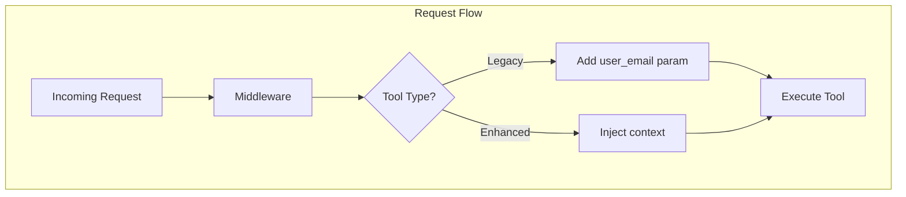
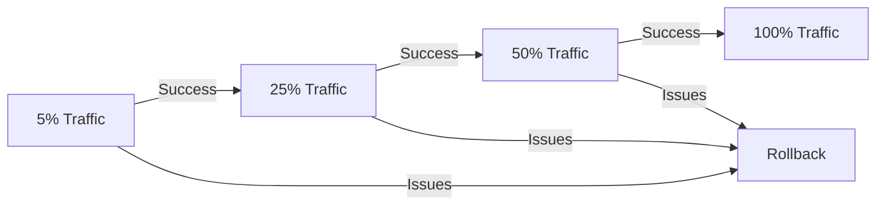
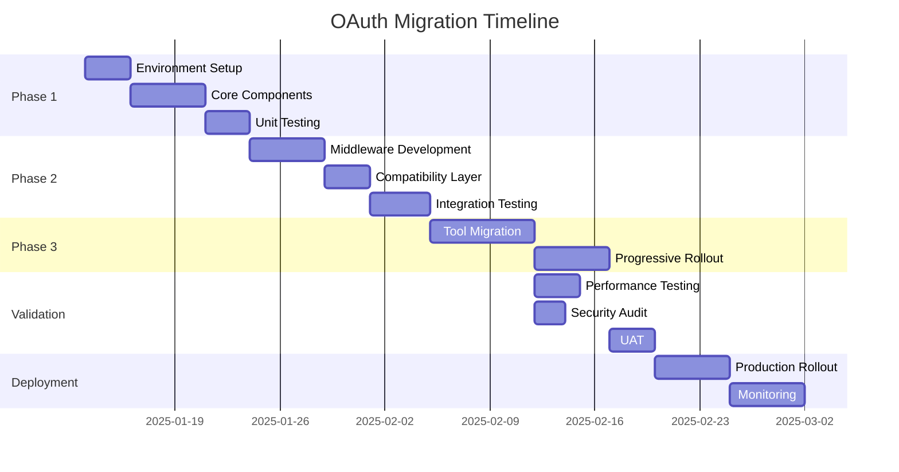

# OAuth Migration Plan: FastMCP 2.12.0 GoogleProvider Integration
## Comprehensive Implementation Roadmap

---

## Executive Summary

This migration plan provides a detailed, phased approach to implementing the unified OAuth architecture using FastMCP 2.12.0's GoogleProvider. The plan ensures zero downtime, maintains backward compatibility, and provides clear rollback procedures at each phase.

**Migration Duration**: 10-12 weeks  
**Risk Level**: Medium (with mitigation strategies)  
**Impact**: All OAuth-dependent tools and services  

---

## Phase 1: Environment Setup & Core Components (Weeks 1-2)

### 1.1 Pre-Migration Preparation

#### Environment Configuration
```yaml
Tasks:
  - Backup current configuration and credentials
  - Set up development/staging environment
  - Configure FastMCP 2.12.0 GoogleProvider settings
  - Validate OAuth client credentials
  - Set up monitoring infrastructure

Required Environment Variables:
  FASTMCP_SERVER_AUTH: "GOOGLE"
  FASTMCP_SERVER_AUTH_GOOGLE_CLIENT_ID: "<client_id>"
  FASTMCP_SERVER_AUTH_GOOGLE_CLIENT_SECRET: "<client_secret>"
  FASTMCP_SERVER_AUTH_GOOGLE_BASE_URL: "http://localhost"
  ENABLE_UNIFIED_AUTH: "false"  # Feature flag for gradual rollout
```

#### Core Component Development

**1. UnifiedSession Class Implementation**
```
Location: auth/unified_session.py
Dependencies: FastMCP 2.12.0 GoogleProvider
Testing: Unit tests required before proceeding
```

**2. Session Bridge Development**
```
Location: auth/session_bridge.py
Purpose: Bridge FastMCP context with tool expectations
Critical Methods:
  - map_fastmcp_to_tool_context()
  - synthesize_credentials()
  - cache_services()
```

**3. Credential Storage Bridge**
```
Location: auth/credential_bridge.py
Purpose: Abstract storage layer for gradual migration
Features:
  - Dual-mode storage support
  - Format translation
  - Migration tracking
```

### 1.2 Validation Checkpoints

- [ ] GoogleProvider successfully authenticates test user
- [ ] UnifiedSession correctly extracts email from token claims
- [ ] Session Bridge creates valid Google service objects
- [ ] Credential Bridge reads/writes both formats
- [ ] Feature flag toggles between old/new flow

### 1.3 Rollback Trigger Points

- GoogleProvider authentication failures > 5%
- Session creation errors > 1%
- Service object creation failures
- Credential storage corruption

---

## Phase 2: Migration Infrastructure & Compatibility (Weeks 3-5)

### 2.1 Middleware Implementation

#### GoogleServiceInjectionMiddleware
```python
Implementation Tasks:
  1. Create middleware skeleton
  2. Implement token extraction from GoogleProvider
  3. Add service caching mechanism
  4. Implement context injection logic
  5. Add backward compatibility parameter injection
  
Critical Features:
  - Automatic user_google_email injection for legacy tools
  - Service object pooling
  - Token refresh handling
  - Error recovery mechanisms
```

#### Compatibility Layer Architecture


### 2.2 Data Migration Strategy

#### Credential Migration Plan
```yaml
Stage 1 - Discovery:
  - Inventory all existing credentials
  - Identify active vs. expired tokens
  - Map credential formats
  - Calculate migration scope

Stage 2 - Shadow Migration:
  - Copy credentials to new format
  - Maintain dual storage
  - Verify format conversion
  - Track migration metrics

Stage 3 - Validation:
  - Test credential access patterns
  - Verify service creation
  - Validate scope preservation
  - Confirm refresh token functionality
```

### 2.3 Tool Compatibility Matrix

| Tool Category | Current State | Migration Approach | Priority |
|--------------|--------------|-------------------|----------|
| Drive Tools | Requires email | Middleware injection | High |
| Gmail Tools | Requires email | Middleware injection | High |
| Calendar Tools | Requires email | Middleware injection | High |
| Chat Tools | Mixed approach | Selective update | Medium |
| Auth Tools | Direct OAuth | Refactor to GoogleProvider | Critical |

### 2.4 Validation Checkpoints

- [ ] Middleware successfully intercepts all tool calls
- [ ] Legacy tools receive user_email parameter
- [ ] Enhanced tools receive context object
- [ ] Credential migration preserves all data
- [ ] Service creation performance < 100ms overhead

---

## Phase 3: Tool Integration & Progressive Rollout (Weeks 6-8)

### 3.1 Tool Migration Priority Matrix

#### Critical Path Tools (Week 6)
```
1. Authentication Tools
   - start_google_auth → Use GoogleProvider directly
   - check_drive_auth → Query GoogleProvider state
   
2. High-Usage Tools
   - search_drive_files
   - search_gmail_messages
   - create_event (Calendar)
```

#### Secondary Tools (Week 7)
```
3. Document Management
   - create_doc
   - update_sheet_values
   - create_form
   
4. Communication Tools
   - send_gmail_message
   - list_spaces (Chat)
```

#### Enhancement Tools (Week 8)
```
5. Enhanced Tools (already context-aware)
   - Validate compatibility
   - Remove redundant code
   - Optimize performance
```

### 3.2 Progressive Rollout Strategy



**Rollout Schedule:**
- Day 1-2: 5% of traffic (monitoring heavy)
- Day 3-4: 25% of traffic (performance validation)
- Day 5-6: 50% of traffic (load testing)
- Day 7: 100% deployment (with rollback ready)

### 3.3 Feature Flag Configuration

```python
Feature Flags:
  UNIFIED_AUTH_ENABLED: Control new auth flow
  LEGACY_COMPAT_MODE: Force backward compatibility
  CREDENTIAL_MIGRATION: Enable credential migration
  SERVICE_CACHING: Enable service object caching
  ENHANCED_LOGGING: Verbose migration logging
  
Per-Tool Flags:
  TOOL_{name}_ENHANCED: Enable enhanced mode per tool
```

---

## Risk Assessment & Mitigation Matrix

### Critical Risks

| Risk | Probability | Impact | Mitigation Strategy | Owner |
|------|------------|--------|-------------------|--------|
| **Authentication Failures** | Medium | Critical | • Dual-flow operation<br>• Automatic fallback<br>• Circuit breaker pattern | Auth Team |
| **Token Expiry Mismatch** | High | High | • Proactive refresh<br>• Grace period handling<br>• Token validation layer | Platform Team |
| **Data Loss** | Low | Critical | • Complete backups<br>• Shadow operations<br>• Rollback procedures | Data Team |
| **Performance Degradation** | Medium | Medium | • Caching strategy<br>• Connection pooling<br>• Load testing | Performance Team |
| **Tool Incompatibility** | Low | High | • Compatibility layer<br>• Gradual migration<br>• Extensive testing | Tools Team |

### Operational Risks

| Risk | Probability | Impact | Mitigation Strategy |
|------|------------|--------|-------------------|
| **Increased Latency** | Medium | Medium | Service pre-warming, aggressive caching |
| **Memory Pressure** | Low | Low | Bounded caches, garbage collection tuning |
| **API Rate Limits** | Low | Medium | Request batching, exponential backoff |
| **Monitoring Gaps** | Medium | High | Comprehensive instrumentation, alerting |

---

## Testing Strategy

### Unit Testing Requirements

```yaml
Coverage Targets:
  UnifiedSession: 95%
  SessionBridge: 90%
  CredentialBridge: 95%
  Middleware: 90%
  Enhanced Tools: 85%
  
Test Categories:
  - Token extraction and parsing
  - Credential format conversion
  - Service object creation
  - Context injection
  - Backward compatibility
  - Error handling
  - Edge cases
```

### Integration Testing Plan

**Phase 1 Integration Tests**
```
1. GoogleProvider Integration
   - OAuth flow completion
   - Token refresh cycle
   - Scope validation
   - Multi-user scenarios
   
2. Session Management
   - Session creation/destruction
   - Context preservation
   - Cache invalidation
   - Concurrent access
```

**Phase 2 Integration Tests**
```
3. Middleware Integration
   - Request interception
   - Parameter injection
   - Service creation
   - Error propagation
   
4. Storage Integration
   - Dual-mode operations
   - Migration verification
   - Consistency checks
   - Rollback testing
```

**Phase 3 Integration Tests**
```
5. End-to-End Tool Testing
   - All tool categories
   - Mixed authentication
   - Performance benchmarks
   - Load testing
```

### Performance Testing Criteria

| Metric | Baseline | Target | Critical Threshold |
|--------|----------|--------|-------------------|
| Auth Latency | 200ms | 150ms | 500ms |
| Service Creation | 50ms | 40ms | 100ms |
| Tool Execution | 300ms | 280ms | 500ms |
| Token Refresh | 100ms | 80ms | 200ms |
| Memory Usage | 512MB | 450MB | 1GB |

---

## Rollback Procedures

### Phase 1 Rollback

```bash
Trigger Conditions:
  - GoogleProvider initialization failures
  - Core component test failures
  - Environment configuration issues

Rollback Steps:
  1. Set ENABLE_UNIFIED_AUTH=false
  2. Restart services
  3. Verify legacy flow operational
  4. Clear any partial migrations
  5. Restore configuration backups

Time to Rollback: < 5 minutes
Data Impact: None
```

### Phase 2 Rollback

```bash
Trigger Conditions:
  - Middleware causing tool failures
  - Credential corruption
  - Performance degradation > 50%

Rollback Steps:
  1. Disable middleware via feature flag
  2. Restore credential backups
  3. Clear migration tracking
  4. Revert code deployment
  5. Validate all tools operational

Time to Rollback: < 15 minutes
Data Impact: Possible credential re-auth needed
```

### Phase 3 Rollback

```bash
Trigger Conditions:
  - Tool incompatibility > 5%
  - User-reported failures
  - System instability

Rollback Steps:
  1. Revert traffic to legacy flow
  2. Disable enhanced tools
  3. Restore tool configurations
  4. Clear service caches
  5. Monitor for stability

Time to Rollback: < 30 minutes
Data Impact: In-flight requests may fail
```

---

## Timeline & Dependencies

### Detailed Timeline



### Critical Dependencies

```yaml
External Dependencies:
  - FastMCP 2.12.0 availability
  - Google OAuth API stability
  - Client ID/Secret validity
  
Internal Dependencies:
  - Test environment availability
  - Team availability for testing
  - Backup infrastructure ready
  - Monitoring tools configured
  
Technical Dependencies:
  - Python 3.10+ environment
  - Required package versions
  - Database migration tools
  - Load testing infrastructure
```

---

## Validation Criteria & Success Metrics

### Phase-Specific Success Criteria

#### Phase 1 Success Criteria
- [ ] GoogleProvider authenticates successfully
- [ ] All core components pass unit tests
- [ ] Session bridge creates valid contexts
- [ ] Feature flags control flow correctly
- [ ] No regression in existing functionality

#### Phase 2 Success Criteria
- [ ] Middleware intercepts 100% of tool calls
- [ ] Backward compatibility maintained
- [ ] Credential migration completes without data loss
- [ ] Performance overhead < 100ms
- [ ] All integration tests pass

#### Phase 3 Success Criteria
- [ ] All tools function with new auth flow
- [ ] Zero authentication failures in production
- [ ] Performance meets or exceeds baseline
- [ ] Successful progressive rollout
- [ ] User acceptance testing passed

### Overall Success Metrics

**Technical Metrics**
```yaml
Authentication:
  Success Rate: > 99.9%
  Latency: < 200ms p95
  Token Refresh: Automatic, < 100ms
  
Performance:
  Tool Execution: No degradation
  Memory Usage: < 10% increase
  API Calls: No increase
  
Reliability:
  Uptime: 99.95%
  Error Rate: < 0.1%
  Recovery Time: < 1 minute
```

**Business Metrics**
```yaml
User Experience:
  Authentication Prompts: 50% reduction
  Tool Failures: 0% increase
  Support Tickets: No increase
  
Development:
  Code Complexity: Reduced
  Maintenance Burden: Decreased
  New Tool Integration: Simplified
```

---

## Pre-Migration Checklist

### Technical Readiness
- [ ] FastMCP 2.12.0 installed and configured
- [ ] OAuth credentials validated
- [ ] Test environment operational
- [ ] Monitoring infrastructure ready
- [ ] Backup systems verified
- [ ] Rollback procedures tested

### Team Readiness
- [ ] Migration team identified
- [ ] Roles and responsibilities assigned
- [ ] Communication channels established
- [ ] Escalation procedures defined
- [ ] Training completed

### Documentation Readiness
- [ ] Architecture documentation complete
- [ ] Migration plan reviewed and approved
- [ ] Runbooks updated
- [ ] User documentation prepared
- [ ] Support documentation ready

---

## Monitoring & Alerting Strategy

### Key Metrics to Monitor

```yaml
Real-time Metrics:
  - Authentication success/failure rate
  - Token refresh rate
  - Service creation latency
  - Tool execution time
  - Error rates by tool category
  - Memory usage
  - API rate limit utilization

Aggregated Metrics:
  - Daily active users
  - Authentication patterns
  - Tool usage distribution
  - Performance trends
  - Error patterns
```

### Alert Configuration

| Alert | Threshold | Priority | Action |
|-------|-----------|----------|--------|
| Auth Failures | > 1% in 5 min | Critical | Page on-call |
| Token Refresh Failures | > 5 in 1 min | High | Investigate immediately |
| Service Creation Timeout | > 500ms p95 | Medium | Review performance |
| Memory Usage | > 80% | High | Scale or optimize |
| API Rate Limit | > 80% | Medium | Review batching |

---

## Post-Migration Validation

### Week 1 Post-Migration
- [ ] All tools operational verification
- [ ] Performance benchmarks met
- [ ] No increase in error rates
- [ ] User feedback collected
- [ ] Monitoring dashboards stable

### Week 2 Post-Migration
- [ ] Legacy code removal planning
- [ ] Documentation updates complete
- [ ] Team retrospective conducted
- [ ] Optimization opportunities identified
- [ ] Long-term monitoring established

### Month 1 Post-Migration
- [ ] Full system audit complete
- [ ] Performance optimization implemented
- [ ] Legacy system decommissioned
- [ ] Cost analysis performed
- [ ] Success metrics validated

---

## Communication Plan

### Stakeholder Communication

**Pre-Migration**
```
Audience: All stakeholders
Timeline: 2 weeks before
Content:
  - Migration overview
  - Expected impact
  - Timeline
  - Support channels
```

**During Migration**
```
Audience: Technical teams
Frequency: Daily updates
Content:
  - Progress status
  - Issues encountered
  - Rollback decisions
  - Next steps
```

**Post-Migration**
```
Audience: All users
Timeline: Within 24 hours
Content:
  - Migration complete
  - New capabilities
  - Known issues
  - Support resources
```

---

## Appendices

### A. Emergency Contacts
- Migration Lead: [Contact Info]
- GoogleProvider Expert: [Contact Info]
- On-Call Engineer: [Contact Info]
- Escalation Manager: [Contact Info]

### B. Reference Documentation
- FastMCP 2.12.0 Documentation
- Google OAuth 2.0 Guide
- Internal Architecture Docs
- Previous Migration Lessons Learned

### C. Tool-Specific Migration Notes
- Detailed per-tool migration steps
- Known incompatibilities
- Workarounds and fixes
- Testing procedures

---

*Document Version: 1.0.0*  
*Created: 2025-01-09*  
*Last Updated: 2025-01-09*  
*Status: Ready for Review*