# Access Control Summary - How Your System Works

## TL;DR - You're Already Protected! ✅

**By default, your MCP server only allows users who have previously authenticated through your OAuth system.**

## How It Works

### 1. Creating Authorized Users (What You've Been Doing)

When you authenticate a user, credentials are saved:

```python
# In auth/google_auth.py - _save_credentials() function (line 274)
creds_path = Path(settings.credentials_dir) / f"{safe_email}_credentials.json"

creds_data = {
    "token": credentials.token,
    "refresh_token": credentials.refresh_token,
    "client_id": credentials.client_id,  # ← OAuth client that was used
    "client_secret": credentials.client_secret,
    "user_email": user_email  # ← The authorized email
}

# Saved to: credentials/user_at_example_com_credentials.json
```

### 2. Validating Access (New Security Layer)

When someone tries to OAuth authenticate:

```python
# In auth/fastmcp_oauth_endpoints.py (line 1232)
if not validate_user_access(user_email):
    # 🚫 Access denied - return 403 page
```

Which calls:

```python
# In auth/access_control.py (line 162)
def validate_user_access(email: str) -> bool:
    access_control = get_access_control()
    return access_control.is_email_allowed(email)
```

Which checks:

```python
# In auth/access_control.py (line 50-75)
def is_email_allowed(self, email: str) -> bool:
    # Check 1: Is email in allowlist? (if configured)
    if self._allowed_emails and email in self._allowed_emails:
        return True
    
    # Check 2: Does user have existing credentials? (DEFAULT CHECK)
    if self.require_existing_credentials:
        if self._has_existing_credentials(email):
            return True  # ✅ User has credentials from your OAuth system
        else:
            return False  # 🚫 No credentials = not authorized
```

Which uses:

```python
# In auth/access_control.py (line 95)
def _has_existing_credentials(self, email: str) -> bool:
    from auth.google_auth import get_all_stored_users
    stored_users = [u.lower() for u in get_all_stored_users()]
    return email.lower() in stored_users
```

Which looks at:

```python
# In auth/google_auth.py (line 530-553)
def get_all_stored_users() -> list[str]:
    """Get list of all users with stored credentials."""
    credentials_dir = Path(settings.credentials_dir)
    users = []
    
    for file_path in credentials_dir.glob("*_credentials.json"):
        # Extract email from filename
        safe_email = file_path.stem.replace("_credentials", "")
        email = safe_email.replace("_at_", "@").replace("_", ".")
        users.append(email)
    
    return users  # ← List of authorized users
```

## Complete Flow Diagram

```mermaid
sequenceDiagram
    participant U as Unauthorized User
    participant A as Authorized User
    participant T as Tailscale URL
    participant O as OAuth System
    participant C as Credentials Check
    participant F as File System

    Note over U,F: Unauthorized User (No Credentials)
    U->>T: Visits Tailscale URL
    T->>O: Redirects to Google OAuth
    U->>O: Authenticates with Google
    O->>C: Callback with email
    C->>F: Check for credentials file
    F-->>C: Not found
    C->>U: 🚫 403 Access Denied

    Note over A,F: Authorized User (Has Credentials)
    A->>T: Visits Tailscale URL
    T->>O: Redirects to Google OAuth
    A->>O: Authenticates with Google
    O->>C: Callback with email
    C->>F: Check for credentials file
    F-->>C: Found: user_at_example_com_credentials.json
    C->>A: ✅ 200 Access Granted
```



## What The User Experiences

### Authorized User (Has Credentials)
1. Clicks Tailscale URL in MCP client
2. Redirected to Google OAuth
3. Signs in with `authorized@example.com`
4. Sees success page: "Authentication Successful!"
5. Can use all MCP tools

### Unauthorized User (No Credentials)
1. Clicks Tailscale URL in MCP client
2. Redirected to Google OAuth
3. Signs in with `random@gmail.com`
4. Sees access denied page: "🚫 Access Denied"
5. Message: "Contact server administrator for access"

## The Security Link Between OAuth and Credentials

### When You Run `start_google_auth`:

```python
# Tool creates OAuth flow
auth_url = await initiate_oauth_flow(user_email="you@example.com")

# User completes OAuth in browser
# Callback received at /oauth2callback

# Credentials saved (auth/google_auth.py:274)
_save_credentials(user_email, credentials)

# Creates file:
# credentials/you_at_example_com_credentials.json
```

### When Remote User Tries to OAuth:

```python
# They complete Google OAuth
# Callback checks access (auth/fastmcp_oauth_endpoints.py:1232)

if not validate_user_access(authenticated_email):
    # Checks: Does credentials/email_credentials.json exist?
    # If NO → 🚫 Access Denied
    # If YES → ✅ Access Granted
```

## Configuration Options

### Default (What You Have Now):
```bash
# .env (or defaults)
MCP_REQUIRE_EXISTING_CREDENTIALS=true  # ← Default!
# MCP_EMAIL_ALLOWLIST_FILE not set
```

**Result:** Only users with credentials files can access.

### Add Allowlist Layer:
```bash
# .env
MCP_REQUIRE_EXISTING_CREDENTIALS=true
MCP_EMAIL_ALLOWLIST_FILE=.email_allowlist
```

**Result:** Users must be in BOTH allowlist AND have credentials.

### Allowlist Without Credentials:
```bash
# .env
MCP_REQUIRE_EXISTING_CREDENTIALS=false
MCP_EMAIL_ALLOWLIST_FILE=.email_allowlist
```

**Result:** Anyone in allowlist can authenticate (creates new credentials).

## Key Insight

**The OAuth client ID/secret in the stored credentials doesn't matter for access control.**

What matters is:
1. **Does the email have a credential file?** (created by your OAuth system)
2. **Is the email in the allowlist?** (if configured)

The client OAuth flow uses your configured OAuth credentials (from `.env` or `credentials.json`), 
and the access check validates against emails that have completed your OAuth flow before.

## Testing

```python
# Check who's authorized
from auth.google_auth import get_all_stored_users
authorized_users = get_all_stored_users()
print(f"Authorized users: {authorized_users}")

# Try to validate specific email
from auth.access_control import validate_user_access
is_allowed = validate_user_access("test@example.com")
print(f"test@example.com allowed: {is_allowed}")

# Get full stats
from auth.access_control import get_access_control
stats = get_access_control().get_stats()
print(stats)
# Output:
# {
#   'allowlist_configured': False,
#   'allowlist_count': 0,
#   'require_existing_credentials': True,  # ← Default protection
#   'stored_credentials_count': 5,  # ← Your authorized users
#   'mode': 'strict'
# }
```

## Bottom Line

**You don't need to change anything!** Your system already:
1. Requires Google OAuth ✅
2. Validates against credentials created through your auth system ✅  
3. Blocks unauthorized users ✅

The credentials tie the OAuth to your auth system because:
- Credentials are created by YOUR OAuth flow ([`auth/google_auth.py:_save_credentials()`](auth/google_auth.py:274))
- Access validation checks for THOSE credential files ([`auth/access_control.py:_has_existing_credentials()`](auth/access_control.py:95))
- Remote OAuth must match a credential file to proceed ([`auth/fastmcp_oauth_endpoints.py:validate_user_access()`](auth/fastmcp_oauth_endpoints.py:1232))