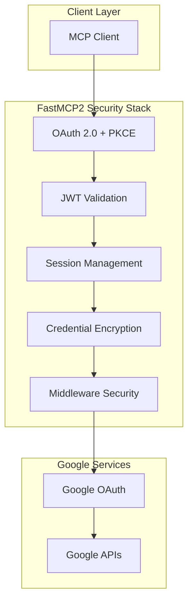
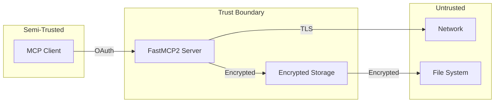

# Security Implementation Details

## Executive Summary

The FastMCP Google MCP Server implements multiple layers of security to protect user data and ensure secure authentication with Google services. This document provides detailed technical information about security implementations, threat models, and compliance considerations.

## Security Architecture Overview



## Auth Folder Architecture

### Executive Summary

The authentication system comprises **24 files** (~10,250 lines) in the `auth/` folder, organized into a hierarchical dependency structure. The audit identified:

- **15 REQUIRED files** (Tiers 1-4): Core authentication functionality
- **3 OPTIONAL files**: Security enhancement layer
- **4 HELPER files**: Utilities and type definitions
- **2 MIGRATION files**: Credential migration helpers (minimal usage)

### Complete File Inventory

| File | Lines | Purpose | Status |
|------|-------|---------|--------|
| `__init__.py` | 1 | Python package marker | ✅ Required |
| `compatibility_shim.py` | 522 | Legacy scope compatibility layer | ✅ Required |
| `context.py` | 475 | Session context management | ✅ Critical |
| `credential_bridge.py` | 420 | Credential format migration helper | ⚠️ Used in health checks |
| `dual_auth_bridge.py` | 384 | Multi-account auth bridge | ✅ Required |
| `dynamic_client_registration.py` | 274 | OAuth DCR (RFC 7591) | ✅ Required |
| `fastmcp_oauth_endpoints.py` | 1,766 | OAuth HTTP endpoints | ✅ Critical |
| `google_auth.py` | 1,078 | Core OAuth flow implementation | ✅ Critical |
| `google_oauth_auth.py` | 288 | GoogleProvider setup | ✅ Required |
| `jwt_auth.py` | 237 | JWT token authentication | ✅ Required |
| `mcp_auth_middleware.py` | 83 | MCP spec compliance middleware | ✅ Required |
| `middleware.py` | 1,261 | Core AuthMiddleware | ✅ Critical |
| `oauth_proxy.py` | 491 | OAuth credential proxy | ✅ Required |
| `pkce_utils.py` | 262 | PKCE (RFC 7636) utilities | ✅ Required |
| `scope_registry.py` | 797 | Centralized scope registry | ✅ Critical |
| `secure_middleware.py` | 315 | Security-enhanced middleware | ⚠️ Optional |
| `secure_server_integration.py` | 293 | Security integration | ⚠️ Optional |
| `security_patch.py` | 447 | Session security manager | ⚠️ Optional |
| `service_dispatcher.py` | 405 | Advanced service routing | ⚠️ Has tests |
| `service_helpers.py` | 389 | Service convenience functions | 📚 Helper |
| `service_manager.py` | 484 | Generic service builder | ✅ Critical |
| `service_types.py` | 83 | Type definitions | 📚 Helper |
| `unified_session.py` | 360 | Unified session management | ✅ Required |

**Total:** 24 files, 10,250 lines

### Dependency Tree

```
server.py (6 direct imports)
│
├─ middleware.py [TIER 1] ✅ CRITICAL
│  ├─ context.py [TIER 2]
│  ├─ service_manager.py [TIER 2]
│  │  ├─ google_auth.py [TIER 3]
│  │  │  ├─ context.py [shared]
│  │  │  ├─ pkce_utils.py [TIER 4]
│  │  │  ├─ scope_registry.py [shared]
│  │  │  └─ unified_session.py [TIER 4]
│  │  ├─ compatibility_shim.py [TIER 3]
│  │  │  └─ scope_registry.py [shared]
│  │  └─ scope_registry.py [shared]
│  └─ dual_auth_bridge.py [TIER 2]
│     ├─ context.py [shared]
│     └─ google_auth.py [shared]
│
├─ mcp_auth_middleware.py [TIER 1] ✅ REQUIRED
├─ google_oauth_auth.py [TIER 1] ✅ REQUIRED
│  ├─ compatibility_shim.py [TIER 2]
│  └─ scope_registry.py [TIER 2]
├─ jwt_auth.py [TIER 1] ✅ REQUIRED
│  └─ scope_registry.py [TIER 2]
├─ fastmcp_oauth_endpoints.py [TIER 1] ✅ CRITICAL
│  ├─ context.py [TIER 2]
│  ├─ oauth_proxy.py [TIER 2]
│  ├─ dynamic_client_registration.py [TIER 3]
│  ├─ pkce_utils.py [TIER 3]
│  ├─ google_auth.py [TIER 3]
│  └─ unified_session.py [TIER 3]
└─ context.py [TIER 1] ✅ CRITICAL

STANDALONE SECURITY LAYER:
secure_server_integration.py ⚠️ OPTIONAL
├─ secure_middleware.py
│  ├─ middleware.py [connects to main tree]
│  ├─ security_patch.py
│  └─ context.py [shared]
└─ security_patch.py
```

### File Classifications

#### ✅ Tier 1: Direct Server Imports (6 files - Critical)

**`middleware.py`** (1,261 lines) - **CRITICAL**
- Core AuthMiddleware with `CredentialStorageMode` enum
- Session management and service injection
- GoogleProvider integration
- Auto-injection of `user_google_email` parameter
- **Impact if removed:** Server cannot start, no authentication

**`context.py`** (475 lines) - **CRITICAL**
- FastMCP Context-based session management
- Service request/injection pattern
- Thread-safe session storage
- Session lifecycle management
- **Impact if removed:** No session tracking, middleware fails

**`mcp_auth_middleware.py`** (83 lines) - **REQUIRED**
- MCP specification compliance
- WWW-Authenticate header handling
- 401 response formatting
- **Impact if removed:** MCP clients cannot discover OAuth endpoints

**`google_oauth_auth.py`** (288 lines) - **REQUIRED**
- Modern GoogleProvider creation
- OAuth metadata generation
- Integration with FastMCP 2.12.0+ GoogleProvider
- **Impact if removed:** No GoogleProvider, modern auth unavailable

**`jwt_auth.py`** (237 lines) - **REQUIRED**
- JWT Bearer token authentication
- Test token generation for development
- JWKS key validation
- **Impact if removed:** No JWT auth option for development/testing

**`fastmcp_oauth_endpoints.py`** (1,766 lines) - **CRITICAL**
- OAuth discovery endpoints (`/.well-known/*`)
- Dynamic Client Registration (RFC 7591)
- OAuth callback handlers
- Token exchange implementation
- **Impact if removed:** No OAuth HTTP endpoints, MCP Inspector fails

#### ✅ Tier 2: Core Dependencies (4 files - Required)

**`service_manager.py`** (484 lines) - **CRITICAL**
- Generic Google service builder
- Service caching (30-minute TTL)
- Scope resolution and validation
- Credentials-to-service conversion
- **Impact if removed:** Cannot create Google API clients

**`dual_auth_bridge.py`** (384 lines) - **REQUIRED**
- Bridges GoogleProvider and file-based auth
- Multi-account support
- Credential format bridging
- **Impact if removed:** Cannot use multiple auth methods simultaneously

**`scope_registry.py`** (797 lines) - **CRITICAL**
- Single source of truth for Google API scopes
- Service metadata and catalog
- Scope validation and resolution
- Used by 8+ files throughout auth system
- **Impact if removed:** No scope management, all services break

**`compatibility_shim.py`** (522 lines) - **REQUIRED**
- Legacy scope format support
- Backward compatibility layer
- Scope string conversion utilities
- **Impact if removed:** Legacy code breaks, scope resolution fails

#### ✅ Tier 3: OAuth Implementation (5 files - Required)

**`google_auth.py`** (1,078 lines) - **CRITICAL**
- Core OAuth flow initiation
- OAuth callback handling
- Credential storage and refresh
- Service selection interface
- PKCE integration
- Custom OAuth client support with fallback
- Three-tier credential persistence
- **Impact if removed:** No OAuth authentication possible

**`oauth_proxy.py`** (491 lines) - **REQUIRED**
- Secure OAuth credential proxy
- Temporary client ID mapping (`mcp_*` prefixes)
- PKCE parameter storage
- Public client validation (`token_endpoint_auth_method: "none"`)
- **Impact if removed:** MCP Inspector OAuth fails, credentials exposed

**`pkce_utils.py`** (262 lines) - **REQUIRED**
- PKCE code verifier/challenge generation
- PKCE session management
- SHA256 hashing for code challenges
- **Impact if removed:** No PKCE support, less secure OAuth flows

**`dynamic_client_registration.py`** (274 lines) - **REQUIRED**
- RFC 7591 Dynamic Client Registration
- MCP Inspector integration
- Temporary credential generation
- **Impact if removed:** MCP Inspector Quick OAuth fails

**`unified_session.py`** (360 lines) - **REQUIRED**
- Unified session management
- Legacy credential support
- Custom OAuth credential storage in metadata
- Session persistence across server restarts
- **Impact if removed:** OAuth callbacks fail, no session persistence

#### ⚠️ Optional: Security Enhancement Layer (3 files)

**`security_patch.py`** (447 lines) - **RECOMMENDED**
- Session isolation and security manager
- Connection fingerprinting
- Audit logging infrastructure
- Authentication token requirements
- **Use case:** Production multi-tenant deployments
- **Impact if removed:** Reduced security isolation

**`secure_middleware.py`** (315 lines) - **RECOMMENDED**
- Security-enhanced AuthMiddleware
- Session token validation
- Additional security checks
- **Use case:** High-security production environments
- **Impact if removed:** Optional security layer unavailable

**`secure_server_integration.py`** (293 lines) - **RECOMMENDED**
- Security integration helper
- Emergency security patches
- Security toolkit functions
- **Use case:** Security incident response
- **Impact if removed:** Security toolkit unavailable

#### 📚 Helper/Utility Files (4 files)

**`service_helpers.py`** (389 lines) - **UTILITY**
- Convenience wrappers (`get_drive_service`, `get_gmail_service`, etc.)
- Multi-service session creation
- Simplified service access patterns
- **Used by:** Various service tools for convenience
- **Impact if removed:** Tools need to use service_manager directly

**`service_types.py`** (83 lines) - **UTILITY**
- Type definitions for IDE support
- Literal types for service names, auth methods
- Type hints for better development experience
- **Impact if removed:** Loss of type safety, no runtime impact

**`credential_bridge.py`** (420 lines) - **MIGRATION HELPER**
- Credential format migration (legacy ↔ FastMCP ↔ unified)
- Used by `tools/server_tools.py` for health checks
- Only active when `CREDENTIAL_MIGRATION=true`
- **Impact if removed:** Health check fails when migration enabled

**`service_dispatcher.py`** (405 lines) - **ADVANCED ROUTING**
- Advanced service routing with confidence scoring
- Has test coverage in `tests/test_routing_improvements.py`
- Uses external dependencies (may exist in middleware/resources)
- **Impact if removed:** Test failures in routing improvements

### Architecture Insights

#### Critical Path
The authentication system has a clear critical path from `server.py` through 6 direct imports, which cascade through 9 additional required files. The deepest dependency is **Tier 4** (4 levels deep from server.py).

#### Shared Components
Three files are heavily shared across the dependency tree:
1. **`scope_registry.py`** - Used by 8+ files as single source of truth
2. **`context.py`** - Session management used by 5+ files
3. **`google_auth.py`** - Core OAuth used by 4+ files

#### Security Layers
The architecture implements defense-in-depth with three distinct security layers:
1. **Core Security** (Tier 1-3): OAuth, PKCE, JWT, session management
2. **Enhanced Security** (Optional): Session isolation, audit logging, fingerprinting
3. **Helper Security** (Utilities): Convenience wrappers with security best practices

#### Storage Strategies
The `auth_method` parameter enables three storage strategies:
- `file_credentials`: Legacy plaintext file storage
- `pkce_file`: PKCE with encrypted file storage (production default)
- `pkce_memory`: PKCE with session-only storage (high security, ephemeral)

## 1. Authentication Security

### 1.1 OAuth 2.0 with PKCE Implementation

The platform implements OAuth 2.0 with Proof Key for Code Exchange (PKCE) to prevent authorization code interception attacks. The system supports both **confidential clients** (with client_secret) and **public clients** (PKCE-only without client_secret).

#### Implementation Details

```python
# auth/google_auth.py - Enhanced PKCE with Public Client Support
async def initiate_oauth_flow(
    user_email: str,
    use_pkce: bool = True,
    auth_method: Literal['file_credentials', 'pkce_file', 'pkce_memory'] = 'pkce_file',
    custom_client_id: Optional[str] = None,
    custom_client_secret: Optional[str] = None
) -> str:
    """
    Initiate OAuth flow with PKCE and custom client support.
    
    - Supports public clients (PKCE without client_secret)
    - Allows custom OAuth credentials with fallback
    - Multiple credential storage strategies
    """
    # Generate PKCE parameters
    if use_pkce:
        pkce_data = pkce_manager.create_pkce_session(state)
        pkce_params.update(pkce_data)
    
    # Handle custom vs default credentials with fallback
    if custom_client_id:
        final_client_secret = custom_client_secret or default_config.get('client_secret', '')
        # Public clients can omit client_secret when using PKCE
```

#### Security Properties
- **Code Verifier**: 43-128 character cryptographically random string (via `pkce_utils.py`)
- **Code Challenge**: SHA256(code_verifier)
- **Challenge Method**: S256 (SHA256)
- **State Parameter**: Cryptographically secure random value to prevent CSRF
- **Public Client Support**: PKCE flows can operate without client_secret for public applications
- **Custom Client Fallback**: Automatic fallback to default credentials when custom ones aren't complete

### 1.2 JWT Token Validation

All incoming requests are validated using JWT tokens signed by Google.

#### Validation Steps

1. **Token Extraction**: Bearer token from Authorization header
2. **Signature Verification**: Using Google's public keys from JWKS endpoint
3. **Claims Validation**:
   - `iss`: Must be `https://accounts.google.com`
   - `aud`: Must match our OAuth client ID
   - `exp`: Token must not be expired
   - `email_verified`: Must be true
4. **Scope Verification**: Required scopes for requested operation

#### JWKS Key Rotation

```python
# auth/jwt_auth.py
class JWTValidator:
    JWKS_URL = "https://www.googleapis.com/oauth2/v3/certs"
    CACHE_TTL = 3600  # 1 hour cache
    
    async def get_public_keys(self):
        """Fetch and cache Google's public keys"""
        if self._keys_expired():
            keys = await self._fetch_jwks()
            self._cache_keys(keys)
        return self._cached_keys
```

### 1.3 Session Management

Sessions are managed with strict security controls through the **UnifiedSession** architecture:

#### Session Properties
- **Session ID**: 256-bit cryptographically secure random
- **Timeout**: 1 hour idle, 24 hours absolute
- **Storage**: Multiple strategies (file, encrypted file, memory-only)
- **Isolation**: Complete session isolation between users
- **Persistence**: Context-based storage with fallback mechanisms

```python
# auth/unified_session.py
class UnifiedSession:
    """Unified session management with robust credential persistence."""
    
    def store_custom_oauth_credentials(self, state: str, custom_client_id: str,
                                     custom_client_secret: str = None,
                                     auth_method: str = None) -> None:
        """Store custom OAuth credentials in session metadata."""
        self._session_state.metadata[f"oauth_state_{state}"] = {
            "custom_client_id": custom_client_id,
            "custom_client_secret": custom_client_secret,
            "auth_method": auth_method,
            "stored_at": datetime.now(UTC).isoformat()
        }
    
    def retrieve_custom_oauth_credentials(self, state: str) -> tuple:
        """Retrieve custom OAuth credentials with fallback support."""
        oauth_creds = self._session_state.metadata.get(f"oauth_state_{state}")
        return (
            oauth_creds.get("custom_client_id"),
            oauth_creds.get("custom_client_secret"),
            oauth_creds.get("auth_method")
        )
```

#### Enhanced Credential Persistence
```python
# auth/google_auth.py - Multi-level fallback
async def handle_oauth_callback(authorization_response: str, state: str):
    """OAuth callback with robust credential retrieval."""
    
    # Primary: State map
    state_info = _oauth_state_map.pop(state, None)
    
    # Fallback 1: UnifiedSession metadata
    if not custom_client_id:
        unified_session = UnifiedSession()
        fallback_client_id, fallback_client_secret, _ = \
            unified_session.retrieve_custom_oauth_credentials(state)
        custom_client_id = fallback_client_id or custom_client_id
    
    # Fallback 2: Context storage
    if not custom_client_id:
        session_id = get_session_context()
        fallback_client_id = get_session_data(session_id, f"custom_client_id_{state}")
```

## 2. Credential Storage Security

### 2.1 Storage Modes

The platform supports multiple credential storage modes with different security levels, managed through the **auth_method** parameter:

| Mode | Auth Method | Encryption | Persistence | Security Level | Use Case |
|------|-------------|------------|-------------|----------------|----------|
| `FILE_PLAINTEXT` | `file_credentials` | No | Yes | Low | Development only |
| `FILE_ENCRYPTED` | `pkce_file` | AES-256-GCM | Yes | High | Production (default) |
| `MEMORY_ONLY` | `pkce_memory` | N/A | No | Highest | High-security/ephemeral |

#### Storage Strategy Selection
```python
# auth/google_auth.py - Auth method determines storage
async def initiate_oauth_flow(
    auth_method: Literal['file_credentials', 'pkce_file', 'pkce_memory'] = 'pkce_file'
):
    """
    - file_credentials: Legacy plaintext file storage
    - pkce_file: PKCE with encrypted file storage (recommended)
    - pkce_memory: PKCE with session-only storage (no persistence)
    """
```

### 2.2 Encryption Implementation

#### AES-256-GCM Encryption

```python
# auth/encryption.py
class CredentialEncryption:
    def __init__(self):
        self.key = self._derive_key()
        
    def _derive_key(self) -> bytes:
        """Derive encryption key from machine-specific data"""
        machine_id = self._get_machine_id()
        salt = b'fastmcp2_salt_v1'
        kdf = PBKDF2HMAC(
            algorithm=hashes.SHA256(),
            length=32,
            salt=salt,
            iterations=100000,
        )
        return kdf.derive(machine_id.encode())
    
    def encrypt(self, data: bytes) -> bytes:
        """Encrypt data using AES-256-GCM"""
        iv = os.urandom(12)
        encryptor = Cipher(
            algorithms.AES(self.key),
            modes.GCM(iv),
        ).encryptor()
        ciphertext = encryptor.update(data) + encryptor.finalize()
        return iv + encryptor.tag + ciphertext
```

#### Key Management
- **Key Derivation**: PBKDF2-HMAC-SHA256 with 100,000 iterations
- **Key Storage**: Never stored, derived on-demand
- **Machine Binding**: Keys tied to machine-specific identifiers
- **Key Rotation**: Automatic on security events

### 2.3 Secure Credential Storage

```python
# File structure for encrypted credentials
{
    "version": "1.0",
    "encrypted": true,
    "algorithm": "AES-256-GCM",
    "data": "base64_encoded_ciphertext",
    "iv": "base64_encoded_iv",
    "tag": "base64_encoded_auth_tag",
    "timestamp": "2024-01-15T10:30:00Z"
}
```

## 3. Middleware Security

### 3.1 AuthMiddleware Security Features

The AuthMiddleware implements multiple security layers:

1. **Request Validation**
   - CORS validation
   - Rate limiting
   - Input sanitization

2. **Token Injection**
   - Automatic token refresh
   - Secure token passing to services
   - Token scope limitation

3. **Error Handling**
   - No credential leakage in errors
   - Secure logging (no tokens/passwords)
   - Timing attack prevention

### 3.2 MCPAuthMiddleware

Implements MCP specification compliant authentication:

```python
# auth/mcp_auth_middleware.py
class MCPAuthMiddleware:
    async def handle_unauthorized(self):
        return JSONResponse(
            status_code=401,
            headers={
                "WWW-Authenticate": 'Bearer realm="FastMCP2", charset="UTF-8"',
                "X-OAuth-Scopes": "drive.file gmail.send",
                "X-OAuth-Authorization-Server": f"{BASE_URL}/.well-known/oauth"
            }
        )
```

## 4. API Security

### 4.1 Input Validation

All tool inputs are validated:

```python
# Common validation patterns
class InputValidator:
    @staticmethod
    def validate_email(email: str) -> bool:
        pattern = r'^[a-zA-Z0-9._%+-]+@[a-zA-Z0-9.-]+\.[a-zA-Z]{2,}$'
        return re.match(pattern, email) is not None
    
    @staticmethod
    def validate_file_id(file_id: str) -> bool:
        # Google Drive file IDs are alphanumeric
        return re.match(r'^[a-zA-Z0-9_-]+$', file_id) is not None
    
    @staticmethod
    def sanitize_path(path: str) -> str:
        # Prevent path traversal
        return os.path.basename(path)
```

### 4.2 Rate Limiting

Implements multiple rate limiting strategies:

```python
# middleware/rate_limiter.py
class RateLimiter:
    limits = {
        'global': {'requests': 10000, 'window': 3600},
        'per_user': {'requests': 1000, 'window': 3600},
        'per_tool': {'requests': 100, 'window': 60}
    }
```

### 4.3 CORS Configuration

```python
# config/security.py
CORS_CONFIG = {
    'allow_origins': ['https://localhost:*'],
    'allow_methods': ['GET', 'POST'],
    'allow_headers': ['Authorization', 'Content-Type'],
    'expose_headers': ['X-OAuth-Scopes'],
    'max_age': 3600
}
```

## 5. Data Security

### 5.1 Data Classification

| Data Type | Classification | Encryption | Storage |
|-----------|---------------|------------|---------|
| OAuth Tokens | Highly Sensitive | Always | Encrypted file or memory |
| Refresh Tokens | Highly Sensitive | Always | Encrypted file or memory |
| User Emails | Sensitive | In transit | Hashed in logs |
| File Content | User Data | In transit | Not stored |
| Metadata | Internal | No | Temporary cache |

### 5.2 Data Handling Policies

1. **No Persistent User Data**: File contents are never stored
2. **Token Lifecycle**: Automatic cleanup on expiry
3. **Memory Cleanup**: Explicit zeroing of sensitive data
4. **Secure Deletion**: Multi-pass overwrite for file deletion

## 6. Network Security

### 6.1 TLS/SSL Configuration

```python
# config/settings.py
SSL_CONFIG = {
    'ssl_version': ssl.PROTOCOL_TLS_SERVER,
    'cert_reqs': ssl.CERT_REQUIRED,
    'ciphers': 'HIGH:!aNULL:!eNULL:!EXPORT:!DES:!MD5:!PSK:!RC4',
    'options': ssl.OP_NO_SSLv2 | ssl.OP_NO_SSLv3 | ssl.OP_NO_TLSv1
}
```

### 6.2 Certificate Validation

- **Google APIs**: Certificate pinning for accounts.google.com
- **Internal**: Optional mTLS for service-to-service
- **Client**: Strict certificate validation

## 7. Threat Model

### 7.1 Identified Threats

| Threat | Impact | Mitigation |
|--------|--------|------------|
| Token Theft | High | Short-lived tokens, secure storage |
| MITM Attack | High | TLS 1.2+, certificate pinning |
| Session Hijacking | High | Secure session IDs, timeout |
| Credential Leak | Critical | Encryption at rest, memory protection |
| CSRF | Medium | State parameter, PKCE |
| XSS | Medium | Input sanitization, CSP headers |

### 7.2 Security Boundaries



## 8. Compliance Considerations

### 8.1 OAuth 2.0 Compliance

- ✅ RFC 6749 (OAuth 2.0 Core)
- ✅ RFC 7636 (PKCE)
- ✅ RFC 8252 (OAuth for Native Apps)
- ✅ RFC 6819 (OAuth Security)
- ✅ RFC 7591 (Dynamic Client Registration)

### 8.2 Google OAuth Policies

- ✅ Restricted scope usage
- ✅ Incremental authorization
- ✅ Secure redirect URIs
- ✅ User consent preservation

### 8.3 Data Protection

- **Data Minimization**: Only required data collected
- **Purpose Limitation**: Data used only for stated purpose
- **Data Deletion**: User can revoke and delete credentials
- **Transparency**: Clear data handling documentation

## 9. Security Audit Checklist

### 9.1 Authentication
- [x] OAuth flow uses PKCE
- [x] State parameter validated
- [x] Tokens expire appropriately
- [x] Refresh tokens rotated
- [x] JWT signature verified
- [x] JWKS keys cached securely
- [x] Public client support implemented
- [x] Custom OAuth client fallback working

### 9.2 Authorization
- [x] Scope enforcement per tool
- [x] User isolation enforced
- [x] Admin operations restricted
- [x] File access validated

### 9.3 Cryptography
- [x] Strong algorithms (AES-256-GCM)
- [x] Secure random generation
- [x] Key derivation (PBKDF2)
- [x] No hardcoded secrets
- [x] Proper IV/nonce handling

### 9.4 Session Management
- [x] Session timeout configured
- [x] Session invalidation on logout
- [x] Session fixation prevention
- [x] Concurrent session limits
- [x] Three-tier credential persistence

### 9.5 Error Handling
- [x] No stack traces to users
- [x] No credential leakage
- [x] Secure error logging
- [x] Rate limit error responses

## 10. Security Configuration

### 10.1 Environment Variables

```bash
# Required Security Settings
CREDENTIAL_STORAGE_MODE=FILE_ENCRYPTED  # Production setting
SESSION_TIMEOUT_MINUTES=60
MAX_SESSION_LIFETIME_HOURS=24
ENABLE_HTTPS=true
SSL_CERT_FILE=/path/to/cert.pem
SSL_KEY_FILE=/path/to/key.pem

# OAuth Configuration
GOOGLE_CLIENT_ID=your-client-id
GOOGLE_CLIENT_SECRET=your-client-secret
OAUTH_REDIRECT_URI=https://localhost:6339/oauth/callback

# Security Headers
ENABLE_SECURITY_HEADERS=true
CSP_POLICY="default-src 'self'"
HSTS_MAX_AGE=31536000

# Optional Security Layer
ENABLE_SECURE_MIDDLEWARE=false  # Enable for high-security deployments
CREDENTIAL_MIGRATION=false      # Enable for credential migration tracking
```

### 10.2 Security Best Practices

1. **Regular Updates**: Keep all dependencies updated
2. **Security Scanning**: Regular vulnerability scans
3. **Penetration Testing**: Annual security audits
4. **Incident Response**: Defined security incident process
5. **Security Training**: Developer security awareness
6. **Auth File Audit**: Periodic review of auth folder dependencies

## 11. Incident Response

### 11.1 Security Incident Types

1. **Credential Compromise**: Immediate token revocation
2. **Data Breach**: User notification within 72 hours
3. **Service Compromise**: Immediate service isolation
4. **Vulnerability Discovery**: Patch within SLA

### 11.2 Response Procedures

```python
# Emergency credential revocation
async def emergency_revoke_all():
    """Revoke all credentials in case of breach"""
    await auth_middleware.revoke_all_sessions()
    await credential_manager.delete_all_stored()
    await google_oauth.revoke_all_tokens()
    logger.critical("SECURITY: All credentials revoked")
```

## 12. Security Monitoring

### 12.1 Metrics Tracked

- Failed authentication attempts
- Unusual API usage patterns
- Token refresh failures
- Session anomalies
- Encryption/decryption errors
- Auth file dependency changes

### 12.2 Alerting Thresholds

```yaml
alerts:
  - name: high_auth_failures
    condition: auth_failures > 10 per minute
    severity: high
    
  - name: token_refresh_failures
    condition: refresh_failures > 5 per user per hour
    severity: medium
    
  - name: suspicious_activity
    condition: unusual_api_pattern detected
    severity: critical
    
  - name: auth_dependency_change
    condition: critical auth file modified
    severity: medium
```

## Conclusion

The FastMCP Google MCP Server implements defense-in-depth security with multiple layers of protection across 24 authentication files organized in a hierarchical architecture. The system provides:

- **Production-ready OAuth 2.0/2.1 + PKCE** with public and confidential client support
- **Three-tier credential persistence** ensuring reliability across server restarts
- **Flexible storage strategies** from development to high-security deployments
- **Optional security enhancement layer** for multi-tenant environments
- **Comprehensive audit trail** of all authentication components

Regular security audits, updates, and monitoring ensure ongoing security posture maintenance.

For security concerns or vulnerability reports, please contact the security team immediately.

---

**Document Version**: 2.0.0  
**Last Updated**: 2024-12-30  
**Classification**: Internal - Security Documentation  
**Auth Folder Audit**: Complete (24 files, 10,250 lines)