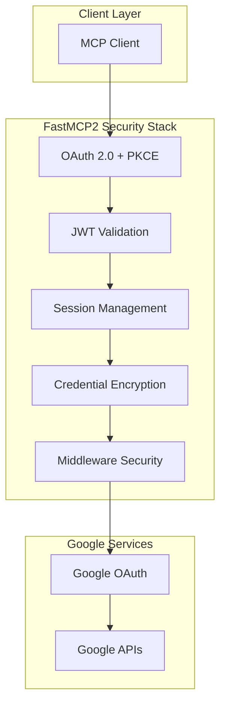
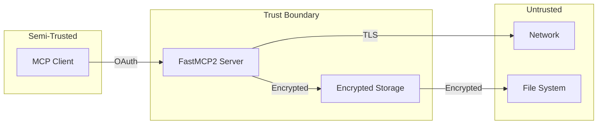

# Security Implementation Details

## Executive Summary

The Groupon Google MCP Server implements multiple layers of security to protect user data and ensure secure authentication with Google services. This document provides detailed technical information about security implementations, threat models, and compliance considerations.

## Security Architecture Overview



## 1. Authentication Security

### 1.1 OAuth 2.0 with PKCE Implementation

The platform implements OAuth 2.0 with Proof Key for Code Exchange (PKCE) to prevent authorization code interception attacks.

#### Implementation Details

```python
# auth/google_auth.py
class GoogleOAuthHandler:
    def __init__(self):
        self.code_verifier = self._generate_code_verifier()
        self.code_challenge = self._generate_code_challenge(self.code_verifier)
    
    def _generate_code_verifier(self) -> str:
        """Generate cryptographically secure random code verifier"""
        return base64.urlsafe_b64encode(os.urandom(32)).decode('utf-8').rstrip('=')
    
    def _generate_code_challenge(self, verifier: str) -> str:
        """Generate SHA256 hash of code verifier"""
        digest = hashlib.sha256(verifier.encode('utf-8')).digest()
        return base64.urlsafe_b64encode(digest).decode('utf-8').rstrip('=')
```

#### Security Properties
- **Code Verifier**: 43-128 character cryptographically random string
- **Code Challenge**: SHA256(code_verifier) 
- **Challenge Method**: S256 (SHA256)
- **State Parameter**: Cryptographically secure random value to prevent CSRF

### 1.2 JWT Token Validation

All incoming requests are validated using JWT tokens signed by Google.

#### Validation Steps

1. **Token Extraction**: Bearer token from Authorization header
2. **Signature Verification**: Using Google's public keys from JWKS endpoint
3. **Claims Validation**:
   - `iss`: Must be `https://accounts.google.com`
   - `aud`: Must match our OAuth client ID
   - `exp`: Token must not be expired
   - `email_verified`: Must be true
4. **Scope Verification**: Required scopes for requested operation

#### JWKS Key Rotation

```python
# auth/jwt_auth.py
class JWTValidator:
    JWKS_URL = "https://www.googleapis.com/oauth2/v3/certs"
    CACHE_TTL = 3600  # 1 hour cache
    
    async def get_public_keys(self):
        """Fetch and cache Google's public keys"""
        if self._keys_expired():
            keys = await self._fetch_jwks()
            self._cache_keys(keys)
        return self._cached_keys
```

### 1.3 Session Management

Sessions are managed with strict security controls:

#### Session Properties
- **Session ID**: 256-bit cryptographically secure random
- **Timeout**: 1 hour idle, 24 hours absolute
- **Storage**: In-memory with optional encrypted persistence
- **Isolation**: Complete session isolation between users

```python
# auth/middleware.py
class SessionManager:
    def create_session(self, user_email: str) -> str:
        session_id = secrets.token_urlsafe(32)
        self.sessions[session_id] = {
            'user': user_email,
            'created': datetime.utcnow(),
            'last_access': datetime.utcnow(),
            'credentials': None  # Encrypted separately
        }
        return session_id
```

## 2. Credential Storage Security

### 2.1 Storage Modes

The platform supports multiple credential storage modes with different security levels:

| Mode | Encryption | Persistence | Security Level | Use Case |
|------|------------|-------------|----------------|----------|
| `FILE_PLAINTEXT` | No | Yes | Low | Development only |
| `FILE_ENCRYPTED` | AES-256-GCM | Yes | High | Production |
| `MEMORY_ONLY` | N/A | No | Highest | High-security environments |
| `MEMORY_WITH_BACKUP` | AES-256-GCM | Yes | High | Balance of security and UX |

### 2.2 Encryption Implementation

#### AES-256-GCM Encryption

```python
# auth/encryption.py
class CredentialEncryption:
    def __init__(self):
        self.key = self._derive_key()
        
    def _derive_key(self) -> bytes:
        """Derive encryption key from machine-specific data"""
        machine_id = self._get_machine_id()
        salt = b'fastmcp2_salt_v1'
        kdf = PBKDF2HMAC(
            algorithm=hashes.SHA256(),
            length=32,
            salt=salt,
            iterations=100000,
        )
        return kdf.derive(machine_id.encode())
    
    def encrypt(self, data: bytes) -> bytes:
        """Encrypt data using AES-256-GCM"""
        iv = os.urandom(12)
        encryptor = Cipher(
            algorithms.AES(self.key),
            modes.GCM(iv),
        ).encryptor()
        ciphertext = encryptor.update(data) + encryptor.finalize()
        return iv + encryptor.tag + ciphertext
```

#### Key Management
- **Key Derivation**: PBKDF2-HMAC-SHA256 with 100,000 iterations
- **Key Storage**: Never stored, derived on-demand
- **Machine Binding**: Keys tied to machine-specific identifiers
- **Key Rotation**: Automatic on security events

### 2.3 Secure Credential Storage

```python
# File structure for encrypted credentials
{
    "version": "1.0",
    "encrypted": true,
    "algorithm": "AES-256-GCM",
    "data": "base64_encoded_ciphertext",
    "iv": "base64_encoded_iv",
    "tag": "base64_encoded_auth_tag",
    "timestamp": "2024-01-15T10:30:00Z"
}
```

## 3. Middleware Security

### 3.1 AuthMiddleware Security Features

The AuthMiddleware implements multiple security layers:

1. **Request Validation**
   - CORS validation
   - Rate limiting
   - Input sanitization

2. **Token Injection**
   - Automatic token refresh
   - Secure token passing to services
   - Token scope limitation

3. **Error Handling**
   - No credential leakage in errors
   - Secure logging (no tokens/passwords)
   - Timing attack prevention

### 3.2 MCPAuthMiddleware

Implements MCP specification compliant authentication:

```python
# auth/mcp_auth_middleware.py
class MCPAuthMiddleware:
    async def handle_unauthorized(self):
        return JSONResponse(
            status_code=401,
            headers={
                "WWW-Authenticate": 'Bearer realm="FastMCP2", charset="UTF-8"',
                "X-OAuth-Scopes": "drive.file gmail.send",
                "X-OAuth-Authorization-Server": f"{BASE_URL}/.well-known/oauth"
            }
        )
```

## 4. API Security

### 4.1 Input Validation

All tool inputs are validated:

```python
# Common validation patterns
class InputValidator:
    @staticmethod
    def validate_email(email: str) -> bool:
        pattern = r'^[a-zA-Z0-9._%+-]+@[a-zA-Z0-9.-]+\.[a-zA-Z]{2,}$'
        return re.match(pattern, email) is not None
    
    @staticmethod
    def validate_file_id(file_id: str) -> bool:
        # Google Drive file IDs are alphanumeric
        return re.match(r'^[a-zA-Z0-9_-]+$', file_id) is not None
    
    @staticmethod
    def sanitize_path(path: str) -> str:
        # Prevent path traversal
        return os.path.basename(path)
```

### 4.2 Rate Limiting

Implements multiple rate limiting strategies:

```python
# middleware/rate_limiter.py
class RateLimiter:
    limits = {
        'global': {'requests': 10000, 'window': 3600},
        'per_user': {'requests': 1000, 'window': 3600},
        'per_tool': {'requests': 100, 'window': 60}
    }
```

### 4.3 CORS Configuration

```python
# config/security.py
CORS_CONFIG = {
    'allow_origins': ['https://localhost:*'],
    'allow_methods': ['GET', 'POST'],
    'allow_headers': ['Authorization', 'Content-Type'],
    'expose_headers': ['X-OAuth-Scopes'],
    'max_age': 3600
}
```

## 5. Data Security

### 5.1 Data Classification

| Data Type | Classification | Encryption | Storage |
|-----------|---------------|------------|---------|
| OAuth Tokens | Highly Sensitive | Always | Encrypted file or memory |
| Refresh Tokens | Highly Sensitive | Always | Encrypted file or memory |
| User Emails | Sensitive | In transit | Hashed in logs |
| File Content | User Data | In transit | Not stored |
| Metadata | Internal | No | Temporary cache |

### 5.2 Data Handling Policies

1. **No Persistent User Data**: File contents are never stored
2. **Token Lifecycle**: Automatic cleanup on expiry
3. **Memory Cleanup**: Explicit zeroing of sensitive data
4. **Secure Deletion**: Multi-pass overwrite for file deletion

## 6. Network Security

### 6.1 TLS/SSL Configuration

```python
# config/settings.py
SSL_CONFIG = {
    'ssl_version': ssl.PROTOCOL_TLS_SERVER,
    'cert_reqs': ssl.CERT_REQUIRED,
    'ciphers': 'HIGH:!aNULL:!eNULL:!EXPORT:!DES:!MD5:!PSK:!RC4',
    'options': ssl.OP_NO_SSLv2 | ssl.OP_NO_SSLv3 | ssl.OP_NO_TLSv1
}
```

### 6.2 Certificate Validation

- **Google APIs**: Certificate pinning for accounts.google.com
- **Internal**: Optional mTLS for service-to-service
- **Client**: Strict certificate validation

## 7. Threat Model

### 7.1 Identified Threats

| Threat | Impact | Mitigation |
|--------|--------|------------|
| Token Theft | High | Short-lived tokens, secure storage |
| MITM Attack | High | TLS 1.2+, certificate pinning |
| Session Hijacking | High | Secure session IDs, timeout |
| Credential Leak | Critical | Encryption at rest, memory protection |
| CSRF | Medium | State parameter, PKCE |
| XSS | Medium | Input sanitization, CSP headers |

### 7.2 Security Boundaries



## 8. Compliance Considerations

### 8.1 OAuth 2.0 Compliance

- ✅ RFC 6749 (OAuth 2.0 Core)
- ✅ RFC 7636 (PKCE)
- ✅ RFC 8252 (OAuth for Native Apps)
- ✅ RFC 6819 (OAuth Security)

### 8.2 Google OAuth Policies

- ✅ Restricted scope usage
- ✅ Incremental authorization
- ✅ Secure redirect URIs
- ✅ User consent preservation

### 8.3 Data Protection

- **Data Minimization**: Only required data collected
- **Purpose Limitation**: Data used only for stated purpose
- **Data Deletion**: User can revoke and delete credentials
- **Transparency**: Clear data handling documentation

## 9. Security Audit Checklist

### 9.1 Authentication
- [ ] OAuth flow uses PKCE
- [ ] State parameter validated
- [ ] Tokens expire appropriately
- [ ] Refresh tokens rotated
- [ ] JWT signature verified
- [ ] JWKS keys cached securely

### 9.2 Authorization
- [ ] Scope enforcement per tool
- [ ] User isolation enforced
- [ ] Admin operations restricted
- [ ] File access validated

### 9.3 Cryptography
- [ ] Strong algorithms (AES-256-GCM)
- [ ] Secure random generation
- [ ] Key derivation (PBKDF2)
- [ ] No hardcoded secrets
- [ ] Proper IV/nonce handling

### 9.4 Session Management
- [ ] Session timeout configured
- [ ] Session invalidation on logout
- [ ] Session fixation prevention
- [ ] Concurrent session limits

### 9.5 Error Handling
- [ ] No stack traces to users
- [ ] No credential leakage
- [ ] Secure error logging
- [ ] Rate limit error responses

## 10. Security Configuration

### 10.1 Environment Variables

```bash
# Required Security Settings
CREDENTIAL_STORAGE_MODE=FILE_ENCRYPTED  # Production setting
SESSION_TIMEOUT_MINUTES=60
MAX_SESSION_LIFETIME_HOURS=24
ENABLE_HTTPS=true
SSL_CERT_FILE=/path/to/cert.pem
SSL_KEY_FILE=/path/to/key.pem

# OAuth Configuration
GOOGLE_CLIENT_ID=your-client-id
GOOGLE_CLIENT_SECRET=your-client-secret
OAUTH_REDIRECT_URI=https://localhost:6339/oauth/callback

# Security Headers
ENABLE_SECURITY_HEADERS=true
CSP_POLICY="default-src 'self'"
HSTS_MAX_AGE=31536000
```

### 10.2 Security Best Practices

1. **Regular Updates**: Keep all dependencies updated
2. **Security Scanning**: Regular vulnerability scans
3. **Penetration Testing**: Annual security audits
4. **Incident Response**: Defined security incident process
5. **Security Training**: Developer security awareness

## 11. Incident Response

### 11.1 Security Incident Types

1. **Credential Compromise**: Immediate token revocation
2. **Data Breach**: User notification within 72 hours
3. **Service Compromise**: Immediate service isolation
4. **Vulnerability Discovery**: Patch within SLA

### 11.2 Response Procedures

```python
# Emergency credential revocation
async def emergency_revoke_all():
    """Revoke all credentials in case of breach"""
    await auth_middleware.revoke_all_sessions()
    await credential_manager.delete_all_stored()
    await google_oauth.revoke_all_tokens()
    logger.critical("SECURITY: All credentials revoked")
```

## 12. Security Monitoring

### 12.1 Metrics Tracked

- Failed authentication attempts
- Unusual API usage patterns
- Token refresh failures
- Session anomalies
- Encryption/decryption errors

### 12.2 Alerting Thresholds

```yaml
alerts:
  - name: high_auth_failures
    condition: auth_failures > 10 per minute
    severity: high
    
  - name: token_refresh_failures
    condition: refresh_failures > 5 per user per hour
    severity: medium
    
  - name: suspicious_activity
    condition: unusual_api_pattern detected
    severity: critical
```

## Conclusion

The Groupon Google MCP Server implements defense-in-depth security with multiple layers of protection. Regular security audits, updates, and monitoring ensure ongoing security posture maintenance.

For security concerns or vulnerability reports, please contact the security team immediately.

---

**Document Version**: 1.0.0  
**Last Updated**: 2024-01-15  
**Classification**: Internal - Security Documentation