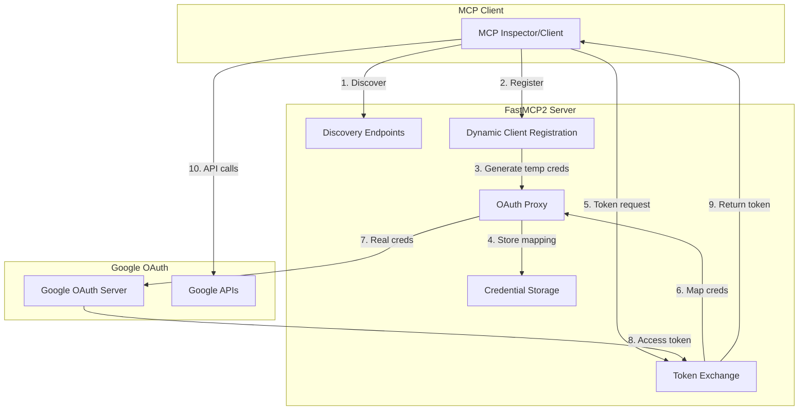
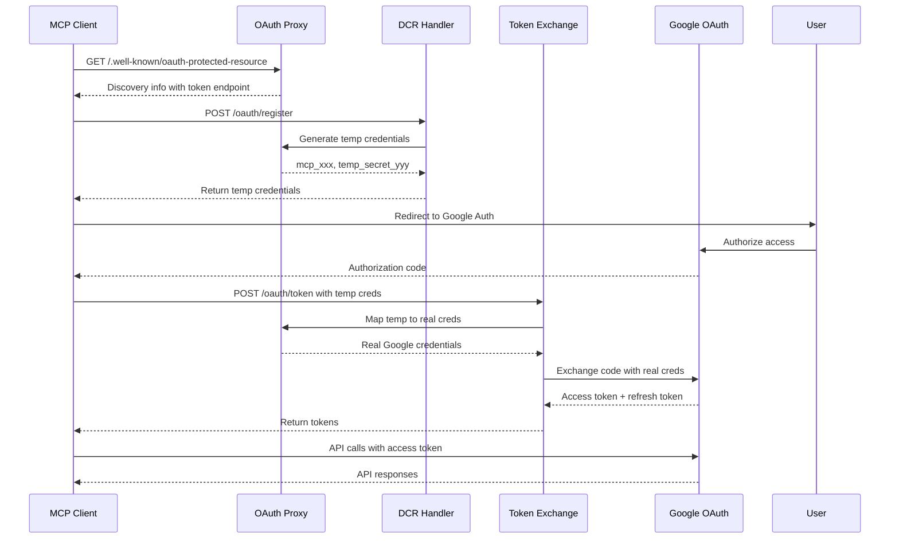
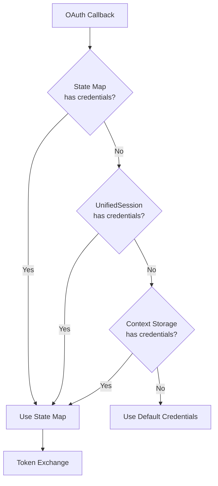

# FastMCP2 OAuth Authentication Guide

## Table of Contents
1. [Architecture Overview](#architecture-overview)
2. [Authentication Flow](#authentication-flow)
3. [OAuth Proxy Details](#oauth-proxy-details)
4. [Configuration Guide](#configuration-guide)
5. [API Reference](#api-reference)
6. [Security Best Practices](#security-best-practices)
7. [Troubleshooting](#troubleshooting)
8. [Migration Guide](#migration-guide)

---

## Architecture Overview

### Why OAuth Proxy?

The OAuth Proxy is a critical component that bridges the gap between two incompatible OAuth approaches:

1. **MCP's Expectation**: The Model Context Protocol (MCP) specification requires Dynamic Client Registration (DCR) where clients can register themselves dynamically and receive unique OAuth credentials.

2. **Google's Reality**: Google OAuth doesn't support true DCR. Instead, it uses fixed OAuth credentials that must be pre-registered through the Google Cloud Console.

### The Solution: OAuth Proxy

The OAuth Proxy acts as an intermediary layer that:
- **Generates temporary credentials** (prefixed with `mcp_`) for each MCP client
- **Maps temporary credentials to real Google OAuth credentials** internally
- **Never exposes real Google credentials** to external clients
- **Handles token exchange** transparently
- **Provides DCR-compliant endpoints** while using fixed Google credentials behind the scenes

### Security Benefits

1. **Credential Isolation**: Real Google OAuth credentials are never exposed to MCP clients
2. **Audit Trail**: Each MCP client gets unique temporary credentials for tracking
3. **Revocation Control**: Individual client access can be revoked without affecting others
4. **Automatic Cleanup**: Expired proxy clients are automatically removed

### Architecture Diagram



---

## Authentication Flow

### Step-by-Step Process

#### 1. Discovery Phase
The MCP client discovers OAuth endpoints by querying well-known URIs.

```http
GET /.well-known/oauth-protected-resource
```

**Response:**
```json
{
  "oauth_authorization_server": "http://localhost:8002/.well-known/oauth-authorization-server",
  "scopes_supported": ["drive.file", "gmail.send", "calendar.events"],
  "bearer_methods_supported": ["header", "body", "query"]
}
```

#### 2. Authorization Server Discovery
The client fetches the authorization server configuration.

```http
GET /.well-known/oauth-authorization-server
```

**Response:**
```json
{
  "issuer": "http://localhost:8002",
  "authorization_endpoint": "https://accounts.google.com/o/oauth2/v2/auth",
  "token_endpoint": "http://localhost:8002/oauth/token",
  "registration_endpoint": "http://localhost:8002/oauth/register",
  "scopes_supported": ["drive.file", "gmail.send", "calendar.events", "..."],
  "response_types_supported": ["code"],
  "grant_types_supported": ["authorization_code", "refresh_token"]
}
```

#### 3. Dynamic Client Registration
The client registers itself and receives temporary credentials. **Public clients** can specify `token_endpoint_auth_method: "none"` for PKCE-only flows.

```http
POST /oauth/register
Content-Type: application/json

{
  "client_name": "MCP Inspector",
  "redirect_uris": ["http://localhost:3000/auth/callback"],
  "grant_types": ["authorization_code", "refresh_token"],
  "token_endpoint_auth_method": "none"  // For public clients using PKCE
}
```

**Response:**
```json
{
  "client_id": "mcp_7f3a9b2c",
  "client_secret": "temp_secret_x5k9m2p4",
  "client_id_issued_at": 1703123456,
  "client_secret_expires_at": 0,
  "registration_access_token": "reg_token_abc123",
  "registration_client_uri": "http://localhost:8002/oauth/register/mcp_7f3a9b2c",
  "token_endpoint_auth_method": "none"  // Echoed for public clients
}
```

**Note for Public Clients:**
- When `token_endpoint_auth_method: "none"` is specified, the proxy skips client_secret validation
- This enables true public client PKCE flows without requiring client_secret
- Your Google OAuth client type should be configured as "Public application" or "Mobile" for this to work

#### 4. Authorization Flow
The client redirects the user to Google's authorization endpoint.

```
https://accounts.google.com/o/oauth2/v2/auth?
  client_id=856407677608-c004jbl22ejkqmpv8511i20sallrrk2e.apps.googleusercontent.com
  &redirect_uri=http://localhost:3000/auth/callback
  &response_type=code
  &scope=drive.file+gmail.send+calendar.events
  &state=random_state_string
```

#### 5. Token Exchange
After authorization, the client exchanges the authorization code for tokens.

```http
POST /oauth/token
Content-Type: application/x-www-form-urlencoded

grant_type=authorization_code
&code=4/0AY0e-g7...
&client_id=mcp_7f3a9b2c
&client_secret=temp_secret_x5k9m2p4
&redirect_uri=http://localhost:3000/auth/callback
```

**Response:**
```json
{
  "access_token": "ya29.a0AS3H6Nx5...",
  "token_type": "Bearer",
  "expires_in": 3599,
  "refresh_token": "1//04eT7hoXDsywc...",
  "scope": "drive.file gmail.send calendar.events"
}
```

### Sequence Diagram



---

## OAuth Proxy Details

### Temporary Credential Generation with Public Client Support

The OAuth Proxy generates unique temporary credentials for each MCP client and supports **public clients** (PKCE without client_secret):

```python
# auth/oauth_proxy.py - Enhanced with Public Client Support

def register_proxy_client(self, real_client_id: str, real_client_secret: str,
                         client_metadata: Dict[str, Any]) -> Dict[str, Any]:
    """Register a new proxy client with temporary credentials."""
    
    # Generate unique temporary credentials
    temp_client_id = f"mcp_{secrets.token_urlsafe(16)}"
    temp_client_secret = secrets.token_urlsafe(32)
    
    # Create proxy client mapping
    proxy_client = ProxyClient(
        temp_client_id=temp_client_id,
        temp_client_secret=temp_client_secret,
        real_client_id=real_client_id,
        real_client_secret=real_client_secret,
        client_metadata=client_metadata,
        created_at=datetime.now(timezone.utc)
    )
    
    # Store in registry (never expose real credentials)
    self._proxy_clients[temp_client_id] = proxy_client
    
    return {
        "client_id": temp_client_id,
        "client_secret": temp_client_secret,
        "registration_access_token": proxy_client.registration_access_token,
        # ... other DCR fields
    }

def get_real_credentials(self, temp_client_id: str, temp_client_secret: str):
    """Get real credentials with public client support."""
    proxy_client = self._proxy_clients.get(temp_client_id)
    
    # Check if this is a public client (no authentication required)
    auth_method = proxy_client.client_metadata.get('token_endpoint_auth_method')
    is_public_client = auth_method == 'none'
    
    # Skip client_secret validation for public clients
    if is_public_client:
        logger.info("✅ Public client - skipping client_secret validation")
    elif proxy_client.temp_client_secret != temp_client_secret:
        logger.warning("❌ Invalid temp secret for client")
        return None
    
    return (proxy_client.real_client_id, proxy_client.real_client_secret)
```

### Credential Mapping Mechanism

The proxy maintains an internal mapping between temporary and real credentials:

```python
# During token exchange
def exchange_token(self, client_id: str, client_secret: str, 
                  authorization_code: str) -> Dict[str, Any]:
    
    # Check if this is a proxy client
    if client_id.startswith("mcp_"):
        # Get real credentials from proxy
        real_credentials = oauth_proxy.get_real_credentials(
            client_id, client_secret
        )
        
        if not real_credentials:
            raise ValueError("Invalid proxy client credentials")
        
        real_client_id, real_client_secret = real_credentials
        
        # Use real credentials for Google OAuth
        return google_oauth_exchange(
            real_client_id, 
            real_client_secret,
            authorization_code
        )
```

### Security Considerations

1. **Credential Lifetime**: Proxy clients have configurable expiry (default: 24 hours)
2. **Secret Validation**: All requests validate both client_id and client_secret
3. **Registration Tokens**: Used for client management operations
4. **Automatic Cleanup**: Expired clients are removed periodically

```python
def cleanup_expired_clients(self):
    """Remove expired proxy clients."""
    current_time = datetime.now(timezone.utc)
    expired = []
    
    for client_id, client in self._proxy_clients.items():
        age = current_time - client.created_at
        if age > timedelta(hours=24):  # Configurable expiry
            expired.append(client_id)
    
    for client_id in expired:
        del self._proxy_clients[client_id]
        logger.info(f"Cleaned up expired proxy client: {client_id}")
```

---

## Configuration Guide

### Environment Variables

Create a `.env` file in your project root with the following variables:

```bash
# ============================================
# GOOGLE OAUTH CONFIGURATION
# ============================================

# Option 1: Using credentials JSON file (recommended)
GOOGLE_OAUTH_CREDENTIALS_FILE=credentials.json

# Option 2: Individual credentials (if not using JSON file)
GOOGLE_CLIENT_ID=your-client-id.apps.googleusercontent.com
GOOGLE_CLIENT_SECRET=your-client-secret
GOOGLE_REDIRECT_URI=http://localhost:3000/auth/callback

# OAuth Scopes (space-separated)
GOOGLE_OAUTH_SCOPES="https://www.googleapis.com/auth/drive.file https://www.googleapis.com/auth/gmail.send https://www.googleapis.com/auth/calendar.events"

# ============================================
# CREDENTIAL STORAGE CONFIGURATION
# ============================================

# Storage mode for credentials
# Options: FILE_PLAINTEXT, FILE_ENCRYPTED, MEMORY_ONLY, MEMORY_WITH_BACKUP
CREDENTIAL_STORAGE_MODE=FILE_ENCRYPTED

# Directory for storing credentials
CREDENTIALS_DIR=./credentials

# Encryption key file (for FILE_ENCRYPTED mode)
AUTH_ENCRYPTION_KEY_FILE=.auth_encryption_key

# Session configuration
SESSION_TIMEOUT_MINUTES=60
MAX_SESSION_LIFETIME_HOURS=24

# ============================================
# MCP SERVER CONFIGURATION
# ============================================

# Server host and port
MCP_HOST=localhost
MCP_PORT=8002

# Base URL for OAuth endpoints
BASE_URL=http://localhost:8002

# MCP Authentication
MCP_AUTH_ENABLED=true
MCP_AUTH_REALM=FastMCP2

# ============================================
# OAUTH PROXY CONFIGURATION
# ============================================

# Proxy client expiry (hours)
PROXY_CLIENT_EXPIRY_HOURS=24

# Cleanup interval (minutes)
PROXY_CLEANUP_INTERVAL_MINUTES=60

# Maximum concurrent proxy clients
MAX_PROXY_CLIENTS=100
```

### Setting Up Google OAuth Credentials

#### Step 1: Create a Google Cloud Project
1. Go to [Google Cloud Console](https://console.cloud.google.com)
2. Create a new project or select an existing one
3. Enable the APIs you need (Drive, Gmail, Calendar, etc.)

#### Step 2: Configure OAuth Consent Screen
1. Navigate to "APIs & Services" > "OAuth consent screen"
2. Choose "External" for public access
3. Fill in the application information
4. Add the required scopes
5. Add test users if in testing mode

#### Step 3: Create OAuth Credentials
1. Go to "APIs & Services" > "Credentials"
2. Click "Create Credentials" > "OAuth client ID"
3. **Choose application type:**
   - **"Web application"** - For confidential clients (requires client_secret)
   - **"Public application"** or **"Mobile"** - For public clients (PKCE without client_secret)
4. Add authorized redirect URIs:
   - `http://localhost:3000/auth/callback`
   - `http://127.0.0.1:3000/auth/callback`
   - `http://localhost:6274/oauth/callback/debug`
5. Download the credentials JSON file

#### Step 4: Configure FastMCP2
Save the credentials file as `credentials.json` in your project root or set individual environment variables.

---

## Custom OAuth Client Support

FastMCP2 now supports **custom OAuth clients** with robust fallback mechanisms, enabling you to use your own OAuth credentials alongside the system defaults.

### Using Custom OAuth Credentials

```python
# Initiate OAuth flow with custom credentials
auth_url = await initiate_oauth_flow(
    user_email="user@example.com",
    custom_client_id="your-custom-client-id.apps.googleusercontent.com",
    custom_client_secret="your-custom-secret",  # Optional for PKCE
    use_pkce=True,
    auth_method='pkce_file'  # or 'pkce_memory'
)
```

### Credential Fallback Chain

The system implements a **three-tier fallback mechanism** for maximum resilience:

#### 1. State Map (Primary)
```python
# Credentials stored during OAuth initiation
_oauth_state_map[state] = {
    'user_email': user_email,
    'custom_client_id': custom_client_id,
    'custom_client_secret': custom_client_secret,
    'auth_method': auth_method
}
```

#### 2. UnifiedSession Metadata (Fallback 1)
```python
# Enhanced persistence via UnifiedSession
unified_session = UnifiedSession()
unified_session.store_custom_oauth_credentials(
    state=state,
    custom_client_id=custom_client_id,
    custom_client_secret=custom_client_secret,
    auth_method=auth_method
)
```

#### 3. Context Storage (Fallback 2)
```python
# Context-based storage for cross-request persistence
from auth.context import store_custom_oauth_credentials
store_custom_oauth_credentials(state, custom_client_id, custom_client_secret)
```

### Public Client PKCE (No client_secret)

For public clients, you can omit the `client_secret`:

```python
auth_url = await initiate_oauth_flow(
    user_email="user@example.com",
    custom_client_id="your-public-client-id.apps.googleusercontent.com",
    # No custom_client_secret provided
    use_pkce=True,
    auth_method='pkce_memory'  # Ephemeral storage for public clients
)
```

**Important:** Your Google OAuth client must be configured as **"Public application"** or **"Mobile"** type to use PKCE without client_secret.

### Credential Resolution Flow



### Benefits

1. **Server Restart Resilience**: Multiple fallback layers ensure OAuth flows survive server restarts
2. **Custom Client Support**: Use your own OAuth credentials without modifying system config
3. **Public Client PKCE**: True public client support without requiring client_secret
4. **Automatic Fallback**: Seamlessly falls back to default credentials when custom ones aren't complete

### Credential Storage Modes

| Mode | Security | Persistence | Use Case |
|------|----------|-------------|----------|
| `FILE_PLAINTEXT` | Low | Yes | Development only |
| `FILE_ENCRYPTED` | High | Yes | Production recommended |
| `MEMORY_ONLY` | Highest | No | High-security, ephemeral |
| `MEMORY_WITH_BACKUP` | High | Yes | Balance of security and UX |

#### FILE_ENCRYPTED Configuration (Recommended)
```bash
CREDENTIAL_STORAGE_MODE=FILE_ENCRYPTED
AUTH_ENCRYPTION_KEY_FILE=.auth_encryption_key
```

The server will automatically:
1. Generate an encryption key if it doesn't exist
2. Use AES-256-GCM encryption for credentials
3. Store encrypted credentials in `credentials/*.enc` files
4. Set restrictive file permissions (0600)

---

## API Reference

### Discovery Endpoints

#### OAuth Protected Resource Discovery
```http
GET /.well-known/oauth-protected-resource
```

**Response Schema:**
```typescript
interface ProtectedResourceMetadata {
  oauth_authorization_server: string;  // Authorization server discovery URL
  scopes_supported: string[];         // Available OAuth scopes
  bearer_methods_supported: string[]; // Token passing methods
  resource_documentation?: string;    // Optional documentation URL
}
```

**Example Response:**
```json
{
  "oauth_authorization_server": "http://localhost:8002/.well-known/oauth-authorization-server",
  "scopes_supported": [
    "https://www.googleapis.com/auth/drive.file",
    "https://www.googleapis.com/auth/gmail.send",
    "https://www.googleapis.com/auth/calendar.events"
  ],
  "bearer_methods_supported": ["header", "body", "query"],
  "resource_documentation": "https://docs.fastmcp2.com"
}
```

#### Authorization Server Discovery
```http
GET /.well-known/oauth-authorization-server
```

**Response Schema:**
```typescript
interface AuthorizationServerMetadata {
  issuer: string;                      // Server identifier
  authorization_endpoint: string;      // Google OAuth authorization URL
  token_endpoint: string;             // Local token exchange endpoint
  registration_endpoint: string;       // Dynamic client registration
  scopes_supported: string[];         // All supported scopes
  response_types_supported: string[]; // OAuth response types
  grant_types_supported: string[];    // OAuth grant types
  token_endpoint_auth_methods_supported: string[];
  service_documentation?: string;
}
```

### Registration Endpoint

#### Register Client
```http
POST /oauth/register
Content-Type: application/json
```

**Request Schema:**
```typescript
interface ClientRegistrationRequest {
  client_name: string;           // Display name for the client
  redirect_uris: string[];       // Allowed redirect URIs
  grant_types?: string[];        // OAuth grant types (default: ["authorization_code"])
  response_types?: string[];     // OAuth response types (default: ["code"])
  scope?: string;               // Requested scopes (space-separated)
  contacts?: string[];          // Contact emails
  logo_uri?: string;            // Client logo URL
  client_uri?: string;          // Client homepage URL
  policy_uri?: string;          // Privacy policy URL
  tos_uri?: string;             // Terms of service URL
}
```

**Response Schema:**
```typescript
interface ClientRegistrationResponse {
  client_id: string;                    // Temporary client ID (mcp_xxx)
  client_secret: string;                 // Temporary client secret
  client_id_issued_at: number;          // Unix timestamp
  client_secret_expires_at: number;     // 0 for no expiry
  registration_access_token: string;    // Token for client management
  registration_client_uri: string;      // Client management endpoint
  // Echo back request fields
  client_name: string;
  redirect_uris: string[];
  grant_types: string[];
  response_types: string[];
  scope?: string;
}
```

**Example Request:**
```json
{
  "client_name": "MCP Inspector",
  "redirect_uris": [
    "http://localhost:3000/auth/callback",
    "http://127.0.0.1:3000/auth/callback"
  ],
  "grant_types": ["authorization_code", "refresh_token"],
  "scope": "drive.file gmail.send"
}
```

#### Get Client Information
```http
GET /oauth/register/{client_id}
Authorization: Bearer {registration_access_token}
```

#### Update Client
```http
PUT /oauth/register/{client_id}
Authorization: Bearer {registration_access_token}
Content-Type: application/json
```

#### Delete Client
```http
DELETE /oauth/register/{client_id}
Authorization: Bearer {registration_access_token}
```

### Token Exchange Endpoint

#### Exchange Authorization Code
```http
POST /oauth/token
Content-Type: application/x-www-form-urlencoded
```

**Request Parameters:**
```
grant_type=authorization_code
&code={authorization_code}
&client_id={temp_client_id}
&client_secret={temp_client_secret}
&redirect_uri={redirect_uri}
```

**Response Schema:**
```typescript
interface TokenResponse {
  access_token: string;      // Google OAuth access token
  token_type: string;        // "Bearer"
  expires_in: number;        // Seconds until expiry
  refresh_token?: string;    // Refresh token (if granted)
  scope: string;            // Granted scopes (space-separated)
  id_token?: string;        // OpenID Connect ID token
}
```

#### Refresh Token
```http
POST /oauth/token
Content-Type: application/x-www-form-urlencoded
```

**Request Parameters:**
```
grant_type=refresh_token
&refresh_token={refresh_token}
&client_id={temp_client_id}
&client_secret={temp_client_secret}
```

---

## Security Best Practices

### 1. Credential Storage

#### Production Settings
```bash
# Always use encrypted storage in production
CREDENTIAL_STORAGE_MODE=FILE_ENCRYPTED

# Enable HTTPS
ENABLE_HTTPS=true
SSL_CERT_FILE=/etc/ssl/certs/server.crt
SSL_KEY_FILE=/etc/ssl/private/server.key

# Strict session timeouts
SESSION_TIMEOUT_MINUTES=30
MAX_SESSION_LIFETIME_HOURS=8
```

#### File Permissions
Ensure proper file permissions for credential storage:

```bash
# Set restrictive permissions on credentials directory
chmod 700 ./credentials

# Encryption key should be readable only by owner
chmod 600 .auth_encryption_key

# Credentials files are automatically set to 600 by the server
```

### 2. Environment Security

#### Never Commit Sensitive Files
Add to `.gitignore`:
```
.env
.env.*
credentials.json
.auth_encryption_key
credentials/
*.enc
```

#### Use Environment-Specific Configurations
```bash
# Development
.env.development

# Staging
.env.staging

# Production
.env.production
```

### 3. Token Management

#### Token Refresh Strategy
```python
def ensure_valid_token(credentials):
    """Ensure token is valid, refresh if needed."""
    if credentials.expired:
        # Automatic refresh using refresh token
        credentials.refresh(Request())
        # Save updated credentials
        middleware.save_credentials(user_email, credentials)
    return credentials.token
```

#### Token Expiry Handling
```python
# Configure token lifetime
ACCESS_TOKEN_EXPIRY = 3600  # 1 hour
REFRESH_TOKEN_EXPIRY = 2592000  # 30 days

# Monitor token age
def check_token_age(issued_at, current_time):
    age = current_time - issued_at
    if age > ACCESS_TOKEN_EXPIRY:
        return "expired"
    elif age > ACCESS_TOKEN_EXPIRY * 0.9:
        return "near_expiry"
    return "valid"
```

### 4. Proxy Client Security

#### Client Validation
```python
def validate_proxy_client(client_id: str, client_secret: str) -> bool:
    """Validate proxy client credentials."""
    if not client_id.startswith("mcp_"):
        return False
    
    client = self._proxy_clients.get(client_id)
    if not client:
        return False
    
    # Constant-time comparison for secrets
    return secrets.compare_digest(
        client.temp_client_secret, 
        client_secret
    )
```

#### Rate Limiting
```python
# Implement rate limiting for registration
from functools import lru_cache
from time import time

@lru_cache(maxsize=1000)
def check_rate_limit(ip_address: str, window: int = 60) -> bool:
    """Check if IP has exceeded rate limit."""
    current = int(time() / window)
    key = f"{ip_address}:{current}"
    
    if registration_counts.get(key, 0) >= MAX_REGISTRATIONS_PER_MINUTE:
        return False
    
    registration_counts[key] = registration_counts.get(key, 0) + 1
    return True
```

### 5. Audit Logging

#### Security Events to Log
```python
# Log all security-relevant events
logger.info(f"✅ Client registered: {temp_client_id} from IP {request.client.host}")
logger.warning(f"⚠️ Invalid credentials attempt: {client_id}")
logger.error(f"❌ Token exchange failed: {client_id} - {error}")
logger.info(f"🔄 Token refreshed for: {client_id}")
logger.info(f"🗑️ Expired client cleaned up: {client_id}")
```

#### Structured Logging
```python
import structlog

logger = structlog.get_logger()

logger.info(
    "oauth_event",
    event_type="client_registration",
    client_id=temp_client_id,
    ip_address=request.client.host,
    timestamp=datetime.utcnow().isoformat(),
    success=True
)
```

---

## Troubleshooting

### Common Issues and Solutions

#### 1. "Invalid client credentials" Error

**Symptom:**
```json
{
  "error": "invalid_client",
  "error_description": "Invalid client credentials"
}
```

**Causes & Solutions:**
- **Expired proxy client**: Proxy clients expire after 24 hours. Re-register the client.
- **Wrong client_secret**: Ensure you're using the temporary secret from registration.
- **Client not found**: The client_id may have been cleaned up. Re-register.

**Debug Steps:**
```python
# Check if client exists
client = oauth_proxy.get_proxy_client(client_id)
if not client:
    print("Client not found - needs re-registration")

# Check client age
age = datetime.now(timezone.utc) - client.created_at
if age > timedelta(hours=24):
    print("Client expired - needs re-registration")
```

#### 2. "Redirect URI mismatch" Error

**Symptom:**
```
Error 400: redirect_uri_mismatch
The redirect URI in the request does not match the ones authorized
```

**Solution:**
1. Ensure redirect_uri in token exchange matches exactly what was registered
2. Check Google Console for authorized redirect URIs
3. Common issues:
   - Missing trailing slash
   - HTTP vs HTTPS mismatch
   - Port number mismatch

**Correct Configuration:**
```python
# In registration
{
  "redirect_uris": ["http://localhost:3000/auth/callback"]
}

# In token exchange (must match exactly)
redirect_uri = "http://localhost:3000/auth/callback"
```

#### 3. "Insufficient scope" Error

**Symptom:**
```json
{
  "error": "insufficient_scope",
  "error_description": "Request requires higher privileges"
}
```

**Solution:**
Check that all required scopes are:
1. Enabled in Google Cloud Console
2. Listed in OAuth consent screen
3. Included in authorization request
4. Not restricted by organization policies

**Verify Scopes:**
```python
# Check configured scopes
print(settings.google_oauth_scopes)

# Check granted scopes in token
token_info = credentials.get_token_info()
print(token_info.get("scope", "").split())
```

#### 4. Token Refresh Failures

**Symptom:**
```json
{
  "error": "invalid_grant",
  "error_description": "Token has been expired or revoked"
}
```

**Causes & Solutions:**
- **Revoked access**: User revoked access in Google Account settings
- **Expired refresh token**: Refresh tokens expire after 6 months of inactivity
- **Invalid refresh token**: Token corruption or storage issue

**Recovery Steps:**
```python
def handle_refresh_failure(user_email: str):
    """Handle refresh token failure."""
    # Clear invalid credentials
    middleware.delete_credentials(user_email)
    
    # Require re-authentication
    return {
        "error": "reauth_required",
        "message": "Please authenticate again",
        "auth_url": get_authorization_url()
    }
```

#### 5. Credential Storage Issues

**Symptom:**
```
Failed to save/load credentials
Permission denied: credentials/user_credentials.enc
```

**Solutions:**

For FILE_ENCRYPTED mode:
```bash
# Fix permissions
chmod 700 ./credentials
chmod 600 .auth_encryption_key

# Verify encryption key exists
ls -la .auth_encryption_key

# Check disk space
df -h ./credentials
```

For MEMORY_ONLY mode:
```python
# Credentials lost on restart - this is expected
# Implement session persistence if needed
```

#### 6. SSL/TLS Issues

**Symptom:**
```
SSL: CERTIFICATE_VERIFY_FAILED
```

**Solutions:**
```bash
# For development (NOT for production)
export NODE_TLS_REJECT_UNAUTHORIZED=0

# For production - install proper certificates
pip install certifi
export SSL_CERT_FILE=$(python -m certifi)
```

### Debug Mode

Enable debug logging for detailed troubleshooting:

```bash
# In .env
DEBUG_MODE=true
LOG_LEVEL=DEBUG
VERBOSE_ERRORS=true
```

```python
# In code
import logging
logging.basicConfig(level=logging.DEBUG)

# OAuth2 library debug
import httplib2
httplib2.debuglevel = 4
```

### Log Messages to Look For

#### Successful Flow
```
✅ OAuth Proxy initialized
✅ Client registered: mcp_7f3a9b2c
✅ Mapped temp to real credentials
✅ Token exchange successful
✅ Token refreshed successfully
✅ Saved encrypted credentials for user@example.com
```

#### Error Indicators
```
❌ Invalid proxy client credentials: mcp_xxx
❌ Token exchange failed: invalid_grant
⚠️ Expired proxy client: mcp_xxx
⚠️ Failed to decrypt credentials for user@example.com
❌ Rate limit exceeded for IP: 192.168.1.1
```

### Health Check Endpoint

Implement a health check to verify OAuth system status:

```python
@app.get("/health/oauth")
async def oauth_health():
    """Check OAuth system health."""
    return {
        "status": "healthy",
        "proxy_clients": len(oauth_proxy._proxy_clients),
        "storage_mode": settings.credential_storage_mode,
        "encryption_enabled": settings.credential_storage_mode != "FILE_PLAINTEXT",
        "google_oauth_configured": bool(settings.google_client_id),
        "endpoints_available": {
            "discovery": True,
            "registration": True,
            "token": True
        }
    }
```

---

## Migration Guide

### From Old Authentication to OAuth Proxy

#### Step 1: Backup Existing Credentials

```bash
# Backup existing credentials
cp -r ./credentials ./credentials.backup
```

#### Step 2: Update Environment Configuration

```bash
# Old configuration
GOOGLE_CLIENT_ID=xxx
GOOGLE_CLIENT_SECRET=yyy

# New configuration (add these)
CREDENTIAL_STORAGE_MODE=FILE_ENCRYPTED
MCP_AUTH_ENABLED=true
PROXY_CLIENT_EXPIRY_HOURS=24
```

#### Step 3: Migrate Credential Storage

```python
# Migration script
from auth.middleware import AuthMiddleware, CredentialStorageMode
import json
from pathlib import Path

def migrate_credentials():
    """Migrate from FILE_PLAINTEXT to FILE_ENCRYPTED."""
    
    # Initialize middleware with old and new modes
    old_middleware = AuthMiddleware(
        storage_mode=CredentialStorageMode.FILE_PLAINTEXT
    )
    new_middleware = AuthMiddleware(
        storage_mode=CredentialStorageMode.FILE_ENCRYPTED
    )
    
    # Find all credential files
    creds_dir = Path("./credentials")
    for cred_file in creds_dir.glob("*_credentials.json"):
        # Extract email from filename
        email = cred_file.stem.replace("_at_", "@").replace("_", ".")
        email = email.replace(".credentials", "")
        
        # Load with old method
        credentials = old_middleware.load_credentials(email)
        
        if credentials:
            # Save with new method
            new_middleware.save_credentials(email, credentials)
            print(f"✅ Migrated: {email}")
        else:
            print(f"⚠️ Skipped (invalid): {email}")
    
    print("Migration complete!")

if __name__ == "__main__":
    migrate_credentials()
```

#### Step 4: Update Client Code

**Old Direct Credentials Approach:**
```python
# Old: Direct use of Google credentials
response = requests.post(
    "http://localhost:8002/oauth/token",
    data={
        "client_id": GOOGLE_CLIENT_ID,
        "client_secret": GOOGLE_CLIENT_SECRET,
        "code": auth_code
    }
)
```

**New OAuth Proxy Approach:**
```python
# New: Register and use temporary credentials
# 1. Register client
reg_response = requests.post(
    "http://localhost:8002/oauth/register",
    json={
        "client_name": "My MCP Client",
        "redirect_uris": ["http://localhost:3000/callback"]
    }
)
temp_credentials = reg_response.json()

# 2. Use temporary credentials
token_response = requests.post(
    "http://localhost:8002/oauth/token",
    data={
        "client_id": temp_credentials["client_id"],  # mcp_xxx
        "client_secret": temp_credentials["client_secret"],
        "code": auth_code
    }
)
```

### Backward Compatibility

The OAuth Proxy maintains backward compatibility:

1. **Direct credential usage still works** for existing integrations
2. **Automatic detection** of proxy vs direct credentials (mcp_ prefix)
3. **Gradual migration** possible - both methods can coexist

```python
# The proxy automatically handles both
if client_id.startswith("mcp_"):
    # New proxy client
    real_creds = oauth_proxy.get_real_credentials(client_id, client_secret)
else:
    # Legacy direct credentials
    real_creds = (client_id, client_secret)
```

### Rollback Plan

If you need to rollback:

```bash
# 1. Restore backup
mv ./credentials.backup ./credentials

# 2. Revert environment
CREDENTIAL_STORAGE_MODE=FILE_PLAINTEXT
MCP_AUTH_ENABLED=false

# 3. Restart server
python server.py
```

### Testing Migration

```python
# Test script
import requests

def test_oauth_migration():
    """Test that both old and new auth methods work."""
    
    base_url = "http://localhost:8002"
    
    # Test 1: Discovery endpoints
    discovery = requests.get(f"{base_url}/.well-known/oauth-protected-resource")
    assert discovery.status_code == 200
    print("✅ Discovery endpoints working")
    
    # Test 2: Client registration
    reg_response = requests.post(
        f"{base_url}/oauth/register",
        json={
            "client_name": "Test Client",
            "redirect_uris": ["http://localhost:3000/callback"]
        }
    )
    assert reg_response.status_code == 200
    print("✅ Client registration working")
    
    # Test 3: Verify temp credentials format
    client_data = reg_response.json()
    assert client_data["client_id"].startswith("mcp_")
    print("✅ Temporary credentials generated")
    
    # Test 4: Check backward compatibility
    # (Requires actual auth code from Google)
    # ... implement based on your needs
    
    print("🎉 All migration tests passed!")

if __name__ == "__main__":
    test_oauth_migration()
```

---

## Additional Resources

### Documentation Links
- [Google OAuth 2.0 Documentation](https://developers.google.com/identity/protocols/oauth2)
- [MCP Specification](https://spec.modelcontextprotocol.io)
- [FastMCP Documentation](https://docs.fastmcp.com)

### Example Implementations
- [MCP Inspector Integration](examples/mcp_inspector_integration.py)
- [Custom Client Example](examples/custom_oauth_client.py)
- [Migration Script](scripts/migrate_credentials.py)

### Support
- GitHub Issues: [FastMCP2 Issues](https://github.com/yourusername/fastmcp2/issues)
- Discord: [FastMCP Community](https://discord.gg/fastmcp)

---

*Last Updated: December 2024*
*Version: 2.0.0*