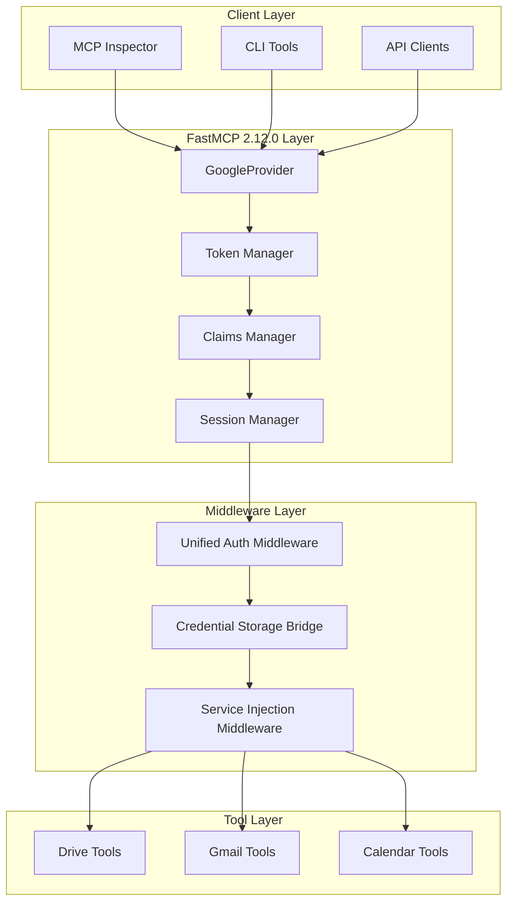
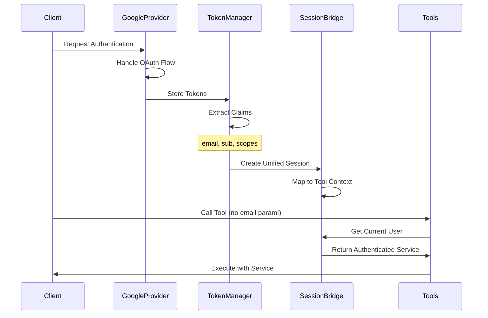
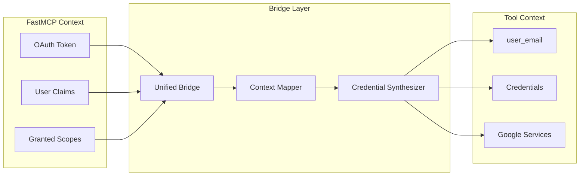
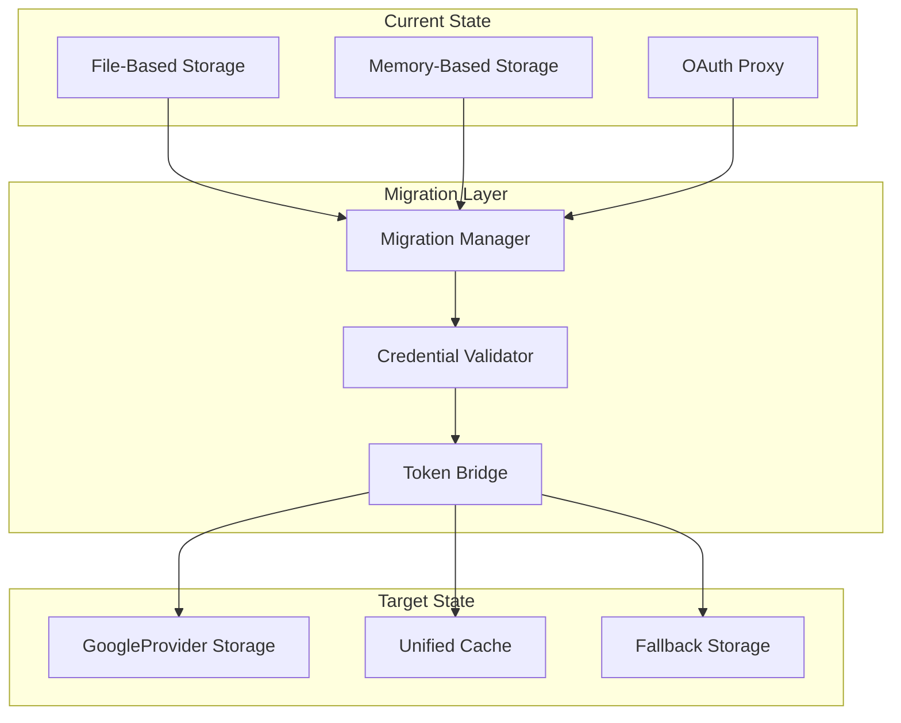
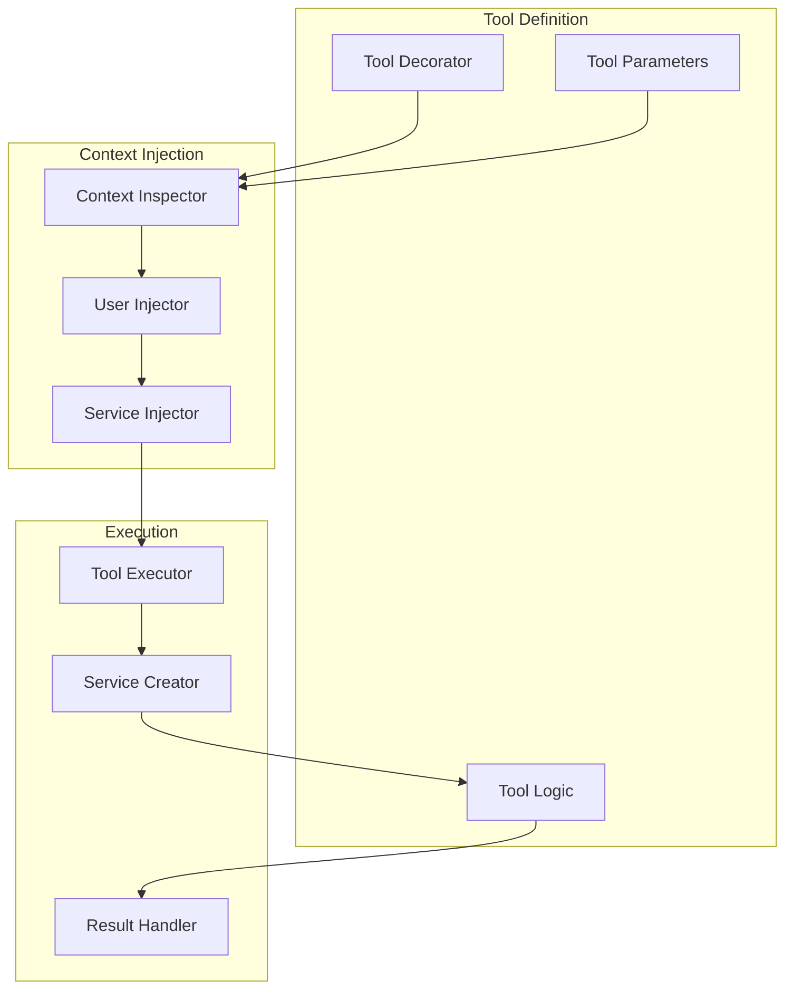
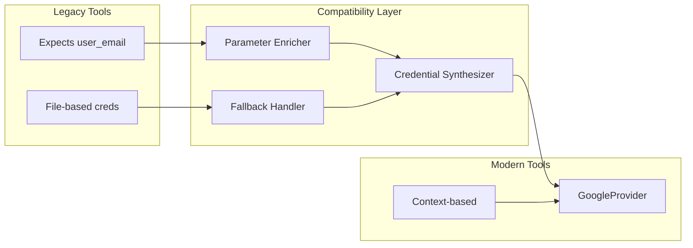
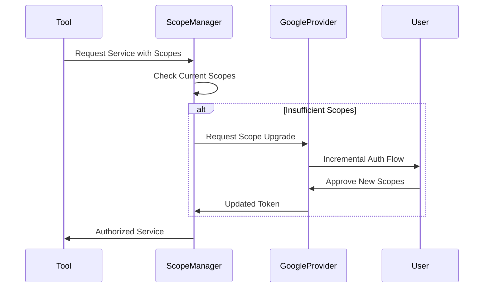

# Unified OAuth Architecture Design for FastMCP 2.12.0
## Leveraging GoogleProvider to Reconcile Dual OAuth Flows

---

## Executive Summary

This design document outlines a unified OAuth architecture that leverages FastMCP 2.12.0's new GoogleProvider features to eliminate the dual-flow authentication problem. The design ensures seamless integration between OAuth Proxy security requirements and tool functionality expectations while maintaining backward compatibility.

---

## 1. Unified OAuth Architecture Overview

### 1.1 Core Architecture Components



### 1.2 Authentication Flow Architecture



---

## 2. Session Context Strategy

### 2.1 Unified Session Model

```python
# Conceptual Design
class UnifiedSession:
    """Bridges FastMCP 2.12.0 context with tool expectations"""
    
    def __init__(self):
        self.fastmcp_token = None  # From GoogleProvider
        self.user_email = None     # From token.claims.get("email")
        self.user_id = None        # From token.claims.get("sub")
        self.scopes = []          # From token.claims
        self.services = {}        # Cached Google services
        self.credentials = None   # Bridged credentials object
```

### 2.2 Context Bridging Strategy



### 2.3 Session Management Lifecycle

1. **Session Creation**: When GoogleProvider authenticates, create unified session
2. **Session Binding**: Bind FastMCP context to tool-compatible context
3. **Session Persistence**: Store in both memory and optional disk cache
4. **Session Refresh**: Auto-refresh using GoogleProvider's token management
5. **Session Cleanup**: Clear on logout or expiry

---

## 3. Credential Storage Migration

### 3.1 Migration Architecture



### 3.2 Storage Abstraction Layer

```python
# Conceptual Design
class UnifiedCredentialStore:
    """Abstraction layer for credential storage"""
    
    def get_credentials(self, user_email: str):
        # Priority order:
        # 1. Check GoogleProvider active tokens
        # 2. Check unified memory cache
        # 3. Check legacy file storage (backward compat)
        # 4. Return None (require auth)
        pass
    
    def store_credentials(self, user_email: str, credentials):
        # Store in:
        # 1. GoogleProvider token store
        # 2. Unified memory cache
        # 3. Optional: Legacy format for backward compat
        pass
```

### 3.3 Migration Phases

**Phase 1: Dual-Mode Operation**
- GoogleProvider handles new authentications
- Legacy storage remains for existing credentials
- Bridge layer translates between formats

**Phase 2: Active Migration**
- On credential use, migrate to GoogleProvider format
- Maintain shadow copy in legacy format
- Log migration progress

**Phase 3: GoogleProvider Primary**
- All new operations use GoogleProvider
- Legacy storage becomes read-only fallback
- Tools updated to use unified context

---

## 4. Tool Integration Design

### 4.1 Enhanced Tool Architecture



### 4.2 Tool Enhancement Pattern

```python
# Current Tool (requires user_google_email)
@mcp.tool
async def upload_file_to_drive(
    user_google_email: str,
    filepath: str,
    folder_id: str = "root"
):
    service = await get_drive_service(user_google_email)
    # ... tool logic

# Enhanced Tool (no email required)
@mcp.tool
@inject_google_context
async def upload_file_to_drive(
    filepath: str,
    folder_id: str = "root",
    _context: GoogleContext = None  # Injected
):
    service = _context.get_service("drive")
    user_email = _context.user_email
    # ... tool logic
```

### 4.3 Service Injection Middleware

```python
# Conceptual Design
class GoogleServiceInjectionMiddleware:
    """Injects Google services based on FastMCP 2.12.0 context"""
    
    async def process_tool_call(self, tool_name, params):
        # Get current token from GoogleProvider
        token = get_access_token()  # FastMCP 2.12.0 dependency
        
        # Extract user info
        user_email = token.claims.get("email")
        
        # Create/cache services
        services = self.get_or_create_services(token)
        
        # Inject context
        context = GoogleContext(
            user_email=user_email,
            services=services,
            token=token
        )
        
        # Add to params if tool expects it
        if tool_needs_context(tool_name):
            params["_context"] = context
        
        # Backward compat: Add user_google_email if expected
        if tool_expects_email(tool_name):
            params["user_google_email"] = user_email
        
        return await execute_tool(tool_name, params)
```

---

## 5. Backward Compatibility Strategy

### 5.1 Compatibility Layers



### 5.2 Transition Phases

**Phase 1: Transparent Compatibility (Weeks 1-4)**
- All existing tools continue working unchanged
- New middleware intercepts and enriches calls
- Dual storage maintains both formats

**Phase 2: Gradual Migration (Weeks 5-8)**
- Update high-use tools to enhanced pattern
- Maintain compatibility wrapper for legacy calls
- Monitor and log usage patterns

**Phase 3: Deprecation Notice (Weeks 9-12)**
- Mark legacy patterns as deprecated
- Provide migration guide and tooling
- Continue full support with warnings

**Phase 4: Modern Default (Week 13+)**
- New tools use modern pattern only
- Legacy support via explicit compatibility flag
- Complete migration documentation

---

## 6. Scope Management Integration

### 6.1 Scope Resolution Architecture

```python
# Integration with FastMCP 2.12.0
class UnifiedScopeManager:
    """Manages scope resolution with GoogleProvider"""
    
    def __init__(self, google_provider):
        self.provider = google_provider
        self.custom_scopes = load_custom_scopes()
    
    def get_required_scopes(self, service_type):
        # Combine:
        # 1. FastMCP 2.12.0 required_scopes
        # 2. Service-specific scopes
        # 3. Custom application scopes
        
        base_scopes = self.provider.required_scopes
        service_scopes = SERVICE_SCOPE_MAP[service_type]
        custom = self.custom_scopes.get(service_type, [])
        
        return list(set(base_scopes + service_scopes + custom))
```

### 6.2 Dynamic Scope Upgrade



---

## 7. Implementation Phases

### Phase 1: Foundation (Week 1-2)
- [ ] Configure FastMCP 2.12.0 GoogleProvider
- [ ] Create UnifiedSession class
- [ ] Implement basic context bridging
- [ ] Set up logging and monitoring

### Phase 2: Integration (Week 3-4)
- [ ] Build GoogleServiceInjectionMiddleware
- [ ] Create credential storage bridge
- [ ] Implement session persistence
- [ ] Add compatibility layer

### Phase 3: Migration (Week 5-6)
- [ ] Migrate high-priority tools
- [ ] Update authentication flows
- [ ] Implement scope management
- [ ] Create migration utilities

### Phase 4: Testing (Week 7-8)
- [ ] Comprehensive integration tests
- [ ] Performance benchmarking
- [ ] Security audit
- [ ] User acceptance testing

### Phase 5: Rollout (Week 9-10)
- [ ] Staged deployment
- [ ] Monitor and adjust
- [ ] Documentation update
- [ ] Training materials

---

## 8. Technical Considerations

### 8.1 Performance Optimizations
- **Token Caching**: Leverage GoogleProvider's built-in caching
- **Service Pooling**: Reuse Google service instances
- **Lazy Loading**: Create services only when needed
- **Request Batching**: Combine multiple API calls

### 8.2 Security Enhancements
- **Token Isolation**: Separate token storage per context
- **Scope Minimization**: Request only necessary scopes
- **Audit Logging**: Track all authentication events
- **Encrypted Storage**: Use GoogleProvider's secure storage

### 8.3 Error Handling
- **Graceful Degradation**: Fallback to legacy flow if needed
- **Clear Error Messages**: User-friendly authentication prompts
- **Automatic Retry**: Handle transient failures
- **Recovery Mechanisms**: Re-authentication workflows

---

## 9. Success Metrics

### 9.1 Technical Metrics
- Zero authentication failures during migration
- < 100ms overhead for context injection
- 100% backward compatibility maintained
- Zero data loss during credential migration

### 9.2 User Experience Metrics
- No required code changes for existing integrations
- 50% reduction in authentication prompts
- Seamless tool execution without email parameters
- Automatic token refresh without user intervention

---

## 10. Risk Mitigation

### 10.1 Identified Risks
1. **Breaking Changes**: Existing tools might fail
   - *Mitigation*: Comprehensive compatibility layer
   
2. **Token Expiry**: FastMCP tokens might expire differently
   - *Mitigation*: Proactive refresh strategy
   
3. **Scope Mismatch**: GoogleProvider scopes might differ
   - *Mitigation*: Scope translation layer
   
4. **Performance Impact**: Additional middleware overhead
   - *Mitigation*: Aggressive caching and optimization

### 10.2 Rollback Strategy
- Maintain complete legacy flow in parallel
- Feature flag for instant rollback
- Automated monitoring for issues
- Clear rollback procedures

---

## Conclusion

This unified OAuth architecture leverages FastMCP 2.12.0's GoogleProvider to create a single, coherent authentication system that:

1. **Eliminates dual flows**: One authentication path for all clients
2. **Removes email parameters**: Tools work without user_google_email
3. **Maintains compatibility**: Existing code continues working
4. **Enhances security**: Leverages GoogleProvider's secure token management
5. **Improves UX**: Seamless authentication and automatic refresh

The phased implementation approach ensures zero disruption while gradually modernizing the authentication architecture.

---

*Document Version: 1.0.0*  
*Created: 2025-01-09*  
*Architecture Design for FastMCP 2.12.0 GoogleProvider Integration*