# Card System Documentation

## Overview

This document explains the card generation, template storage, and feedback learning system in the FastMCP2 Google Workspace Platform. It covers the architecture, file structure, and key components.

---

## System Architecture

```mermaid
flowchart TB
    subgraph Input["📝 User Input"]
        NL[/"Natural Language<br/>'Create a status card...'"/]
        DSL[/"DSL Notation<br/>'§[δ×3, Ƀ[ᵬ×2]]'"/]
    end

    subgraph CardTools["🔧 card_tools.py"]
        Tool["send_dynamic_card()"]
    end

    subgraph Builder["⚙️ smart_card_builder.py"]
        Parse["Parse DSL Symbols"]
        QueryPatterns["Query Qdrant Patterns"]
        Build["Build Card Structure"]
        Feedback["Add Feedback Section"]
    end

    subgraph Wrapper["📦 ModuleWrapper"]
        Index["Component Index<br/>(Qdrant Embeddings)"]
        Load["Dynamic Class Loading"]
        Symbols["Symbol Registry<br/>§ δ Ƀ ᵬ τ ► ℊ"]
    end

    subgraph Qdrant["🗄️ Qdrant Vector DB"]
        Components["Components Vector<br/>(ColBERT 128d)"]
        Inputs["Inputs Vector<br/>(ColBERT 128d)"]
        Relations["Relationships Vector<br/>(MiniLM 384d)"]
        Patterns["Instance Patterns<br/>(content + feedback_ui)"]
    end

    subgraph Validation["✅ Validation"]
        Structure["Structure Validator<br/>(Parent-Child Rules)"]
        Render["Component.render()"]
    end

    subgraph Output["📤 Output"]
        JSON[/"Google Chat JSON"/]
        Store["Store Pattern"]
        Send["Send to Chat"]
    end

    NL --> Tool
    DSL --> Tool
    Tool --> Parse
    Parse --> |"§[δ×3]"| Symbols
    Parse --> |"No DSL"| QueryPatterns
    QueryPatterns --> |"Search"| Patterns
    Patterns --> |"Match found"| Build
    Symbols --> |"Section, DecoratedText×3"| Build
    Build --> |"Search"| Components
    Components --> Load
    Load --> Structure
    Structure --> |"Valid"| Render
    Render --> JSON
    Build --> Feedback
    Feedback --> JSON
    JSON --> Store
    Store --> Patterns
    JSON --> Send
```



---

## DSL Symbol System

Components are mapped to Unicode symbols for compact structure notation:

```mermaid
flowchart LR
    subgraph Symbols["🔣 DSL Symbols"]
        S1["§ Section"]
        S2["δ DecoratedText"]
        S3["Ƀ ButtonList"]
        S4["ᵬ Button"]
        S5["τ TextInput"]
        S6["► SelectionInput"]
        S7["□ DateTimePicker"]
        S8["ℊ Grid"]
        S9["ǵ GridItem"]
        S10["℅ Columns"]
        S11["ɨ Image"]
    end

    subgraph Example["📝 Example DSL"]
        E1["§[δ×3, Ƀ[ᵬ×2]]"]
        E2["= Section with<br/>3 DecoratedText +<br/>ButtonList with 2 Buttons"]
    end

    subgraph Parsed["🔍 Parsed Structure"]
        P1["Section"]
        P2["├─ DecoratedText ×3"]
        P3["└─ ButtonList"]
        P4["    └─ Button ×2"]
    end

    E1 --> E2
    E2 --> P1
    P1 --> P2
    P1 --> P3
    P3 --> P4
```



---

## Component Embedding & Retrieval

```mermaid
sequenceDiagram
    participant User as 👤 User
    participant Builder as ⚙️ SmartCardBuilder
    participant Wrapper as 📦 ModuleWrapper
    participant Qdrant as 🗄️ Qdrant
    participant Framework as 📋 card_framework

    User->>Builder: "§[δ×3]" (DSL)
    Builder->>Wrapper: Lookup symbol "δ"
    Wrapper->>Wrapper: Symbol Registry: δ → DecoratedText

    Builder->>Qdrant: ColBERT search "DecoratedText widget"
    Note over Qdrant: Multi-vector embedding<br/>[128d] × N tokens

    Qdrant-->>Builder: Results with scores<br/>DecoratedText: 24.5<br/>decorated_text.py: 22.1

    Builder->>Wrapper: get_component_by_path(<br/>"card_framework.v2.widgets.decorated_text.DecoratedText")
    Wrapper->>Framework: importlib.import_module()
    Framework-->>Wrapper: <class DecoratedText>
    Wrapper-->>Builder: DecoratedText class

    Builder->>Framework: DecoratedText(text="...", wrapText=True)
    Framework-->>Builder: instance
    Builder->>Framework: instance.render()
    Framework-->>Builder: {"decoratedText": {...}}
```



---

## Structure Validation

The `StructureValidator` (in `adapters/structure_validator.py`) validates DSL structures against component hierarchy rules.

### Validation Flow

```mermaid
flowchart TB
    subgraph Input["📝 Input"]
        DSL["§[δ, Ƀ[ᵬ×2], ℊ[ǵ×4]]"]
    end

    subgraph Parse["1️⃣ Parse Structure"]
        P1["parse_structure()"]
        P2["_split_at_level()"]
        P3["_parse_recursive()"]
    end

    subgraph Tree["🌳 Component Tree"]
        T1["Section (§)"]
        T2["├─ DecoratedText (δ)"]
        T3["├─ ButtonList (Ƀ)"]
        T4["│  └─ Button (ᵬ) ×2"]
        T5["└─ Grid (ℊ)"]
        T6["   └─ GridItem (ǵ) ×4"]
    end

    subgraph Rules["📜 Validation Rules"]
        R1["WIDGET_TYPES<br/>Components valid in Section"]
        R2["NEEDS_WRAPPER<br/>Button→ButtonList<br/>Chip→ChipList<br/>GridItem→Grid"]
        R3["relationships<br/>(from Qdrant/dataclass hints)"]
    end

    subgraph Validate["2️⃣ Recursive Validation"]
        V1["_validate_component()"]
        V2["Check: Is symbol known?"]
        V3["Check: Can parent contain child?"]
        V4["Check: Does child need wrapper?"]
    end

    subgraph Result["📊 ValidationResult"]
        VR1["is_valid: bool"]
        VR2["issues: List[str]"]
        VR3["suggestions: List[str]"]
        VR4["resolved_components: Dict"]
    end

    DSL --> P1
    P1 --> P2
    P2 --> P3
    P3 --> Tree

    Tree --> V1
    R1 --> V3
    R2 --> V4
    R3 --> V3
    V1 --> V2
    V2 --> V3
    V3 --> V4
    V4 --> Result
```



### Validation Rules Detail

```mermaid
flowchart LR
    subgraph WIDGET["WIDGET_TYPES (Direct Section Children)"]
        W1["DecoratedText"]
        W2["TextParagraph"]
        W3["Image"]
        W4["ButtonList"]
        W5["Grid"]
        W6["SelectionInput"]
        W7["DateTimePicker"]
        W8["Divider"]
        W9["Columns"]
        W10["ChipList"]
    end

    subgraph WRAPPER["NEEDS_WRAPPER (Must Be Contained)"]
        direction TB
        N1["Button → ButtonList"]
        N2["Chip → ChipList"]
        N3["GridItem → Grid"]
        N4["Column → Columns"]
    end

    subgraph CHECK["can_contain(parent, child)"]
        C1["1. Direct relationship?"]
        C2["2. Widget in Section/Column?"]
        C3["3. Child needs wrapper<br/>that parent can contain?"]
    end

    WIDGET --> C2
    WRAPPER --> C3
    C1 --> |"✓ or"| C2
    C2 --> |"✓ or"| C3
```



### Example: Invalid Structure Detection

```mermaid
flowchart TB
    subgraph Bad["❌ Invalid: §[ᵬ×2]"]
        B1["Section"]
        B2["└─ Button ×2"]
        B3["Button NOT in WIDGET_TYPES"]
        B4["Button NEEDS_WRAPPER = ButtonList"]
    end

    subgraph Fix["✅ Suggested Fix"]
        F1["§[Ƀ[ᵬ×2]]"]
        F2["Section"]
        F3["└─ ButtonList"]
        F4["   └─ Button ×2"]
    end

    subgraph Output["ValidationResult"]
        O1["is_valid: False"]
        O2["issues: ['Button should be wrapped in ButtonList']"]
        O3["suggestions: ['Use Ƀ[ᵬ] instead of ᵬ']"]
    end

    Bad --> Output
    Output -.-> Fix
```



### Fallback: Structure Generation from Inputs

When no DSL is provided, the validator can generate structure from input keys:

```mermaid
flowchart LR
    subgraph Inputs["📥 Inputs Dict"]
        I1["{'text': 'Hello',<br/>'button': 'Click Me'}"]
    end

    subgraph Infer["🔍 INPUT_PATTERNS Lookup"]
        L1["text → DecoratedText"]
        L2["button → Button"]
    end

    subgraph Wrap["🎁 Apply Wrappers"]
        W1["Button → ButtonList"]
    end

    subgraph Filter["🔽 Filter to WIDGET_TYPES"]
        F1["DecoratedText ✓"]
        F2["ButtonList ✓"]
    end

    subgraph Generate["📤 Generated DSL"]
        G1["§[δ, Ƀ[ᵬ]]"]
    end

    Inputs --> Infer
    Infer --> Wrap
    Wrap --> Filter
    Filter --> Generate
```



---

## Feedback Learning Loop

```mermaid
flowchart TB
    subgraph Generate["1️⃣ Card Generation"]
        G1["Build card content"]
        G2["Store content pattern<br/>(pattern_type=content)"]
        G3["Add feedback UI"]
        G4["Store feedback_ui pattern<br/>(pattern_type=feedback_ui)"]
    end

    subgraph Card["📋 Rendered Card"]
        C1["Main Content"]
        C2["─────────"]
        C3["👍 Content correct?"]
        C4["👍 Layout good?"]
    end

    subgraph Feedback["2️⃣ User Feedback"]
        F1["Click 👍 or 👎"]
        F2["GET /card-feedback?<br/>card_id=abc&<br/>feedback=positive&<br/>feedback_type=content"]
    end

    subgraph Update["3️⃣ Pattern Update"]
        U1["Find pattern by card_id"]
        U2["Update content_feedback<br/>or form_feedback"]
        U3["Propagate to components"]
    end

    subgraph Learn["4️⃣ Future Searches"]
        L1["Filter: content_feedback=positive"]
        L2["Boost proven patterns"]
        L3["Exclude negative patterns"]
    end

    G1 --> G2
    G2 --> G3
    G3 --> G4
    G4 --> Card

    Card --> F1
    F1 --> F2
    F2 --> U1
    U1 --> U2
    U2 --> U3

    U3 -.-> L1
    L1 --> L2
    L2 --> L3
    L3 -.->|"Better cards"| G1
```



---

## Three-Vector Architecture

```mermaid
flowchart LR
    subgraph Point["📍 Qdrant Point"]
        ID["point_id: uuid"]
    end

    subgraph Vectors["🔢 Named Vectors"]
        V1["components<br/>(ColBERT 128d×N)<br/>Identity: Name + Type + Path"]
        V2["inputs<br/>(ColBERT 128d×N)<br/>Values: Params + Defaults"]
        V3["relationships<br/>(MiniLM 384d)<br/>Structure: Parent-Child + DSL"]
    end

    subgraph Payload["📦 Payload"]
        P1["type: instance_pattern"]
        P2["pattern_type: content|feedback_ui"]
        P3["card_id: abc123"]
        P4["content_feedback: positive|negative|null"]
        P5["form_feedback: positive|negative|null"]
        P6["parent_paths: [Section, ...]"]
        P7["relationship_text: §[δ×3] | ..."]
    end

    Point --> Vectors
    Point --> Payload
    V1 --> |"Search by<br/>component name"| P6
    V2 --> |"Search by<br/>parameter values"| P4
    V3 --> |"Search by<br/>structure/layout"| P5
```



---

## File Structure

```
gchat/
├── card_tools.py           # MCP tool setup (send_dynamic_card, etc.)
├── card_types.py           # Pydantic response types
├── smart_card_builder.py   # Main card builder with DSL + feedback
├── card_framework_wrapper.py  # ModuleWrapper singleton for card_framework
├── feedback_loop.py        # Qdrant-based pattern storage & learning
├── chat_tools.py           # Basic chat messaging tools
├── testing/
│   └── smoke_test_generator.py  # Feedback pattern testing
└── content_mapping/
    └── template_manager.py  # Template storage API
```

## Architecture

### 1. Card Tools (`card_tools.py`)

Entry point for MCP card tools. Provides:
- `send_dynamic_card` - Main tool for card generation
- `_build_card_with_smart_builder` - Internal builder function
- `setup_card_tools(mcp)` - Registers tools with FastMCP

### 2. Smart Card Builder (`smart_card_builder.py`)

The main card builder supporting:
- **DSL Parsing**: Structure notation like `§[δ×3, Ƀ[ᵬ×2]]`
- **Content DSL**: Styled text like `δ 'Status: OK' success bold`
- **Modular Feedback**: Randomly assembled feedback UI sections

#### Key Classes/Functions:
```python
class SmartCardBuilderV2:
    def build(description, title, subtitle) -> Dict
    def _query_qdrant_patterns(description, card_params) -> Optional[Dict]
    def _build_from_pattern(pattern, card_params) -> Optional[Dict]
    def _generate_pattern_from_wrapper(description, card_params) -> Dict
    def _create_feedback_section(card_id) -> Dict
    def _store_card_pattern(card_id, ...) -> None
    def _store_feedback_ui_pattern(card_id, feedback_section) -> None

def get_smart_card_builder() -> SmartCardBuilderV2
```

### 3. Feedback Loop (`feedback_loop.py`)

Closed-loop learning system that:
1. **Stores Patterns**: Cards are stored as `instance_pattern` points in Qdrant
2. **Receives Feedback**: `/card-feedback` endpoint updates pattern metadata
3. **Learns from Feedback**: Future searches can filter by feedback scores

#### Pattern Types:
- `pattern_type="content"` - Main card content (from tool inference)
- `pattern_type="feedback_ui"` - Randomly generated feedback UI section

#### Key Configuration:
```python
MAX_INSTANCE_PATTERNS = int(os.getenv("MAX_INSTANCE_PATTERNS", "500"))
ENABLE_FEEDBACK_BUTTONS = os.getenv("ENABLE_CARD_FEEDBACK", "true") == "true"
```

### 4. Card Framework Wrapper (`card_framework_wrapper.py`)

Singleton wrapper around ModuleWrapper for card_framework access:
```python
def get_card_framework_wrapper() -> CardFrameworkWrapper
```

Used by:
- SmartCardBuilder
- TemplateComponent
- card_tools
- Any module needing card_framework access

## Card Generation Flow

```
┌─────────────────────────────────────────────────────────────────┐
│  send_dynamic_card(description, title, ...)                     │
├─────────────────────────────────────────────────────────────────┤
│  1. SmartCardBuilder.build() - Fallback Chain:                  │
│     ├── 1a. Try Structure DSL parsing (§[δ×3, Ƀ[ᵬ×2]])         │
│     ├── 1b. Try Content DSL parsing (δ 'text' success)          │
│     ├── 1c. Query Qdrant for matching instance patterns         │
│     │       └── feedback_loop.query_with_feedback()             │
│     ├── 1d. Generate pattern from ModuleWrapper relationships   │
│     │       └── _generate_pattern_from_wrapper()                │
│     └── 1e. Plain text fallback (last resort)                   │
├─────────────────────────────────────────────────────────────────┤
│  2. Store Content Pattern                                       │
│     └── pattern_type="content" (before feedback added)          │
├─────────────────────────────────────────────────────────────────┤
│  3. Add Feedback Section                                        │
│     ├── Random component assembly                               │
│     ├── Store feedback_ui pattern (pattern_type="feedback_ui")  │
│     └── Add divider + feedback widgets                          │
├─────────────────────────────────────────────────────────────────┤
│  4. Send to Google Chat                                         │
│     └── Webhook or Chat API                                     │
└─────────────────────────────────────────────────────────────────┘
```

## Feedback Loop Flow

```
┌─────────────────────────────────────────────────────────────────┐
│  User clicks feedback button (👍/👎)                            │
├─────────────────────────────────────────────────────────────────┤
│  GET /card-feedback?card_id=abc&feedback=positive&type=content  │
├─────────────────────────────────────────────────────────────────┤
│  feedback_loop.update_feedback(card_id, content_feedback=...)   │
│     ├── Find pattern by card_id                                 │
│     ├── Update content_feedback or form_feedback                │
│     └── Propagate positive feedback to components               │
├─────────────────────────────────────────────────────────────────┤
│  Return HTML confirmation page                                  │
└─────────────────────────────────────────────────────────────────┘
```

## Qdrant Storage

### Collection: `mcp_gchat_cards_v7`

#### Instance Pattern Payload:
```python
{
    "type": "instance_pattern",
    "pattern_type": "content" | "feedback_ui",
    "card_id": "abc123",
    "card_description": "...",
    "parent_paths": ["Section", "DecoratedText", ...],
    "instance_params": {...},
    "content_feedback": "positive" | "negative" | None,
    "form_feedback": "positive" | "negative" | None,
    "timestamp": "2026-01-26T...",
}
```

#### Indexed Fields:
- `type` (keyword)
- `pattern_type` (keyword)
- `card_id` (keyword)
- `content_feedback` (keyword)
- `form_feedback` (keyword)
- `timestamp` (keyword)

## Modular Feedback Assembly

The feedback section is randomly assembled from component registries:

```python
TEXT_COMPONENTS = ["text_paragraph", "decorated_text", "decorated_text_icon", ...]
CLICKABLE_COMPONENTS = ["button_list", "chip_list", "icon_buttons", ...]
DUAL_COMPONENTS = ["decorated_text_with_button", "chip_dual", "columns_inline"]
LAYOUT_WRAPPERS = ["sequential", "with_divider", "columns_layout", "compact"]
```

This creates ~4,000+ structural combinations for training data variety.

## Configuration

### Environment Variables:
```bash
ENABLE_CARD_FEEDBACK=true          # Enable/disable feedback buttons
MAX_INSTANCE_PATTERNS=500          # Max patterns to keep in Qdrant
CARD_COLLECTION=mcp_gchat_cards_v7 # Qdrant collection name
```

### Settings:
```python
settings.base_url      # Server URL for feedback callbacks
settings.card_collection  # Qdrant collection name
```

## Template System

Templates are stored in Qdrant with:
- `payload_type: "template"` marker
- Deterministic ID from template name + content hash
- Payload-based search for retrieval

## Best Practices

1. **Use `send_dynamic_card`** - The unified interface for all card generation
2. **Include DSL** for complex structures: `§[δ×3, Ƀ[ᵬ×2]]`
3. **Let feedback flow** - Patterns are stored automatically
4. **Filter by pattern_type** when querying to separate content from UI patterns
5. **Check feedback stats** at `/card-feedback/stats`

## Migration Notes

### File Renames (v1.5+):
- `unified_card_tool.py` → `card_tools.py`
- `unified_card_types.py` → `card_types.py`
- `smart_card_builder_v2.py` → `smart_card_builder.py`

### Import Updates:
```python
# Old
from gchat.unified_card_tool import setup_unified_card_tool
from gchat.smart_card_builder_v2 import SmartCardBuilderV2

# New
from gchat.card_tools import setup_card_tools
from gchat.smart_card_builder import SmartCardBuilderV2
```
