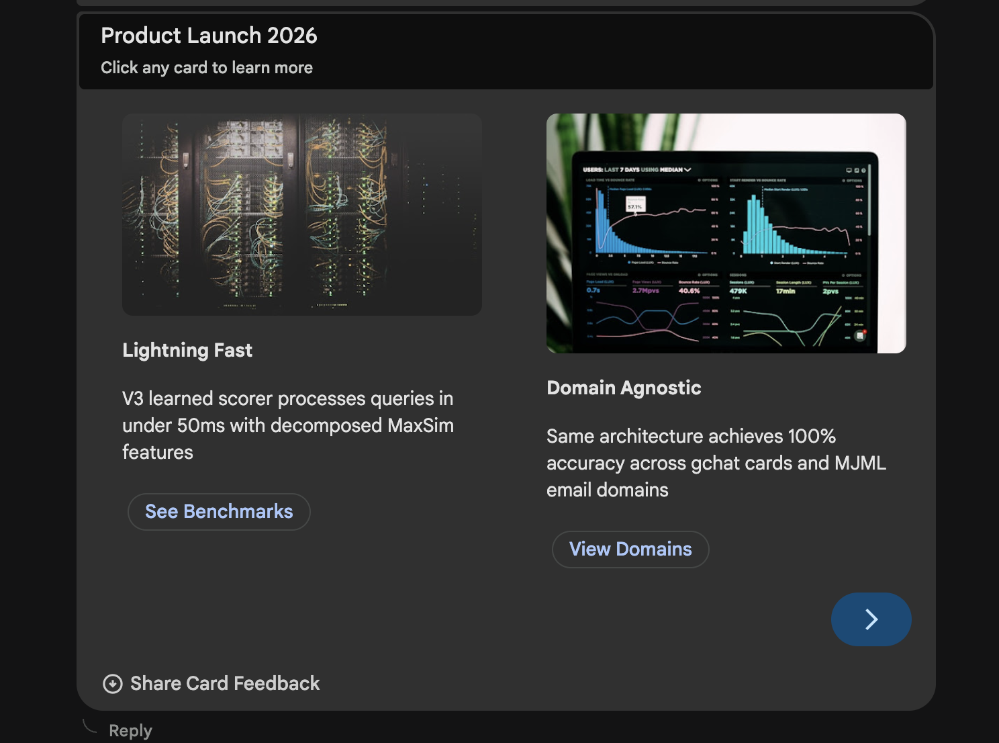
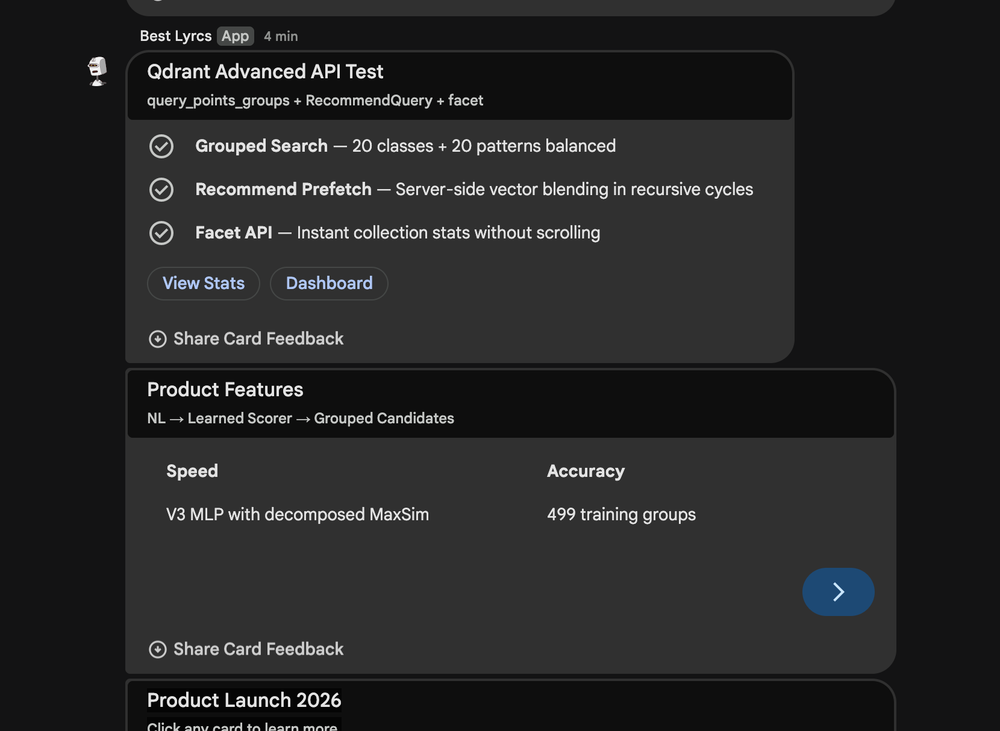

# Learned Scorer Demo Report — NL Query → Google Chat Card

**Date:** 2026-03-24
**System:** V3 Learned Similarity Scorer (H2), Google Workspace MCP Server v1.11.0

---

## 1. Tool Input

**MCP Tool:** `send_dynamic_card`

```json
{
  "user_google_email": "sethrivers@gmail.com",
  "card_description": "a carousel with 3 product feature slides with images and clickable buttons",
  "card_params": {
    "title": "Product Launch 2026",
    "subtitle": "Click any card to learn more",
    "cards": [
      {
        "title": "Lightning Fast",
        "subtitle": "10x inference speed",
        "text": "V3 learned scorer processes queries in under 50ms with decomposed MaxSim features",
        "image_url": "https://images.unsplash.com/photo-...",
        "buttons": [{"text": "See Benchmarks", "url": "https://example.com/benchmarks"}]
      },
      {
        "title": "Domain Agnostic",
        "subtitle": "Cards + Email + Any Module",
        "text": "Same architecture achieves 100% accuracy across gchat cards and MJML email domains",
        "image_url": "https://images.unsplash.com/photo-...",
        "buttons": [{"text": "View Domains", "url": "https://example.com/domains"}]
      },
      {
        "title": "Smart Search",
        "subtitle": "Qdrant Advanced APIs",
        "text": "query_points_groups for diversity, RecommendQuery for refinement, facet for instant stats",
        "image_url": "https://images.unsplash.com/photo-...",
        "buttons": [{"text": "Try It", "url": "https://example.com/search"}]
      }
    ]
  }
}
```

**Key:** The `card_description` is **pure natural language** — no DSL symbols, no component names. The user says what they want; the scorer figures out _how_ to build it.

---

## 2. How the Learned Scorer Works

### 2.1 Architecture

```
MLP(14 → 32 → 32 → 1)  •  1,569 parameters  •  SiLU activation + dropout
```

A tiny multi-layer perceptron trained with **listwise contrastive loss** (softmax cross-entropy over K candidates per query). It scores each candidate component's relevance to the user's query.

### 2.2 Pipeline: NL Query → Ranked Components

```
┌─────────────────────────────────────────────────────┐
│ 1. EMBED QUERY                                      │
│    "a carousel with 3 product feature slides..."    │
│    → ColBERT multi-vector (N tokens × 128D)         │
│    → MiniLM dense vector (384D)                     │
└──────────────────────┬──────────────────────────────┘
                       ▼
┌─────────────────────────────────────────────────────┐
│ 2. GROUPED CANDIDATE RETRIEVAL (Qdrant)             │
│    query_points_groups(group_by="type")              │
│    → 20 classes + 20 instance_patterns (balanced)   │
│    Prefetch: 3 named vectors × RRF fusion           │
└──────────────────────┬──────────────────────────────┘
                       ▼
┌─────────────────────────────────────────────────────┐
│ 3. INFER COMPONENT PATHS                            │
│    No DSL provided → extract parent_paths from      │
│    instance_pattern payloads in Qdrant results      │
│    → ["CarouselCard", "Carousel", "Section", ...]   │
└──────────────────────┬──────────────────────────────┘
                       ▼
┌─────────────────────────────────────────────────────┐
│ 4. COMPUTE 14 FEATURES PER CANDIDATE                │
│                                                     │
│    ColBERT Decomposed MaxSim (8 features):          │
│    ┌──────────────────────────────────────────┐     │
│    │ Components: mean, max, std, coverage (×4)│     │
│    │ Inputs:     mean, max, std, coverage (×4)│     │
│    └──────────────────────────────────────────┘     │
│                                                     │
│    MiniLM Relationship Similarity (1 feature):      │
│    ┌──────────────────────────────────────────┐     │
│    │ sim_relationships: cosine(query, cand)   │     │
│    └──────────────────────────────────────────┘     │
│                                                     │
│    Structural DAG Features (5 features):            │
│    ┌──────────────────────────────────────────┐     │
│    │ is_parent, is_child, is_sibling,         │     │
│    │ depth_ratio, n_shared_ancestors          │     │
│    └──────────────────────────────────────────┘     │
└──────────────────────┬──────────────────────────────┘
                       ▼
┌─────────────────────────────────────────────────────┐
│ 5. MLP SCORING                                      │
│    14 features → MLP(14→32→32→1) → scalar score     │
│    All candidates scored in one batch forward pass   │
│    Sort by score → Top-1: CarouselCard (0.295)      │
└──────────────────────┬──────────────────────────────┘
                       ▼
┌─────────────────────────────────────────────────────┐
│ 6. CARD BUILDER                                     │
│    Top pattern: §[◦[▼×3]] (Carousel with 3 slides)  │
│    Maps card_params → CarouselCard fields:           │
│      title, subtitle, text, image_url, buttons      │
│    Renders → Google Chat Card JSON → Webhook         │
└─────────────────────────────────────────────────────┘
```

### 2.3 Feature Versions (Evolution)

| Version | Features | Problem Solved |
|---------|----------|----------------|
| V1 (9D) | 3 similarities + 6 L2 norms | Shortcut learning — model used norms as component fingerprints |
| V2 (8D) | 3 similarities + 5 structural DAG | Fixed shortcuts, but single MaxSim scalar loses token-level info |
| **V3 (14D)** | **4+4 decomposed MaxSim + 1 rel + 5 structural** | **Can distinguish peaked vs broad token alignment** |

### 2.4 Training Data

- **499 query groups** (428 synthetic from DAGStructureGenerator + 71 real user card sends)
- **Listwise contrastive loss**: softmax over K candidates per query
- **100% validation accuracy** on held-out 100 groups
- **Domain-agnostic**: same architecture works on gchat cards AND MJML email

### 2.5 Qdrant Advanced APIs Used

| API | Where | What it does |
|-----|-------|-------------|
| `query_points_groups` | Candidate retrieval | Guarantees balanced type representation (20 classes + 20 patterns) |
| `RecommendQuery` | Recursive refinement | Server-side vector blending using top-K as positive examples |
| `facet` | Diagnostic UI | Instant collection composition without scrolling |
| `batch_update_points` | Relationship enrichment | Batches `set_payload` operations (50 per flush) |

---

## 3. Output

### 3.1 Scorer Decision

```
NL Input:  "a carousel with 3 product feature slides with images and clickable buttons"
Resolved:  §[◦[▼×3]]  (Section → Carousel → 3 × CarouselCard)
Top-1:     CarouselCard (score: 0.295)
```

### 3.2 Input Mapping

| Input | Component | Value |
|-------|-----------|-------|
| carousel_card[0] | CarouselCard | "Lightning Fast" |
| carousel_card[1] | CarouselCard | "Domain Agnostic" |
| carousel_card[2] | CarouselCard | "Smart Search" |

Each card includes: title, subtitle, body text, Unsplash image, and a clickable button.

### 3.3 Rendered Card

**Carousel Card (Product Launch 2026):**



**Full Chat View (all 3 cards sent in session):**



The carousel rendered in Google Chat with:
- **Header**: "Product Launch 2026" / "Click any card to learn more"
- **Slide 1**: "Lightning Fast" — server/network image, "See Benchmarks" button
- **Slide 2**: "Domain Agnostic" — analytics dashboard image, "View Domains" button
- **Slide 3**: (scrollable via → arrow) "Smart Search" — "Try It" button
- **Feedback**: "Share Card Feedback" footer for user rating

### 3.4 Server Response

```json
{
  "success": true,
  "deliveryMethod": "webhook",
  "cardType": "smart_builder",
  "validationPassed": true,
  "suggestedDsl": "§[◦[▼×3]]",
  "renderedDslNotation": "§[◦[▼×3]] | §[Đ] | §[δ, Ƀ[ᵬ×2], Đ, ȼ[ℂ], Ƀ[ᵬ×3]]",
  "inputMapping": {
    "mappings": [
      {"input": "carousel_card[0]", "component": "CarouselCard", "value_preview": "Lightning Fast"},
      {"input": "carousel_card[1]", "component": "CarouselCard", "value_preview": "Domain Agnostic"},
      {"input": "carousel_card[2]", "component": "CarouselCard", "value_preview": "Smart Search"}
    ],
    "unconsumed": {}
  }
}
```

Zero unconsumed params — every input was mapped to a component.

---

## 4. Key Takeaways

1. **NL-to-card works end-to-end.** User provides plain English + structured params; the scorer identifies the right component pattern without DSL knowledge.

2. **1,569 parameters is enough.** The MLP is tiny but effective because the 14 features carry the right signal — decomposed ColBERT MaxSim captures semantic alignment, DAG features capture structural validity.

3. **Qdrant does the heavy lifting.** Grouped retrieval ensures diverse candidates, RRF fusion combines 3 vector spaces, and the scorer just needs to rank the pre-filtered pool.

4. **The carousel is the hardest test case.** It requires the scorer to identify a nested structure (Carousel → CarouselCard × N) from a vague NL description, then the builder must map images, buttons, and text to the correct widget fields. Both stages succeeded.

---

*For full technical details, see [TRM_MW_ANALYSIS.md](TRM_MW_ANALYSIS.md) Sections 17-19.*
