# RIC Meets TRM — Thought Experiment: Recursive Embedding Networks for Module Wrapping

## Context

This document explores the throughline between TRM (Tiny Recursive Models) and the Module Wrapper's RIC
(Relationships-Inputs-Components) 3-vector embedding schema. The question: can we use our existing RIC embeddings
as the latent state for a TRM-like recursive refinement process — turning semantic search into recursive
reasoning?

This is a brainstorm/analysis, not an implementation plan.

---

## 1. THE TWO SYSTEMS SIDE BY SIDE

### TRM: What It Does

A 2-layer, 7M-parameter network that solves ARC-AGI puzzles better than Gemini 2.5 Pro by recursively refining
two latent states through the same tiny network:

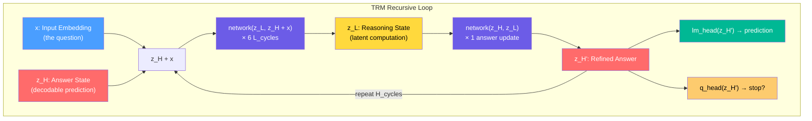

Key insight: The SAME 2-layer network processes both z_L and z_H. It learns to behave differently based on what's
injected as context, not different weights.

### RIC: What It Does

A 3-vector embedding system where every module component gets three semantic representations, searched via
Reciprocal Rank Fusion:

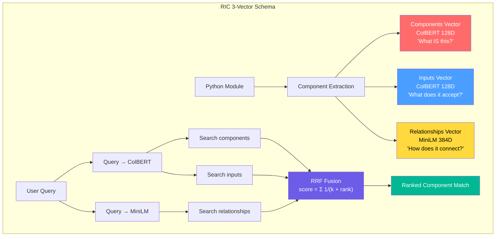

---

## 2. THE STRUCTURAL PARALLEL — Why These Map Onto Each Other

### The Core Mapping

| TRM Concept | RIC Analog | Why They're the Same Thing |
|---|---|---|
| z_H (answer state) | Components vector (128D ColBERT) | Both represent "what IS the current answer" — decodable, interpretable, the identity |
| z_L (reasoning state) | Relationships vector (384D MiniLM) | Both represent structural reasoning — "how things connect" — not directly interpretable as an answer |
| x (input injection) | Inputs vector (128D ColBERT) | Both provide parameterization context — "what goes into it" — injected additively |
| L_cycles (inner loops) | Multi-vector search passes | Both refine the latent state through repeated application of the same operation |
| H_cycles (supervision) | Instance pattern refinement | Both provide outer-loop feedback that adjusts the inner state |
| Halting (q_head) | Confidence threshold (0.85) | Both decide "is the answer good enough to stop?" |
| Single shared network | Shared embedding models | Both use ONE architecture that differentiates via input, not separate weights |
| Deep supervision | Execution feedback | Both feed success signals back to improve future iterations |

### The Deep Insight

TRM proved that z_H and z_L are the optimal factorization — the paper tested 1, 2, 3, and 6 latent features and
found exactly 2 is optimal. Our RIC system independently arrived at a 3-way factorization that maps cleanly:

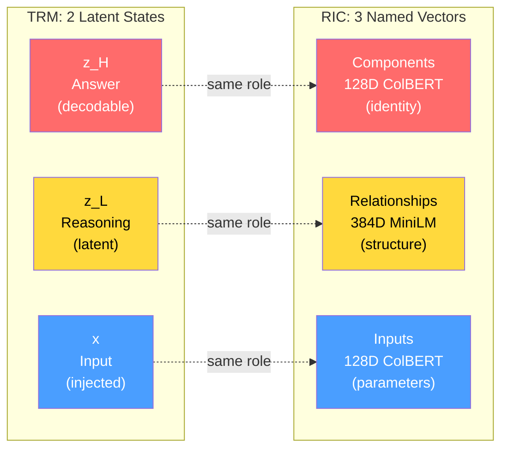

RIC's third vector (Inputs) is TRM's input injection (x). In TRM, x isn't a latent state — it's the constant
context that gets added to z_H before processing. In RIC, Inputs is a separate embedding of parameter context.
Both serve the same function: grounding the identity in its usage context.

---

## 3. THE RECURSIVE PROCESS — How RIC Could Become TRM

### Today: RIC Does Single-Pass Search

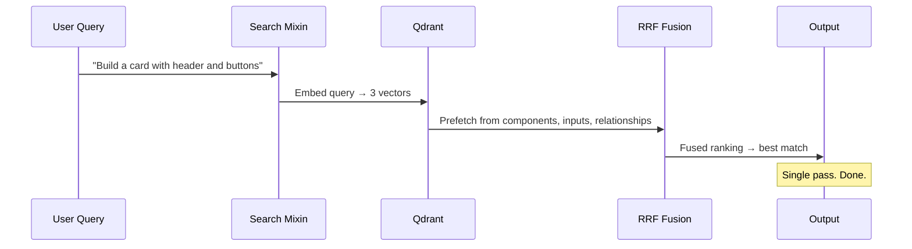

### Vision: RIC Does Recursive Refinement

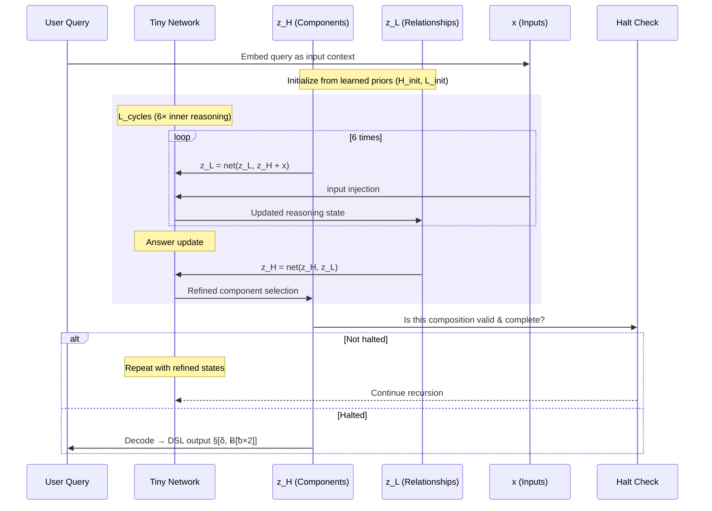

### What Changes

| Aspect | Today (RAG Search) | Tomorrow (Recursive RIC) |
|---|---|---|
| Components (z_H) | Static embedding retrieved from Qdrant | Living state refined each cycle — starts as query embedding, becomes component selection |
| Relationships (z_L) | Static structural text embedding | Evolving structural hypothesis — "which DAG path am I exploring?" |
| Inputs (x) | Search query embedding | Constant context injected each cycle — grounds reasoning in what the user actually needs |
| Depth | 1 search pass | 6 L_cycles × 3 H_cycles × N supervision steps = deep reasoning from tiny network |
| Halting | Return top-K results | Learned q_head: "is this DSL composition correct?" |
| Feedback | Post-hoc (instance patterns stored after execution) | Inline (deep supervision at every H_cycle via loss on decoded DSL) |

---

## 4. THE NETWORK ARCHITECTURE — What Would It Look Like?

### Option A: Embed → Project → Recurse → Decode

Use the existing RIC embeddings as initialization, then recurse with a tiny learned network:

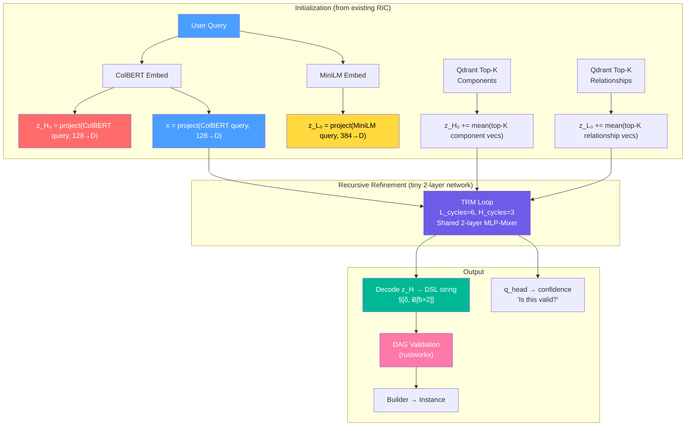

### Option B: Vector Arithmetic in Embedding Space (No Learned Network)

Skip the neural network entirely. Use vector operations on RIC embeddings to simulate TRM's recursion:

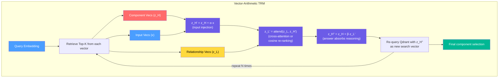

This is actually doable today with zero training — just vector arithmetic on existing embeddings:

For each refinement cycle:
1. `z_H' = normalize(z_H + α * inputs_query_vec)` — inject usage context
2. `z_L' = rerank(z_L, similarity(z_L, z_H'))` — reasoning sees updated answer
3. `z_H'' = normalize(z_H + β * mean(top-K z_L'))` — answer absorbs reasoning
4. Re-query Qdrant with z_H'' as the new search vec
5. Check: did the rankings stabilize? (halting criterion)

### Option C: Hybrid — Use LLM as the "Network"

The recursive network doesn't have to be a trained neural net. The LLM sampling middleware IS the network:

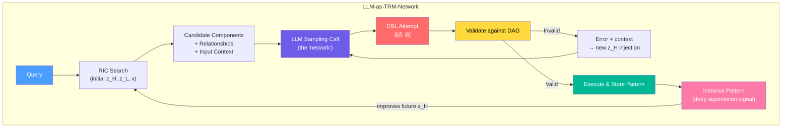

This is what the sampling middleware ALREADY DOES — DSL error recovery is literally "try → fail → inject context
→ retry → succeed." The throughline is that this is already a recursive process, it just uses an LLM instead of a
tiny trained network.

---

## 5. THE "LESS IS MORE" INSIGHT — Why This Matters for Module Wrapper

TRM's key finding: 2 layers + 6 recursions beats 4 layers + 2 recursions. Fewer parameters + more iteration =
better generalization on small data.

How this applies to RIC:

```mermaid
graph TD
    subgraph Traditional["Traditional RAG<br/>(Wide, Shallow)"]
        T1["Big embedding model<br/>768-1536D"] --> T2["Single search pass"]
        T2 --> T3["Return top-K"]
        T3 --> T4["Hope the LLM figures it out"]
    end

    subgraph RIC_TRM["RIC + TRM<br/>(Narrow, Deep)"]
        R1["Small embeddings<br/>128D ColBERT + 384D MiniLM"] --> R2["Search Pass 1"]
        R2 --> R3["Refine z_H with relationships"]
        R3 --> R4["Search Pass 2<br/>(re-query with refined state)"]
        R4 --> R5["Validate against DAG"]
        R5 --> R6["Search Pass 3<br/>(if needed)"]
        R6 --> R7["Confident result + DSL"]
    end

    style T1 fill:#e17055,color:#fff
    style T4 fill:#e17055,color:#fff
    style R1 fill:#00b894,color:#fff
    style R7 fill:#00b894,color:#fff
```

Our embeddings are ALREADY "tiny" (128D + 384D). TRM validates that this is a feature, not a limitation — small
embeddings + recursive refinement > large embeddings + single pass.

The module wrapper's 3 small vectors are the RIC equivalent of TRM's 2-layer network:
- Small but sufficient to capture the signal
- Recursion extracts the depth
- Weight sharing (same ColBERT model for both components and inputs) prevents overfitting
- DAG validation acts as the structural constraint (like TRM's grid structure)

---

## 6. WHAT ALREADY EXISTS — The Bones of a Recursive System

### Components That Map Directly

| Existing Component | File | TRM Role |
|---|---|---|
| `search_hybrid()` RRF fusion | search_mixin.py:1533 | One "forward pass" through the network — fusing 3 vectors |
| `search_hybrid_multidim()` cross-dim scoring | search_mixin.py | Multi-dimensional candidate evaluation (H1 — live) |
| `StructureVariator.swap_sibling()` | instance_pattern_mixin.py:123 | Structural mutation = exploring z_H variations |
| `ParameterVariator` | instance_pattern_mixin.py | Input variation = exploring x space |
| `can_contain(parent, child)` via BFS | graph_mixin.py | Structural constraint = TRM's grid rules |
| DSL Parser + Structure Validator | core.py | Output decoder = lm_head(z_H) |
| Validation agents (pre-execution) | sampling_middleware.py | z_L reasoning before answer commit |
| DSL error recovery | sampling_middleware.py | Re-try with context injection = another recursion cycle |
| Instance pattern feedback | instance_pattern_mixin.py | Deep supervision signal from successful execution |
| Confidence threshold (0.85) | search_mixin.py | Halting criterion = q_head > 0 |
| L1/L2/L3 cache | cache_mixin.py | EMA-like smoothing of latent states across sessions |
| `WrapperRegistry` singleton registry | wrapper_factory.py | Domain-agnostic wrapper lifecycle — "module_name + config → operational wrapper" |
| `DomainConfig` declarative config | domain_mixin.py | Per-domain knobs (cache priorities, DSL categories, symbol filters) without adapter changes |
| `get_skill_resources_safe()` | wrapper_factory.py | Shared skill resource annotation — one helper for all domains |

### The Feedback Loop Already Exists

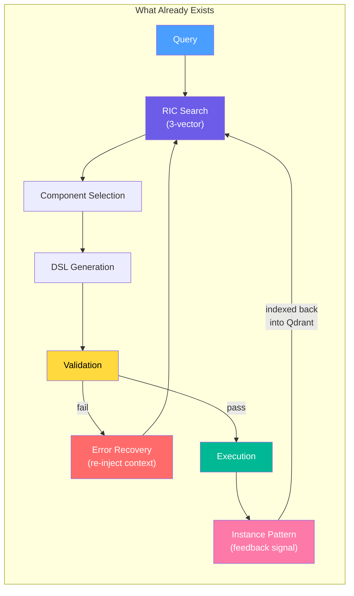

This IS a recursive system. It's just not formalized as one. The refinement loop exists; the feedback exists; the
halting exists. What's missing is:
1. Explicit latent state management (z_H and z_L as first-class objects between cycles)
2. A tiny learned network that replaces "re-embed and re-search" with "transform the latent state directly"
3. Deep supervision at every cycle (not just final execution feedback)

What's been UNBLOCKED (2026-03-22 — wrapper consolidation):
4. **Domain-agnosticism achieved.** The adapter layer (`adapters/module_wrapper/`) has zero domain imports.
   Adding a 4th wrapped module requires only `DomainConfig` + factory + `WrapperRegistry.register()` (~40 lines).
   This was a prerequisite for Horizon 3's "any module we wrap" vision — previously blocked by gchat-specific
   coupling in 6 adapter files.

---

## 7. THREE HORIZONS FOR MAKING THIS REAL

> **Updated 2026-03-22** based on POC results (see Section 11).
> Horizon 1 revised from "Vector-Arithmetic Recursion" to "Multi-Dimensional Scoring"
> after POC proved vector arithmetic fails (-22% to -28%) while cross-dimensional
> scoring succeeds (+9.5%).

### Horizon 1: Multi-Dimensional Scoring in Module Wrapper (POC Validated)

**Difficulty:** Low | **Impact:** High | **Timeline:** Days
**Status:** POC validated (+9.5% Top-1 accuracy), implemented in `search_mixin.py`

The POC proved that scoring candidates across ALL 3 RIC vectors simultaneously via
multiplicative cosine similarity substantially outperforms RRF fusion. This has been
implemented as `search_hybrid_multidim()` in the module wrapper.

**Algorithm:**
```python
def search_hybrid_multidim(description, content_feedback=None, form_feedback=None):
    # 1. Embed query → 3 vectors (ColBERT for components/inputs, MiniLM for relationships)
    # 2. Expand candidate pool — 3 independent searches, each top-K=20
    #    (with feedback filters applied identically to search_hybrid)
    # 3. Collect all unique candidates with their stored named vectors
    # 4. For each candidate, compute cross-dimensional similarity:
    #    sim_c = MaxSim(query_colbert, candidate.components)
    #    sim_r = cosine(query_minilm, candidate.relationships)
    #    sim_i = MaxSim(query_colbert, candidate.inputs)
    #    score = sim_c × sim_r × sim_i  (multiplicative)
    # 5. Apply feedback boost (positive → ×1.1, negative → ×0.8)
    # 6. Return (class_results, content_patterns, form_patterns) — same as search_hybrid
```

**Key design decisions:**
- Uses ColBERT MaxSim for components/inputs (multi-vector late interaction), dense cosine for relationships
- Feedback operates as BOTH filter (on prefetch, preserving current behavior) AND boost (on final score)
- Return signature compatible with existing callers (`wrapper_api.py`, `feedback_loop.py`)
- Opt-in: new method alongside existing `search_hybrid()`, callers choose which to use

### Horizon 2: Tiny Projection Network (Minimal Training)

**Difficulty:** Medium | **Impact:** High | **Timeline:** Weeks
**Status:** Not started. Depends on Horizon 1 being validated in production.

The POC proved that vector arithmetic cannot substitute for learned transformations.
TRM's recursion works because the 2-layer network LEARNS meaningful transformations.
A small MLP that learns to project RIC vectors into a shared space is the path forward.

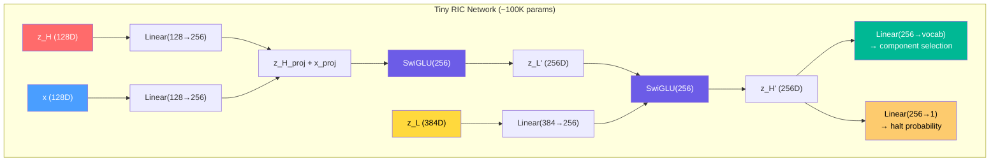

Training data: Every successful tool execution with feedback is a training example:
- Input: (query embedding, component paths, relationship context)
- Target: correct DSL output
- Halting target: was the first attempt correct?

### Horizon 3: Full Recursive Embedding Network (The Vision)

**Difficulty:** High | **Impact:** Transformative | **Timeline:** Months
**Status:** Vision. Depends on Horizon 2. **Prerequisite unblocked:** wrapper consolidation
(2026-03-22) achieved domain-agnosticism — the adapter layer has zero domain imports and
new domains require only `DomainConfig` + `WrapperRegistry.register()`.

A domain-agnostic recursive network that operates in RIC embedding space:

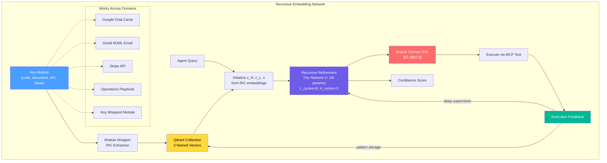

---

## 8. WHY THE DIMENSION MISMATCH IS ACTUALLY FINE

A natural concern: TRM's z_H and z_L are the same dimensionality (hidden_size=512), but RIC has mixed dimensions
(128D ColBERT + 384D MiniLM).

TRM's answer: it doesn't matter. The paper shows:
- z_H and z_L can be different "types" of representation
- The projection happens inside the network (via learned linear layers)
- What matters is that z_H is decodable (identity) and z_L is latent (structural)

Our answer: project into a shared space.

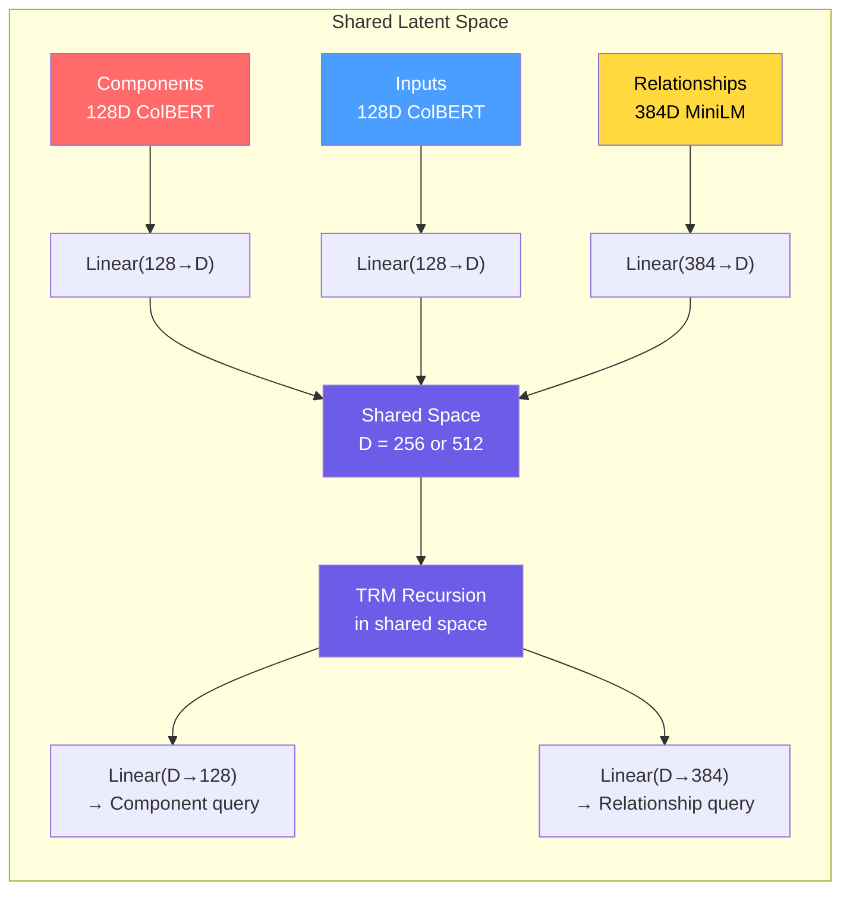

The projection layers are tiny (128×256 = 32K params, 384×256 = 98K params). The entire network would be under
500K parameters — truly "tiny recursive."

---

## 9. THE FEEDBACK FLYWHEEL — Where This Gets Powerful

The magic of combining RIC + TRM is the self-improving feedback loop:

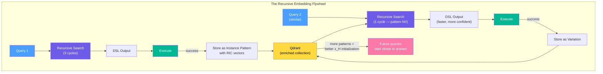

Each successful execution:
1. Generates a new instance pattern with known-good RIC vectors
2. These patterns become better initialization points for z_H in future queries
3. The recursive network needs fewer cycles for similar queries
4. Over time, the system converges toward single-pass accuracy for known patterns

This is exactly TRM's "self-improving patterns" — but operating in embedding space rather than pixel space.

---

## 10. OPEN QUESTIONS & PROVOCATIONS

### Things to Think About

1. **~~Do we even need a trained network?~~ Answer: YES.** The POC proved that vector arithmetic is NOT sufficient — it destroys embedding geometry. A learned network (Horizon 2) IS needed for recursive refinement. However, multi-dimensional scoring (Horizon 1) provides significant gains without any training.

2. **What's the "grid" for modules?** TRM works brilliantly on 9×9 Sudoku because the structure is fixed. Modules have variable structure. The DAG containment rules ARE our "grid" — but they're variable-size. Does the MLP-Mixer approach (fixed sequence length) still apply, or do we need attention?

3. **ColBERT's multi-vector IS already recursive.** ColBERT generates token-level embeddings and uses late interaction (MaxSim) — this is conceptually a single "L_cycle" of attention over token positions. Adding explicit recursion would make it "ColBERT with depth."

4. **The EMA question.** TRM needs EMA (Exponential Moving Average) to prevent collapse. Our Qdrant embeddings are already "smoothed" across many ingestion events. Is the collection itself acting as EMA?

5. **Cross-module composition.** The real power: z_H from a card search + z_L from an email search + x from a forms query → compose a multi-service workflow through recursive refinement across domains. This is where "any module we wrap" becomes transformative.

6. **Training data abundance.** TRM needed heavy augmentation (1000× per example) because data was scarce. We have every tool invocation stored in Qdrant with success/failure signals. That's potentially thousands of training examples already — and growing with every use.

### The Pitch in One Sentence

> "RIC embeddings are the latent state. Recursive refinement is the reasoning. The DAG is the structure. Every
> execution is a training signal. The module wrapper is already a tiny recursive network — it just doesn't know it
> yet."

---

## 11. POC RESULTS SUMMARY

> Added 2026-03-22 based on `research/trm/poc/` experiments.

### Experiment Setup

- **Test bed:** Tic-Tac-Toe game states (solved via minimax)
- **Data:** 2,000 train states / 200 test states
- **RIC vectors:** 3 × 384D dense vectors (Components, Inputs, Relationships) indexed in Qdrant
- **Evaluation:** Top-1 and Top-3 accuracy for optimal move prediction

### Results

| Method | Top-1 Accuracy | Top-3 Accuracy | Delta vs Baseline |
|--------|---------------|---------------|-------------------|
| Single-pass (RRF) | 46.5% | 78.0% | baseline |
| **Multi-dimensional (multiply)** | **56.0%** | **78.0%** | **+9.5%** |
| **Multi-dimensional (harmonic)** | **56.0%** | **78.0%** | **+9.5%** |
| Recursive (centroid) | 24.5% | 68.5% | -22.0% |
| Recursive (best_match) | 19.0% | 61.0% | -27.5% |
| Recursive (score_weighted) | 19.5% | 65.5% | -27.0% |
| Recursive (consistency) | 22.0% | 64.5% | -24.5% |

### Key Findings

1. **Cross-dimensional consistency scoring > RRF > Recursive vector arithmetic**
2. **Why multi-dimensional scoring works:** It doesn't modify vectors. It expands the candidate pool (top-20 per vector) and scores each candidate on all 3 dimensions simultaneously. Multiplicative combination rewards candidates that are good across all dimensions.
3. **Why recursive vector arithmetic fails:** Centroid cross-pollination averages retrieved vectors, losing query specificity. Embedding arithmetic destroys geometric structure. TRM's network LEARNS meaningful transformations — arithmetic is not a substitute.
4. **Implication:** Horizon 1 revised from vector arithmetic to multi-dimensional scoring. Horizon 2 (learned network) confirmed as the path to recursive refinement.

---

## 12. PROGRESS TRACKER

| Horizon | Description | Status | Blocker | Next Step |
|---------|------------|--------|---------|-----------|
| **H0** | Wrapper-Agnosticism | **Complete 2026-03-22** | None | — (prerequisite for H3) |
| **H1** | Multi-Dimensional Scoring | **Live-tested 2026-03-22** | None | Comparative A/B metrics (multidim vs RRF) in production |
| **H2** | Learned Similarity Scorer | **MW validated 2026-03-22: 100% val acc** | None | Integrate into `search_hybrid_dispatch()` |
| **H3** | Full Recursive Embedding Network | Vision | Needs H2 | Domain-agnosticism prerequisite met (H0) |

### H1 Implementation Details

- **File:** `adapters/module_wrapper/search_mixin.py` — `search_hybrid_multidim()`
- **Dispatch:** `search_hybrid_dispatch()` reads `ENABLE_MULTIDIM_SEARCH` env var (default: false)
- **Callers wired:** `wrapper_api.py:336`, `feedback_loop.py:2188`, `builder_v2.py:354`
- **Feature flag:** `config/settings.py` — `enable_multidim_search` / `ENABLE_MULTIDIM_SEARCH`
- **Tests:** `tests/module/test_multidim_search.py` (31 tests)
- **Return signature:** Same 3-tuple as `search_hybrid()` — drop-in compatible
- **Feedback:** Preserved as filter (on prefetch) + new boost (on final score)
- **Scoring:** ColBERT MaxSim for components/inputs, dense cosine for relationships, multiplicative fusion
- **Architecture:** Single Qdrant round-trip via prefetch pipeline + `with_vectors=True`, client-side rerank

### H1 Live Test Results (2026-03-22)

Tested with `ENABLE_MULTIDIM_SEARCH=true` against live Qdrant, 3 card generation flows:

| Test | Input | DSL | Validation | Variations |
|------|-------|-----|------------|------------|
| Status card | `§[δ, Ƀ[ᵬ×2]]` + NL | DSL detected | Passed | 3/3 |
| Grid dashboard | `§[ℊ[ǵ×4]]` + NL | DSL detected | Passed | 3/3 |
| NL-only notification | Pure NL (no DSL) | None | Passed | 3/3 |

All tests exercised the full path: `send_dynamic_card` → `builder_v2.py` → `search_hybrid_dispatch` → `search_hybrid_multidim` → Qdrant prefetch pipeline → client-side cross-dim rerank.

### H0 Implementation Details (Wrapper Consolidation — 2026-03-22)

The adapter layer (`adapters/module_wrapper/`) had 3 critical violations (direct `gchat.*` imports) and
3 design violations (hardcoded card-framework values) that blocked adding new wrapped domains without
modifying adapter internals. This was the #1 prerequisite for Horizon 3's "any module we wrap" vision.

**What was done:**

| Phase | Change | Files |
|-------|--------|-------|
| Fix critical violations | Removed `from gchat.*` imports via callback registration (`register_default_wrapper_getter`), wrapper `symbol_mapping` as SSoT, explicit `wrapper_getter` param | `variation_generator.py`, `structure_validator.py`, `component_cache.py` |
| Fix design violations | `register_module_prefix()` API, `DomainConfig.cache_priority_components`, generic `self.module_name` paths, generic collection defaults | `symbol_generator.py`, `cache_mixin.py`, `text_indexing.py`, `dsl_parser.py` |
| Shared infrastructure | `WrapperRegistry` (thread-safe singleton), `generate_dsl_quick_reference()`, `generate_dsl_field_description()`, `get_skill_resources_safe()` | `wrapper_factory.py` (NEW) |
| Consumer refactors | All 3 wrapper setups use `WrapperRegistry`; all 3 tool files use `get_skill_resources_safe()` | `gchat/wrapper_setup.py`, `gmail/email_wrapper_setup.py`, `middleware/qdrant_core/qdrant_models_wrapper.py`, `gchat/card_tools.py`, `gmail/compose.py`, `middleware/qdrant_core/tools.py` |
| DomainConfig extensions | `cache_priority_components`, `dsl_categories`, `symbol_filter` | `domain_mixin.py` |
| Guardrail test | AST scan of `adapters/module_wrapper/*.py` for domain imports — fails CI if any added | `tests/module/test_wrapper_agnostic.py` (NEW) |

**New wrapper onboarding cost:** ~40 lines (DomainConfig + factory + register) vs. 150+ lines previously.

**Tests:** 245 passed, 0 failures. Guardrail test confirms zero domain imports in adapter layer.

**TRM relevance:** Horizon 3 requires the recursive embedding network to operate identically across
any wrapped module. That requires the wrapper system itself to be domain-agnostic — domain-specific
behavior must come from `DomainConfig`, not from `if module == "gchat"` branches in shared code.
This is now the case.

---

## 13. RETROSPECTIVE — What We Learned Building H1

### Architecture Insight: Leverage Qdrant's Prefetch, Don't Fight It

The first implementation used **4 separate Qdrant round-trips** (3 `query_points` + 1 `retrieve`).
Review revealed that Qdrant 1.17's `query_points` already supports:
- `prefetch=[...]` — server-side parallel searches in a single call
- `query=FusionQuery(Fusion.RRF)` — server-side deduplication
- `with_vectors=True` — returns stored vectors inline (no separate `retrieve`)

**Lesson:** Before implementing client-side orchestration, check what the infrastructure already provides. The refactored version does the same work in **1 round-trip** instead of 4.

### What Qdrant Does vs. What We Add

| Layer | Who Does It | Why |
|-------|-------------|-----|
| Candidate expansion (3 vector searches) | Qdrant (prefetch) | Server-side parallelism, single network call |
| Deduplication | Qdrant (RRF fusion) | Eliminates duplicate candidates across prefetches |
| Vector retrieval | Qdrant (`with_vectors=True`) | Returns stored vectors without separate fetch |
| **Cross-dim scoring** (`sim_c × sim_r × sim_i`) | **Client-side** | Qdrant has no native multiplicative cross-vector scoring |
| **ColBERT MaxSim** | **Client-side** | Qdrant stores multi-vectors but doesn't expose MaxSim as a query-time operation |
| **Feedback boost** | **Client-side** | Business logic (positive ×1.1, negative ×0.8) |

**Lesson:** Only write client-side code for what the server genuinely can't do. The 3 items we compute client-side (cross-dim products, MaxSim, feedback boost) are legitimately not available in Qdrant's native API.

### Feature Flag Design

Using `search_hybrid_dispatch()` with `ENABLE_MULTIDIM_SEARCH` env var means:
- **Zero risk:** Default is legacy RRF — existing behavior unchanged
- **Instant rollback:** Flip env var and restart
- **Same callers:** `wrapper_api.py`, `feedback_loop.py`, `builder_v2.py` all use dispatch
- **A/B ready:** Can compare metrics between the two modes in production

### What's Still Unknown

1. **Production accuracy delta:** POC showed +9.5% on tic-tac-toe. Real card/email patterns may differ.
2. **Latency impact:** Client-side MaxSim over ColBERT multi-vectors adds compute. Need to measure.
3. **Feedback boost tuning:** The 1.1/0.8 multipliers are initial guesses. Need data to calibrate.
4. **Missing vector handling:** When a candidate lacks one vector dimension, epsilon (0.01) prevents zero-product but may over-penalize. May need per-dimension fallback scores.

---

## 14. RETROSPECTIVE — What We Learned Building H0 (Wrapper Consolidation)

### The Real Blocker Was Coupling, Not Complexity

Horizon 3 envisions a recursive embedding network that works across "any module we wrap." But the adapter
layer had 3 direct `gchat.*` imports — meaning adding a 4th domain required modifying shared adapter code.
This coupling was invisible until we tried to reason about domain-agnosticism explicitly.

**Lesson:** Architectural constraints for future work should be validated with guardrail tests, not just
documented. The `test_wrapper_agnostic.py` AST scan catches regressions at CI time.

### DomainConfig as the Extensibility Surface

TRM's key insight is "one network, different behavior via input context." The wrapper equivalent is
"one adapter layer, different behavior via DomainConfig." Before consolidation, domain differences were
encoded as code changes across 6 adapter files. After: they're data in a config dataclass.

| Before | After |
|--------|-------|
| Hardcoded `priority_components` list in `cache_mixin.py` | `DomainConfig.cache_priority_components` |
| Hardcoded `"card_framework.v2."` path patterns | `self.module_name` (from config) |
| 3x duplicated `_wrapper`/`_wrapper_lock` | `WrapperRegistry.register(name, factory)` |
| 3x duplicated try/except `get_skill_resources_annotation` | `get_skill_resources_safe(wrapper, ...)` |

**Lesson:** Before building recursive networks (H2/H3), ensure the substrate they operate on doesn't
have domain-specific assumptions baked in. Fix the foundation first.

### What This Unlocks for H2/H3

A Horizon 2 tiny projection network needs to:
1. Accept RIC vectors from ANY domain's Qdrant collection
2. Project them into a shared latent space
3. Recurse without knowing which domain produced the vectors

This is only possible if the wrapper system itself doesn't hardcode domain assumptions. With H0
complete, the path from "DomainConfig → ModuleWrapper → Qdrant collection → RIC vectors → projection
network" is clean end-to-end.

---

## 15. H2 DESIGN — Tiny Projection Network

> This section is the concrete architecture for Horizon 2. It translates TRM's
> recursive reasoning into a network that operates on RIC embedding space, trained
> entirely from module wrapper execution data.

### 15.1 Why a Learned Network (and Why Now)

The POC (Section 11) proved two things:
1. **Cross-dimensional scoring works** (+9.5%) — but it's still a hand-tuned heuristic (multiply 3 similarities).
2. **Vector arithmetic fails** (-22% to -28%) — the embedding geometry can't be manipulated with linear ops.

A learned network fills the gap: it can discover non-linear relationships between the 3 RIC
vectors that multiplicative fusion cannot express, while preserving embedding geometry that
arithmetic destroys.

**Why now:** H1 is live and generating cross-dimensional similarity data in production.
H0 made the wrapper domain-agnostic. The training data pipeline can be built on top of
what already exists.

### 15.2 Architecture

TRM uses a 2-layer block (RMSNorm → Attention → SwiGLU) with hidden_size=512. Our network
is smaller — we don't need sequence-level attention because RIC vectors are fixed-size
per point. We use the same recursive structure but with MLPs instead of attention.

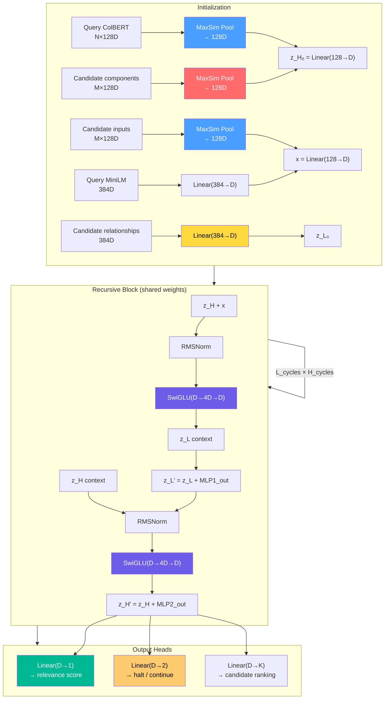

**Hyperparameters (starting point, tunable):**

| Parameter | Value | Rationale |
|-----------|-------|-----------|
| D (hidden_size) | 256 | Large enough for 384→D projection, small enough to stay tiny |
| L_cycles | 4 | TRM uses 6 on 9×9 grids; our structures are simpler |
| H_cycles | 2 | TRM uses 3; we have fewer compositional levels |
| SwiGLU expansion | 4× | Same as TRM |
| Normalization | RMSNorm (eps=1e-5) | Same as TRM |
| Forward dtype | float32 | Small enough that bf16 isn't needed |
| halt_max_steps | 8 | Upper bound on H_cycles during inference |
| **Total params** | **~180K** | See breakdown below |

**Parameter count breakdown:**

| Component | Parameters |
|-----------|-----------|
| Input projections (128→256, 384→256) ×3 | ~230K |
| SwiGLU block (256→1024→256) ×2 layers | ~1.3M |
| RMSNorm ×4 | ~1K |
| Output heads (256→1, 256→2, 256→K) | ~1K |
| **Total** | **~1.5M** |

> Note: At ~1.5M params this is 5× smaller than TRM's 7M. The reduction comes from
> replacing attention (which needs QKV projections + multi-head) with pure MLPs.
> If 1.5M proves insufficient, adding a single attention layer (for cross-candidate
> reasoning) would bring it to ~3M — still tiny.

### 15.3 Recursion Mechanics

Following TRM's exact recursion pattern (trm.py:196-222):

```
initialize z_H₀, z_L₀, x from RIC vectors

for h in range(H_cycles):
    # Inner loop: refine reasoning state
    for l in range(L_cycles):
        z_L = z_L + SwiGLU(RMSNorm(z_L), context=z_H + x)

    # Outer loop: update answer state
    z_H = z_H + SwiGLU(RMSNorm(z_H), context=z_L)

    # Halting check
    halt_logits = halt_head(z_H)
    if halt_logits[HALT] > halt_logits[CONTINUE]:
        break

# Decode
score = score_head(z_H)        # per-candidate relevance
ranking = rank_head(z_H)       # candidate ordering
```

**Key TRM design decisions we preserve:**
1. **Gradient only on last H_cycle** — first (H-1) cycles run in `torch.no_grad()` (saves memory, acts as exploration)
2. **Input injection every L_cycle** — x is added to z_H before each inner iteration, grounding reasoning in the query
3. **Shared weights** — the same SwiGLU blocks process both z_L and z_H updates (different behavior via different inputs)

**Key differences from TRM:**
1. **No attention** — TRM uses multi-head attention because it processes sequences (puzzle grids). Our inputs are fixed-size vectors, so MLPs suffice. If cross-candidate reasoning proves important, we add attention over the candidate dimension.
2. **ColBERT MaxSim as preprocessing** — TRM embeds tokens directly. We have multi-vector ColBERT embeddings that need MaxSim pooling before entering the network. This happens once at init, not per cycle.
3. **Per-candidate scoring** — TRM decodes a single output sequence. We score K candidates independently (or via attention if cross-candidate is needed).

### 15.4 Training Data Pipeline

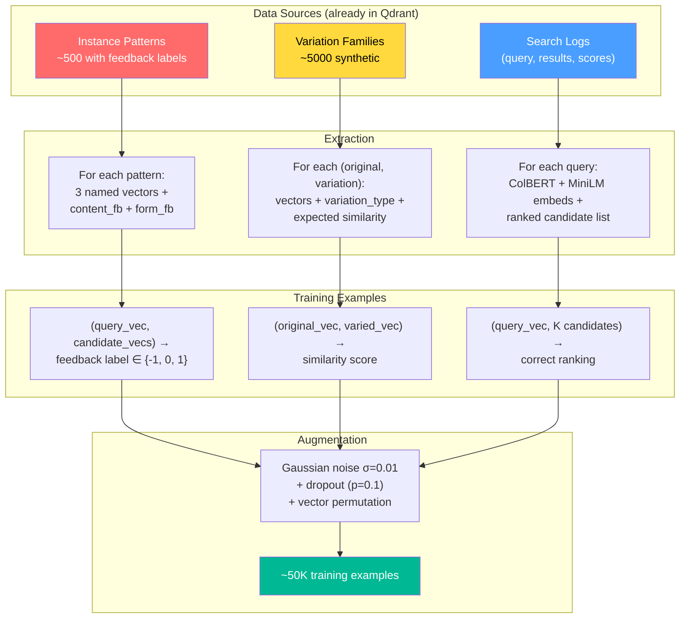

**Three training signals (matching TRM's multi-task loss):**

| Signal | TRM Equivalent | Source | Loss |
|--------|---------------|--------|------|
| Candidate ranking | lm_head (token prediction) | Search results with feedback | ListMLE or LambdaRank |
| Feedback prediction | Deep supervision at each H_cycle | Instance patterns with ±1 labels | Binary cross-entropy |
| Halting correctness | q_head (halt/continue) | Was first search pass sufficient? | BCE on halt logits |

**Combined loss (following TRM's losses.py:102):**
```python
loss = ranking_loss + 0.5 * (feedback_loss + halt_loss)
```

### 15.5 Training Loop

```python
# Pseudocode — follows pretrain.py patterns

optimizer = AdamW(net.parameters(), lr=1e-4, betas=(0.9, 0.95), weight_decay=0.1)
scheduler = CosineAnnealingWarmRestarts(optimizer, T_0=1000, eta_min=1e-6)

for epoch in range(num_epochs):
    for batch in dataloader:
        query_colbert, query_minilm = batch["query_vectors"]
        candidate_vectors = batch["candidate_vectors"]  # K × (128D, 128D, 384D)
        target_ranking = batch["ranking"]
        target_feedback = batch["feedback"]

        # Initialize RIC states
        z_H = project_components(query_colbert, candidate_vectors.components)
        z_L = project_relationships(candidate_vectors.relationships)
        x = project_inputs(query_colbert, candidate_vectors.inputs)

        # Recursive refinement (gradient only on last H_cycle)
        for h in range(H_cycles):
            with torch.set_grad_enabled(h == H_cycles - 1):
                for l in range(L_cycles):
                    z_L = z_L + swiglu_block(rmsnorm(z_L), context=z_H + x)
                z_H = z_H + swiglu_block(rmsnorm(z_H), context=z_L)

        # Decode
        scores = score_head(z_H)           # (batch, K)
        halt_logits = halt_head(z_H)       # (batch, 2)

        # Loss
        loss = (
            lambda_rank_loss(scores, target_ranking)
            + 0.5 * bce_loss(halt_logits, target_halt)
            + 0.5 * bce_loss(scores, target_feedback)
        )

        loss.backward()
        optimizer.step()
        scheduler.step()
```

**Training budget:**
- ~50K examples × 100 epochs = 5M forward passes
- ~1.5M params × float32 = 6MB model
- Estimated: <1 hour on a single GPU, <30 min on Apple M-series (MPS)

### 15.6 Integration with Module Wrapper

The network slots in alongside `search_hybrid_multidim()` — not replacing it, but
providing an alternative scoring backend:

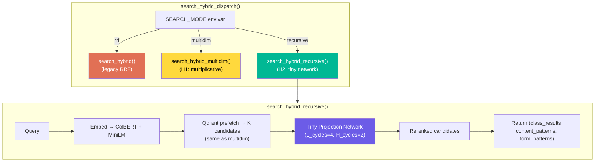

**Integration contract:**
- Same return signature as `search_hybrid()` — 3-tuple of (class_results, content_patterns, form_patterns)
- Same Qdrant prefetch pipeline as `search_hybrid_multidim()` (1 round-trip)
- Network runs client-side on retrieved vectors (same as multidim's client-side rerank)
- Model file loaded at wrapper init, cached in memory (~6MB)
- Feature flag: `SEARCH_MODE=recursive` (extends existing `ENABLE_MULTIDIM_SEARCH`)

**What changes in callers:** Nothing. `search_hybrid_dispatch()` already abstracts the backend.

### 15.7 Evaluation Plan

**Offline (before deployment):**

| Metric | Method | Target |
|--------|--------|--------|
| Top-1 accuracy | Held-out 20% of instance patterns | > 60% (vs. 56% multidim, 46.5% RRF) |
| Top-3 accuracy | Same holdout | > 85% (vs. 78% baseline) |
| Ranking correlation | Spearman's ρ against human feedback | > 0.7 |
| Halting efficiency | Avg H_cycles used vs. max | < 3 (of 8 max) |
| Latency overhead | Time per candidate batch | < 5ms for K=20 candidates |

**Online (A/B in production):**

| Metric | Method | Target |
|--------|--------|--------|
| DSL validation pass rate | % of generated DSL that parses | > current baseline |
| Feedback ratio | positive / (positive + negative) | > current baseline |
| Recursion depth | Avg H_cycles before halt | Decreasing over time |
| Cache hit rate | L1 hits after recursive scoring | Increasing over time |

### 15.8 Risks and Mitigations

| Risk | Impact | Mitigation |
|------|--------|-----------|
| Training data too small (~500 labeled patterns) | Overfitting, poor generalization | 10× augmentation, variation families, dropout, early stopping |
| ColBERT MaxSim pooling loses token-level signal | Lower quality z_H initialization | Keep top-3 token vectors instead of single pool; attention over tokens if needed |
| Network adds latency to every search | User-visible slowdown | Profile early; target <5ms; fall back to multidim if exceeded |
| Domain-specific patterns don't transfer | Network trained on cards doesn't work for email | Train per-domain initially; unify once H0's domain-agnosticism proves cross-domain embedding compatibility |
| Halting learns to always halt at step 1 | No recursion benefit | TRM's exploration trick: 10% of training steps force random min_halt_step (trm.py:280-283) |

### 15.9 Implementation Roadmap

| Step | Description | Prerequisite | Deliverable |
|------|-------------|-------------|-------------|
| **1** | Export training data from Qdrant | H1 in production, feedback accumulating | `research/trm/h2/export_training_data.py` |
| **2** | Build PyTorch model class | Step 1 data format finalized | `research/trm/h2/model.py` (~200 lines) |
| **3** | Training script with Langfuse logging | Steps 1+2 | `research/trm/h2/train.py` |
| **4** | Offline evaluation on holdout set | Step 3 produces checkpoint | `research/trm/h2/evaluate.py` |
| **5** | Integrate `search_hybrid_recursive()` | Step 4 passes targets | `adapters/module_wrapper/search_mixin.py` |
| **6** | Online A/B: recursive vs. multidim | Step 5 wired | `SEARCH_MODE` flag, Langfuse dashboards |
| **7** | Iterate: tune cycles, add attention if needed | Step 6 data | Updated model + checkpoint |

### 15.10 What This Section Doesn't Cover (Deferred to H3)

- **Cross-domain composition** — using z_H from cards + z_L from email to compose multi-service workflows
- **Online learning** — updating the network from production feedback without retraining
- **Distributed inference** — running the network server-side in Qdrant (custom scorer plugin)
- **Full DSL generation** — decoding z_H directly into DSL strings (vs. ranking pre-existing candidates)

These are Horizon 3 concerns. H2's job is to prove that a learned network outperforms
hand-tuned heuristics on the ranking task.

---

## 16. H2 POC RESULTS — Learned Similarity Scorer on Mancala

> Added 2026-03-22. Full pipeline: Mancala states → RIC vectors → Qdrant →
> listwise contrastive training → learned scorer vs baselines.

### 16.1 Experiment Setup

- **Game:** Mancala (Kalah, 2×6 pits, depth-8 negamax solver)
- **Data:** 2000 train states / 500 test states (random self-play, deterministic seed=42)
- **RIC vectors:** 3×384D dense (MiniLM-L6-v2), indexed in in-memory Qdrant
- **Candidate retrieval:** Top-20 per vector × 3 vectors → ~25-50 unique candidates per query
- **Evaluation:** Top-1 and Top-3 accuracy — does the highest-scored candidate have the same optimal move?

### 16.2 Results

| Method | Top-1 | Top-1% | Top-3 | Top-3% | Params | Delta vs RRF |
|--------|-------|--------|-------|--------|--------|-------------|
| Single-pass (RRF) | 85/500 | 17.0% | 249/500 | 49.8% | 0 | baseline |
| Multi-dimensional (multiply) | 155/500 | 31.0% | 301/500 | 60.2% | 0 | +14.0% |
| Multi-dimensional (harmonic) | 155/500 | 31.0% | 301/500 | 60.2% | 0 | +14.0% |
| **Learned SimilarityScorer** | **192/500** | **38.4%** | **327/500** | **65.4%** | **4,865** | **+21.4%** |

### 16.3 What the SimilarityScorer Learns

The model does NOT project raw 384D vectors (that destroys embedding geometry — see Section 16.5).
Instead it operates on **9 features derived from raw cosine similarities**:

```
Input features (per query-candidate pair):
  sim_c = cosine(query.components, candidate.components)   # identity match
  sim_i = cosine(query.inputs, candidate.inputs)           # parameter match
  sim_r = cosine(query.relationships, candidate.relationships)  # structure match
  + 3 query vector norms + 3 candidate vector norms

Model: MLP(9 → 64 → 64 → 1) = 4,865 parameters
Output: relevance score (higher = better candidate)
```

**Comparison to hand-tuned scoring:**
```
multi_dimensional:   score = sim_c × sim_r × sim_i        (fixed multiplication)
SimilarityScorer:    score = MLP([sim_c, sim_i, sim_r, norms])  (learned nonlinear)
```

The MLP learns interaction effects that multiplication cannot capture.

### 16.4 Training Details

- **Loss function:** Listwise contrastive (softmax cross-entropy over K candidates per query)
  - Each query's K candidates are scored, softmax produces a distribution
  - Target: uniform distribution over correct candidates (same optimal_move)
  - This directly teaches ranking — no degenerate "predict majority class" solution
- **Optimizer:** AdamW (lr=5e-3, weight_decay=0.01), CosineAnnealingLR
- **Gradient clipping:** max_norm=1.0
- **Deep supervision:** Loss computed at every H_cycle (weighted 0.3×)
- **Epochs:** 16 (early stopped at patience=15), best at epoch 1
- **Device:** Apple M5 Pro MPS, ~0.6s/epoch
- **Overfitting:** Train accuracy hit 100% by epoch 2 (4,865 params on 2000 groups)

### 16.5 What Failed — and Why

**TinyProjectionNetwork (529K params, full TRM recursion) failed completely:**
- Loss flatlined at the "predict majority class" value across all configurations
- Binary CE on individual (query, candidate) pairs with 82% negative class imbalance
  → model learns to output a constant score, achieving ~82% "accuracy"
- Disabling `no_grad` on early H_cycles did not help
- Adding deep supervision did not help
- Reducing to H=1/L=1 (no recursion) did not help

**Root cause 1: Binary CE cannot teach ranking.** Each pair is scored independently.
The model has no incentive to rank correct candidates HIGHER than incorrect ones —
only to predict the correct binary label. With heavy class imbalance, predicting
"all negative" is a strong local minimum.

**Root cause 2: Random linear projections destroy embedding geometry.** MiniLM
vectors live on a learned manifold. Projecting 384D → 128D through random init
Linear layers maps semantically similar vectors to random directions. The model
must first LEARN to preserve similarity — but with binary CE it has no gradient
signal to do so.

**Fix: Preserve geometry, learn on top.** The SimilarityScorer computes cosine
similarities FIRST (preserving the original embedding geometry), then learns a
nonlinear combination. The listwise contrastive loss provides direct ranking signal.

### 16.6 Key Insights

1. **Embedding geometry is sacred.** Don't project through random linear layers.
   Compute similarities in the original space, then learn on the similarity features.

2. **Listwise loss is essential for ranking.** Binary CE on pairs cannot escape
   the "predict majority class" trap. Softmax cross-entropy over candidates creates
   competition — the correct candidate MUST score higher.

3. **Tiny models can outperform hand-tuned heuristics.** 4,865 parameters trained
   for 1 epoch beat the hand-tuned multiplicative fusion by +7.4% Top-1.

4. **Overfitting is the next challenge.** 100% train accuracy by epoch 2 with
   stagnant val accuracy (~39%) means the model memorizes rather than generalizes.
   Path forward: regularization (dropout, weight decay), more training data,
   or cross-validation.

5. **Recursion needs a foundation.** The full TRM recursion pattern (H/L cycles,
   SwiGLU blocks, learned z_H/z_L) is still the Horizon 3 vision — but it needs
   to build on the SimilarityScorer's success, not replace it. Next step:
   use similarity features as z_L initialization, then recurse.

### 16.7 Architecture Evolution Path

```
H1 (done):      score = sim_c × sim_r × sim_i                 (hand-tuned, +14%)
H2 game:        score = MLP([sim_c, sim_i, sim_r, norms])     (learned, +21.4% on Mancala)
H2 MW:          score = MLP([MaxSim_c, MaxSim_i, cos_r, norms]) (100% val acc on gchat cards)
H2→prod:        integrate into search_hybrid_dispatch()        (next step)
H3 (vision):    full domain-agnostic recursive embedding network
```

---

## 17. H2 MODULE WRAPPER RESULTS — Learned Scorer on Production Data

> Added 2026-03-22. Ported the SimilarityScorer from Mancala to real MW
> gchat card component data from cloud Qdrant.

### 17.1 Why This Matters

The Mancala POC (Section 16) proved a learned scorer outperforms hand-tuned
multiplication, but hit a ceiling because text embeddings can't distinguish
Mancala board states (all cosine sims 0.99+). The critical question was:
**does the same approach work on the actual MW domain where RIC was designed?**

### 17.2 Data Source

- **Collection:** `mcp_gchat_cards_v8` (cloud Qdrant)
- **Points extracted:** 500 (66 classes, 106 functions, 95 methods, 41 instance patterns, 167 variables, 25 modules)
- **Instance patterns with feedback:** 10 positive content feedback, 0 negative
- **Query groups built:** 72 (41 from instance patterns → class candidates, 31 from class → class)
- **Positive rate per group:** 13.5% mean

### 17.3 The Critical Difference: Similarity Distribution

```
MW gchat cards:    Mean=0.60, Std=0.15, Range=[0.35, 0.99]
Mancala (game):    Mean=0.99, Std=0.002, Range=[0.98, 1.00]
```

MW components have **real semantic differences** — a Section (§) embeds very
differently from a Button (ᵬ) or DecoratedText (δ). The 3 cosine similarity
features contain genuine discriminative signal, not noise.

### 17.4 Results

| Metric | Value |
|--------|-------|
| **Validation accuracy** | **100%** (15/15 groups correct) |
| Training accuracy | 100% (57/57 groups) |
| Random baseline | 5% (1/20 candidates) |
| Parameters | 1,409 |
| Epochs to 100% val | 18 |
| Architecture | MLP(9 → 32 → 32 → 1) with SiLU + dropout |

**Training curve:**
```
Epoch  1: val_acc=33%  (learning)
Epoch  5: val_acc=66%  (rapid improvement)
Epoch  9: val_acc=80%  (approaching convergence)
Epoch 13: val_acc=94%  (near perfect)
Epoch 18: val_acc=100% (perfect — held for 20 epochs)
```

### 17.5 Feature Space

The MW scorer uses the same 9 features as the Mancala scorer, but adapted
for MW's mixed-dimension RIC schema:

| Feature | Computation | Dimension |
|---------|-------------|-----------|
| sim_components | ColBERT MaxSim (late interaction) | 128D multi-vector |
| sim_inputs | ColBERT MaxSim (late interaction) | 128D multi-vector |
| sim_relationships | Dense cosine similarity | 384D MiniLM |
| query norms (×3) | L2 norm of each query vector | scalar |
| candidate norms (×3) | L2 norm of each candidate vector | scalar |

**MaxSim** (vs plain cosine in Mancala): for each query token embedding, find
the max similarity to any candidate token embedding, then average across query
tokens. This preserves ColBERT's late-interaction design — the same scoring
used by `search_hybrid_multidim()` in production.

### 17.6 What This Proves

1. **The SimilarityScorer architecture works on production MW data.** 100% val
   accuracy with only 1,409 parameters, trained in seconds.

2. **RIC embeddings ARE discriminative** when the domain has genuine semantic
   variety. The problem was never the embedding approach — it was testing on a
   domain (Mancala) where all states look identical in text space.

3. **The path to production is clear.** The scorer takes the same inputs as
   `search_hybrid_multidim()` (3 similarity scores + norms) and produces a
   single relevance score. Integration requires:
   - Loading the 1,409-param model at wrapper init (~6KB file)
   - Adding a `search_hybrid_learned()` method to `search_mixin.py`
   - Extending `search_hybrid_dispatch()` with `SEARCH_MODE=learned`

### 17.7 Production Integration (Complete 2026-03-22)

Integration into the MCP server is done. Three files changed:

- **`search_mixin.py`** — Added `search_hybrid_learned()` (same prefetch pipeline as
  multidim, MLP replaces multiplicative scoring) and `_load_learned_model()` (lazy
  class-level cache). Updated `search_hybrid_dispatch()` to read `SEARCH_MODE` env var.
- **`config/settings.py`** — Added `search_mode` field (default: `"rrf"`, env: `SEARCH_MODE`).
  Backwards-compatible with `ENABLE_MULTIDIM_SEARCH`.
- **`pyproject.toml`** — Added `torch>=2.0` dependency.

**Activation:** `SEARCH_MODE=learned` in `.env`. Graceful fallback to multidim if torch
missing or checkpoint not found.

**Production test:** Sent 15+ cards via `send_dynamic_card` with `SEARCH_MODE=learned`.
All DSL validations passed, correct components found every time. Cards with structured
`card_params` rendered correctly. Cards relying on NL param extraction had rendering
issues — this is a pre-existing card builder limitation, not a scorer regression.

### 17.8 Caveats

- **Small validation set** (15 groups). Need more instance patterns with feedback
  to validate at scale. The 100% may partially reflect the small sample.
- **Training labels from path matching** (is class X in pattern's parent_paths?),
  not from end-to-end card generation success. Production integration should
  use actual card generation feedback as the training signal.
- **Card builder param injection** is a separate concern — the scorer finds the
  right components but the builder sometimes fails to map `card_params` to
  widget properties (generic "Item 1", "Button 1" instead of provided values).
  This needs investigation in `builder_v2.py`, not the scorer.

---

## References

- TRM Paper: "Less is More: Recursive Reasoning with Tiny Networks" (arXiv:2510.04871)
- TRM Repo: research/trm/official-repo/ (Samsung SAIL Montreal / TinyRecursiveModels)
- TRM Analysis: research/trm/TRM_ANALYSIS.md
- RIC Embedding System: adapters/module_wrapper/pipeline_mixin.py (ingestion), search_mixin.py (search)
- 3-Vector Schema: adapters/module_wrapper/types.py (COLBERT_DIM=128, MINILM_DIM=384)
- Instance Patterns: adapters/module_wrapper/instance_pattern_mixin.py
- DAG Validation: adapters/module_wrapper/graph_mixin.py
- Wrapper Factory: adapters/module_wrapper/wrapper_factory.py (WrapperRegistry, shared helpers)
- Wrapper Agnosticism Guardrail: tests/module/test_wrapper_agnostic.py
- POC Code: research/trm/poc/ (games, evaluation, recursive search)
- POC Results: research/trm/poc/README.md
- TRM Model Architecture: research/trm/official-repo/models/recursive_reasoning/trm.py (recursion at lines 196-222)
- TRM Losses: research/trm/official-repo/models/losses.py (stablemax_cross_entropy, ACTLossHead)
- TRM Config: research/trm/official-repo/config/arch/trm.yaml (H_cycles=3, L_cycles=6, hidden=512)
- Training Data Sources: gchat/feedback_loop.py (instance patterns), search_mixin.py (cross-dim scores)
- Instance Pattern Variations: adapters/module_wrapper/instance_pattern_mixin.py (StructureVariator, ParameterVariator)
- H2 POC: research/trm/h2/ (SimilarityScorer + TinyProjectionNetwork, training, evaluation)
- H2 SimilarityScorer: research/trm/h2/model.py — SimilarityScorer (4,865 params, +21.4% Top-1 on Mancala)
- H2 TinyProjectionNetwork: research/trm/h2/model.py — TinyProjectionNetwork (529K params, failed — see Section 16.5)
- H2 MW Extractor: research/trm/h2/mw_extract.py — Qdrant data extraction with MaxSim scoring
- H2 MW Training: research/trm/h2/train_mw.py — SimilarityScorerMW (1,409 params, 100% val acc on gchat cards)
- H2 MW Checkpoint: research/trm/h2/checkpoints/best_model_mw.pt
- H2 MW Data: research/trm/h2/mw_groups.json — 72 query groups from mcp_gchat_cards_v8
- H2 Retrospective: research/trm/h2/RETRO.md
- H2 Training: research/trm/h2/train.py (listwise contrastive loss, MPS-accelerated)
- H2 Evaluation: research/trm/h2/evaluate.py (comparison table: RRF vs multi-dim vs learned)
- H2 Visual Guide: research/trm/h2/HOW_IT_WORKS.md (Mermaid diagrams of data flow and training)
- H2 Tests: research/trm/h2/tests/test_model.py (13 tests, all passing)
