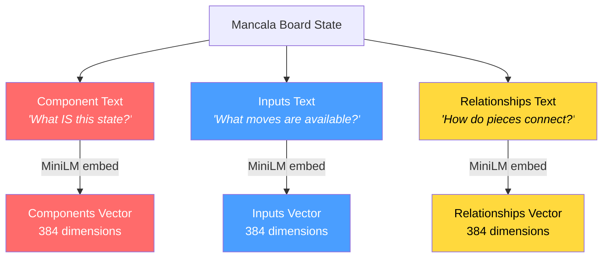
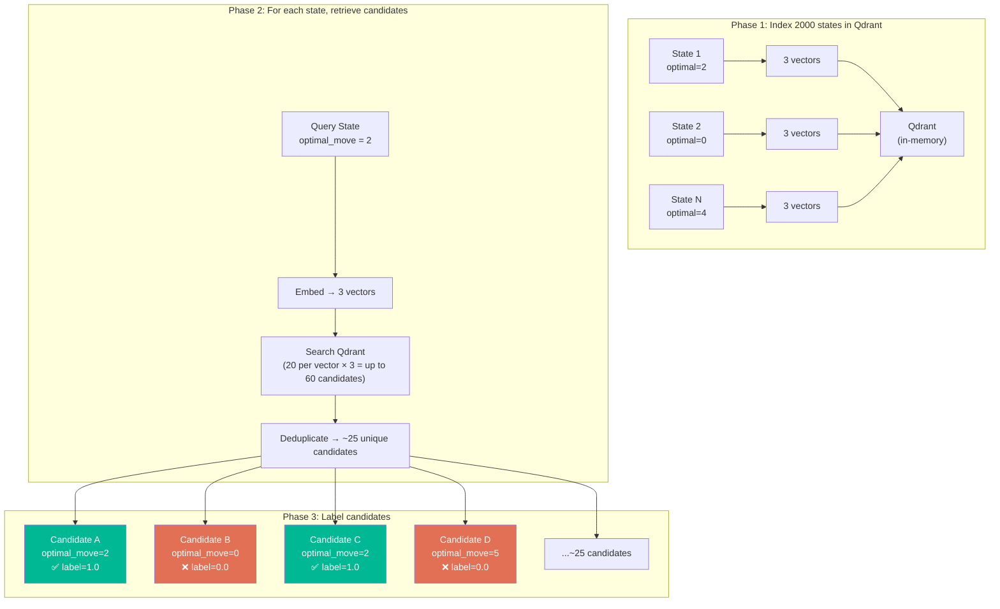
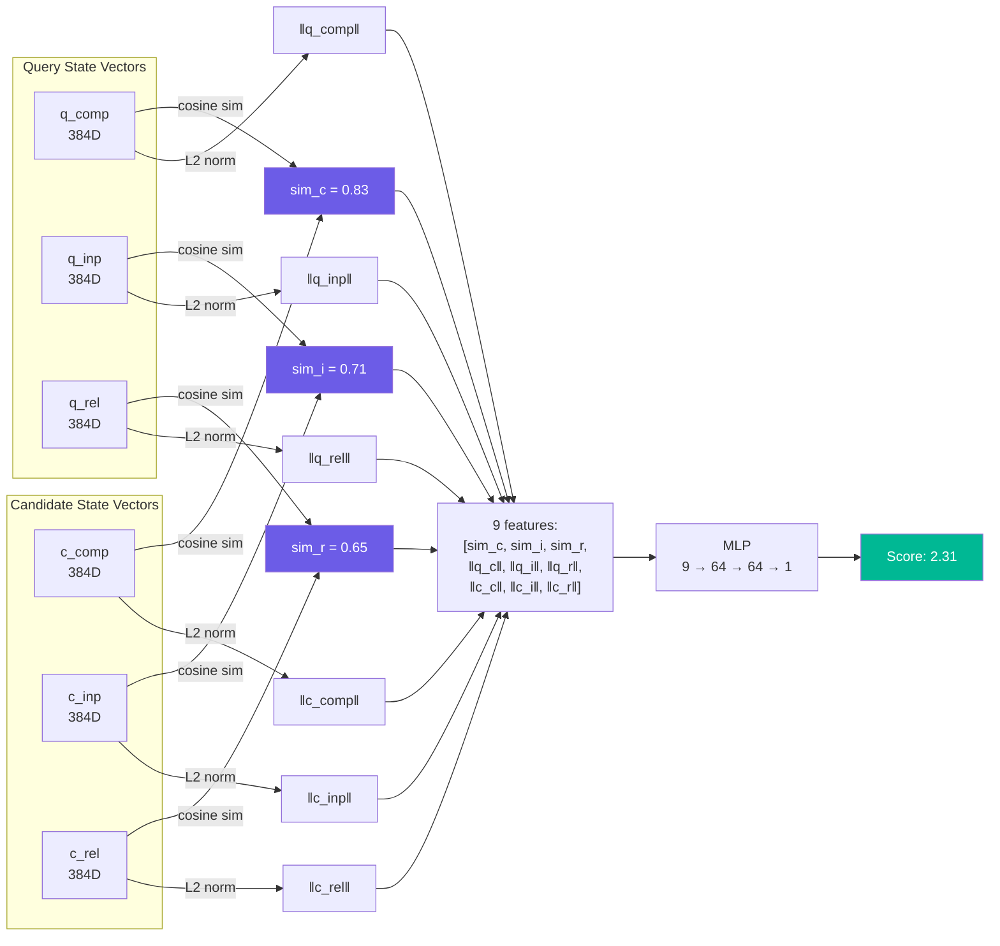
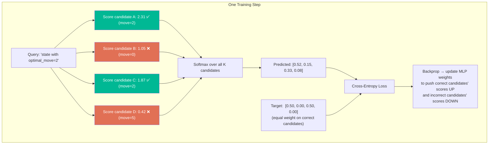
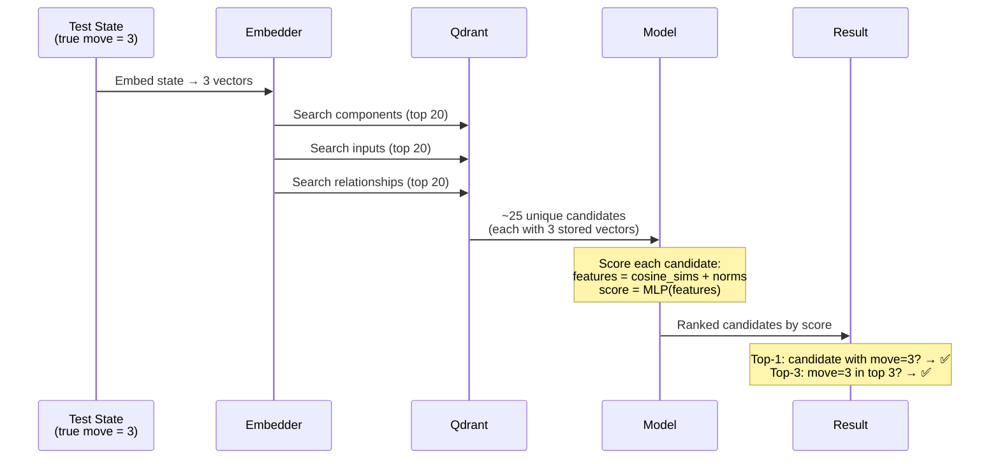
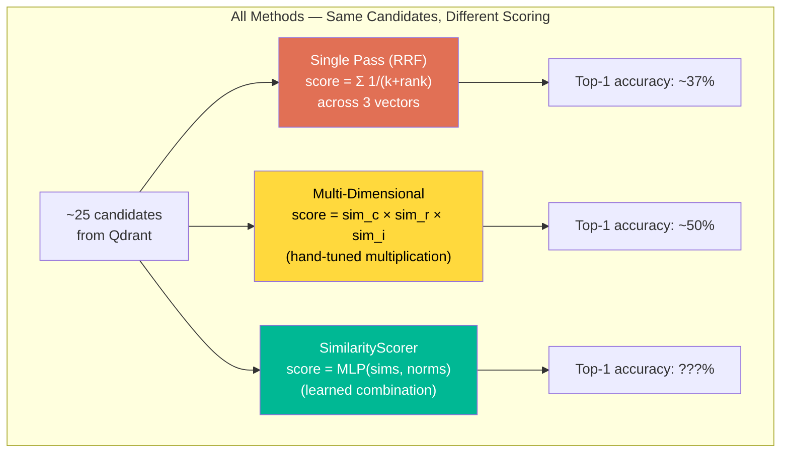

# How the TRPN POC Works — Visual Guide

## 1. What Is a Mancala "State"?

A game state is a snapshot of the board + whose turn it is. The solver computes the **optimal move** for each state.

```
  Player 2: [4] [4] [4] [4] [4] [4]
  Store P2 [0]                     [0] Store P1
  Player 1: [4] [4] [4] [4] [4] [4]

  Current Player: 1
  Legal Moves: [0, 1, 2, 3, 4, 5]  (pit indices with stones)
  Optimal Move: 2                    (computed by negamax solver)
```

---

## 2. How a State Becomes 3 RIC Vectors

Each state is described with 3 natural-language texts, then each text is embedded into a 384-dimensional vector using MiniLM:



### Example Texts for One State

**Component Text** (identity — what IS this?):
```
Mancala Board State
Current Player: 1
Stones: P1=24 P2=24 (stores: 0/0)
Turn: early game (move 0)
Board: [4,4,4,4,4,4] [0] [4,4,4,4,4,4] [0]
```

**Inputs Text** (actions — what can you DO?):
```
Legal moves for Player 1: [0, 1, 2, 3, 4, 5]
  Move 0 (pit 0, 4 stones): sow to pits 1-4
  Move 2 (pit 2, 4 stones): lands in store → EXTRA TURN
  Move 5 (pit 5, 4 stones): sow into opponent side
```

**Relationships Text** (structure — how do pieces CONNECT?):
```
P1 pits: [4,4,4,4,4,4] sum=24  P1 store: 0
P2 pits: [4,4,4,4,4,4] sum=24  P2 store: 0
Extra turn opportunities: pit 2 (lands in store)
Capture threats: none (all pits have stones)
Store advantage: tied (0 vs 0)
```

---

## 3. Training Data: From States to (Query, Candidates) Groups



**Key insight:** A candidate is "correct" if its **optimal_move matches the query's optimal_move**. The model doesn't need to know the board — it just needs to learn which retrieved state has the same best move.

---

## 4. What the Model Sees (Input Features)

### SimilarityScorer (current working model)

For each (query, candidate) pair, compute 9 features:



**vs. multi_dimensional_search (hand-tuned):**
```
Hand-tuned:   score = sim_c × sim_r × sim_i
Learned MLP:  score = MLP([sim_c, sim_i, sim_r, norms...])
```

The MLP can learn non-linear relationships that multiplication cannot express.

---

## 5. How Training Works (Listwise Contrastive Loss)



**Why this works (vs. binary BCE which failed):**
- BCE sees each candidate independently → can minimize loss by predicting "all negative"
- Listwise sees all K candidates together → MUST rank correct ones higher to reduce loss
- The softmax creates competition between candidates — there's no degenerate solution

---

## 6. At Evaluation Time: What Gets Predicted



**The final output is a ranked list of candidates.** "Accuracy" means: does the highest-scoring candidate have the same optimal move as the test state?

---

## 7. How It Compares to Existing Methods



All three methods retrieve the SAME candidates from Qdrant. The only difference is how they **score and rank** those candidates. The question is whether a learned scoring function can beat the hand-tuned one.

---

## 8. Connection to TRM and the Module Wrapper

| POC (Games) | Module Wrapper (Production) |
|---|---|
| Mancala board state | Python module component (class/function) |
| Component text = board snapshot | Component text = class name + type + path |
| Inputs text = legal moves | Inputs text = parameters + description |
| Relationships text = piece connections | Relationships text = DAG parent/child links |
| Optimal move prediction | Correct component selection for DSL |
| MiniLM 384D × 3 | ColBERT 128D × 2 + MiniLM 384D × 1 |

The 3-vector RIC schema is the same. If a learned scorer beats hand-tuned multiplication on games, the same approach should improve component selection in the module wrapper.
