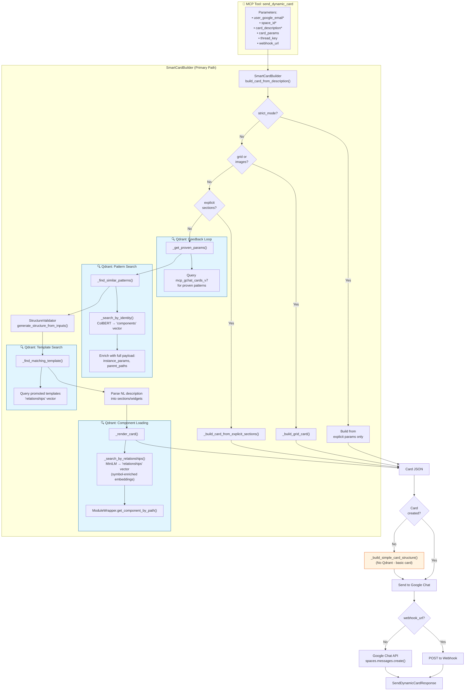

# send_dynamic_card Complete Flow Diagram

> **Note:** force_reindex_components

## Complete Mermaid Diagram

## Key Points

### All primary paths use Qdrant:

1. **Feedback Loop** → queries proven patterns from successful cards
2. **Pattern Search** → `_search_by_identity()` with ColBERT multi-vector on `components` named vector
3. **Template Search** → queries promoted templates via `relationships` vector
4. **Component Loading** → `_search_by_relationships()` with MiniLM on `relationships` vector (this is where symbol-enriched embeddings match DSL notation)

### Only fallback bypasses Qdrant:

- `_build_simple_card_structure()` is only used if SmartCardBuilder throws an exception - it builds a basic text/button card without any vector search

### DSL symbols work via vector similarity:

- The v7 collection's `relationships` vector contains symbol-enriched text like:
  - `§ Section | contains C_0 CollapseControl, ʍ Widget | §[C_0, ʍ]`
  - `Ƀ ButtonList | contains ᵬ Button | Ƀ[ᵬ]`
- When you pass `§[δ, Ƀ[ᵬ×2]] Dashboard` as `card_description`, the MiniLM embedding matches against these symbol patterns

---

✻ *Cooked for 1m 9s*
